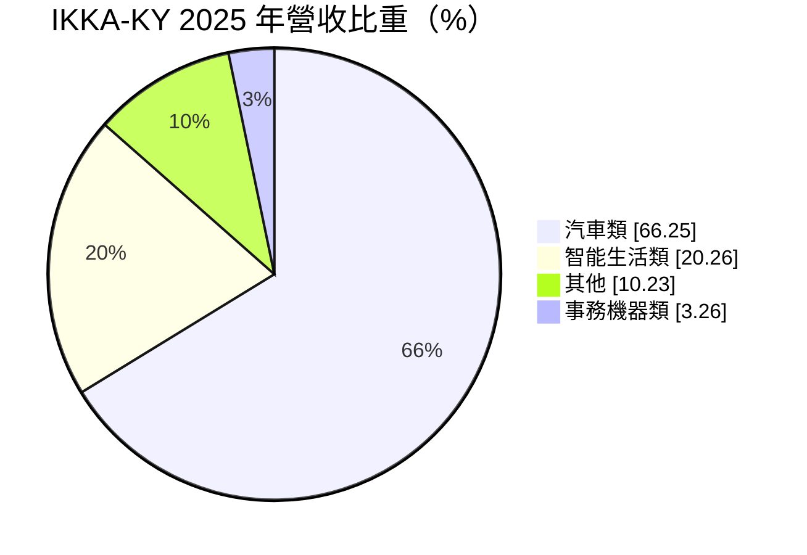
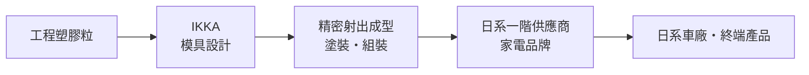
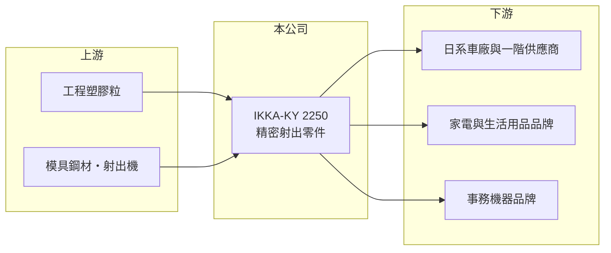

# 2250 IKKA-KY

> 上市｜[[產業索引-汽車工業|汽車工業]]｜上市（櫃）日期 2021/05/31

# 第一章：企業模式與商業藍圖

> [!info] 撰寫說明
> 本文由 Claude 依公開資料整理，架構比照 [[2330台積電]] 的四章研究，資料截至 2026-10-08。財務數字來源：Goodinfo 台灣股市資訊網年度經營績效、MoneyDJ 理財網個股基本資料（營收比重）、證交所開放資料（本筆記 _data 快照）。製程、據點與客戶類型憑既有知識整理並標「待校對」。公開資料有限。#待校對

在評估單一個股的長期投資價值時，首要步驟是拆解企業的底層獲利邏輯。本章說明 IKKA-KY（股票代號：2250，以下簡稱 IKKA）以日系管理的精密塑膠零件製造，如何服務汽車與家電客戶。

## 一、核心定位：日系客戶的精密塑膠零件供應商

IKKA 是開曼註冊的控股公司，2016 年設立、2021 年上市。總經理小原正美為日籍經理人（證交所與 MoneyDJ 資料），公司源自日系體系、以日系客戶為主（待校對）。依 MoneyDJ，2025 年營收中汽車類占 66.25%、智能生活類 20.26%、其他 10.23%、事務機器類 3.26%。主要製程是精密[[射出成型]]與後段組裝，生產據點在中國等亞洲地區（待校對）。

* **汽車類：** 車內外的塑膠功能件與外觀件，需要符合日系車廠嚴格的品質標準。
* **智能生活類：** 家電與生活用品的塑膠零件，客戶多為日系品牌（推估）。
* **事務機器類：** 印表機、影印機的零件，是早期業務，比重已降到 3% 左右。

## 二、資本轉化邏輯

射出零件本身同質性高，IKKA 的價值在於日式品質管理與模具能力，讓日系客戶願意把零件交給它在海外生產。這種模式毛利率不高（16% 至 20%），但客戶關係穩定、訂單可預期。

## 三、企業長期方向

IKKA 的長期方向是提高汽車類比重，並跟著日系客戶調整生產據點，以因應中國以外的供應鏈需求（推估）。營收在 2019 至 2025 年間大致維持 34 億至 43 億元（Goodinfo），成長有限；資本配置上偏重配息，2025 年度現金股利 3 元，配息率約 75%（推算）。

# 第二章：護城河深度與競爭優勢

在長期價值投資中，「護城河」指企業抵禦競爭、維持超額利潤的保護機制。本章分析 IKKA 的競爭位置。

## 一、護城河的核心組成要素

* **1. 日系客戶的信任：** 日系車廠與家電品牌對供應商的品質要求高、更換供應商的流程長，長期合作關係是 IKKA 最主要的資產。
* **2. 模具與品質管理：** 精密射出件的尺寸穩定度、外觀良率決定成本，日式管理讓不良率維持在低水準（推估）。
* **3. 護城河偏窄：** 塑膠射出的設備與技術普及，競爭者眾多，IKKA 的優勢主要是客戶關係而非技術壁壘，所以毛利率難以大幅提高。

## 二、主要對手

| 對手 | 定位 | 對 IKKA 的威脅 |
|---|---|---|
| 中國本土射出廠 | 成本低、產能大 | 在價格敏感的零件上競爭 |
| 日系射出廠的海外工廠 | 同樣服務日系客戶 | 直接爭奪同一批訂單 |
| 東南亞射出廠 | 供應鏈移轉受惠者 | 承接中國以外的新訂單 |

## 三、守得住／守不住／觀察重點

* **守得住：** 日系客戶的長期車型零件與高外觀要求零件。
* **守不住：** 一般塑膠零件的報價，以及客戶銷量下滑時的訂單量。
* **觀察重點：** 汽車類比重能否持續提升，以及日系車廠在中國市占下滑對訂單的影響。

# 第三章：財務體質與盈利規模

資料日期：2026-10-08。數字取自 Goodinfo 年度經營績效與證交所開放資料快照，表格是撰寫當時的快照；最新月營收、毛利率、累計 EPS 由自動排程寫在本筆記的屬性欄位（月營收、毛利率、累計EPS 等）。#待校對

財務報表是檢驗護城河是否真實存在的最終標準。本章用多年度數字檢視 IKKA 的獲利穩定度。

## 一、多年度三率與 ROE

| 年度 | 營收（新台幣） | [[毛利率]] | [[營業利益率]] | EPS（元） | [[ROE]] |
|---|---|---|---|---|---|
| 2021 | 42.8 億 | 17.7% | 4.99% | 6.06 | 17.9% |
| 2022 | 36.2 億 | 16.8% | 3.32% | 3.54 | 8.48% |
| 2023 | 36.5 億 | 18.4% | 4.89% | 4.07 | 7.2% |
| 2024 | 36.9 億 | 19.6% | 6.12% | 6.17 | 10.2% |
| 2025 | 33.9 億 | 17.0% | 4.79% | 3.99 | 6.58% |
| 2026 上半年 | 15.7 億 | 16.24% | 2.30% | 0.84 | 未查得 |

* **[[毛利率]]：** 長期維持在 16% 至 20%，波動小，符合代工型零件廠的特性。
* **[[營業利益率]]：** 3% 至 6% 之間，2026 年上半年降到 2.30%，業外收益 0.34 億元與營業利益 0.36 億元相當（證交所開放資料），本業獲利變薄。
* **長期指標：** 2020 至 2025 年營收年複合成長率約 -1.3%（推算）；2021 至 2025 年平均 ROE 約 10.1%（推算）。2021 至 2026 年平均現金股利約 3.12 元（Goodinfo），配息穩定。

## 二、財務結構

2026 年第二季底資產 36.3 億元、負債 16.2 億元，負債比約 45%，每股淨值 55.39 元（證交所開放資料），股價淨值比約 0.99 倍。

## 三、[[ROIC]] 與 [[WACC]]

2025 年營業利益約 1.62 億元（33.9 億元 × 4.79%），稅後約 1.30 億元。投入資本以權益 20.2 億元加非流動負債 5.1 億元近似（約 25.3 億元，有息負債細項未查得），ROIC 約 5.1%（推算）；只用權益約 6.4%。WACC 以 CAPM 推估：無風險利率 1.5% 至 2%、市場風險溢酬 6%、β 未查得，取 0.9（假設），權益成本約 6.9% 至 7.4%；負債成本假設 3%，負債約占資本兩成，WACC 約 6% 至 6.5%（推算）。ROIC 與 WACC 大致打平，2021 年 ROE 高峰期曾明顯創造價值，近年利差接近零，需要靠汽車類成長提高資本報酬。

# 第四章：總體風險與地緣政治

任何企業都無法脫離宏觀環境獨立存在。本章整理 IKKA 長期必須面對的風險。

## 一、地緣政治與政策

* **中國生產據點：** 生產集中在中國（待校對），若日系客戶加速把供應鏈移出中國，IKKA 需要跟著投資新據點，否則可能失去訂單。

## 二、產業週期與市場結構

* **日系車在中國市占下滑：** 中國電動車品牌崛起，日系車廠在中國的銷量下降，服務日系車廠的零件廠首當其衝。
* **家電需求循環：** 智能生活類跟著家電景氣波動。

## 三、營運風險

* **原物料：** 塑膠粒價格隨油價波動，若無法轉嫁，毛利率會受壓。
* **匯率：** 以日圓、人民幣計價的交易多，匯率變化影響報表（推估）。
* **人力成本：** 射出與組裝屬勞力密集，工資上漲壓縮獲利，需要自動化投資。

## 四、技術演進

* **材料替代：** 車廠追求輕量化會增加塑膠件使用量，對 IKKA 有利；但電動車的零件設計與燃油車不同，需要重新爭取專案。

# 專有名詞解析

## 金融

- **[[配息率]]**：現金股利占每股盈餘的比例，反映公司把多少獲利還給股東。
- **[[ROIC]]**：投入資本報酬率，衡量公司用股東與債權人資金創造本業稅後利潤的效率。
- **[[WACC]]**：加權平均資金成本，依股權與負債比重加權的資金成本，是 ROIC 要超過的門檻。

## 產業

- **[[射出成型]]**：把加熱熔化的塑膠注入模具、冷卻後成形的加工方式，是塑膠零件最主要的製程。
- **[[一階供應商]]**：直接供貨給整車廠的零件廠，又稱 Tier 1，向下再向二階、三階供應商採購。

# 核心供應鏈

## 1. 上游：原物料與設備
- 工程塑膠粒、模具鋼材、射出機（供應商名稱未查得）

## 2. 中游：IKKA 本身
- 模具設計、精密射出成型、塗裝與組裝

## 3. 下游：客戶
- 日系車廠與一階供應商、家電與事務機器品牌（客戶名單未查得）

## 4. 同業
- 台股汽車零件：[[2248華勝-KY]]、[[4569六方科-KY]]

## 最新新聞
<!-- news:start -->
<!-- news:end -->

## 相關連結
- [公開資訊觀測站](https://mopsov.twse.com.tw/mops/web/t05st03?step=1&firstin=1&co_id=2250)
- [Goodinfo](https://goodinfo.tw/tw/StockDetail.asp?STOCK_ID=2250)
- [Yahoo 股市](https://tw.stock.yahoo.com/quote/2250)
- [鉅亨網新聞](https://www.cnyes.com/twstock/2250/news)
