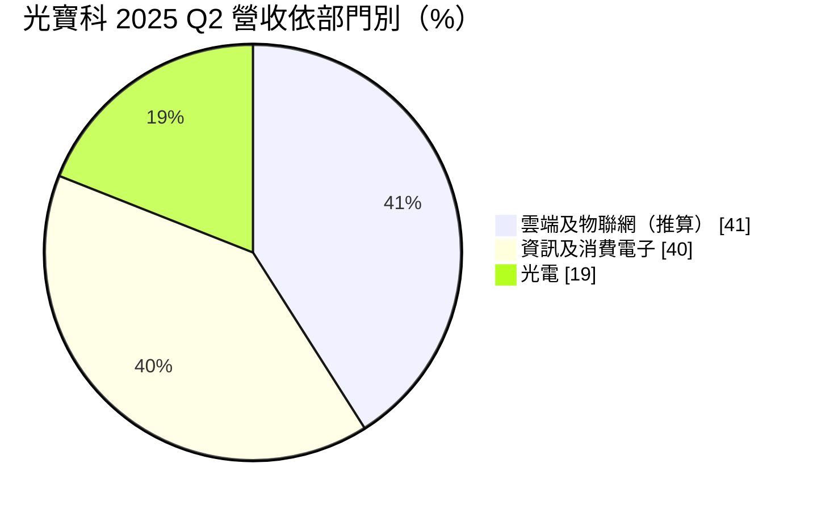
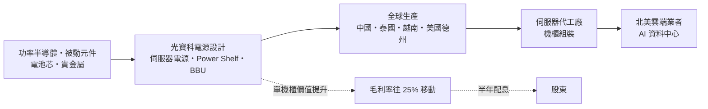
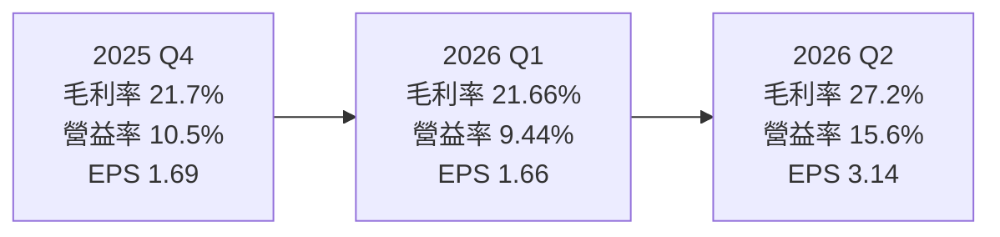
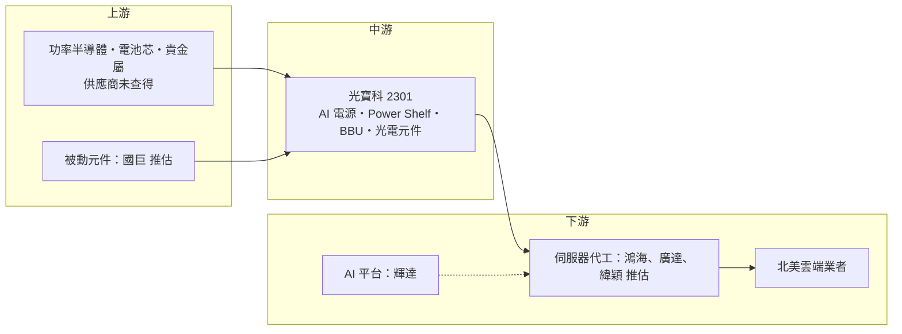

# 2301 光寶科

> 上市｜[[產業索引-電腦及週邊設備業|電腦及週邊設備業]]｜上市（櫃）日期 1995/11/17

# 第一章：企業模式與商業藍圖

> [!info] 撰寫說明
> 本文由 Claude 依公開資料整理，架構比照 [[2330台積電]] 的四章研究，資料截至 2026-10-07。財務數字來源：優分析（光寶科 2025 年第四季與 2026 年第二季法說會報導）、數位時代、HiStock 嗨投資（每股盈餘、利潤比率、除權息頁面）；產業描述為整理性內容，尚未逐條比對原始文件。#待校對

在評估單一個股的長期投資價值時，首要步驟是拆解企業的底層獲利邏輯。本章針對光寶科技（股票代號：2301，以下簡稱光寶科）的商業模式進行定性分析，說明一家以 PC 電源與光電元件起家的零組件廠，如何把重心移到 AI 資料中心的電力架構。

## 一、核心定位：從消費電子零組件轉型為 AI 資料中心電源供應商

光寶科 1995 年上市，屬於光寶集團的核心公司，經過多次合併後，業務涵蓋電源供應器、光電元件、網通與資訊周邊產品。過去光寶科給市場的印象是「PC 電源與鍵盤、LED 元件的大型代工廠」，[[毛利率]]長期在 20% 上下，成長性有限。

近幾年光寶科積極調整產品組合，把資源集中到「高價值事業」：雲端與物聯網、光電兩大部門。2025 年高價值事業占營收比重已提升到 62%，四年前還不到一半；人工智慧相關營收在 2025 年突破 20%，公司預期 2026 年 AI 營收占比將突破 30%。這個轉型讓光寶科從消費電子供應鏈，變成 AI 伺服器電源、[[BBU]]（備援電池）與 [[HVDC]]（高壓直流）電力架構的重要供應商。

## 二、終端應用與產品板塊：雲端部門已過半

依數位時代報導，2025 年第二季三大部門的營收比重如下（雲端及物聯網部門比重為 100% 減去另兩部門推算）：

這張圖已是一年多前的結構。到 2026 年第二季，雲端及物聯網部門營收 288.9 億元，占總營收 55%，上半年占比 54%（2022 年同期僅 32%），變化速度很快。

* **雲端及物聯網部門：** AI 伺服器電源、[[Power Shelf]]（機櫃式電源）、BBU、網通設備等。2025 年全年營收成長超過 70%；2026 年第二季單季營業利益約 69 億元，呈倍數成長。
* **光電部門：** LED 與光耦合器、光學感測元件、車用照明等，最新比重本次未查得。
* **資訊及消費電子部門：** PC 與筆電電源、轉接器、鍵盤與周邊等，公司預估 2026 年消費性產品將衰退 2% 至 8%，比重持續下降。

**AI 電源產品線（依 2026 年 7 月法說會報導）：**

* 8.5kW 伺服器電源供應器已量產，110kW 與 120kW 機櫃式電源已出貨。
* 800V HVDC 機櫃預計 2026 年下半年完成驗證，2027 年第一季擴大放量。
* BBU 產能由 60 萬顆擴充到 90 萬顆，占雲端部門營收近兩成。未來高壓直流機櫃將標配備援電池，BBU 出貨可望進一步成長。
* 打入兩家新的北美大型雲端服務業者（[[CSP]]）供應鏈並開始出貨，目標讓每家關鍵大客戶的年營收貢獻達到 10 億美元。

## 三、資本轉化邏輯：從單顆電源到整櫃電力方案

* **單位價值提升：** 從一台伺服器幾千瓦的電源，到一整個機櫃上百千瓦的 Power Shelf 加 BBU，光寶科在每個機櫃中的產值大幅增加。
* **全球產能布局：** 生產基地長期以中國為主，近年加速分散到泰國、越南等東南亞據點，並宣布在美國德州設立新廠，預計 2026 年 8 月動工、2027 年第二季量產。公司預估 2027 年非中國產能比重將提升到 70%。

## 四、企業長期藍圖：搶下 800V 高壓直流世代

光寶科的長期目標是把自己定位為資料中心電力架構的供應商，而不只是電源零件廠。三個主軸是：800V HVDC 機櫃在 2027 年放量、BBU 擴產與標配化，以及把每家關鍵 CSP 客戶的年貢獻做到 10 億美元。2026 年 [[CapEx]] 上修至 180 億元，用於購置設備與擴建全球據點。

# 第二章：護城河深度與競爭優勢

在長期價值投資中，「護城河」指企業抵禦競爭、維持超額利潤的保護機制。本章分析光寶科的護城河構成、主要競爭對手，以及這些優勢在 AI 電源競賽中能守住多少。

## 一、光寶科護城河的核心組成要素

光寶科的護城河屬於「窄護城河」，正在加寬中：

* **1. 電源設計與量產規模：** 光寶科是全球主要的電源供應器廠之一，長年為 PC、伺服器、網通設備供應電源，累積大量設計經驗與零組件採購規模。AI 伺服器電源功率快速提高（從數 kW 到機櫃百 kW 級），需要高效率轉換、散熱與可靠度設計，進入門檻提高。
* **2. 雲端客戶的驗證與綁定：** 機櫃式電源與 BBU 必須通過 CSP 與伺服器代工廠的長期驗證，一旦打入供應鏈，在同一代平台中更換供應商的成本高。
* **3. 電源加電池的整合能力：** 同時做電源與 BBU，可以提供電力架構的整合方案，對應 800V 高壓直流的新架構。
* **4. 全球產能分散：** 中國以外產能比重提高，加上美國德州新廠，有助於爭取對供應鏈地點有要求的美國客戶。

## 二、全球主要競爭對手格局

| 對手 | 定位 | 對光寶科的威脅 |
|---|---|---|
| [[2308台達電]] | 全球電源龍頭，AI 電源與資料中心電力架構最完整 | 最直接的對手，高階技術與規模領先 |
| [[6282康舒]]、[[6412群電]]、[[3015全漢]] | 國內電源同業 | 在伺服器與 PC 電源領域價格競爭 |
| [[6781AES-KY]]、[[3211順達]]、[[6121新普]] | 電池模組廠 | 爭取 AI 伺服器 BBU 訂單 |
| [[2393億光]]、艾邁斯歐司朗 | LED 與光學感測 | 光電部門的主要競爭者 |

## 三、優勢轉化：哪些市場守得住、哪些守不住

* **守得住：** 已通過驗證的北美 CSP 平台、BBU 擴產後的規模，以及電源與電池的整合方案。
* **守不住：** 台達電在高階電源與電力架構的技術與規模仍領先；BBU 市場參與者多，價格競爭可能隨產能擴充而轉趨激烈。
* **觀察重點：** 800V HVDC 機櫃能否如期在 2027 年第一季放量、新 CSP 客戶能否放大到每家 10 億美元規模，以及毛利率能否穩定在公司所說約 25% 的長期水準。

# 第三章：財務體質與盈利規模

資料日期：2026-10-07。數字取自光寶科法說會相關報導（優分析、數位時代）與 HiStock 嗨投資整理，最新月營收與三率請見[[#相關連結]]的公開資訊觀測站。#待校對

財務報表是檢驗護城河是否真實存在的最終標準。本章用三率、ROE、現金流與資本報酬，檢視光寶科轉型 AI 電源後的獲利品質。

## 一、獲利能力的基石：三率

| 項目 | 2025 全年 | 2025 Q4 | 2026 Q1 | 2026 Q2 |
|---|---|---|---|---|
| 營收（新台幣） | 1,660.9 億 | 443.6 億 | 約 434.1 億 | 527 億 |
| [[毛利率]] | 22.9% | 21.7% | 21.66% | 27.2% |
| [[營業利益率]] | 10.1% | 10.5% | 9.44% | 15.6% |
| EPS（元） | 6.64 | 1.69 | 1.66 | 3.14 |

* **營收與獲利：** 2025 年營收年增 21.1%，營業利益 167.4 億元，稅後淨利 151.2 億元，EPS 6.64 元創歷史新高。2026 年第二季營收年增 30.4%、季增 21.4%，稅後淨利 71.2 億元，年增 125.5%。上半年營收 961.1 億元，EPS 4.8 元。
* **[[毛利率]]：** 管理層表示，上半年毛利率 24.7% 較接近公司長期約 25% 的常態水準，第二季 27.2% 的高毛利率不宜直接外推。
* **[[營業利益率]]：** 由 2025 年的 10.1% 提升到 2026 年上半年的 12.8%，反映 AI 電源比重提高與營運槓桿。

## 二、[[ROE]]：資本效率

光寶科過去屬於低毛利、高周轉的代工型態。隨 AI 電源比重提高，獲利率改善，股東權益報酬率可望同步提升（精確數字未查得）。需要注意的是，2025 年存貨周轉天數由 58 天增加到 69 天，公司說明是因應貴金屬價格波動與記憶體缺貨而策略性備料，周轉率下降會部分抵銷獲利率改善對 ROE 的貢獻。

## 三、資本支出與自由現金流

* **[[CapEx]]：** 2026 年資本支出上修至 180 億元，用於設備與全球據點擴建，包含美國德州新廠與 BBU 產能擴充。資本支出明顯高於過去的代工廠水準，未來折舊會增加。
* **[[自由現金流]]：** 擴產與備料同時進行，2026 年自由現金流可能低於獲利成長幅度（推估）。
* **股利：** 光寶科採半年配息。2024 年度合計配發 4.51 元（2.51 元加 2.0 元），2025 年度合計 5.5 元（3.0 元加 2.5 元），以 2025 年 EPS 6.64 元計算，配發率約 83%。2026 年上半年盈餘董事會通過配發 2.5 元。

## 四、[[ROIC]] 與 [[WACC]]：價值創造利差

光寶科過去以 20% 上下的毛利率經營，ROIC 與 WACC 的利差有限（推估，具體數值未查得）。AI 電源把營益率推升到雙位數中段，利差正在擴大；但 180 億元資本支出與存貨增加會同時推高投入資本，若 800V 機櫃放量延後，新增資本的報酬率可能暫時偏低。

# 第四章：總體風險與地緣政治

任何企業都無法脫離宏觀環境獨立存在。本章分析光寶科未來必須面對的地緣政治、產業週期與營運風險。

## 一、地緣政治風險

* **中國產能比重：** 光寶科過去以中國生產為主，美國對中國製電子產品加徵關稅，是推動公司加速移往東南亞與美國的主要原因。公司目標 2027 年非中國產能達 70%，執行進度是關鍵。
* **美國在地生產：** 德州新廠可以滿足美國客戶在地化需求，但美國的人工與營運成本較高，可能壓縮毛利。
* **台灣與兩岸風險：** 研發與總部在台灣，與其他台灣科技業相同面臨兩岸風險。

## 二、產業週期與市場結構風險

* **AI 資本支出循環：** 雲端部門已占營收過半，若 CSP 放緩 AI 資料中心投資，成長動能會明顯減弱。
* **消費電子衰退：** 公司預估 2026 年消費性產品衰退 2% 至 8%，PC 與周邊需求疲弱會拖累整體營收。
* **匯率：** 營收多以美元計價，新台幣升值會壓縮帳面獲利。

## 三、營運環境的隱性風險

* **原物料與缺料：** 貴金屬價格波動與記憶體缺貨，迫使公司提高庫存，若需求反轉可能出現存貨跌價損失。
* **擴產執行：** BBU 擴產、德州新廠與 800V 機櫃放量同時進行，任何一項延誤都可能影響 2027 年成長。
* **價格競爭：** 電源與 BBU 同業積極擴產，可能壓縮報價。

## 四、科技演進風險

資料中心電力架構正從 48V 走向 800V 高壓直流，甚至可能出現[[固態變壓器]]等新方案。若光寶科在新架構的驗證進度落後於台達電等對手，可能失去下一代平台的市占率。

# 專有名詞解析

## 應用

- **[[CSP]]**：雲端服務供應商，例如微軟、谷歌、亞馬遜、Meta，是 AI 資料中心的主要投資者。

## 金融

- **[[毛利率]]**：毛利除以營收，反映產品本身的定價能力與成本控制。
- **[[營業利益率]]**：營業利益除以營收，反映扣除研發、管銷費用後的本業獲利能力。
- **[[ROE]]**：股東權益報酬率，稅後淨利除以股東權益，衡量公司運用股東資金的效率。
- **[[CapEx]]**：資本支出，用於購置廠房、設備等長期資產的支出。
- **[[自由現金流]]**：營業活動現金流減去資本支出，代表企業可自由用於配息、還債或併購的現金。
- **[[ROIC]]**：投入資本報酬率，衡量公司運用股東與債權人資金創造本業報酬的效率。
- **[[WACC]]**：加權平均資金成本，股東與債權人要求報酬率的加權平均，ROIC 高於它才算創造價值。

## 產業

- **[[BBU]]**：備援電池模組（Battery Backup Unit），在市電中斷時短暫供電，保護 AI 伺服器運算不中斷。
- **[[HVDC]]**：高壓直流供電，資料中心以 800V 等高壓直流配電，減少交直流轉換損耗並降低銅線用量。
- **[[Power Shelf]]**：機櫃式電源，把多個電源模組集中在機櫃的一層，統一供電給整櫃伺服器。
- **[[固態變壓器]]**：以功率半導體取代傳統鐵芯線圈的變壓器，體積小、可直接輸出直流，被視為下一代資料中心電力架構的選項。

# 核心供應鏈

## 1. 上游：零組件與原料
- 功率半導體、被動元件、電池芯、貴金屬：本次未查得具體供應商
- 被動元件：[[2327國巨]]（推估為業界主要供應來源之一）

## 2. 中游：光寶科本身
- AI 伺服器電源、機櫃式電源、BBU、光電元件、PC 電源與周邊

## 3. 下游：雲端與伺服器客戶
- AI 平台：[[NVDA輝達]]
- 北美雲端服務業者：[[MSFT微軟]]、[[GOOGL谷歌]]、[[AMZN亞馬遜]]、[[META臉書]]（具體客戶名單公司未揭露，屬推估）
- 伺服器代工：[[2317鴻海]]、[[2382廣達]]、[[6669緯穎]]（推估）

## 4. 同業
- 電源：[[2308台達電]]、[[6282康舒]]、[[6412群電]]、[[3015全漢]]
- BBU：[[6781AES-KY]]、[[3211順達]]、[[6121新普]]
- 光電：[[2393億光]]

## 最新新聞
<!-- news:start（自動產生，請勿手動編輯此範圍） -->
- 2026-10-06 🏛️ 重訊 14:09｜公告處分ams-OSRAM AG普通股股票｜[觀測站](https://mops.twse.com.tw/mops/#/web/t05st01)
- 2026-10-06 📰 媒體 12:10｜鉅亨速報 - Factset 最新調查：光寶科(2301-TW)EPS預估上修至10.53元，預估目標價為292.5元｜[鉅亨網](https://news.cnyes.com/news/id/6622607)

完整紀錄：[[2301光寶科 新聞]]
<!-- news:end -->

## 相關連結
- [公開資訊觀測站](https://mopsov.twse.com.tw/mops/web/t05st03?step=1&firstin=1&co_id=2301)
- [Goodinfo](https://goodinfo.tw/tw/StockDetail.asp?STOCK_ID=2301)
- [Yahoo 股市](https://tw.stock.yahoo.com/quote/2301)
- [鉅亨網新聞](https://www.cnyes.com/twstock/2301/news)
