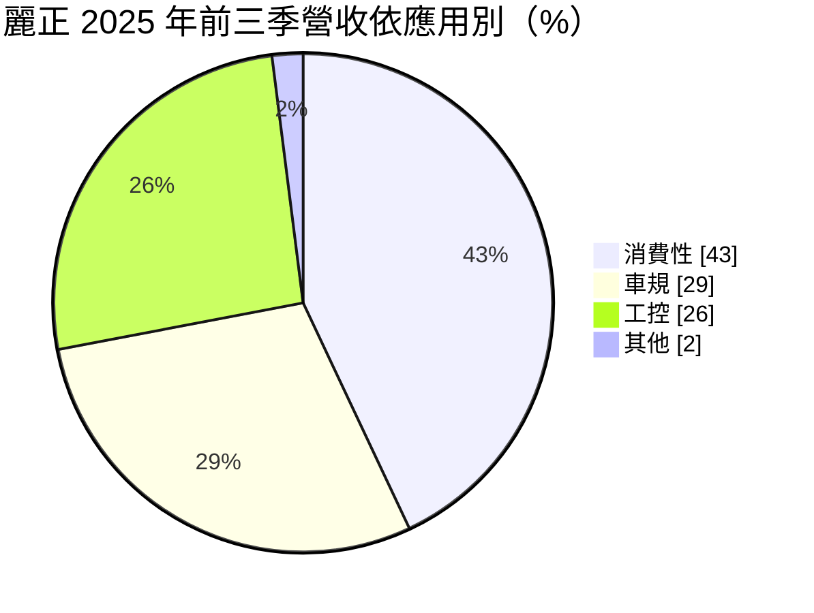
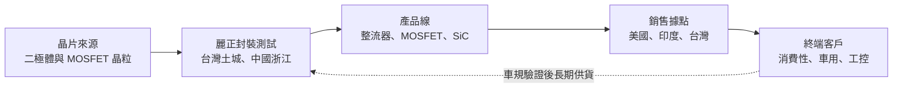
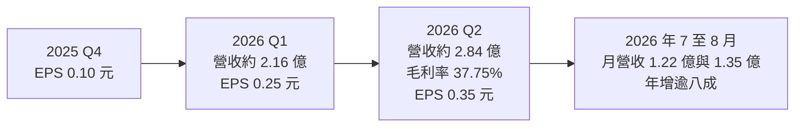
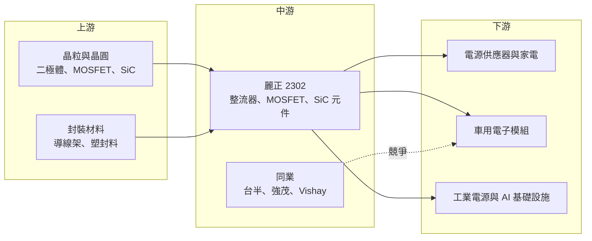

# 2302 麗正

> 上市｜[[產業索引-半導體業|半導體業]]｜上市（櫃）日期 1985/01/15

# 第一章：企業模式與商業藍圖

> [!info] 撰寫說明
> 本文由 Claude 依公開資料整理，架構比照 [[2330台積電]] 的四章研究，資料截至 2026-10-07。財務數字來源：富果研究麗正 2025 年 11 月法說會整理、nStock 公司資料、Yahoo 股市月營收與季 EPS、HiStock；產業描述為整理性內容，尚未逐條比對原始文件。#待校對

在評估單一個股的長期投資價值時，首要步驟是拆解企業的底層獲利邏輯。本章針對麗正國際科技（股票代號：2302，以下簡稱麗正）的商業模式進行定性分析，說明一家規模不大的[[分離式元件]]廠，如何在消費性市場之外把重心轉向車用與工控。

## 一、核心定位：小而專的整流器與功率元件廠

麗正成立於 1976 年，是台股中歷史最悠久的半導體公司之一，資本額約 16.63 億元。公司主要製造與銷售各種[[整流器]]與其他半導體零件，產品屬於「分離式元件」：一顆晶片只做一個功能（整流、開關、保護），不像 IC 那樣把大量電路整合在一起。

麗正的生產基地在台灣土城與中國浙江，並在美國與印度設有銷售據點。營業項目中還包括醫療器材、不動產租賃與酒品買賣，但從營收與法說內容看，半導體元件才是主體。

和大型功率半導體廠相比，麗正的規模很小，2025 年前三季營收只有 6.34 億元。它的經營策略不是拚產能，而是：

* **以封裝型態與交期服務中小客戶：** [[SMD]] 表面黏著型產品占 2025 年前三季營收 66%，屬於標準化程度高、但需要穩定交期的料件。
* **往車規與工控升級：** 公司在法說中明確表示「將車用市場視為核心發展方向」，車規產品已占營收近三成。
* **新增 [[MOSFET]] 與 [[SiC]]：** 從傳統二極體延伸到電晶體與第三代半導體，MOSFET 已占營收 19%。

## 二、終端應用／產品板塊：消費性仍最大，車用與工控快速追上

依富果整理的 2025 年 11 月法說會資料，2025 年前三季營收依應用別如下：

* **消費性：** 家電、電源供應器、充電器中的整流與保護元件，量大但價格競爭激烈。
* **車規：** 公司把車用分為新能源車、車身控制模組、智能座艙、傳統燃油系統與智能駕駛五大主軸，需要通過[[車規驗證]]，單價與黏著度較高。
* **工控：** 工業電源、馬達驅動與自動化設備，近年也延伸到 AI 基礎設施與新能源相關電源。

地區分布上，美洲占 43%、印度 20%、韓國 19%、中國 13%。美洲與印度比重高，代表麗正的客戶群偏向國際電源與電子製造業者，而非單一依賴中國市場。

## 三、資本轉化邏輯（營運模式）：外購晶片、自主封裝、國際通路

* **封裝型態決定附加價值：** 分離式元件的晶片成本不高，價值大多在封裝、測試與可靠度驗證。麗正 SMD 產品占比高，代表它跟隨下游產品小型化的趨勢。
* **輕資產經營：** 以營收規模推估，麗正的固定資產投資規模有限，獲利主要來自產品組合改善，而非產能擴張（推估）。
* **營運槓桿：** 2025 年前三季營收年增 15%，營業利益卻年增 57%，顯示營收成長時固定成本攤提效果明顯。

## 四、企業長期藍圖：車用、AI 電源與新能源

* **車用為核心：** 公司把新能源車、車身控制、智能座艙、燃油系統與智能駕駛列為五大方向，目標是讓車規產品逐步超越消費性。
* **AI 基礎設施與新能源：** 法說資料提到重點拓展 AI 基礎設施與新能源領域，預計 2026 年推出多款高性能新品。2026 年 7 月與 8 月營收分別年增 81% 與 88%，月營收創下近年新高，可能與新產品出貨有關（推估，公司未逐月說明原因）。
* **供應鏈備援：** 面對中美貿易戰，公司已評估海外產地備選方案，降低關稅對美洲客戶的衝擊。

# 第二章：護城河深度與競爭優勢

在長期價值投資中，「護城河」指企業抵禦競爭、維持超額利潤的保護機制。本章分析麗正在分離式元件市場的競爭位置，以及小型廠如何在大廠夾縫中保有利基。

## 一、護城河的核心組成要素

麗正的護城河屬於「窄護城河」，主要來自客戶關係與認證，而非技術獨占：

* **1. 車規與工控認證：** 車用元件一旦通過車廠或一階供應商驗證，通常會連續供貨數年。車規比重提升，等於提高客戶的轉換成本。
* **2. 長年國際通路：** 掛牌超過 40 年，在美洲、印度、韓國都有穩定客戶，這種分散的客戶結構讓公司不必依賴單一大客戶。
* **3. 彈性與交期：** 小型廠可以接受少量多樣的訂單，對中小型電源廠與模組廠而言，比大型 IDM 更容易配合。

## 二、全球主要競爭對手格局

| 對手 | 定位 | 對麗正的威脅 |
|---|---|---|
| Vishay、onsemi、Diodes 等國際廠 | 分離式元件全球大廠，產品線完整 | 可整包報價，壓縮小廠在大客戶的空間 |
| [[5425台半]] | 台灣整流二極體與 MOSFET 大廠 | 產品高度重疊，規模與車規認證較多 |
| [[2481強茂]] | 台灣分離式元件大廠，車用比重高 | 在車用、工控直接競爭 |
| [[3016嘉晶]]、[[5299杰力]]、[[8255朋程]] | 磊晶、MOSFET 設計、車用整流 | 在特定產品領域競爭或為潛在供應鏈夥伴 |
| 中國分離式元件廠 | 低價、政策扶植、產能擴張快 | 在消費性市場以價格壓迫 |

## 三、優勢轉化：守得住、守不住與觀察重點

* **守得住：** 車規與工控的長期訂單，以及美洲、印度、韓國分散的客戶。2026 年第二季[[毛利率]] 37.75%，與 2025 年前三季的 37% 相當，顯示產品組合升級後毛利率維持在不錯的水準。
* **守不住：** 一般消費性二極體的價格。中國廠商產能擴張下，標準品價格很難提高。
* **觀察重點：** 第一，2026 年下半年月營收年增八成以上的動能能否延續；第二，SiC 與新款 MOSFET 的出貨是否放量；第三，車規比重能否超過消費性。

# 第三章：財務體質與盈利規模

資料日期：2026-10-07。數字取自富果研究、nStock、Yahoo 股市與 HiStock，表格是撰寫當時的快照；最新月營收、毛利率、累計 EPS 由自動排程寫在本筆記的屬性欄位（月營收、毛利率、累計EPS 等）。#待校對

財務報表是檢驗護城河是否真實存在的最終標準。本章用三率、ROE、現金流與資本報酬，檢視麗正營收加速成長後的獲利品質。

## 一、獲利能力的基石：三率

| 項目 | 2025 前三季 | 2025 全年 | 2026 Q1 | 2026 Q2 |
|---|---|---|---|---|
| 營收（新台幣） | 6.34 億 | 未查得 | 約 2.16 億（月營收加總） | 約 2.84 億（月營收加總） |
| [[毛利率]] | 37% | 未查得 | 未查得 | 37.75% |
| [[營業利益率]] | 約 14.8%（推算） | 未查得 | 未查得 | 19.29% |
| EPS（元） | 0.40 | 0.50（四季加總） | 0.25 | 0.35 |

* **[[毛利率]]：** 37% 左右的毛利率在分離式元件廠中屬中上水準，反映 SMD、車規與 MOSFET 的組合改善。
* **[[營業利益率]]：** 2025 年前三季營業利益 9,382 萬元，以營收推算營業利益率約 14.8%；2026 年第二季提升到 19.29%，營運槓桿開始顯現。
* **EPS：** 2025 年四季 EPS 分別為 -0.05、0.07、0.38、0.10 元，季度波動大，部分可能來自匯率與業外項目（推估）。2026 年前兩季已累計 0.60 元，超過 2025 年全年。
* **營收：** 2026 年 1 至 8 月累計營收 7.58 億元，年增 38%。

## 二、[[ROE]]：資本效率

依 nStock 資料，2026 年第二季單季 ROE 為 3.24%，換算全年約 13% 上下（推估）。過去幾年麗正的 ROE 偏低，主要是獲利規模小；營收若能維持目前的成長速度，ROE 有機會回到雙位數。

## 三、資本支出與自由現金流

* **[[CapEx]]：** 公司未公開年度資本支出金額（未查得）。分離式元件封裝的設備投資相對有限，推估資本支出規模不大。
* **[[自由現金流]]：** 輕資產模式下，營業現金流大部分可轉為自由現金流（推估）。
* **股利：** 2025 年度配發現金股利 0.35 元，近五年平均現金股利 0.53 元。以目前股價計算殖利率不到 1%，市場對麗正的評價主要建立在成長題材，而非配息。

## 四、[[ROIC]] 與 [[WACC]]：價值創造利差

麗正過去幾年獲利波動大，ROIC 與 WACC 的利差並不穩定（推估，具體數值未查得）。2026 年營業利益率提升到接近兩成，若能持續，ROIC 有機會穩定高於資金成本。需要注意的是，目前市值約 77 億元，相對於年化獲利的評價已相當高，股價已提前反映成長預期。

# 第四章：總體風險與地緣政治

任何企業都無法脫離宏觀環境獨立存在。本章分析麗正未來必須面對的地緣政治、產業週期、營運與技術風險。

## 一、地緣政治

* **中美貿易戰：** 美洲是最大市場，占營收 43%，而部分產能在中國浙江。美國對中國製電子零件加徵關稅，會影響浙江廠產品的競爭力，公司已在評估海外替代產地。
* **印度市場：** 印度占營收 20%，當地電子製造政策與關稅變化會直接影響出貨。

## 二、產業週期與市場結構

* **分離式元件景氣循環：** 功率元件需求跟隨消費電子、車用與工業景氣，庫存調整時常出現[[長鞭效應]]，訂單在短期內大起大落。
* **中國產能過剩：** 中國廠商大舉擴充二極體與 MOSFET 產能，消費性標準品價格面臨長期壓力。

## 三、營運環境的隱性風險

* **規模小、波動大：** 營收基期小，單一客戶或單一產品的變動就會造成獲利大幅波動，2025 年第一季即出現虧損。
* **非本業項目：** 公司營業項目包含醫療器材、不動產租賃與酒品買賣，資源是否分散、是否影響本業專注度，值得觀察。
* **匯率：** 以外銷為主，新台幣升值會壓縮毛利率與帶來匯損。

## 四、科技或法規演進

* **SiC 與 [[GaN]] 的替代：** 在電動車與 AI 伺服器電源中，第三代半導體正在取代部分矽基元件。麗正已布局 SiC，但規模與技術深度仍需時間驗證；若跟不上，傳統矽基產品可能被邊緣化。
* **車規標準提高：** 車用電子對可靠度要求持續提高，認證成本與時間增加，對小型廠是門檻也是負擔。

# 專有名詞解析

## 半導體

- **[[分離式元件]]**：只具單一功能的半導體元件，例如二極體、電晶體，和把大量電路整合的 IC 相對。
- **[[整流器]]**：把交流電轉成直流電的二極體元件，是電源供應器與充電器的基本零件。
- **[[MOSFET]]**：金屬氧化物半導體場效電晶體，用電壓控制電流開關，是電源轉換最常用的功率元件。
- **[[SiC]]**：碳化矽，屬第三代半導體材料，耐高壓、耐高溫，用於電動車與高功率電源。
- **[[GaN]]**：氮化鎵，屬第三代半導體材料，開關速度快，常用於快充與資料中心電源。
- **[[SMD]]**：表面黏著元件，直接焊在電路板表面的小型封裝，適合自動化生產與輕薄產品。

## 應用

- **[[車規驗證]]**：車用晶片須通過 AEC-Q100 等可靠度測試與車廠認證，流程常需 2 至 3 年，因此轉換成本高。

## 金融

- **[[毛利率]]**：營收扣除銷貨成本後的毛利占營收比例，反映產品本身的獲利能力。
- **[[營業利益率]]**：營業利益占營收的比例，代表扣除研發、管理與銷售費用後本業的獲利能力。
- **[[長鞭效應]]**：終端需求的小幅變動，沿供應鏈往上游傳遞時被逐級放大，造成上游庫存與訂單劇烈波動。

# 核心供應鏈

## 1. 上游：晶粒與封裝材料
- 功率元件晶圓與磊晶：[[3016嘉晶]]（產業常見供應來源，麗正實際供應商未查得）
- 導線架：[[2351順德]]（產業常見供應來源，麗正實際供應商未查得）

## 2. 中游：麗正本身與同業
- 台灣分離式元件同業：[[5425台半]]、[[2481強茂]]、[[8255朋程]]
- MOSFET 設計同業：[[5299杰力]]
- 國際同業：Vishay、onsemi、Diodes

## 3. 下游：終端應用
- 消費性電源與家電：美洲、印度、韓國客戶（名稱未查得）
- 車用電子：車身控制、智能座艙、燃油系統與新能源車模組
- 工控與 AI 基礎設施電源

## 最新新聞
<!-- news:start（自動產生，請勿手動編輯此範圍） -->
- 2026-10-08 📰 媒體 17:23｜營收速報 - 麗正(2302)9月營收1.19億元年增率高達39.87％｜[鉅亨網](https://news.cnyes.com/news/id/6624988)

完整紀錄：[[2302麗正 新聞]]
<!-- news:end -->

## 相關連結
- [公開資訊觀測站](https://mopsov.twse.com.tw/mops/web/t05st03?step=1&firstin=1&co_id=2302)
- [Goodinfo](https://goodinfo.tw/tw/StockDetail.asp?STOCK_ID=2302)
- [Yahoo 股市](https://tw.stock.yahoo.com/quote/2302)
- [鉅亨網新聞](https://www.cnyes.com/twstock/2302/news)
