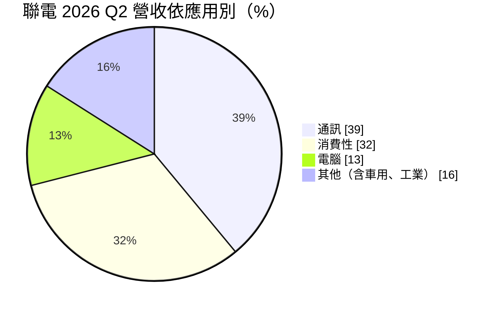
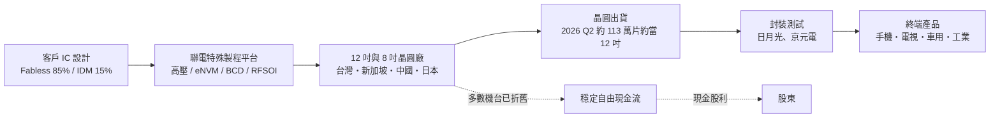
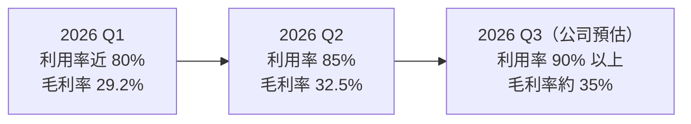
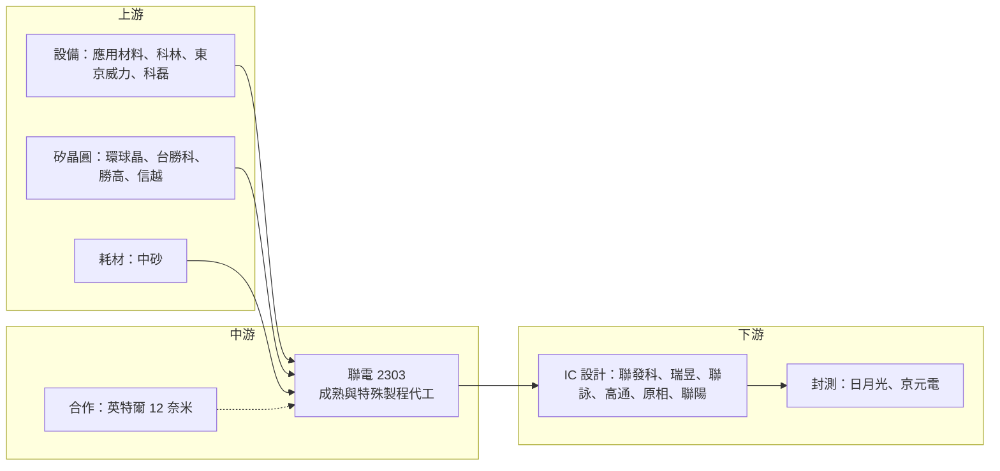

# 2303 聯電

> 上市｜[[產業索引-半導體業|半導體業]]｜上市（櫃）日期 1985/07/16

# 第一章：企業模式與商業藍圖

> [!info] 撰寫說明
> 本文由 Claude 依公開資料整理，架構比照 [[2330台積電]] 的四章研究，資料截至 2026-10-07。財務數字來源：聯電 2025 年第四季與 2026 年第二季法說會新聞稿（Business Wire、優分析、科技新報、自由時報）；產業描述為整理性內容，尚未逐條比對原始文件。#待校對

在評估單一個股的長期投資價值時，首要步驟是拆解企業的底層獲利邏輯。本章針對聯華電子（股票代號：2303，以下簡稱聯電）的商業模式進行定性分析，說明它為何選擇退出先進製程競賽，以及如何在[[成熟製程]]市場中建立自己的定價基礎。

## 一、核心定位：專注成熟與特殊製程的純晶圓代工

聯電成立於 1980 年，是台灣第一家半導體公司，由工研院電子所衍生而來，1990 年代轉型為純[[晶圓代工]]。和 [[2330台積電]] 一樣，聯電不賣自有品牌晶片，只替 [[Fabless]] 與 [[IDM]] 客戶代工，2026 年第二季營收中 Fabless 客戶占 85%、IDM 占 15%。

兩者最大的差別在於技術路線。聯電在 2018 年宣布不再投入 12 奈米以下的先進製程，把資源集中在 14 至 28 奈米與 8 吋製程。這個決策有兩個商業意義：

* **以資本紀律換取現金流：** 不需每年投入上百億美元追趕最新節點，資本支出長期維持在營收的兩成上下，自由現金流可以穩定發放股利。
* **以特殊製程取代線寬競賽：** 成熟製程本身同質性高，聯電的差異化改由[[特殊製程]]平台建立，也就是在同一個線寬上疊加高壓、嵌入式記憶體、射頻等功能。

## 二、終端應用板塊：通訊與消費性為主

2026 年第二季的晶圓營收結構如下：

* **通訊：** 手機與網通的射頻（[[RFSOI]]）、Wi-Fi、電源管理晶片，客戶包括 [[2454聯發科]]、[[2379瑞昱]]、[[QCOM高通]]。
* **消費性：** 電視與面板的顯示驅動 IC（[[DDI]]），主要客戶為 [[3034聯詠]]。
* **電腦：** PC 周邊的介面、電源與控制晶片。
* **其他：** 車用、工業用的 [[MCU]]、[[BCD]] 電源管理、[[eNVM]] 與感測器，是聯電近年刻意拉高比重的板塊。

依製程別，22/28 奈米占晶圓營收 37%，其中 22 奈米單獨占 17.5%，持續創新高，代表產品組合正往較高單價的節點移動。

## 三、資本轉化邏輯：已折舊產能的現金機器

* **多地產能分散：** 台灣（新竹 8 吋、台南 12A）、新加坡（12i）、中國（廈門聯芯 12 吋、蘇州和艦 8 吋）與日本（三重 USJC 12 吋），2026 年第二季月產能約 130.5 萬片約當 12 吋晶圓。客戶可以把同一顆晶片分散到不同國家生產，這在地緣政治升溫後成為接單賣點。
* **折舊攤提完的成本優勢：** 8 吋與 28 奈米以上多數機台已攤提完畢，[[產能利用率]]一旦回升，增加的營收大部分直接轉為利潤，2026 年第二季利用率從約 80% 升到 85%，毛利率就從 29.2% 跳升到 32.5%。

## 四、企業長期藍圖：借力英特爾、跨入先進封裝與矽光子

* **英特爾 12 奈米合作：** 2024 年 1 月宣布與 [[INTC英特爾]] 共同開發 12 奈米 [[FinFET]] 平台，於英特爾亞利桑那廠生產。依 2026 年 5 月報導，技術轉移已完成，預計 2026 年內完成驗證、2027 年下半年量產。聯電藉此在不自建先進廠的情況下，取得美國本土產能與更先進的節點。
* **[[先進封裝]]與[[矽光子]]：** 聯電提供中介層（[[Interposer]]）與晶圓對晶圓混合鍵合（[[Hybrid Bonding]]），2026 年第二季宣布 12 吋光子 IC 已量產出貨，切入 AI 資料中心的光通訊需求。
* **擴產：** 新加坡 P4 擴充與台南新廠建設，2026 年 [[CapEx]] 上修至 20 億美元，其中 90% 投入 12 吋。

# 第二章：護城河深度與競爭優勢

在長期價值投資中，「護城河」指企業抵禦競爭、維持超額利潤的保護機制。本章分析聯電的護城河構成、全球主要競爭對手，以及這些優勢在成熟製程價格戰中能守住多少。

## 一、聯電護城河的核心組成要素

聯電的護城河不如台積電深，屬於「窄護城河」，由三個要素組成：

* **1. 特殊製程的轉換成本：** 驅動 IC、電源管理、eNVM 這類晶片的電路設計和製程參數高度綁定。車用晶片在一座晶圓廠完成[[車規驗證]]往往需要 2 至 3 年，客戶一旦導入，很少輕易轉單。
* **2. 折舊完畢產能的成本優勢：** 同樣是 28 奈米，新建廠商要負擔高額折舊，聯電則以攤提完的機台報價，在價格戰中有較大的毛利緩衝。
* **3. 多地生產與中立性：** 不做自有品牌，加上台灣、新加坡、日本、中國與未來美國（英特爾合作）多點生產，符合國際客戶「台灣加一」或「中國以外」的供應鏈要求。

## 二、全球主要競爭對手格局

| 對手 | 定位 | 對聯電的威脅 |
|---|---|---|
| [[2330台積電]] | 先進與成熟製程皆有，28 奈米產能大 | 綁定先進製程客戶，可整包接單 |
| 格羅方德（GlobalFoundries） | 退出先進製程、專攻特殊製程，握有美國產能 | 定位最接近，搶同一批歐美 IDM 客戶 |
| 中芯國際、華虹 | 中國政策扶植，大舉擴充 28 奈米以上 | 以低價搶中國客戶，壓低全球報價 |
| [[5347世界先進]]、[[6770力積電]] | 台灣 8 吋與電源、驅動製程 | 在 8 吋與驅動 IC 直接競爭 |

## 三、優勢轉化：哪些市場守得住、哪些守不住

* **守得住：** 驗證週期長的車用、工業與高壓製程，以及需要非中國產能的國際客戶。這些訂單看重穩定交期與認證，價格敏感度較低。
* **守不住：** 一般消費性晶片在 28/40 奈米的報價。2025 年聯電毛利率由前一年的 32.6% 降到 29.0%，反映的正是中國同業的價格壓力與新產能折舊。
* **觀察重點：** 22 奈米占比能否持續提升、英特爾 12 奈米能否如期量產，以及 2026 年 7 月起「新增量、新製程、新訂單」的選擇性漲價能否延伸到 2027 年全面調漲。這三點決定聯電能否擺脫純成熟製程的價格戰。

# 第三章：財務體質與盈利規模

資料日期：2026-10-07。數字取自公司法說會新聞稿與財經媒體整理，最新月營收與三率請見[[#相關連結]]的公開資訊觀測站。#待校對

財務報表是檢驗護城河是否真實存在的最終標準。本章用三率、ROE、現金流與資本報酬，檢視聯電在成熟製程週期中的獲利品質。

## 一、獲利能力的基石：三率

| 項目 | 2025 全年 | 2026 Q1 | 2026 Q2 |
|---|---|---|---|
| 營收（新台幣） | 2,375.5 億 | 約 610 億（推算） | 687.3 億 |
| [[毛利率]] | 29.0% | 29.2% | 32.5% |
| [[營業利益率]] | 18.5% | 18.5% | 21.8% |
| EPS（元） | 3.34 | 1.29（推算） | 3.39 |
| [[產能利用率]] | Q4 為 78% | 近 80% | 85% |

* **[[毛利率]]：** 成熟製程的毛利率主要由產能利用率決定。利用率每提高 5 個百分點，毛利率約提升 3 個百分點，是典型的「營運槓桿」。
* **[[營業利益率]]：** 研發與管理費用相對固定，營收回升時營業利益率擴張比毛利率更快。
* **[[淨利率]]與業外：** 2026 年第二季稅後淨利 422.6 億元創新高，但其中約 302 億元來自業外投資與股利收入，屬一次性成分較高的收益。評估本業時應以營業利益為準。

## 二、[[ROE]]：資本效率

聯電長年維持低負債，ROE 在景氣好時可達 20% 以上，景氣低迷時落在 10% 上下（推估，依歷年財報區間）。由於大部分產能已折舊完畢，資本支出占營收比例遠低於台積電，因此能把較高比例的獲利以現金股利發放。

## 三、資本支出與自由現金流

* **[[CapEx]]：** 2025 年約 16 億美元，2026 年原訂 15 億美元，第二季法說上修為 20 億美元，九成用於 12 吋。
* **[[自由現金流]]：** 營業現金流足以支應資本支出並維持穩定的現金股利。不過資本支出上修代表 2027 年起折舊將回升，需要靠漲價與 22 奈米等高附加價值製程抵銷。

## 四、[[ROIC]] 與 [[WACC]]：價值創造利差

企業創造價值的條件是投入資本報酬率高於資金成本。聯電在 2021 至 2022 年的高利用率期間 ROIC 明顯高於 WACC，2023 至 2025 年的成熟製程低谷期利差縮小（推估，具體數值未查得）。2026 年利用率回到 85% 以上、價格開始調漲，是利差重新擴大的關鍵觀察期。

# 第四章：總體風險與地緣政治

任何企業都無法脫離宏觀環境獨立存在。本章分析聯電未來必須面對的地緣政治、產業週期與營運風險。

## 一、地緣政治風險

* **中國產能的雙面刃：** 廈門聯芯與蘇州和艦讓聯電能服務中國客戶，但也暴露在美國出口管制與中國本土化政策之下。中國客戶可能被要求優先採用本土晶圓廠。
* **美國關稅與在地化要求：** 英特爾合作提供美國本土產能，是對沖美國半導體關稅與「美國製造」要求的重要布局。
* **台灣集中風險：** 主要 12 吋產能仍在台灣，面臨與其他台灣半導體廠相同的兩岸風險。

## 二、產業週期與市場結構風險

* **成熟製程供過於求：** 中國大舉擴充 28 奈米以上產能，可能在 2026 至 2028 年持續壓抑報價。
* **[[長鞭效應]]與庫存週期：** 消費性與通訊合計占營收七成，手機、PC、電視需求轉弱時，庫存調整會沿供應鏈放大，直接反映在產能利用率。
* **匯率：** 營收以美元計價為主，新台幣升值會壓縮以台幣計算的毛利率。

## 三、營運環境的隱性風險

* **新產能折舊：** 新加坡 P4、台南新廠與資本支出上修，未來折舊增加。
* **合作執行風險：** 英特爾 12 奈米若延後量產，或英特爾代工策略改變，合作效益會打折。
* **水電與人才：** 與台灣同業相同，面臨供電穩定、綠電取得與工程人才競爭。

## 四、科技演進風險

聯電主動不走 12 奈米以下的路線，好處是省下巨額研發與資本支出，代價是無法參與 AI 先進製程最大的一塊市場。如果 AI 需求持續集中在先進製程，聯電能分到的主要是周邊晶片（電源、驅動、連網、光通訊），矽光子與先進封裝能否成為新的成長來源，是長期觀察重點。

# 專有名詞解析

## 半導體

- **[[晶圓代工]]**：替其他公司製造晶片、本身不賣自有品牌晶片的商業模式，代表廠商為台積電、聯電。
- **[[成熟製程]]**：一般指 28 奈米及更大線寬的製程，技術成熟、設備多已折舊，主要用於電源、驅動、車用與物聯網晶片。
- **[[特殊製程]]**：在成熟線寬上加入高壓、嵌入式記憶體、射頻等特殊功能的製程平台，差異化程度高於一般邏輯製程。
- **[[FinFET]]**：鰭式場效電晶體，把電晶體通道做成立體鰭片以降低漏電，是 16/14 奈米到 3 奈米的主流架構。
- **[[eNVM]]**：嵌入式非揮發性記憶體，把斷電後仍能保存資料的記憶體做進同一顆晶片，常見於 MCU 與智慧卡。
- **[[BCD]]**：Bipolar-CMOS-DMOS 製程，把類比、數位與高功率元件整合在同一晶片，主要用於電源管理 IC。
- **[[RFSOI]]**：在絕緣層上覆矽（SOI）晶圓製作射頻元件的製程，用於手機的天線開關與前端模組。
- **[[DDI]]**：顯示驅動 IC，負責控制面板每個像素的電壓，需要高壓製程，聯詠、奇景為主要設計公司。
- **[[先進封裝]]**：把多顆晶片以中介層、混合鍵合等方式高密度整合的封裝技術，例如 CoWoS、SoIC。
- **[[Interposer]]**：中介層，放在晶片與載板之間、內含細微線路的矽片，用來連接並排的多顆晶片。
- **[[Hybrid Bonding]]**：混合鍵合，以銅對銅直接接合兩片晶圓或晶片，不需凸塊，可大幅提高連接密度。
- **[[矽光子]]**：在矽晶片上製作光學元件，以光取代電傳輸資料，可降低 AI 資料中心的傳輸耗電。

## 應用

- **[[車規驗證]]**：車用晶片須通過 AEC-Q100 等可靠度測試與車廠認證，流程常需 2 至 3 年，因此轉換成本高。

## 金融

- **[[產能利用率]]**：實際投片量占總產能的比例，晶圓代工廠的毛利率高度取決於此數字。
- **[[自由現金流]]**：營業活動現金流減去資本支出，代表企業可自由用於配息、還債或併購的現金。
- **[[長鞭效應]]**：終端需求的小幅變動，沿供應鏈往上游傳遞時被逐級放大，造成上游庫存與訂單劇烈波動。

# 核心供應鏈

## 1. 上游：設備、材料與矽晶圓
- 半導體設備：[[AMAT應用材料]]、[[LRCX科林研發]]、[[8035東京威力科創]]、[[KLAC科磊]]
- 矽晶圓：[[6488環球晶]]、[[3532台勝科]]、[[3436勝高]]、[[4063信越化學]]
- 研磨耗材：[[1560中砂]]

## 2. 中游：聯電本身與合作夥伴
- 12 奈米合作開發與美國產能：[[INTC英特爾]]
- 轉投資的 ASIC 設計服務：[[3035智原]]

## 3. 下游：主要 IC 設計客戶
- 手機與連網晶片：[[2454聯發科]]、[[QCOM高通]]
- 驅動 IC：[[3034聯詠]]
- 網通與音訊晶片：[[2379瑞昱]]
- 影像與感測晶片：[[3227原相]]、[[3014聯陽]]

## 4. 下游：封裝測試
- [[3711日月光投控]]、[[2449京元電子]]

延伸閱讀：[[聯發科供應鏈]]

## 供應鏈關係
- 供應給 [[2454聯發科]]：成熟製程主力 (電源管理、Wi-Fi 晶片)（聯發科供應鏈 › 中游：晶圓代工生產夥伴 (Foundry)）

## 最新新聞
<!-- news:start（自動產生，請勿手動編輯此範圍） -->
- 2026-10-07 📰 媒體 17:34｜9月營收創新高！ 聯電突發重訊「澄清1事」｜[TVBS新聞網](https://news.google.com/rss/articles/CBMiT0FVX3lxTE1aYW5BaXkxSEVfWG1Rb1MtS21Ka29vVmo4MW1tLXhzeERWNWJuaFRhTXlrck9fOXhmTFBxOXVtZVBseVFOMXF6MEFBTHBLaHM?oc=5)
- 2026-10-07 📰 媒體 14:31｜【零股排行榜】盤中零股成交量TOP 20｜0050 元大台灣50、2327 國巨*、2303 聯電、2454 聯發科、1303 南亞 (1007)｜[永豐金證券](https://news.google.com/rss/articles/CBMi7gNBVV95cUxNdjdNY0JrMUZNS1NzNlB1OXFTMHlQNmRVR0NSa2ZkZEhycVpiV2hDcC1kR2JxcGpoVmE5dDRaX0h2WUJDSUQ0ak9QY0Fydy02X0RmbS1tQzZUcDV1TENETmFPejIzZnJsZFplRjQtenIzbjJBd1hONjlmeV9TcWdHRHVEUFRsZ29fNnJUMkFSR3lrSThndGdLb0w1RjNYQ3E4RWtCbTY1WnlqVW1pZjhrSVBDZ1NKQXlOQUI0b1hmUWhacXVVTEFJd1hRUkdKVkNya0xtOHM4emoyYlY3VUVkamp1MFM5SlB3UGVkUEQwbW9xdVVvX0R1UktfdWFLc1FaaVFobC1RazRmaDZ6UHdOdl9kak9ScEthZHdpWmNnVk9jV2tfRlp1ZlB0ZE8wZktjTVNXUjhzcFhUS1JIa0hWZERjV3g0enJUZERIcHIwb1NCZktDZE1ZTENTZTR3SkxYdmJubnVtcVI3TFN5bGFSZ1V4OHlwdHB6RWx1SmlHRnFxbUlhRXhfbUQ0YjVJdjdUTGxKN1JfM3FobUxyYWgwZDhVY0lXbTN3N0Fna21fNTEtSHhQeVFLdHFraU01VnVDcFBlVFZkOWczemhaOHZ5Vmx1VjFWbkZSeW9ncTV6UGUwXzliUHJUYzBuX0lodw?oc=5)
- 2026-10-07 📰 媒體 09:30｜個股：9月業績亮眼支撐，聯電(2303)今日開小紅上漲｜[富聯網](https://news.google.com/rss/articles/CBMikgFBVV95cUxQeXVkdHdhTlk2VnV1TVhMdEpGLUVNRVhFeS1RY29SejNjU2FReklHb2IxOC0wQUxPdDBUWkUxNUtQcW1xelg4b1BORDFmNWlaRXVjLWRSNTlPUXlVc1lHM2pjZmFmc1lfaG8xRWRGM1l3T1U2NDdkRkpvMGZCelo2VUZCckpqRmhUcGxYYkJlTzM2UQ?oc=5)
- 2026-10-07 📰 媒體 05:18｜需求強勁 聯電、技嘉９月營收創新高｜[自由時報](https://news.google.com/rss/articles/CBMiWEFVX3lxTE5VQ3Y0NE1mMXh6dzRkdTZVWUxleHVueFF3QUNqUjU0S2hUbVAxQUVoMTlWZDNzcjBlVjdBZm1STThoclowdU5ESVVMa0hmYzZqQ2o3ckdIc0U?oc=5)
- 2026-10-07 📰 媒體 02:21｜聯電報喜！9月營收創新高 連七月繳出成長佳績｜[UDN](https://news.google.com/rss/articles/CBMiUEFVX3lxTE52a0F1bTlPM0tzek5xZmtic2V6YkNybERqSGhxcTJ5Uk9HQlN0SC1zUGczcmZIZGtEblhZckh2NS1XYWpHanBVX0FjSXNtY0Ex0gFWQVVfeXFMUFhsMjVtMV96ZzRGMWVjR2hWTmZTX25hRkN0eFdqTWVEWTBycUpKSktLeTFxMjUyek5NbGNCc3VtWFhVZVM0RzRyRk9pV3dxdjJxOVhHanc?oc=5)

完整紀錄：[[2303聯電 新聞]]
<!-- news:end -->

## 相關連結
- [公開資訊觀測站](https://mopsov.twse.com.tw/mops/web/t05st03?step=1&firstin=1&co_id=2303)
- [Goodinfo](https://goodinfo.tw/tw/StockDetail.asp?STOCK_ID=2303)
- [Yahoo 股市](https://tw.stock.yahoo.com/quote/2303)
- [鉅亨網新聞](https://www.cnyes.com/twstock/2303/news)
