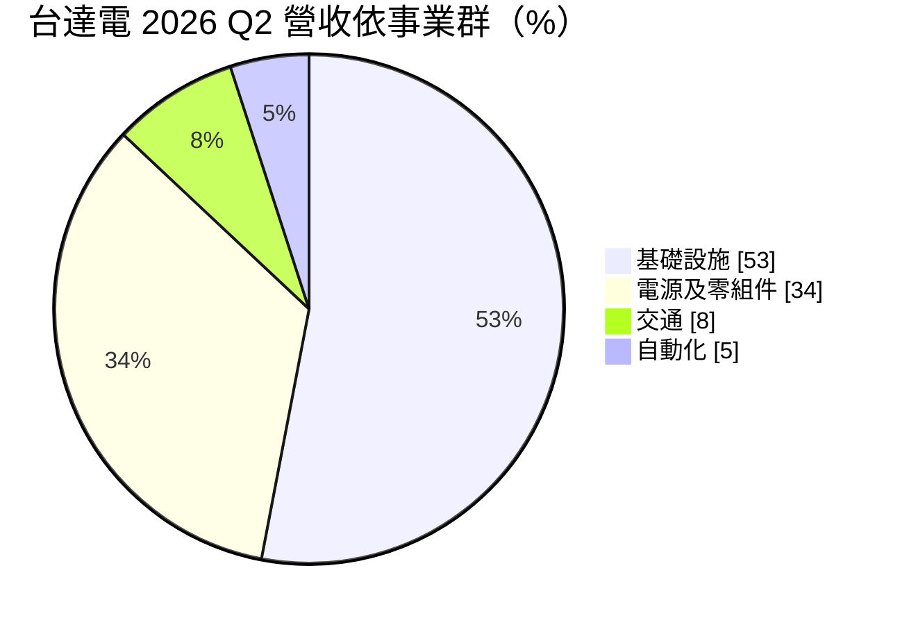
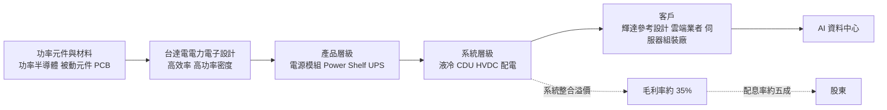
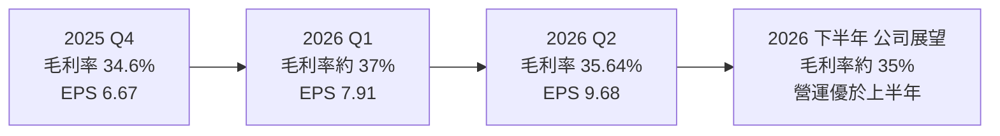
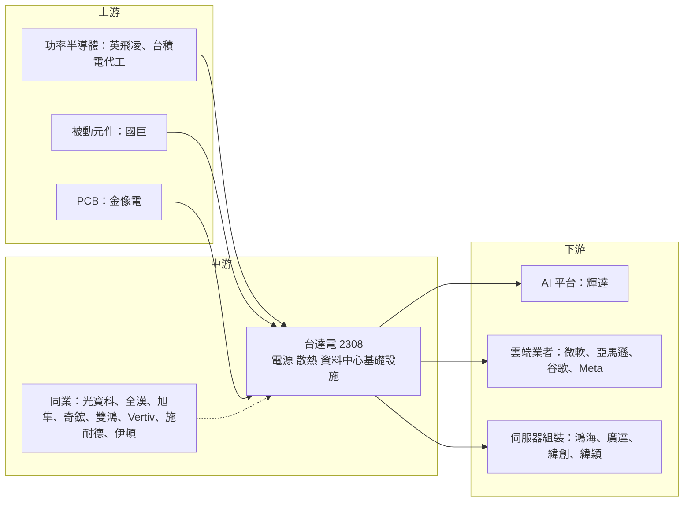

# 2308 台達電

> 上市｜[[產業索引-電子零組件業|電子零組件業]]｜上市（櫃）日期 1988/12/19

# 第一章：企業模式與商業藍圖

> [!info] 撰寫說明
> 本文由 Claude 依公開資料整理，架構比照 [[2330台積電]] 的四章研究，資料截至 2026-10-07。財務數字來源：台達電 2025 年財報與 2026 年第一季、第二季法說會內容（科技新報、ETtoday 財經雲、股感、窮人的股票法說會整理）；產業描述為整理性內容，尚未逐條比對原始文件。#待校對

在評估單一個股的長期投資價值時，首要步驟是拆解企業的底層獲利邏輯。本章針對台達電子（股票代號：2308，以下簡稱台達電）的商業模式進行定性分析，說明一家電源供應器廠如何在 AI 資料中心的功耗競賽中，轉型為電力與散熱整體解決方案供應商，並讓毛利率站上 35% 附近。

## 一、核心定位：從電源供應器龍頭走向 AI 資料中心電力與散熱整合商

台達電由鄭崇華於 1971 年創立，早期生產電視用線圈與濾波器，之後發展為全球交換式電源供應器的龍頭。台達電的核心能力是「[[電力電子]]」：把電能有效率地轉換、分配與管理，並延伸到散熱、自動化與能源基礎設施。

過去台達電的營收主要來自 PC、伺服器、網通與消費電子的電源與風扇，屬於穩健但成長平緩的零組件廠。AI 資料中心興起後，GPU 機櫃的功耗從十幾千瓦躍升到上百千瓦，電源轉換效率與散熱能力成為資料中心建置的瓶頸。這個變化有兩個商業意義：

* **從零組件升級為系統：** 產品涵蓋伺服器電源、機櫃電源架（[[Power Shelf]]）、不斷電系統（[[UPS]]）、[[液冷]]散熱與高壓直流（[[HVDC]]）配電，單一客戶的採購金額大幅提高。
* **效率就是定價權：** AI 機櫃每提升 1% 轉換效率，對資料中心電費與散熱都有顯著影響，客戶願意為效率付溢價，這是台達電毛利率遠高於組裝廠的原因。2025 年台達電 EPS 創歷史新高，市值一度躍居台股第二大。

## 二、終端應用板塊：基礎設施躍升為最大事業群

台達電將營收分為四大事業群，2026 年第二季比重如下：

* **基礎設施：** 資料中心基礎設施（UPS、機櫃電源、液冷系統、HVDC）、通訊電源、能源基礎設施（儲能、充電樁、再生能源變流器）。2026 年第二季年增 78%，是成長主引擎。
* **電源及零組件：** 伺服器與網通電源、PC 與消費電子電源、被動元件、風扇與散熱模組。AI 伺服器電源與液冷相關零組件是主要成長來源，2026 年第二季年增約五成。
* **交通：** 電動車動力系統與車用電源，近年因電動車市場調整而衰退，2026 年第二季年減 23%。
* **自動化：** 工業自動化（驅動器、伺服馬達、PLC、機器視覺）與樓宇自動化。

依法說資料整理，2025 年第四季電源及零組件占 50%、基礎設施占 37%，而 2026 年第二季兩者分別為 34% 與 53%。兩期比重差距明顯，推估與資料中心相關產品歸類調整及基礎設施業務高速成長都有關，閱讀時應以公司最新法說資料為準。公司預估 2026 年 AI 相關營收占比超過 25%。

## 三、資本轉化邏輯：電力電子技術變成整櫃方案

* **多地產能分散：** 台達電在台灣、中國、泰國、印度、美國、歐洲都設有生產與研發據點。泰國子公司泰達電是集團在東南亞的重要生產基地，也是泰國股市市值最大的公司之一。2026 年擴產地點涵蓋台灣、中國、泰國與美國，台灣有觀音新廠（暫估總價約 103 億元）與桃園一廠重建工程（暫估約 18 億元）。多地生產讓台達電能因應美國關稅與客戶「非中國產能」的要求。
* **從賣零件到賣方案：** 同一個資料中心專案，台達電可以同時提供電源、配電、UPS 與液冷，單一專案金額與毛利都高於單賣電源模組。

## 四、企業長期藍圖：高壓直流與能源基礎設施

* **800V 高壓直流：** [[NVDA輝達]] 規劃下一代 AI 資料中心改用 800V 直流供電，以降低電流與銅材用量、提升效率。依法說內容，台達電 ±400V 方案於 2026 年出貨，800V 方案預期 2027 年放量，台達電是輝達 800V 架構的電源合作夥伴之一。
* **液冷散熱：** 從冷卻液分配裝置（[[CDU]]）、冷板到機櫃級液冷系統，台達電提供完整方案，是 GPU 機櫃散熱升級的直接受惠者。
* **能源基礎設施：** 儲能、電動車充電與電網相關設備，搭配 AI 資料中心對電力的龐大需求。
* **資本支出：** 2025 年 [[CapEx]] 461 億元，2026 年上半年 275 億元，全年目標約 700 億元，大幅高於過去水準。

# 第二章：護城河深度與競爭優勢

在長期價值投資中，「護城河」指企業抵禦競爭、維持超額利潤的保護機制。本章分析台達電的護城河構成、在電源與資料中心基礎設施兩個市場的主要競爭對手，以及這些優勢在新世代供電架構中能守住多少。

## 一、台達電護城河的核心組成要素

台達電的護城河屬於「寬護城河」中較穩固的一類，主要來自技術累積與系統整合能力：

* **1. 電源轉換效率的技術領先：** 長期專注電力電子，在高效率、高功率密度電源設計上累積大量專利與經驗。效率每提升一點，就直接轉為客戶的電費節省。
* **2. 從零組件到系統的完整產品線：** 從單一電源模組、Power Shelf、UPS、液冷到 HVDC 配電，台達電能提供整個電力鏈的解決方案，降低客戶整合多家供應商的風險。
* **3. 與輝達、雲端業者的早期合作：** 參與輝達參考設計與 800V 架構規劃，讓台達電在新世代平台導入時具先發優勢。
* **4. 可靠度與品牌信譽：** 電源若故障會影響整座機櫃，客戶對可靠度要求極高，新供應商導入門檻高。
* **5. 全球化製造與服務網：** 多地生產與在地服務，讓台達電能承接大型資料中心專案。

## 二、全球主要競爭對手格局

| 對手 | 定位 | 對台達電的威脅 |
|---|---|---|
| [[2301光寶科]] | 台灣另一家大型電源供應器廠 | 在伺服器電源與 AI 電源直接競爭 |
| [[6409旭隼]]、[[3015全漢]] | UPS 與電源供應器 | 在特定產品線以價格競爭 |
| Vertiv、施耐德電機、伊頓 | 國際資料中心電力與散熱基礎設施大廠 | 長期客戶關係與服務網絡，是擴大基礎設施業務的主要對手 |
| [[3017奇鋐]]、[[3324雙鴻]] | 散熱模組與液冷 | 在冷板與液冷模組上競爭 |
| 西門子、三菱電機、安川電機 | 工業自動化大廠 | 自動化事業的主要對手 |

## 三、優勢轉化：哪些市場守得住、哪些守不住

* **守得住：** 高功率伺服器電源與 Power Shelf，台達電市占與技術都領先，2025 年毛利率提升到 34.3%、營業利益率 15.1% 創新高，顯示具定價能力。
* **守不住：** 資料中心基礎設施市場規模大，Vertiv、施耐德等國際大廠擁有長期客戶關係與服務網絡；液冷與 HVDC 仍在標準形成期，競爭者眾多。交通與自動化事業則面臨景氣與價格雙重壓力。
* **觀察重點：** 800V HVDC 能否如期在 2027 年放量、液冷產品規模化後毛利率是否維持在 35% 上下、自動化與交通事業何時止跌回升。

# 第三章：財務體質與盈利規模

資料日期：2026-10-07。數字取自台達電財報、法說會內容與財經媒體整理，表格是撰寫當時的快照；最新月營收、毛利率、累計 EPS 由自動排程寫在本筆記的屬性欄位（月營收、毛利率、累計EPS 等）。#待校對

財務報表是檢驗護城河是否真實存在的最終標準。本章用三率、ROE、現金流與資本報酬，檢視台達電在 AI 需求帶動下的獲利品質，以及大幅擴產對資本效率的影響。

## 一、獲利能力的基石：三率

| 項目 | 2025 全年 | 2025 Q4 | 2026 Q1 | 2026 Q2 |
|---|---|---|---|---|
| 營收（新台幣） | 5,548.9 億 | 約 1,616 億 | 1,593.5 億 | 1,832.6 億 |
| [[毛利率]] | 34.3% | 34.6% | 約 37% | 35.64% |
| [[營業利益率]] | 15.1% | 未查得 | 創單季新高（精確值未查得） | 16.7% |
| 稅後淨利 | 601 億 | 173.2 億 | 約 205.6 億（推算） | 251.4 億 |
| EPS（元） | 23.14 | 6.67 | 7.91 | 9.68 |

* **營收：** 2025 年營收年增 31.8%，稅後淨利年增 70.6%，EPS 23.14 元創歷史新高；第四季 EPS 受約 12 至 13 億元資產減損影響。2026 年上半年營收 3,426 億元、年增 41%，稅後淨利 456.9 億元、年增 88.9%，EPS 17.59 元創同期新高。
* **[[毛利率]]：** 第一季約 37%，部分來自一次性訂單取消收入與部分液冷產品交易條件，第二季回到 35.64%。公司預期下半年毛利率大致維持在 35% 區間。
* **[[營業利益率]]：** 第二季 16.7%，高於 2025 年全年的 15.1%。淨利成長幅度遠大於營收成長，顯示高毛利的資料中心產品比重提升帶來明顯的[[營運槓桿]]。
* **[[淨利率]]：** 第二季稅後淨利 251.4 億元除以營收 1,832.6 億元，約 13.7%（推算）。

## 二、[[ROE]]：資本效率

台達電長期維持低負債與穩健的資本結構，2025 年起獲利大幅成長，ROE 隨之上升（精確數值未查得）。過去台達電屬於低資本密集的零組件廠，ROE 主要來自不錯的利潤率而非財務槓桿，這是品質較好的 ROE 來源。

## 三、資本支出與自由現金流

* **[[CapEx]]：** 2025 年 461 億元；2026 年上半年 275 億元，全年目標約 700 億元，用於台灣、中國、泰國、美國擴產。
* **融資：** 董事會於 2026 年初規劃發行不超過 300 億元的公司債或永續債，顯示擴產資金需求上升。
* **[[自由現金流]]：** 精確數值本次未查得。資本支出由 461 億元增至約 700 億元，推估 2026 年自由現金流占淨利的比例會低於過去，需觀察營業現金流成長能否跟上。
* **股利：** 2025 年度配發現金股利 11.6 元，以 EPS 23.14 元計算配息率約五成。

## 四、[[ROIC]] 與 [[WACC]]：價值創造利差

企業創造價值的條件是投入資本報酬率高於資金成本。台達電的 ROIC 精確數值本次未查得；以 15% 以上的營業利益率與低負債結構推估，ROIC 明顯高於 WACC。真正的考驗在於 2026 年約 700 億元的資本支出：新產能若能維持現有利潤率，利差可望維持；若投產延遲或液冷、HVDC 產品價格競爭加劇，資本基數擴大會先稀釋 ROIC。

# 第四章：總體風險與地緣政治

任何企業都無法脫離宏觀環境獨立存在。本章分析台達電未來必須面對的地緣政治、產業週期、營運風險，以及資料中心供電與散熱技術路線尚未定型帶來的不確定性。

## 一、地緣政治風險

* **中國生產基地：** 台達電在中國仍有大量產能，美中貿易衝突與關稅可能影響出口成本；但已透過泰國、印度、美國等地分散。
* **美國關稅與在地化：** AI 資料中心集中在美國，美國若提高對電源與基礎設施設備的關稅，或要求在地製造，會影響成本結構，台達電在美國的擴產是因應措施。
* **台灣集中風險：** 研發總部與部分關鍵產能在台灣，面臨兩岸風險與台灣電力供應問題。

## 二、產業週期與市場結構風險

* **AI 資本支出週期：** 公司預估 2026 年 AI 相關營收占比超過 25%，基礎設施事業高度依賴雲端業者的資料中心投資，一旦投資放緩，成長動能會明顯受影響。
* **[[長鞭效應]]：** 資料中心建置節奏改變時，電源與散熱零組件的訂單波動會被放大，第一季的一次性訂單取消收入就是需求調整的跡象。
* **電動車市場調整：** 交通事業 2026 年第二季年減 23% 並出現虧損，電動車需求若持續疲弱會拖累整體獲利。
* **自動化景氣：** 工業自動化受製造業景氣影響大，2026 年第二季已轉虧。

## 三、營運環境的隱性風險

* **零組件供應壓力：** 公司提到新產品放量與零組件供應壓力，可能影響毛利率。
* **大規模擴產的執行：** 全年約 700 億元資本支出，新廠若投產延遲或產能利用率不如預期，折舊將壓縮獲利。
* **匯率：** 營收以美元為主，新台幣升值會壓縮台幣計價的毛利率與獲利。

## 四、科技演進風險

* **電源架構標準的變化：** 800V HVDC、[[固態變壓器]]等新架構仍在發展，如果業界最終採用的標準與台達電布局不同，或競爭者在新架構取得領先，可能影響市占。
* **散熱技術路線：** 液冷從冷板走向[[浸沒式冷卻]]等不同方案，台達電需要持續投入研發維持競爭力。

# 專有名詞解析

## 金融

- **[[營運槓桿]]**：固定費用占比高時，營收小幅成長即可帶動營業利益大幅成長的現象。
- **[[ROE]]**：股東權益報酬率，稅後淨利除以股東權益，衡量公司運用股東資本賺錢的效率。
- **[[ROIC]]**：投入資本報酬率，衡量公司投入營運的全部資本能產生多少稅後營業利潤。
- **[[WACC]]**：加權平均資金成本，股東與債權人要求報酬率的加權平均，是 ROIC 的比較基準。
- **[[自由現金流]]**：營業活動現金流減去資本支出，代表企業可自由用於配息、還債或併購的現金。
- **[[長鞭效應]]**：終端需求的小幅變動，沿供應鏈往上游傳遞時被逐級放大，造成上游庫存與訂單劇烈波動。

## 產業

- **[[電力電子]]**：以半導體開關元件轉換、控制電能的技術，涵蓋電源供應器、變頻器與配電設備，是台達電的核心能力。
- **[[Power Shelf]]**：機櫃電源架，把多個電源模組集中安裝在機櫃一層，統一供電給整櫃伺服器。
- **[[UPS]]**：不斷電系統，市電中斷時以電池即時供電，避免資料中心伺服器斷電。
- **[[HVDC]]**：高壓直流供電，資料中心以 400V 或 800V 直流直接配電，可減少交直流轉換損耗與銅材用量。
- **[[液冷]]**：以冷卻液取代風扇帶走晶片熱量的散熱方式，AI 機櫃功耗動輒上百千瓦，逐漸成為標配。
- **[[CDU]]**：冷卻液分配裝置，負責液冷系統中冷卻液的循環、溫控與熱交換，是機櫃級液冷的核心設備。
- **[[浸沒式冷卻]]**：把伺服器直接浸泡在不導電的冷卻液中散熱，散熱效率高於冷板，但建置與維護方式差異大。
- **[[固態變壓器]]**：以電力電子元件取代傳統鐵芯線圈的變壓器，體積小、可直接輸出直流，被視為次世代資料中心配電方案。

# 核心供應鏈

## 1. 上游：電子元件與材料
- 功率半導體：英飛凌、[[2330台積電]]（晶片代工）
- 被動元件：[[2327國巨]]
- PCB：[[2368金像電]]

## 2. 中游：台達電本身與同業
- 電源供應器：[[2301光寶科]]、[[3015全漢]]
- UPS：[[6409旭隼]]
- 散熱：[[3017奇鋐]]、[[3324雙鴻]]
- 國際資料中心基礎設施：Vertiv、施耐德電機、伊頓

## 3. 下游：主要客戶
- AI 平台與參考設計：[[NVDA輝達]]
- 雲端服務業者：[[MSFT微軟]]、[[AMZN亞馬遜]]、[[GOOGL谷歌]]、[[META臉書]]
- 伺服器組裝廠：[[2317鴻海]]、[[2382廣達]]、[[3231緯創]]、[[6669緯穎]]

## 最新新聞
<!-- news:start（自動產生，請勿手動編輯此範圍） -->
- 2026-10-07 🏛️ 重訊 18:55｜本公司代子公司台達電子(東莞)有限公司公告向非關係人取得供營業使用之設備｜[觀測站](https://mops.twse.com.tw/mops/#/web/t05st01)
- 2026-10-06 🏛️ 重訊 17:20｜本公司代子公司Eltek Norway AS公告決議召集115年 股東臨時會｜[觀測站](https://mops.twse.com.tw/mops/#/web/t05st01)
- 2026-10-06 🏛️ 重訊 17:20｜本公司代子公司Eltek Norway AS公告115年股東臨時會 重要決議事項｜[觀測站](https://mops.twse.com.tw/mops/#/web/t05st01)
- 2026-10-05 📰 媒體 10:29｜【跨年度做夢行情】友達、聯亞、台達電、聯發科非首選？這幾檔才是下一檔飆股？｜[鉅亨網](https://news.cnyes.com/news/id/6621551)

完整紀錄：[[2308台達電 新聞]]
<!-- news:end -->

## 相關連結
- [公開資訊觀測站](https://mopsov.twse.com.tw/mops/web/t05st03?step=1&firstin=1&co_id=2308)
- [Goodinfo](https://goodinfo.tw/tw/StockDetail.asp?STOCK_ID=2308)
- [Yahoo 股市](https://tw.stock.yahoo.com/quote/2308)
- [鉅亨網新聞](https://www.cnyes.com/twstock/2308/news)
