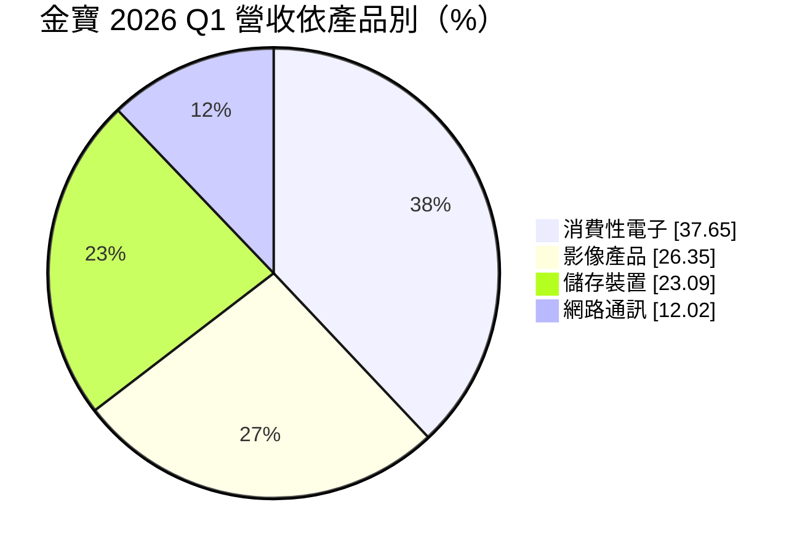
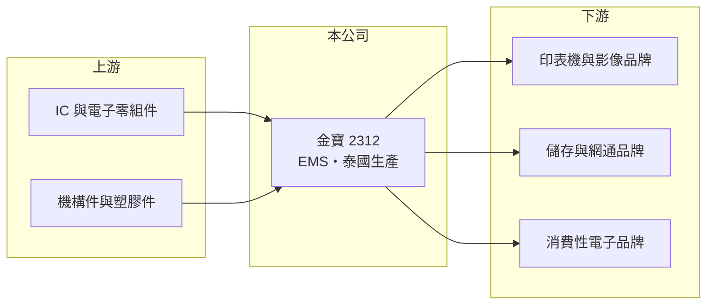

# 2312 金寶

> 上市｜[[產業索引-其他電子業|其他電子業]]｜上市（櫃）日期 1989/11/07

# 第一章：企業模式與商業藍圖

> [!info] 撰寫說明
> 精簡版，由 Claude 依公開資料整理，架構比照 [[2330台積電]]，資料截至 2026-10-07。來源：富果研究金寶 2026 年 6 月法說會整理、科技新報與 winvest 營收新聞標題。#待校對

金寶是仁寶集團旗下的[[EMS]]電子代工廠，以泰國為主要生產基地，產品涵蓋消費性電子、印表機等影像產品、儲存裝置與網通設備。

- **核心業務：** 替國際品牌代工消費性電子、印表機與事務機、[[SSD]] 等儲存裝置，以及網通產品。
- **營收結構：** 2026 年第一季消費性電子占 37.65%、影像產品 26.35%、儲存裝置 23.09%、網路通訊 12.02%。
- **營運據點：** 泰國為主要生產基地，設有印表機、SSD、車用電子與伺服器產線，另在菲律賓、美國、墨西哥、巴西設廠。
- **長期方向：** 從代工製造轉型為設計製造，研發投入量子位元控制系統、[[低軌衛星]]地面接收設備與高階伺服器機櫃。

# 第二章：護城河深度與競爭優勢

金寶的優勢在於泰國等[[非紅供應鏈]]產能，但代工業利潤率薄。

- **競爭優勢：** 長年在泰國經營大型生產基地，能滿足品牌客戶分散中國產能的需求；印表機代工經驗深厚（推估）。
- **主要對手：** [[2317鴻海]]、Jabil、偉創力等 EMS 大廠，以及同集團的 [[2324仁寶]] 在部分產品線有重疊。
- **觀察重點：** 公司預期下半年營收與毛利率優於上半年，影像、儲存與網通產線持續成長；伺服器機櫃與衛星設備能否貢獻營收。

# 第三章：財務體質與盈利規模

資料日期：2026-10-07，表格是撰寫當時的快照；最新月營收、毛利率、累計 EPS 由自動排程寫在本筆記的屬性欄位（月營收、毛利率、累計EPS 等）。#待校對

金寶營收規模大，但毛利率不到一成，屬典型的低毛利代工模式。

- **營收規模：** 2025 年全年營收 1,631.62 億元；2026 年第一季 356.3 億元，年減 15.03%；6 月營收 148.55 億元、年增 32.7%，8 月營收 134.52 億元、年增 22.38%。
- **獲利：** 2026 年第一季稅後淨利 5.27 億元，EPS 0.35 元，[[毛利率]] 6.87%。
- **財務特色：** 第一季每股淨值 14.92 元；研發費用年增 15%，顯示公司在轉型設計製造上持續投入。

# 第四章：總體風險與地緣政治

金寶的風險在於代工業的低毛利與客戶訂單變動。

- **產業週期：** 消費性電子與印表機需求成熟甚至下滑，品牌庫存調整會影響訂單。
- **營運風險：** 毛利率低，產品組合或稼動率小幅變化就會明顯影響獲利；新事業研發投入短期內未必有回報。
- **其他風險：** 美國關稅政策、泰銖與新台幣匯率，以及墨西哥、巴西等海外據點的營運風險。

# 專有名詞解析

## 半導體

- **[[SSD]]**：固態硬碟，以快閃記憶體取代傳統硬碟的儲存裝置，速度快、耗電低。

## 應用

- **[[低軌衛星]]**：運行在約 500 至 2,000 公里高度的通訊衛星群，延遲較低，需大量地面接收設備，代表業者為 Starlink。

## 金融

- **[[毛利率]]**：毛利除以營收，反映產品或服務本身的獲利能力。

## 產業

- **[[EMS]]**：電子製造服務，替品牌客戶組裝電子產品並管理供應鏈的代工模式，鴻海、和碩為代表。
- **[[非紅供應鏈]]**：生產據點設在中國以外的供應鏈，用來分散地緣政治與關稅風險。

# 核心供應鏈

- 上游：IC、被動元件、機構件與塑膠件供應商（推估）
- 下游／客戶：國際印表機、儲存、網通與消費性電子品牌（推估）
- 同業：[[2317鴻海]]、[[2324仁寶]]、Jabil、偉創力

## 最新新聞
<!-- news:start（自動產生，請勿手動編輯此範圍） -->
- 2026-10-06 🏛️ 重訊 17:22｜代子公司-泰金寶科技股份有限公司依「公開發行公司 資金貸與及背書保證處理準則」第二十五條第一項第四款規定公告｜[觀測站](https://mops.twse.com.tw/mops/#/web/t05st01)

完整紀錄：[[2312金寶 新聞]]
<!-- news:end -->

## 相關連結
- [公開資訊觀測站](https://mopsov.twse.com.tw/mops/web/t05st03?step=1&firstin=1&co_id=2312)
- [Goodinfo](https://goodinfo.tw/tw/StockDetail.asp?STOCK_ID=2312)
- [Yahoo 股市](https://tw.stock.yahoo.com/quote/2312)
- [鉅亨網新聞](https://www.cnyes.com/twstock/2312/news)
