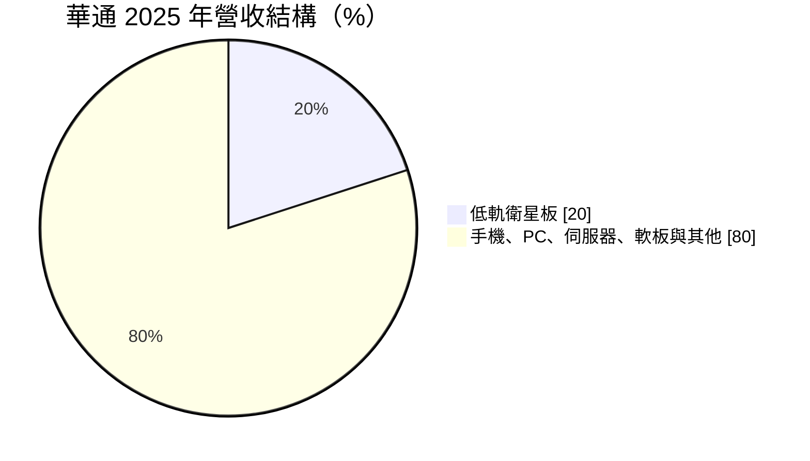
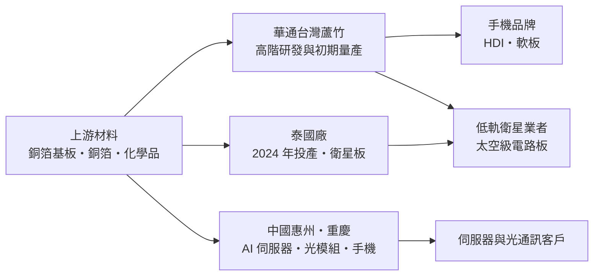
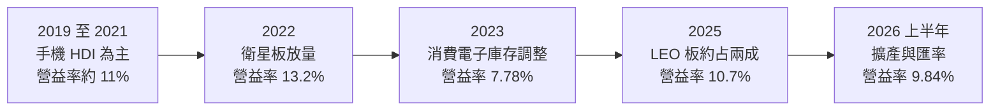
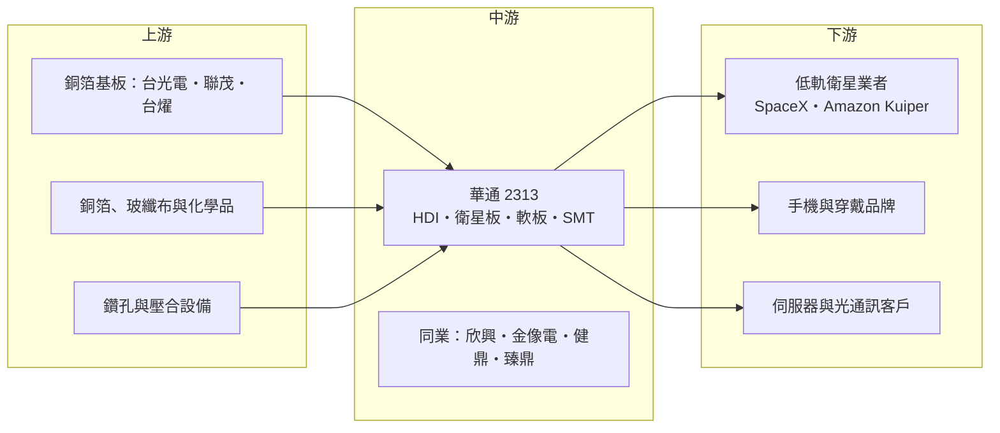

# 2313 華通

> 上市｜[[產業索引-電子零組件業|電子零組件業]]｜上市（櫃）日期 1990/07/24

# 第一章：企業模式與商業藍圖

> [!info] 撰寫說明
> 本文由 Claude 依公開資料整理，架構比照 [[2330台積電]] 的四章研究，資料截至 2026-10-08。財務數字來源：Goodinfo 年度經營績效、現金流量與股利政策頁、MoneyDJ 理財網財務比率、營收比重與資產負債表、富果研究法說會備忘錄（2025 年 8 月）、優分析、證交所開放資料（基本資料、資產負債、綜合損益、營益分析、股利）；產業描述為整理性內容，尚未逐條比對原始文件。#待校對

在評估單一個股的長期投資價值時，首要步驟是拆解企業的底層獲利邏輯。本章針對華通電腦（股票代號：2313，以下簡稱華通）的商業模式進行定性分析。華通是台灣歷史最久的[[PCB]]（印刷電路板）廠之一，長期以手機用的高密度連接板（[[HDI]]）聞名，近年則因為成為[[低軌衛星]]電路板的主要供應商，而從一家成熟的手機零組件廠，轉變為太空產業供應鏈中的關鍵角色。

## 一、核心定位：高階 HDI 與太空級電路板製造商

華通成立於 1973 年，1990 年在台灣證券交易所上市，總部位於桃園市蘆竹區，董事長為江培琨、總經理為吳柏毅。華通的本業是印刷電路板製造，依 MoneyDJ 理財網整理的 2025 年營收比重，PCB 及 [[SMT]]（表面黏著組裝）占 99.17%。

PCB 是所有電子產品的「骨架」，負責承載並連接晶片、被動元件與連接器。華通的技術核心是 HDI 板，也就是透過雷射鑽孔與多次壓合，在有限面積內做出高密度線路的電路板，主要用在手機、穿戴裝置等輕薄產品上。富果研究整理的法說會資料指出，HDI 是華通的技術核心與最大優勢，台灣廠的 HDI 產能龐大。

華通的差異化定位在於「把手機級的高密度技術，應用到太空等高可靠度市場」。低軌衛星需要在極端溫度、輻射與真空環境下長期運作，電路板必須同時做到高密度與高可靠度，這正好結合了華通在 HDI 與品質管理上的長期累積。

## 二、終端應用／產品板塊：手機為基礎、衛星為成長、AI 為下一步

華通沒有公開完整的產品別營收比重。依優分析整理，2025 年低軌衛星板（LEO 板）營收超過 151 億元，約占總營收 20%，創歷史新高；富果研究整理的 2025 年 8 月法說會資料則指出衛星通訊板占比穩定在約 22%。以下圓餅圖依 2025 年 LEO 板約 20% 的比重繪製，其餘部分包含手機、PC、伺服器、[[軟板]]與 SMT 等，細項比重未查得。

* **手機 HDI：** 華通長期是國際一線手機品牌的 HDI 主要供應商（客戶名稱公司未公開，市場普遍認為包括 [[AAPL蘋果]]，待校對）。手機 HDI 技術門檻高，但市場成熟、價格壓力大，近年在華通營收中的比重逐步下降。
* **低軌衛星板：** 依優分析整理，華通主要衛星客戶的在軌衛星約 9,555 顆，其太空 PCB 大多由華通供應；第二大衛星客戶在軌約 180 顆，幾乎由華通獨家供貨。富果研究整理的法說會資料將主要客戶稱為 S 客戶與 A 客戶，市場普遍解讀為 SpaceX 的 Starlink 與亞馬遜的 Project Kuiper（待校對）。客戶新一代衛星規格升級、單片電路板面積放大，有助於提升營收與毛利。
* **伺服器與資料中心：** 富果研究整理的法說會資料指出，2025 年第二季伺服器與資料中心營收年增與季增都約 50%，但基期較低。華通正在開發 22 層以上、使用 M7 等級以上材料的 [[AI伺服器]]板，並研發 M8 材料，用於 30 至 40 多層甚至近 80 層的產品，同時擴充[[背鑽]]產能。公司預期 AI 相關營收的顯著成長將在 2026 年出現。
* **軟板與 SMT：** 軟板（FPC）用於手機、穿戴與 AR/VR 裝置，近年營收已超過 SMT 業務；SMT 產能利用率約八成，公司沒有擴充計畫。

## 三、資本轉化邏輯（營運模式）：多廠區分工與持續投資

* **多廠區分工：** 依富果研究整理的法說會資料，台灣廠定位為高階產品研發與初期量產中心；泰國硬板廠在 2024 年 6 月投產，產能規劃從 40 萬平方英尺提升到 60 至 80 萬平方英尺，泰國軟板廠總規劃產能 40 萬平方英尺；中國的惠州與重慶廠則分別承接 AI 伺服器與光模組需求。公司把約 20 至 30 萬平方英尺的衛星板產能從台灣移到泰國，釋出台灣產能給 AI 產品。
* **資本密集：** PCB 產業的[[資本密集度]]很高，需要持續投資雷射鑽孔、壓合、電鍍等設備。依富果研究整理，2025 年資本支出預估超過 70 億元，未來幾年不低於此水準，年折舊約 55 至 60 億元；依優分析報導，2026 年資本支出預計達 150 億元。
* **客戶集中的雙面性：** 衛星板集中在少數客戶，好處是訂單量大、技術合作深，壞處是單一客戶的發射計畫或供應鏈策略改變，會直接影響華通營收。

## 四、企業長期藍圖：太空、AI 與東南亞產能

* **太空產業：** 低軌衛星星系需要持續發射與汰換，衛星板具有長期需求。依優分析整理，法人預估 2026 年 LEO 板營收成長逾三成、2027 年再成長約三成（屬法人預估，待校對）。華通若能維持主要客戶的供應地位，太空業務將是未來十年最重要的獲利來源。
* **AI 伺服器板：** 高層數、高速材料的伺服器板是 PCB 產業最主要的成長領域，華通正從手機 HDI 廠轉型切入，但在這個市場起步較晚，需要時間累積客戶與實績。
* **泰國產能：** 泰國廠是華通在中國以外的主要產能布局，可以滿足美國客戶對非中國供應鏈的要求，也是承接衛星板的主力。
* **財務紀律：** 富果研究整理的法說會資料指出，華通負債比低於 50%、現金充足，不需對外籌資。經營層的資本配置習慣是以自有現金流支應擴產，並維持穩定的現金股利。

# 第二章：護城河深度與競爭優勢

在長期價值投資中，「護城河」指企業抵禦競爭、維持超額利潤的保護機制。本章分析華通在高度競爭的 PCB 產業中，靠哪些要素在衛星板市場取得領先，以及這些優勢能否延伸到 AI 伺服器板。

## 一、護城河的核心組成要素

PCB 產業整體競爭激烈，多數產品屬於「窄護城河」，但華通在衛星板的護城河相對深：

* **1. 太空級可靠度的認證門檻：** 衛星電路板必須通過嚴格的可靠度測試，包括熱循環、振動與輻射環境測試，認證流程長、失敗代價高。客戶一旦認證華通的產品並大量部署，更換供應商需要重新驗證，轉換成本很高。華通能拿下主要衛星客戶大部分的太空 PCB，正是這個門檻的體現。
* **2. HDI 製程的長期累積：** 高密度線路需要精密的雷射鑽孔、填孔電鍍與多次壓合，良率管理是長期經驗的累積。華通在手機 HDI 市場經營數十年，製程能力是進入衛星與 AI 伺服器市場的基礎。
* **3. 與客戶共同開發：** 衛星客戶的新一代設計往往與供應商共同開發，華通參與早期設計，讓它在新規格上具有先發優勢。
* **4. 非中國產能：** 泰國廠與台灣廠符合美國客戶對供應鏈安全的要求，在美國太空與國防相關產業中，這是重要的入場條件。

## 二、全球主要競爭對手格局

| 對手 | 定位 | 對華通的影響 |
|---|---|---|
| [[3037欣興]] | 台灣最大 PCB 與 ABF 載板廠 | 在 HDI 與高階板市場競爭 |
| [[2368金像電]] | 伺服器板領導廠 | AI 伺服器板的主要對手，實績領先華通 |
| [[8046南電]]、[[3044健鼎]]、[[4958臻鼎-KY]] | 台灣大型 PCB 廠 | 在手機、伺服器與各類 PCB 市場競爭 |
| [[3189景碩]] 等 | 載板與高階 PCB | 部分產品重疊 |
| 中國 PCB 廠（深南電路、勝宏、滬電等） | 規模大、價格競爭力強 | 在手機與伺服器板市場以價格競爭 |
| 美國本土 PCB 廠（TTM 等） | 國防與航太 PCB | 在美國太空與國防市場競爭 |

註：對手名單為產業常識整理，未經本次搜尋逐一確認，待校對。

## 三、優勢轉化：守得住／守不住／觀察重點

* **守得住：** 低軌衛星板。高可靠度認證、長期合作與非中國產能，讓華通在主要衛星客戶中具有高市占。2025 年毛利率從 16% 升到 18.6%（Goodinfo），優分析報導指出主要原因之一是高毛利的 LEO 板比重提升。
* **守不住：** 手機 HDI 的價格。手機市場成熟、品牌商議價力強，中國 PCB 廠持續擴產，手機 HDI 的毛利長期承壓。
* **觀察重點：** 第一，主要衛星客戶的發射節奏與新一代衛星規格，這直接影響衛星板需求。第二，第二家衛星客戶（市場解讀為亞馬遜 Kuiper）的部署速度，富果研究整理的法說會資料指出其發射數量曾不如預期。第三，AI 伺服器板能否在 2026 年後形成明顯營收，這決定華通能否建立第二條成長曲線。

# 第三章：財務體質與盈利規模

資料日期：2026-10-08。數字取自 Goodinfo 年度經營績效、現金流量與股利政策頁、MoneyDJ 理財網財務比率與資產負債表、富果研究法說會備忘錄、優分析與證交所開放資料，表格是撰寫當時的快照；最新月營收、毛利率、累計 EPS 由自動排程寫在本筆記的屬性欄位（月營收、毛利率、累計EPS 等）。#待校對

財務報表是檢驗護城河是否真實存在的最終標準。本章用多年度的三率、ROE、現金流與資本報酬，檢視華通從手機 HDI 廠轉型為衛星板供應商的過程中，獲利品質的變化。

## 一、獲利能力的基石：三率

| 年度 | 營收（新台幣） | [[毛利率]] | [[營業利益率]] | EPS（元） | [[ROE]] |
|---|---|---|---|---|---|
| 2016 | 455 億 | 未查得 | 未查得 | 未查得 | 未查得 |
| 2019 | 562 億 | 17.8% | 10.9% | 3.21 | 15.5% |
| 2020 | 605 億 | 18.2% | 11.0% | 3.91 | 17.0% |
| 2021 | 631 億 | 18.1% | 10.8% | 4.31 | 16.7% |
| 2022 | 764 億 | 20.2% | 13.2% | 6.71 | 22.5% |
| 2023 | 671 億 | 15.1% | 7.78% | 3.50 | 10.7% |
| 2024 | 725 億 | 16.0% | 8.46% | 4.70 | 13.4% |
| 2025 | 760 億 | 18.6% | 10.7% | 5.51 | 14.2% |
| 2026 上半年 | 395.4 億 | 18.25% | 9.84% | 2.50 | 未查得 |

註：2016 至 2025 年取自 Goodinfo 合併報表（2017、2018 年未查得，2016 年僅查得營收）；2026 上半年取自證交所營益分析與綜合損益開放資料。

* **[[毛利率]]：** 華通的毛利率長期在 15% 至 20% 之間，高於一般 PCB 廠。2022 年衛星板放量時毛利率達 20.2%，2023 年消費電子庫存調整時降到 15.1%，2025 年回升到 18.6%。毛利率的高低主要取決於衛星板的比重與產能利用率。
* **[[營業利益率]]：** 營業利益率與毛利率的差距約 7 至 8 個百分點，反映 PCB 業的研發與管理費用。2026 年上半年營業利益率 9.84%，略低於 2025 年，可能與新產能折舊及新台幣升值有關（推估）。
* **營收趨勢：** 2020 至 2025 年營收從 605 億元成長到 760 億元，年複合成長率約 4.7%（推算）。營收成長不快，但產品組合往衛星板移動，讓獲利成長快於營收：2025 年稅後純益 65.67 億元，年增約 17%（優分析）。

## 二、[[ROE]]：資本效率

2021 至 2025 年平均 ROE 約 15.5%（推算），在台灣 PCB 產業中屬於中上水準。華通的 ROE 主要來自穩定的利潤率，而非高槓桿：MoneyDJ 資料顯示負債比率從 2019 年的 58% 降到 2025 年的 47%，[[利息保障倍數]]在 2025 年達 27 倍。值得注意的是，2026 年 10 月初[[股價淨值比]]約 6.18 倍、本益比約 40.6 倍（證交所資料），遠高於過去的估值水準，代表市場對衛星與 AI 業務的長期成長寄予很高的期待，這部分預期是否能實現，需要用未來的 ROE 來驗證。

## 三、資本支出、自由現金流與股利

| 年度 | 營業現金流 | 投資現金流 | [[自由現金流]] | 現金股利（元） |
|---|---|---|---|---|
| 2019 | 77.1 億 | -44.4 億 | 32.7 億 | 1.2 |
| 2020 | 86.1 億 | -65.0 億 | 21.2 億 | 1.5 |
| 2021 | 89.8 億 | -84.5 億 | 5.29 億 | 1.8 |
| 2022 | 137 億 | -75.0 億 | 61.8 億 | 2.7 |
| 2023 | 105 億 | -65.7 億 | 38.8 億 | 1.5 |
| 2024 | 97.1 億 | -58.7 億 | 38.4 億 | 2.4 |
| 2025 | 113 億 | -67.6 億 | 45.3 億 | 2.8 |

註：現金流取自 Goodinfo（自由現金流＝營業現金流＋投資現金流），股利依所屬年度列示。

* **持續的資本投入：** 華通每年投資現金流約 44 億至 85 億元，約占營業現金流的五到九成，這是 PCB 產業資本密集的特性。2026 年資本支出預計提高到 150 億元（優分析），可能會讓自由現金流短期轉為負值（推估）。
* **自由現金流長期為正：** 2019 至 2025 年七年自由現金流全部為正，累計約 244 億元（推算），代表華通在擴產的同時仍能以自有資金支應配息。
* **股利政策：** 公司章程採剩餘股利政策，現金分派比例以不低於股利總額的 50% 為原則。2025 年度配發現金股利 2.8 元，以 EPS 5.51 元計算[[配發率]]約 51%（推算）。華通的配發率偏保守，保留較多盈餘用於擴產，現金股利隨獲利成長穩定提高。

## 四、[[ROIC]] 與 [[WACC]]：價值創造利差

**ROIC 推算：** 2025 年營業利益約 81.3 億元（營收 760 億元 × 營業利益率 10.7%），扣除 20% 稅率後約 65.1 億元。投入資本以 2026 年第二季底計算：股東權益 485.8 億元（證交所），有息負債約 180.7 億元（短期借款 40.9 億元、一年內到期長期負債 9 億元、長期借款 122.7 億元、租賃負債約 8.1 億元，MoneyDJ），合計約 666.5 億元，ROIC 約 9.8%（推算）。若扣除約 119.5 億元的現金，ROIC 約 11.9%（推算）。以 2022 年高峰（營業利益約 101 億元）回推，ROIC 約 12% 以上（推算，資本基礎以近期數字代替）。

**WACC 推估（CAPM）：** 假設台灣 10 年期公債殖利率約 1.75%、市場風險溢酬 6%、β 取 1.1（推估，電子零組件類股常見值），股東權益成本約 8.35%；稅前負債成本假設 2.2%（推估），稅後約 1.76%。以市值計算（股價淨值比約 6.18 倍，市值約 3,002 億元），權益約占 94%、負債約占 6%，WACC 約 8.0%（推算）；若以帳面價值計算約 6.6%。

**結論：** 華通 2025 年 ROIC 約 10% 至 12%，高於帳面口徑的 WACC 約 6.6%，也略高於市值口徑的約 8%，代表公司在衛星板帶動下持續創造價值，但利差並不寬。2026 年資本支出大幅提高到 150 億元，若新產能能如期轉化為衛星板與 AI 伺服器板的營收，ROIC 有機會提升；若需求不如預期，折舊增加會壓低 ROIC。市場目前給予的高估值，隱含對未來 ROIC 明顯提升的期待。

# 第四章：總體風險與地緣政治

任何企業都無法脫離宏觀環境獨立存在。本章分析華通未來必須面對的地緣政治、產業週期與營運風險。

## 一、地緣政治

* **美中科技競爭：** 華通的主要衛星客戶為美國企業，太空產業與國防安全高度相關，美國客戶對供應鏈的國籍與產地要求可能越來越嚴格。華通在中國惠州與重慶有產能，這部分產能可能無法承接美國太空與國防相關訂單，泰國與台灣廠的角色因此更重要。
* **美國關稅與在地化：** 美國若對進口 PCB 加徵關稅或要求太空供應鏈在地化，華通可能需要評估在美國或其他地區設廠（推估）。
* **台灣集中風險：** 高階研發與初期量產集中在台灣，面臨與其他台灣科技廠相同的兩岸風險。

## 二、產業週期與市場結構

* **手機換機週期：** 手機 HDI 仍是華通的重要業務，手機市場的成熟與換機週期拉長，會影響這部分營收。2023 年消費電子庫存調整時，營業利益率從 13.2% 降到 7.78%。
* **衛星發射節奏：** 衛星板需求取決於客戶的發射計畫，火箭發射延誤、衛星設計改變或客戶策略調整，都會造成訂單波動。
* **PCB 產業擴產潮：** AI 伺服器帶動 PCB 產業大規模擴產，未來可能出現產能過剩與價格競爭。

## 三、營運環境的隱性風險

* **客戶集中：** 衛星板集中在少數客戶，若主要客戶自建 PCB 產能或改採多元供應，華通的衛星業務會受到衝擊。
* **匯率：** 富果研究整理的法說會資料指出，新台幣對人民幣與泰銖升值造成匯率逆風。華通營收以美元為主、成本分散在台灣、中國與泰國，匯率波動影響明顯。
* **擴產執行：** 2026 年資本支出 150 億元，泰國軟板廠與 AI 產能的量產時程、良率與客戶認證都有不確定性。
* **原料短缺：** 優分析報導提到 LEO 板曾受缺料影響，高階銅箔基板（[[CCL]]）等材料的供應穩定性會影響出貨。

## 四、科技或法規演進

* **AI 伺服器板的材料升級：** 伺服器板從 M7 往 M8、M9 等更低損耗材料升級，層數從 20 多層增加到 30 至 80 層，技術門檻持續提高。華通能否在這波升級中追上領先廠商，是長期競爭力的關鍵。
* **衛星技術演進：** 衛星設計若轉向更高整合度的封裝或新型材料，電路板的需求型態可能改變。直接對手機通訊（direct-to-cell）等新功能，會帶來更大面積、更複雜的電路板需求，對華通是機會也是挑戰。
* **環保法規：** PCB 製程使用大量化學品與水資源，各國環保法規趨嚴，會增加廢水處理與合規成本。

# 專有名詞解析

## 應用

- **[[低軌衛星]]**：在距地面約 500 至 2,000 公里軌道運行的衛星，以大量衛星組成星系提供全球網路服務。
- **[[AI伺服器]]**：搭載 GPU 等 AI 加速器、用於訓練與推論的伺服器，單價高且需要系統整合能力。

## 金融

- **[[配發率]]**：現金股利占當年度每股盈餘的比例，用來衡量公司把多少獲利分給股東。
- **[[利息保障倍數]]**：稅前息前利益除以利息費用，衡量公司以獲利支付利息的能力。
- **[[股價淨值比]]**：股價除以每股淨值，用來判斷市場給予公司資產的估值高低。
- **[[資本密集度]]**：資本支出占營收或營業現金流的比例，比例越高代表維持營運需要越多投資。

## 產業

- **[[PCB]]**：印刷電路板，承載並連接電子零件的基板，是所有電子產品的基礎零組件。
- **[[HDI]]**：高密度連接板，以雷射鑽孔與多次壓合在小面積內做出高密度線路，主要用於手機與穿戴裝置。
- **[[SMT]]**：表面黏著技術，把電子零件直接焊接在電路板表面的組裝製程。
- **[[軟板]]**：可彎折的柔性電路板，用於手機、穿戴裝置與相機模組等需要彎曲或節省空間的位置。
- **[[CCL]]**：銅箔基板，由樹脂、玻纖布與銅箔壓合而成，是 PCB 的主要原料，材料等級決定訊號傳輸損耗。
- **[[背鑽]]**：把多層電路板中多餘的導通孔殘段鑽除，以降低高速訊號的干擾，是 AI 伺服器板的關鍵製程。

# 核心供應鏈

## 1. 上游：材料與設備
- 銅箔基板：[[2383台光電]]、[[6213聯茂]]、[[6274台燿]]（供應關係為整理性描述，待校對）
- 銅箔、玻纖布與製程化學品（供應商未查得）

## 2. 中游：PCB 同業
- [[3037欣興]]、[[2368金像電]]、[[3044健鼎]]、[[4958臻鼎-KY]]、[[8046南電]]

## 3. 下游：客戶
- 低軌衛星：SpaceX（Starlink）、亞馬遜 Project Kuiper（市場解讀，待校對）
- 手機與穿戴品牌：[[AAPL蘋果]] 等（待校對）
- 伺服器與光通訊：AI 伺服器與光模組客戶（名稱未查得）

## 最新新聞
<!-- news:start（自動產生，請勿手動編輯此範圍） -->
- 2026-10-08 📰 媒體 15:30｜低軌衛星概念股迎新商機！貝佐斯砸300億美元布局5萬顆AI衛星，昇達科、華通領軍，6檔台股供應鏈受關注｜[鉅亨網](https://news.cnyes.com/news/id/6624834)
- 2026-10-05 📰 媒體 17:59｜華通9月、Q3營收同創歷史新高 估Q4營運強勢增長｜[鉅亨網](https://news.cnyes.com/news/id/6621815)
- 2026-10-05 📰 媒體 17:30｜低軌衛星股全面起飛！昇達科(3491)、華通(2313)、百一(6152)攻漲停，誰真正吃得到Starlink訂單？｜[鉅亨網](https://news.cnyes.com/news/id/6621808)

完整紀錄：[[2313華通 新聞]]
<!-- news:end -->

## 相關連結
- [公開資訊觀測站](https://mopsov.twse.com.tw/mops/web/t05st03?step=1&firstin=1&co_id=2313)
- [Goodinfo](https://goodinfo.tw/tw/StockDetail.asp?STOCK_ID=2313)
- [Yahoo 股市](https://tw.stock.yahoo.com/quote/2313)
- [鉅亨網新聞](https://www.cnyes.com/twstock/2313/news)
