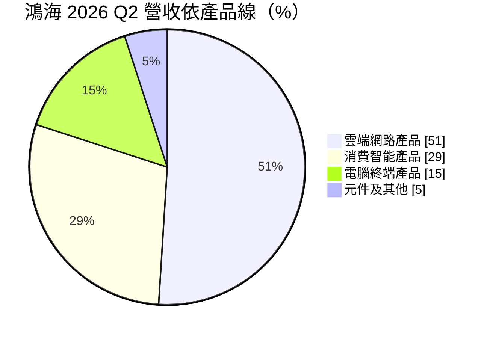
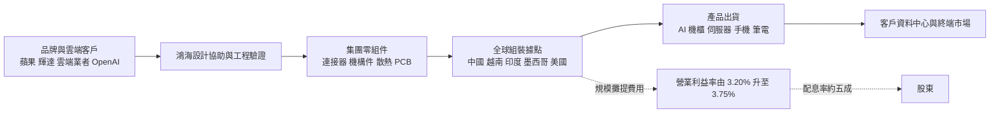
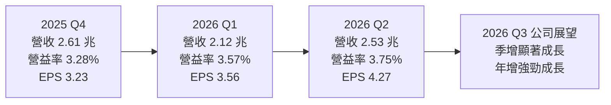
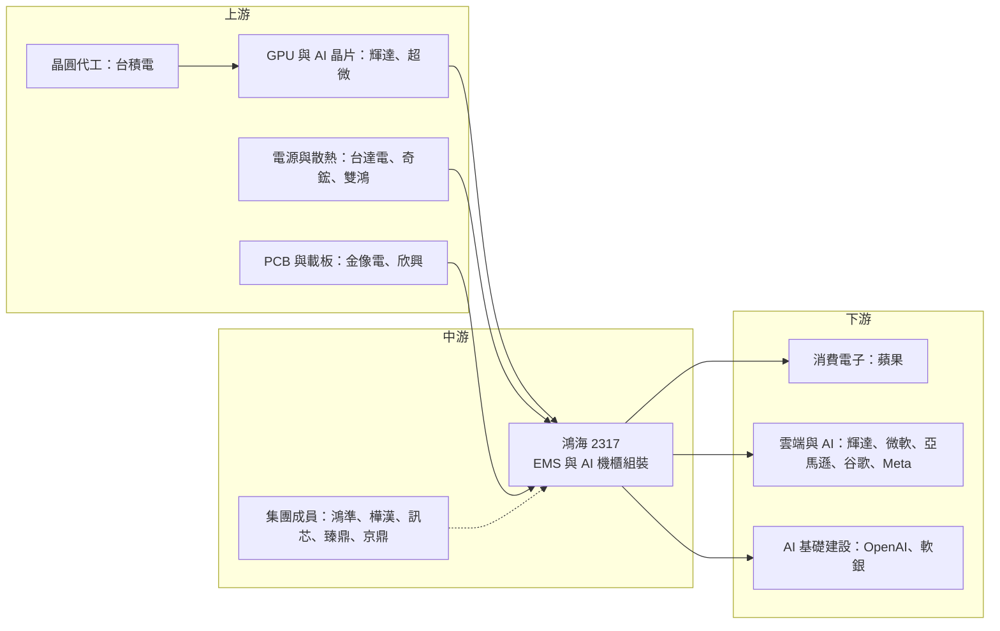

# 2317 鴻海

> 上市｜[[產業索引-其他電子業|其他電子業]]｜上市（櫃）日期 1991/06/18

# 第一章：企業模式與商業藍圖

> [!info] 撰寫說明
> 本文由 Claude 依公開資料整理，架構比照 [[2330台積電]] 的四章研究，資料截至 2026-10-07。財務數字來源：鴻海 2025 年第四季、2026 年第一季與第二季法說會內容（自由時報、鉅亨網、富果研究、INSIDE、理財周刊、工商時報整理）；產業描述為整理性內容，尚未逐條比對原始文件。#待校對

在評估單一個股的長期投資價值時，首要步驟是拆解企業的底層獲利邏輯。本章針對鴻海精密（股票代號：2317，國際名稱 Foxconn / Hon Hai Technology Group，以下簡稱鴻海）的商業模式進行定性分析，說明一家毛利率只有 6% 上下的代工廠，如何靠規模與垂直整合累積每年近 2,000 億元的淨利，以及它正在從「蘋果代工廠」轉向「AI 資料中心硬體供應商」的過程。

## 一、核心定位：全球最大的電子代工服務廠，正轉型為 AI 基礎建設供應商

鴻海成立於 1974 年，從生產電視旋鈕的塑膠零件起家，逐步發展為全球規模最大的電子代工服務（[[EMS]]）廠。它的商業模式是替品牌客戶提供設計協助、零組件垂直整合與大規模組裝，以「規模、垂直整合、全球製造據點」換取極低的單位成本。

和 [[2330台積電]] 不賣自有品牌晶片的邏輯類似，鴻海也不賣自有品牌終端產品，因此能同時服務彼此競爭的品牌客戶。兩者的差別在於附加價值：台積電靠製程技術收取高毛利，鴻海則是在極薄的毛利上靠周轉與規模賺錢，因此有兩個商業特徵：

* **以量取勝的獲利結構：** 2025 年營收超過 8 兆元新台幣，[[毛利率]]約 6%、[[營業利益率]]約 3%。毛利率很難大幅提升，但營收每成長一成，就是數百億元的營業利益增量。
* **身分隨客戶需求轉換：** 過去二十年鴻海最為人熟知的身分是 [[AAPL蘋果]] iPhone 的主要組裝廠；2023 年 AI 伺服器需求爆發後，它憑藉從零組件、主機板、伺服器到整座機櫃的垂直整合能力，成為 [[NVDA輝達]] GB200、GB300 等 [[AI 機櫃]]的主要組裝夥伴。2026 年第二季雲端網路產品占營收比重首次突破五成。

## 二、終端應用板塊：雲端網路首度過半

鴻海將營收分為四大產品線，2026 年第二季比重如下：

比重變化比單季數字更能說明轉型速度：

| 產品線 | 2024 | 2025 | 2026 Q1 | 2026 Q2 |
|---|---|---|---|---|
| 雲端網路產品 | 30% | 40% | 48% | 51% |
| 消費智能產品 | 46% | 38% | 33% | 29% |
| 電腦終端產品 | 未查得 | 15% | 14% | 15% |
| 元件及其他 | 未查得 | 7% | 5% | 5% |

* **雲端網路產品：** 一般伺服器、AI 伺服器、AI 機櫃、交換器與網通設備。客戶涵蓋美系雲端服務商（[[MSFT微軟]]、[[AMZN亞馬遜]]、[[GOOGL谷歌]]、[[META臉書]] 等）與輝達。除了輝達 GPU 機櫃，鴻海也承接雲端業者自研 [[ASIC]] 晶片的伺服器專案，公司目標在 ASIC 伺服器取得四成以上市占率。
* **消費智能產品：** 智慧型手機、穿戴裝置、智慧家庭等，以蘋果為最大客戶。營收規模仍大，但成長已趨平緩，比重兩年內從 46% 降到 29%。
* **電腦終端產品：** 筆電、桌機、平板等，比重穩定在一成半上下。
* **元件及其他：** 連接器、機構件、半導體與電動車相關業務等。

## 三、資本轉化邏輯：垂直整合的規模機器

* **垂直整合降低成本與交期：** 鴻海集團旗下有連接器、機構件、散熱、PCB 組裝、模組到整機組裝的能力。AI 機櫃牽涉 GPU 板卡、交換器、[[液冷]]、電源、線纜與整櫃測試，自家掌握越多環節，越能縮短驗證時間。
* **全球據點分散：** 鴻海在中國（深圳、鄭州、成都等）、越南、印度、墨西哥、美國、捷克、匈牙利等地都設有工廠。近年加速在印度擴充 iPhone 產能，並在墨西哥與美國德州擴建 AI 伺服器廠。依媒體報導，墨西哥與德州新廠將用於輝達下一代平台；蘋果於 2025 年宣布與鴻海在德州休士頓合作建置 AI 伺服器組裝廠，供應 Apple Intelligence 的資料中心。
* **[[營運槓桿]]：** 毛利率大致持平，但營收放大後研發與管理費用被攤薄，營業利益率從 2025 年全年的 3.20% 升到 2026 年第二季的 3.75%。對代工業而言，這 0.5 個百分點的改善就是轉型成效的主要指標。

## 四、企業長期藍圖：「3+3」策略與 AI 基礎建設

董事長劉揚偉在 2019 年接任後提出「3+3」策略：三大新興產業為電動車、數位健康、機器人；三大新技術為人工智慧、半導體、新世代通訊。實際執行上，AI 伺服器已成為最主要的成長引擎，電動車與半導體仍在投入期。

* **AI 伺服器與機櫃：** 公司在法說會預期 2026 年 AI 機櫃出貨維持倍數以上成長，第三季出貨量較第二季「高雙位數成長」。媒體估計鴻海在 AI 伺服器建置市場的市占率約四成以上。
* **與 OpenAI、軟銀的合作：** 2025 年下半年起，鴻海證實與 OpenAI 合作在美國打造 AI 基礎設施硬體，涵蓋多個世代的資料中心機櫃與零組件，並在俄亥俄州生產；同時與軟銀合作建置模組化資料中心。2026 年 7 月外電報導輝達將為 OpenAI 租用軟銀俄亥俄州資料中心提供融資擔保，市場視鴻海為受惠者。
* **電動車：** 透過鴻華先進等平台推動 MIH 開放電動車平台與委託設計製造（[[CDMS]]），目前對營收與獲利的貢獻仍小，屬長期布局。
* **擴產：** 2026 年上半年 [[CapEx]] 809 億元，公司預期全年年增三成以上，主要用於伺服器、機櫃、液冷與測試產能。

# 第二章：護城河深度與競爭優勢

在長期價值投資中，「護城河」指企業抵禦競爭、維持超額利潤的保護機制。代工產業毛利率低、客戶議價能力強，鴻海的護城河不是來自定價權，而是來自別人難以複製的規模與整合能力。本章分析這些優勢的構成、全球主要競爭對手，以及它們在 AI 伺服器分食戰中能守住多少。

## 一、鴻海護城河的核心組成要素

* **1. 規模經濟與採購議價力：** 2025 年營收超過 8 兆元，龐大的採購量讓鴻海在零組件、物流與產能調度上具備成本優勢。能在短時間內把新產品拉到數百萬台、數萬座機櫃的規模，是少數廠商才做得到的事。
* **2. 垂直整合：** 從連接器、機構件、散熱、PCB 到整機組裝，集團內就能完成大部分環節。AI 機櫃的液冷、電源與高速互連整合難度高，垂直整合讓鴻海更能掌握交期與[[良率]]。
* **3. 全球製造據點：** 中國、越南、印度、墨西哥、美國等多地產能，讓客戶在關稅與地緣政治變化下能快速移轉生產地點，這在 2025 至 2026 年成為接單的重要條件。
* **4. 與核心客戶的長期關係：** 與蘋果合作超過二十年、與輝達在 AI 機櫃上的早期合作，讓鴻海常能拿到新平台的首批訂單。

## 二、全球主要競爭對手格局

| 對手 | 定位 | 對鴻海的威脅 |
|---|---|---|
| [[2382廣達]] | AI 伺服器 [[ODM]] 龍頭，與雲端業者關係深 | ASIC 伺服器與直接出貨雲端業者的模式具優勢 |
| [[3231緯創]]、[[6669緯穎]] | 緯創做輝達 GPU 基板，緯穎專注美系雲端 | 分食 GPU 基板與雲端伺服器訂單 |
| [[2356英業達]]、[[2376技嘉]] | 伺服器代工與品牌伺服器 | 在中小型雲端與企業伺服器競爭 |
| [[4938和碩]]、立訊精密 | 消費電子組裝 | 立訊受中國支持，持續爭取蘋果訂單 |
| Jabil、Flex、Celestica | 美系 EMS 業者 | 在網通與部分雲端伺服器專案上競爭 |

## 三、優勢轉化：哪些市場守得住、哪些守不住

* **守得住：** 大規模 AI 機櫃的整櫃組裝與交期，對資金、產能與供應鏈整合要求極高，鴻海的規模優勢明顯，2026 年雲端網路產品比重持續上升就是證明。
* **守不住：** 鴻海本質仍是代工，毛利率長期在 6% 上下。客戶通常會刻意維持兩家以上供應商，雲端業者也會把 ASIC 伺服器分給廣達、緯穎等對手，市占很難無限擴大；消費電子方面，立訊精密持續侵蝕蘋果訂單份額（定性描述）。
* **觀察重點：** 營業利益率能否在 AI 營收占比上升下持續改善（2026 年第二季 3.75%，高於 2025 年全年的 3.20%）、ASIC 伺服器四成市占目標能否達成，以及美國、墨西哥新廠投產後的獲利表現。

# 第三章：財務體質與盈利規模

資料日期：2026-10-07。數字取自鴻海法說會內容與財經媒體整理，表格是撰寫當時的快照；最新月營收、毛利率、累計 EPS 由自動排程寫在本筆記的屬性欄位（月營收、毛利率、累計EPS 等）。#待校對

財務報表是檢驗護城河是否真實存在的最終標準。本章用三率、ROE、現金流與資本報酬，檢視鴻海在 AI 營收快速放大下的獲利品質。

## 一、獲利能力的基石：三率

| 項目 | 2025 全年 | 2025 Q4 | 2026 Q1 | 2026 Q2 |
|---|---|---|---|---|
| 營收（新台幣） | 8 兆 1,031 億 | 2 兆 6,064 億 | 2.12 兆 | 2.53 兆 |
| [[毛利率]] | 6.15% | 5.88% | 6.18% | 6.12% |
| [[營業利益率]] | 3.20% | 3.28% | 3.57% | 3.75% |
| 稅後淨利 | 1,894 億 | 452 億 | 499 億 | 600 億 |
| EPS（元） | 13.61 | 3.23 | 3.56 | 4.27 |

* **營收：** 2025 年營收年增 18%，稅後淨利與 EPS 皆年增 24%，創歷史新高。2026 年上半年營收 4.65 兆元、年增 35%，上半年 EPS 7.84 元、年增 26%；第二季 EPS 4.27 元創單季新高。2026 年 7 月營收 9,465 億元、年增 54%，前七月累計 5.59 兆元、年增 38%。
* **[[毛利率]]：** 大致持平在 6% 上下。AI 機櫃中 GPU 等高價料件占成本比重高，拉高營收但不一定拉高毛利率，這是代工業的結構限制。
* **[[營業利益率]]：** 連續三季改善，代表營收規模擴大後費用攤提效益浮現。營業利益成長幅度大於營收成長，是 AI 業務帶動獲利結構改善的訊號。
* **[[淨利率]]：** 2026 年第二季稅後淨利 600 億元除以營收 2.53 兆元，約 2.4%（推算），仍是典型的薄利多銷結構。

## 二、[[ROE]]：資本效率

鴻海 2026 年上半年 ROE 為 6.21%（未年化），較去年同期增加 0.73 個百分點。代工業毛利率低，ROE 主要靠高資產周轉率支撐，而不是高利潤率；營業利益率每提升 0.1 個百分點，在 8 兆元以上的營收基礎上就是可觀的獲利增量。截至 2026 年第二季底，帳上現金加定存約 1.52 兆元，淨現金約 2,198 億元，財務結構穩健。

## 三、資本支出與自由現金流

* **[[CapEx]]：** 2026 年上半年 809 億元、年增 5%，公司預期全年年增三成以上，用於伺服器、機櫃、液冷與測試產能。相對 8 兆元營收，資本支出占營收比例很低，鴻海屬於輕資本密集的組裝業。
* **[[營運資金]]與[[自由現金流]]：** AI 機櫃單價高，出貨規模放大時需要大量營運資金支應存貨與應收帳款，自由現金流在出貨高峰期可能波動，精確數值本次未查得，需持續觀察營運資金周轉。
* **股利：** 2025 年度配發現金股利 7.2 元，配息率約 52.9%，近年配息率大致維持在五成上下。

## 四、[[ROIC]] 與 [[WACC]]：價值創造利差

企業創造價值的條件是投入資本報酬率高於資金成本。鴻海的 ROIC 精確數值本次未查得；以上半年 ROE 6.21%（年化約一成出頭，推算）與淨現金部位來看，推估 ROIC 略高於 WACC，屬於「薄而穩」的價值創造。AI 營收占比提高後若營業利益率能站穩 4% 附近，利差有機會擴大；反之若新廠投產初期效率不佳、營運資金占用增加，利差會被壓縮。

# 第四章：總體風險與地緣政治

任何企業都無法脫離宏觀環境獨立存在。本章分析鴻海未來必須面對的地緣政治、產業週期與營運風險，以及 AI 平台快速換代帶來的技術挑戰。

## 一、地緣政治風險

* **中國生產基地：** 鴻海大量產能仍在中國，美中科技與貿易衝突可能影響出口、人員與供應鏈；中國對特定產業的人才與設備外移限制，也會增加產能移轉的難度。
* **美國關稅與在地製造：** 美國對進口電子產品與伺服器的關稅政策變動頻繁，鴻海以墨西哥、德州、俄亥俄州等據點因應，但新廠的人力與營運成本較高，可能壓縮利潤。
* **印度擴產：** 印度是 iPhone 產能分散的重點，但當地基礎建設、法規與勞工管理仍存在執行風險。

## 二、產業週期與市場結構風險

* **AI 資本支出週期：** 雲端網路產品已占營收五成以上，若美系雲端業者或 OpenAI 等客戶放緩 AI 資料中心投資，鴻海營收成長會明顯受影響。
* **客戶集中：** 媒體指出部分客戶占比超過 50%，蘋果、輝達與少數雲端業者的訂單變化對營運影響大。
* **[[長鞭效應]]：** 雲端業者調整建置節奏時，訂單變化會沿伺服器、零組件一路放大，代工廠的存貨與產能利用率首當其衝。
* **消費電子需求平淡：** 智慧型手機與 PC 市場成熟，消費智能產品營收成長有限。

## 三、營運環境的隱性風險

* **低毛利的放大效應：** 毛利率約 6%，任何零組件缺料、良率問題或新平台轉換延遲，都可能吃掉大部分利潤。AI 機櫃的液冷與高功耗設計複雜度高，量產初期容易出現調校問題。
* **營運資金與匯率：** AI 機櫃單價高，存貨與應收帳款大幅增加，需注意現金周轉與匯率避險。
* **新事業投入：** 電動車與半導體仍在投入期，若長期無法獲利，會拖累整體報酬率。

## 四、科技演進與法規風險

* **AI 平台世代交替快：** 輝達每年推出新平台，代工廠必須不斷投入新產線與測試設備，若在某一世代失去主要份額，後續追趕成本高。
* **雲端業者自研晶片：** ASIC 伺服器的設計與供應商選擇主要由雲端業者決定，代工廠議價力有限。
* **ESG 與勞動法規：** 大型組裝廠長期面臨勞動條件、用電與碳排的監督壓力，國際客戶對供應鏈減碳的要求持續提高。

# 專有名詞解析

## 半導體

- **[[ASIC]]**：特定應用積體電路，為單一用途客製的晶片，例如雲端業者自研的 AI 加速器。
- **[[良率]]**：合格產品占總產出的比例，組裝業的良率直接影響重工成本與交期。

## 金融

- **[[營運槓桿]]**：固定費用占比高時，營收小幅成長即可帶動營業利益大幅成長的現象。
- **[[營運資金]]**：支應存貨、應收帳款等日常營運所需的資金，出貨規模放大時占用會同步增加。
- **[[ROE]]**：股東權益報酬率，稅後淨利除以股東權益，衡量公司運用股東資本賺錢的效率。
- **[[ROIC]]**：投入資本報酬率，衡量公司投入營運的全部資本能產生多少稅後營業利潤。
- **[[WACC]]**：加權平均資金成本，股東與債權人要求報酬率的加權平均，是 ROIC 的比較基準。
- **[[自由現金流]]**：營業活動現金流減去資本支出，代表企業可自由用於配息、還債或併購的現金。
- **[[長鞭效應]]**：終端需求的小幅變動，沿供應鏈往上游傳遞時被逐級放大，造成上游庫存與訂單劇烈波動。

## 產業

- **[[EMS]]**：電子代工服務，替品牌客戶進行零組件採購、組裝與測試，本身不賣自有品牌產品，代表廠商為鴻海。
- **[[ODM]]**：原廠委託設計製造，代工廠除了生產也負責產品設計，品牌商只提出規格，廣達、緯穎屬此類。
- **[[AI 機櫃]]**：把多台 GPU 伺服器、交換器、電源與散熱整合在一座機櫃內整櫃出貨的產品，例如輝達 GB200 NVL72。
- **[[液冷]]**：以冷卻液取代風扇帶走晶片熱量的散熱方式，AI 機櫃功耗動輒上百千瓦，逐漸成為標配。
- **[[CDMS]]**：委託設計製造服務，鴻海用於電動車業務的模式，替車廠從設計到量產一手包辦。

# 核心供應鏈

## 1. 上游：晶片與關鍵零組件
- GPU 與 AI 晶片：[[NVDA輝達]]、[[AMD超微]]
- 晶圓代工：[[2330台積電]]
- 電源與散熱：[[2308台達電]]、[[3017奇鋐]]、[[3324雙鴻]]
- PCB 與載板：[[2368金像電]]、[[3037欣興]]

## 2. 中游：鴻海本身與集團成員
- 機構件與散熱：[[2354鴻準]]
- 工業電腦與系統整合：[[6414樺漢]]
- 系統級封裝模組：[[6451訊芯-KY]]
- PCB：[[4958臻鼎-KY]]
- 半導體設備零組件：[[3413京鼎]]

## 3. 下游：主要客戶
- 消費電子：[[AAPL蘋果]]
- AI 與雲端伺服器：[[NVDA輝達]]、[[MSFT微軟]]、[[AMZN亞馬遜]]、[[GOOGL谷歌]]、[[META臉書]]
- AI 基礎建設合作：OpenAI、軟銀

## 4. 同業：伺服器與電子代工
- [[2382廣達]]、[[3231緯創]]、[[6669緯穎]]、[[2356英業達]]、[[4938和碩]]

延伸閱讀：[[台積電供應鏈]]

## 最新新聞
<!-- news:start（自動產生，請勿手動編輯此範圍） -->
- 2026-10-08 🏛️ 重訊 19:02｜代子公司富聯裕展科技(河南)有限公司公告取得廠房之使用權資產｜[觀測站](https://mops.twse.com.tw/mops/#/web/t05st01)
- 2026-10-05 📰 媒體 18:50｜營收速報 - 鴻海(2317)9月營收1.16兆元年增率高達38.42％｜[鉅亨網](https://news.cnyes.com/news/id/6621906)
- 2026-10-05 📰 媒體 17:30｜鴻海9月營收首破兆元大關創新高，第3季營收年增47%優於預期｜[鉅亨網](https://news.cnyes.com/news/id/6621806)
- 2026-10-05 📰 媒體 16:30｜鴻海9月營收1.15兆元月增25% 單月首度破兆創新高｜[鉅亨網](https://news.cnyes.com/news/id/6621750)

完整紀錄：[[2317鴻海 新聞]]
<!-- news:end -->

## 相關連結
- [公開資訊觀測站](https://mopsov.twse.com.tw/mops/web/t05st03?step=1&firstin=1&co_id=2317)
- [Goodinfo](https://goodinfo.tw/tw/StockDetail.asp?STOCK_ID=2317)
- [Yahoo 股市](https://tw.stock.yahoo.com/quote/2317)
- [鉅亨網新聞](https://www.cnyes.com/twstock/2317/news)
