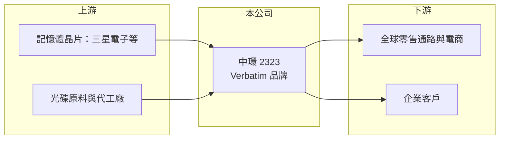

# 2323 中環

> 上市｜[[產業索引-光電業|光電業]]｜上市（櫃）日期 1992/02/17

# 第一章：企業模式與商業藍圖

> [!info] 撰寫說明
> 精簡版，由 Claude 依公開資料整理，架構比照 [[2330台積電]]，資料截至 2026-10-07。來源：優分析（2026-08-13 財報報導）、TechNews 財經、winvest 營收快訊。#待校對

中環的商業模式已從光碟製造轉為以國際品牌銷售儲存與電力周邊產品。

- **核心業務：** 中環早年是全球主要光碟片製造商，目前以旗下 Verbatim 品牌在全球銷售光碟、記憶體與儲存周邊產品。
- **營收結構：** 公司說明成長來自 Verbatim 品牌帶動的記憶體與電力兩大產品線，光碟產品則受惠價格調漲與供需偏緊；各產品確切比重未查到。
- **營運據點：** 總部在台灣，透過 Verbatim 品牌的全球通路銷售，海外營收占比推估偏高。
- **長期方向：** 公司推行「S'n'P」（Storage and Power）策略，往儲存與電力類產品擴張，降低對傳統[[光儲存媒體]]的依賴。

# 第二章：護城河深度與競爭優勢

中環的護城河主要來自 Verbatim 這個老牌國際品牌與其通路，而非製造技術。

- **競爭優勢：** Verbatim 是歷史悠久的國際儲存媒體品牌，通路覆蓋廣，有助於推新品類。
- **主要對手：** 光碟領域同業有 [[2349錸德]]；記憶體周邊品牌則與 [[3260威剛]]、[[2451創見]]、[[8271宇瞻]] 等競爭。
- **觀察重點：** 光碟漲價能否延續、記憶體與電力產品線的成長速度，以及本業是否能穩定獲利。

# 第三章：財務體質與盈利規模

資料日期：2026-10-07，表格是撰寫當時的快照；最新月營收、毛利率、累計 EPS 由自動排程寫在本筆記的屬性欄位（月營收、毛利率、累計EPS 等）。#待校對

中環 2026 年營收與本業同步轉好，但業外對獲利的影響仍需拆開來看。

- **營收規模：** 2026 年上半年營收 39.56 億元，年增約 16%；2026 年 8 月營收 7.10 億元，年增約 20%。
- **獲利：** 2026 年上半年 EPS 0.99 元、第二季 EPS 1.4 元，上半年營業利益 1.87 億元，較去年同期轉盈。
- **財務特色：** 過去曾以[[現金減資]]搭配配息方式退還股東資金；[[業外收益]]對獲利的影響推估不小，需留意本業與業外的拆分。

# 第四章：總體風險與地緣政治

中環同時面對光碟市場的長期萎縮與記憶體價格循環兩種風險。

- **產業週期：** 光碟屬於長期萎縮的成熟市場，近期漲價屬供給收縮帶來的結構變化；記憶體周邊則跟隨 [[NAND Flash]] 與 [[DRAM]] 價格循環。
- **營運風險：** 記憶體產品毛利受上游晶片價格波動影響大，品牌轉型若推進不如預期，營收可能回落。
- **其他風險：** 海外營收比重高，匯率變動會影響獲利；全球消費性電子需求轉弱也會衝擊銷售。

# 專有名詞解析

## 半導體

- **[[NAND Flash]]**：斷電後仍能保存資料的快閃記憶體，用於 SSD、記憶卡與隨身碟，價格循環明顯。
- **[[DRAM]]**：動態隨機存取記憶體，電腦與手機的主記憶體，報價隨供需大幅波動。

## 應用

- **[[光儲存媒體]]**：以雷射讀寫資料的光碟類媒體，包括 CD、DVD、藍光，市場因雲端與串流長期萎縮。

## 金融

- **[[現金減資]]**：公司減少股本並把對應現金退還股東，可提高每股盈餘與淨值報酬率。
- **[[業外收益]]**：本業以外的收益，例如投資、處分資產或匯兌利益，通常不具持續性。

# 核心供應鏈

- 上游：NAND Flash 與 DRAM 晶片供應商（如 [[005930三星電子]]）、光碟原料與代工廠
- 下游／客戶：全球零售通路、電商與企業客戶
- 同業：[[2349錸德]]、[[3260威剛]]、[[2451創見]]、[[8271宇瞻]]

## 最新新聞
<!-- news:start（自動產生，請勿手動編輯此範圍） -->
- 2026-10-06 🏛️ 重訊 17:55｜公告本公司處分有價證券｜[觀測站](https://mops.twse.com.tw/mops/#/web/t05st01)
- 2026-10-06 🏛️ 重訊 17:53｜公告本公司取得有價證券｜[觀測站](https://mops.twse.com.tw/mops/#/web/t05st01)

完整紀錄：[[2323中環 新聞]]
<!-- news:end -->

## 相關連結
- [公開資訊觀測站](https://mopsov.twse.com.tw/mops/web/t05st03?step=1&firstin=1&co_id=2323)
- [Goodinfo](https://goodinfo.tw/tw/StockDetail.asp?STOCK_ID=2323)
- [Yahoo 股市](https://tw.stock.yahoo.com/quote/2323)
- [鉅亨網新聞](https://www.cnyes.com/twstock/2323/news)
