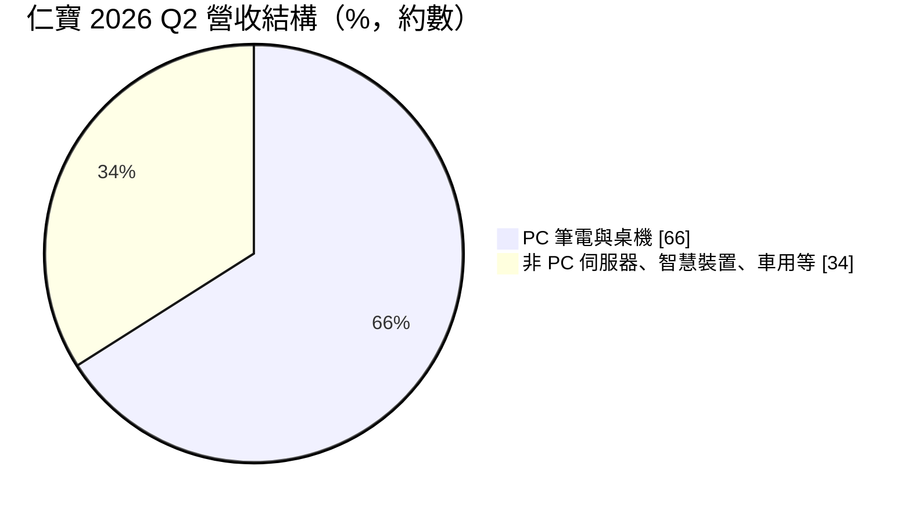
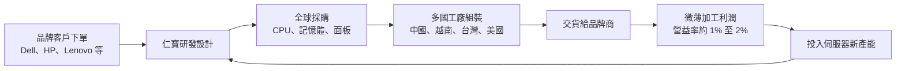
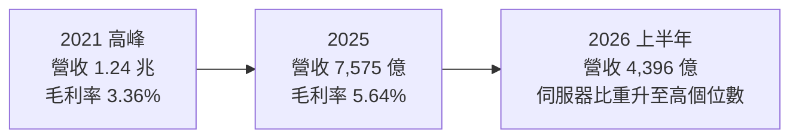
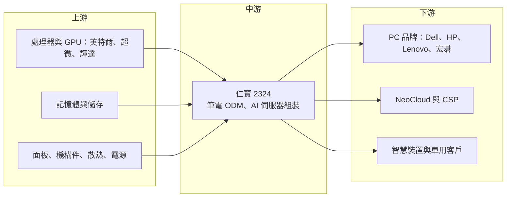

# 2324 仁寶

> 上市｜[[產業索引-電腦及週邊設備業|電腦及週邊設備業]]｜上市（櫃）日期 1992/02/18

# 第一章：企業模式與商業藍圖

> [!info] 撰寫說明
> 本文由 Claude 依公開資料整理，架構比照 [[2330台積電]] 的四章研究，資料截至 2026-10-08。財務數字來源：Goodinfo 年度經營績效頁（2020 至 2025 年）、證交所開放資料（基本資料、2026 年第二季資產負債與綜合損益、營益分析、股利）、優分析 2026 年 8 月仁寶法說與大溪廠啟用報導；產業描述為整理性內容，尚未逐條比對原始文件，憑既有知識撰寫的部分已標「待校對」。#待校對

在評估單一個股的長期投資價值時，首要步驟是拆解企業的底層獲利邏輯。本章針對仁寶電腦（股票代號：2324，以下簡稱仁寶）的商業模式進行分析，說明全球主要筆電代工廠之一，如何在 PC 市場成熟、利潤微薄的環境下，嘗試把成長引擎轉向 AI 伺服器與非 PC 業務。

## 一、核心定位：全球主要筆電 ODM

仁寶成立於 1984 年，1992 年上市，實收資本額約 440.7 億元，董事長為陳瑞聰，總經理為 Anthony Peter Bonadero（證交所開放資料）。仁寶屬於金仁寶集團，長期以[[ODM]]模式替國際 PC 品牌設計與生產筆記型電腦，是全球前兩大筆電代工廠之一，主要客戶包括 Dell、HP、Lenovo 與 [[2353宏碁]] 等品牌。#待校對

ODM 的核心價值在於「把品牌廠的產品規劃變成可大量生產的產品」。品牌廠負責市場與規格，仁寶負責機構與電路設計、零件採購、組裝測試與全球交貨。這個模式的特色是營收規模極大、利潤率極薄：2025 年營收約 7,575 億元，營業利益率只有 1.40%（Goodinfo）。仁寶賺的是龐大出貨量下每一台的微薄加工與設計費用。

## 二、終端應用與產品板塊

仁寶的業務可以分成 PC 與非 PC 兩大類。2026 年第二季，非 PC 業務約占 34%（優分析引述法說內容），公司目標年底提高到 40%，並預期 2027 年 PC 營收占比降到 50% 以下。

* **PC：** 以筆電為主，是仁寶的基本盤。2026 年第二季 PC 出貨季增 5%，高階機種與 [[AI PC]] 比重提升，推高平均售價。
* **伺服器：** 2026 年第二季伺服器營收占整體營收提升到高個位數百分比，其中 AI 伺服器占伺服器營收約 70%，上半年 AI 伺服器有八成是 [[L10]] 等級的整機出貨。公司目標 2026 全年伺服器營收占比約 10%，2027 年達 30% 至 40%。
* **其他非 PC：** 包含平板、智慧裝置、穿戴式產品、車用電子與 5G 網通等，詳細比重本次未查得。

## 三、資本轉化邏輯：以規模換取微利的代工模式

代工模式的關鍵在於資金與營運效率，而不是單位利潤：

* **營運資金密集：** 仁寶需要替客戶先採購大量零組件，存貨與應收帳款金額龐大。2026 年第二季底流動資產約 4,238 億元、流動負債約 3,451 億元（證交所開放資料），資產負債表的規模幾乎和半年營收相當。
* **低毛利、低費用：** 毛利率長期在 3% 至 6% 之間，營業費用也必須壓得很低，才能留下約 1% 的營業利益率。任何零件價格波動或匯率變化，都可能吃掉整季的利潤。
* **高營收、低資本支出：** 傳統筆電組裝需要的設備投資相對有限，但 AI 伺服器需要更大的廠房、電力與測試設備。2026 年仁寶全年資本支出約 180 億元，上半年約 90 億元中有 60 至 70 億元用於伺服器（優分析），顯示資本配置正明顯轉向伺服器。

## 四、企業長期藍圖

仁寶的長期方向是降低對成熟 PC 市場的依賴。具體做法包括：

* **AI 伺服器：** 2026 年 8 月啟用桃園大溪 AI 伺服器製造中心，規劃 L10、[[L11]] 自動化產線與研發中心；美國德州規劃兩座廠，預計可生產 [[L6]] 到 L10，甚至 L11；越南則作為東南亞 L6 主機板的主要生產基地，SMT 產線由 4 條擴充到 10 條（優分析）。
* **客戶多元化：** 目前伺服器客戶以 [[NeoCloud]] 為主，2027 年目標打入一線品牌、大型[[CSP]]與 Hyperscaler。
* **筆電維持穩定：** 筆電仍是現金流的主要來源，目標是提高高階與 AI PC 的比重，而不是追求出貨量。

這是一次重大的結構轉型。若成功，仁寶的營收組合將從以 PC 為主，轉變為 PC 與伺服器並重，利潤率與成長性都可能改善；若失敗，大量投入的產能將拖累資本報酬。

# 第二章：護城河深度與競爭優勢

本章針對仁寶的競爭優勢進行分析。電子代工產業的護城河不在技術專利，而在規模、客戶關係、全球製造網路與成本控制能力。

## 一、護城河的核心組成要素

* **規模經濟：** 仁寶每年出貨數千萬台筆電，採購量龐大，能向零件供應商取得較好的價格與供貨優先順序。#待校對 規模也讓研發與設計人力可以分攤到更多產品上。
* **長期客戶關係：** 筆電 ODM 與品牌廠的合作往往長達十年以上，雙方的研發團隊共同開發每一代機種。品牌廠更換代工廠需要重新驗證品質與供應鏈，因此主要客戶的訂單相對穩定。
* **全球製造網路：** 仁寶在中國、越南、台灣等地設有生產基地，並在美國建立伺服器產能。#待校對 在關稅與地緣政治變動下，能依客戶要求調整生產地點，是代工廠新的核心競爭力。
* **成本與營運管理：** 在 1% 左右的營業利益率下，存貨控制、良率與自動化程度直接決定是否賺錢。仁寶長期維持獲利，代表它具備成熟的營運管理能力。

## 二、全球主要競爭對手格局

| 公司 | 筆電代工 | 伺服器代工 | 與仁寶的比較 |
|---|---|---|---|
| [[2382廣達]] | 全球第一大 | AI 伺服器主要廠商 | 規模與伺服器布局都領先 |
| [[2317鴻海]] | 規模較小 | 全球最大 AI 伺服器代工 | 伺服器垂直整合能力強 |
| [[3231緯創]] | 有 | AI 伺服器主要廠商 | 伺服器起步較早 |
| [[2356英業達]] | 有 | 伺服器主機板與整機 | 伺服器業務比重高 |
| [[4938和碩]] | 有 | 有 | 產品線多元 |
| 中國華勤、龍旗等 | 中低階筆電與平板 | 有限 | 以價格競爭 #待校對 |

在筆電代工上，仁寶與廣達長期占據前兩名；但在 AI 伺服器上，仁寶起步較晚，鴻海、廣達、緯創已經與主要 GPU 廠和 CSP 建立深厚的合作關係，仁寶屬於追趕者。

## 三、優勢轉化：守得住、守不住與觀察重點

* **守得住：** 主要品牌客戶的筆電訂單。筆電市場雖然成熟，但仁寶與品牌客戶的長期合作與規模優勢，讓它能持續保有一定的市占率與穩定現金流。
* **守不住：** 筆電的價格與利潤。品牌廠在價格競爭下持續壓低代工價格，中國代工廠以低價搶單，筆電代工的利潤率很難提升。2021 年營收 1.24 兆元，到 2025 年降至 7,575 億元，部分原因是客戶改由其他代工廠或改變採購模式（推估）。
* **觀察重點：** 第一，AI 伺服器能否從 NeoCloud 擴展到大型 CSP，並如期在 2027 年達到 30% 至 40% 的營收比重；第二，伺服器比重提高後，毛利率與營業利益率能否改善；第三，美國德州與台灣大溪新產能的利用率。

# 第三章：財務體質與盈利規模

資料日期：2026-10-08。多年度數字取自 Goodinfo 年度經營績效頁，2026 年上半年取自證交所開放資料，表格是撰寫當時的快照；最新月營收、毛利率、累計 EPS 由自動排程寫在本筆記的屬性欄位（月營收、毛利率、累計EPS 等）。#待校對

財務報表是檢驗護城河是否真實存在的最終標準。本章用多年度的三率、ROE、現金流與資本報酬，檢視仁寶在代工模式下的獲利品質。

## 一、獲利能力的基石：三率

| 年度 | 營收（新台幣） | [[毛利率]] | [[營業利益率]] | EPS（元） | [[ROE]] |
|---|---|---|---|---|---|
| 2020 | 10,489 億 | 3.38% | 1.10% | 2.15 | 9.02% |
| 2021 | 12,357 億 | 3.36% | 1.08% | 2.90 | 11.6% |
| 2022 | 10,732 億 | 3.76% | 0.86% | 1.67 | 6.86% |
| 2023 | 9,467 億 | 4.48% | 1.27% | 1.76 | 7.02% |
| 2024 | 9,103 億 | 4.98% | 1.63% | 2.30 | 8.09% |
| 2025 | 7,575 億 | 5.64% | 1.40% | 1.38 | 5.20% |
| 2026 上半年 | 4,396 億 | 4.92% | 1.25% | 1.18 | 未查得 |

* **營收縮小、毛利率提升：** 2020 至 2025 年營收年複合成長率約 -6.3%（推算），規模明顯縮小；但毛利率由 3.4% 提升到 5.6%，代表仁寶主動放棄部分低利潤訂單，或產品組合往高階移動（推估）。
* **營業利益率始終在 1% 上下：** 毛利率提高的部分大多被營業費用吸收，營業利益率在 0.86% 至 1.63% 之間。這是代工產業的典型結構：毛利每提高一點，研發與管理費用也會隨著新業務投入而增加。
* **2026 年上半年：** 營收年增約 16%，主要由伺服器帶動；但毛利率降到 4.92%，反映 AI 伺服器整機出貨中零組件成本占比極高，營收放大但毛利率被稀釋（證交所營益分析、優分析）。

## 二、[[ROE]]：資本效率

2021 至 2025 年平均 ROE 約 7.8%（推算）。仁寶的 ROE 主要靠高資產周轉率支撐，而不是利潤率。2026 年第二季底權益總計約 1,535.6 億元、總負債約 3,682 億元，負債比約 71%（證交所開放資料），這在代工業屬於常態，因為大量應付帳款來自零件供應商。

## 三、資本支出與自由現金流

2026 年資本支出約 180 億元，大幅高於傳統筆電代工時期的水準，主要投入伺服器產能。代工廠的[[自由現金流]]受營運資金波動影響很大：營收成長時存貨與應收帳款增加，會吃掉現金；營收衰退時則釋放現金。未來兩年伺服器擴產與營收成長同時發生，自由現金流可能轉緊（推估）。

股利方面，2025 年度每股配發現金股利 1.1 元，配發率約 80%（證交所股利資料，推算）。公司章程規定，股東股息及紅利不低於當年度稅後淨利的 30%。仁寶長期維持高配息率，是代工股吸引長期投資人的主要原因。

## 四、[[ROIC]] 與 [[WACC]]：價值創造利差

* **ROIC（推算）：** 2025 年營業利益約 7,575 億元 × 1.40% ≈ 106 億元，稅後約 85 億元。投入資本以 2026 年第二季底權益總計 1,535.6 億元，加上假設的有息負債約 1,100 億元（開放資料未拆分借款，以總負債約三成推估，代工廠常以短期借款支應營運資金），合計約 2,636 億元，ROIC 約 3.2%（推算）。
* **WACC（推算）：** 無風險利率 1.75%、市場風險溢酬 6%，β 取電子代工股常見值 0.9，股東權益成本約 7.15%；負債成本假設 3%（含美元借款）、稅後約 2.4%；權益約占 58%，WACC 約 5.2%（推算）。
* **結論：** 以 2025 年的數字推算，仁寶的 ROIC 低於 WACC，代表傳統筆電代工在目前的利潤率下難以創造經濟價值。這也解釋了為什麼仁寶必須轉型：只有伺服器等較高附加價值業務提高營業利益率，或資產周轉率明顯改善，ROIC 才可能回到資金成本之上。

# 第四章：總體風險與地緣政治

任何企業都無法脫離宏觀環境獨立存在。本章分析仁寶長期必須面對的地緣政治、產業週期與營運風險。

## 一、地緣政治風險

* **美中貿易與關稅：** 筆電代工長期集中在中國，美國對中國產品加徵關稅，迫使代工廠把產能移往越南、台灣、墨西哥與美國。產能遷移需要大量資本與時間，過渡期的效率損失會壓縮利潤。
* **美國在地製造：** 美國德州伺服器廠是回應美國在地化要求的布局，但美國的人工與營運成本遠高於亞洲，新廠能否達到經濟規模，是重要的觀察點。
* **出口管制：** AI 伺服器涉及高階 GPU，受美國出口管制規範，客戶與出貨地區都需要嚴格合規。

## 二、產業週期與市場結構風險

* **PC 市場成熟：** 全球 PC 出貨長期停滯，換機需求集中在作業系統更新或 AI PC 等少數時點，筆電代工的成長空間有限。
* **[[長鞭效應]]：** 品牌廠在需求旺盛時大量下單、在需求轉弱時急踩煞車，代工廠的營收波動常比終端市場更劇烈。2021 年疫情期間的營收高峰與 2022 年後的回落，就是一例。
* **AI 伺服器的競爭：** AI 伺服器代工市場已有鴻海、廣達、緯創等強勢對手，後進者往往需要以價格或服務換取訂單，利潤率未必高於筆電。

## 三、營運環境的隱性風險

* **零組件價格與供應：** CPU、記憶體、GPU 等關鍵零件價格大幅波動時，代工廠可能在報價與成本之間出現落差。
* **營運資金與存貨風險：** 伺服器單價高，備料金額龐大，若客戶延後拉貨，存貨跌價與資金成本都會增加。
* **匯率：** 營收與採購多以美元計價，但台灣與中國的營運費用以當地貨幣計價，匯率變化會影響利潤率。

## 四、科技演進風險

AI 伺服器朝更高功率、[[液冷]]與整櫃交付演進，代工廠需要具備機櫃整合、散熱設計與大型測試能力。仁寶若無法跟上 GPU 平台每一到兩年一次的世代更替，就可能錯過下一代產品的訂單。另一方面，AI PC 若帶動新一波換機潮，對筆電代工是利多，但這個趨勢目前仍在發展中。

# 專有名詞解析

## 金融

- **[[毛利率]]**：營業毛利占營收的比例，反映產品定價能力與生產成本控制。
- **[[營業利益率]]**：扣除營業費用後的營業利益占營收的比例，衡量本業整體獲利能力。
- **[[ROE]]**：股東權益報酬率，稅後淨利除以股東權益，衡量公司運用股東資金的效率。
- **[[ROIC]]**：投入資本報酬率，稅後營業利益除以股東權益與有息負債的合計，衡量本業對所有資金提供者的報酬。
- **[[WACC]]**：加權平均資金成本，依股東權益與負債的比重加權計算的資金成本，ROIC 高於它才代表創造價值。
- **[[自由現金流]]**：營業活動現金流減去資本支出，代表企業可自由用於配息、還債或併購的現金。
- **[[長鞭效應]]**：終端需求的小幅變動，沿供應鏈往上游傳遞時被逐級放大，造成上游庫存與訂單劇烈波動。

## 產業

- **[[ODM]]**：原始設計製造，代工廠替品牌客戶負責產品設計與生產，品牌商負責行銷與銷售。
- **[[L6]]**：伺服器主機板層級的組裝，完成主機板上的元件焊接與測試。
- **[[L10]]**：伺服器整機組裝層級，把主機板、電源、散熱與儲存裝置組成完整伺服器並測試。
- **[[L11]]**：整櫃組裝層級，把多台伺服器、網路交換器與電源整合在機櫃內，完成系統測試後交貨。
- **[[CSP]]**：雲端服務供應商，例如亞馬遜 AWS、微軟 Azure、Google Cloud，是 AI 伺服器最大的買家。
- **[[NeoCloud]]**：專門出租 GPU 算力的新興雲端業者，規模小於大型 CSP，但近年快速成長。
- **[[AI PC]]**：內建神經網路處理器（NPU）、能在本機執行 AI 運算的個人電腦。
- **[[液冷]]**：以液體帶走伺服器晶片熱量的散熱方式，效率高於傳統氣冷，是高功率 AI 伺服器的主流方向。

# 核心供應鏈

## 1. 上游：關鍵零組件
- 處理器與 GPU：[[INTC英特爾]]、[[AMD超微]]、[[NVDA輝達]]、[[QCOM高通]]。
- 記憶體：[[005930三星電子]]、[[2408南亞科]] 等。
- 散熱與電源：[[3017奇鋐]]、[[2308台達電]]、[[2301光寶科]]。#待校對

## 2. 中游：仁寶本身
- 筆電 ODM 與 AI 伺服器組裝（台灣大溪、越南、美國德州等據點）。

## 3. 下游：品牌與雲端客戶
- PC 品牌：Dell、HP、Lenovo、[[2353宏碁]]。#待校對
- 伺服器：NeoCloud 業者，目標擴及大型 CSP。

## 4. 同業與競爭者
- [[2382廣達]]、[[2317鴻海]]、[[3231緯創]]、[[2356英業達]]、[[4938和碩]]。

## 最新新聞
<!-- news:start（自動產生，請勿手動編輯此範圍） -->
- 2026-10-08 📰 媒體 19:48｜〈電子五哥營收〉仁寶Q3營收2427億元年增近3成 非PC業務動能強勁Q4持續往上｜[鉅亨網](https://news.cnyes.com/news/id/6625128)
- 2026-10-08 📰 媒體 17:23｜營收速報 - 仁寶(2324)9月營收944.34億元年增率高達35.45％｜[鉅亨網](https://news.cnyes.com/news/id/6624989)
- 2026-10-05 📰 媒體 08:11｜鉅亨速報 - Factset 最新調查：仁寶(2324-TW)EPS預估上修至2.4元，預估目標價為40元｜[鉅亨網](https://news.cnyes.com/news/id/6621406)

完整紀錄：[[2324仁寶 新聞]]
<!-- news:end -->

## 相關連結
- [公開資訊觀測站](https://mopsov.twse.com.tw/mops/web/t05st03?step=1&firstin=1&co_id=2324)
- [Goodinfo](https://goodinfo.tw/tw/StockDetail.asp?STOCK_ID=2324)
- [Yahoo 股市](https://tw.stock.yahoo.com/quote/2324)
- [鉅亨網新聞](https://www.cnyes.com/twstock/2324/news)
