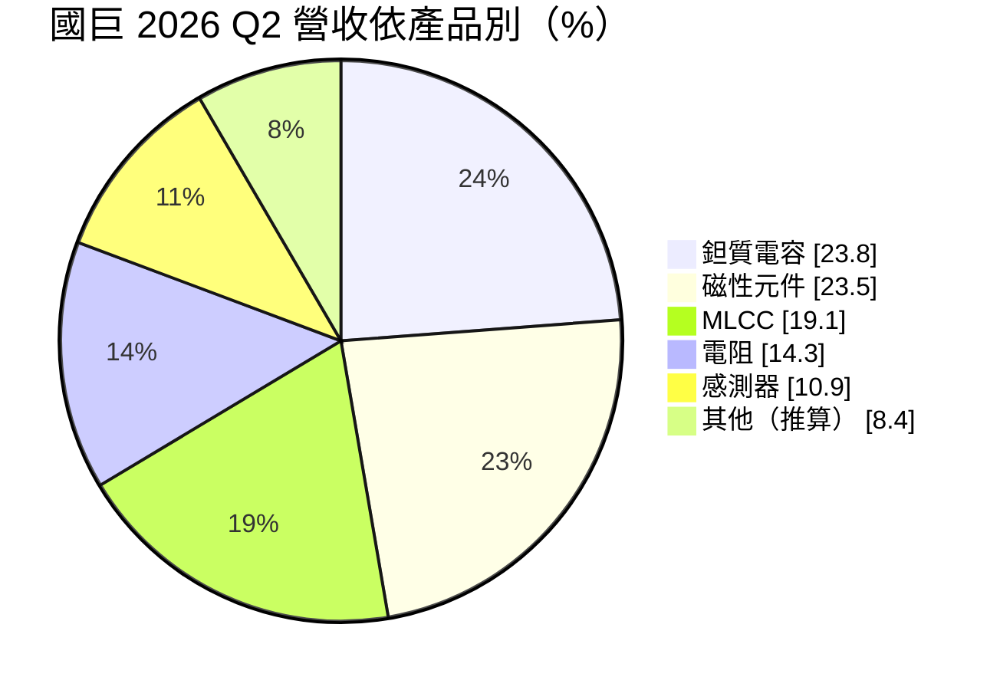
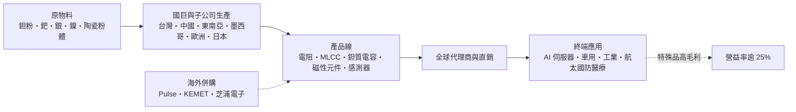
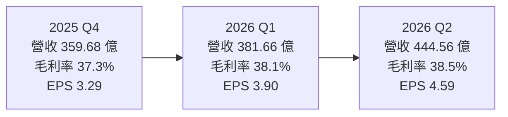
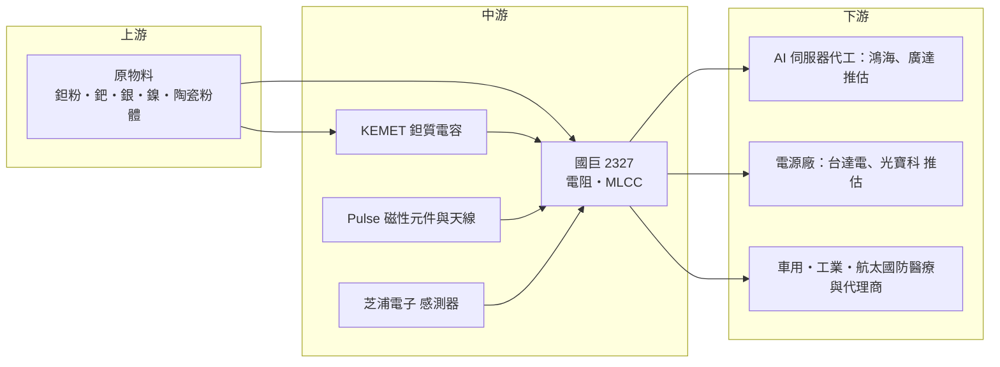

# 2327 國巨

> 上市｜[[產業索引-電子零組件業|電子零組件業]]｜上市（櫃）日期 1993/10/22

# 第一章：企業模式與商業藍圖

> [!info] 撰寫說明
> 本文由 Claude 依公開資料整理，架構比照 [[2330台積電]] 的四章研究，資料截至 2026-10-07。財務數字來源：國巨 2026 年第二季法說會簡報、優分析（2025 年第四季、2026 年第二季法說會與芝浦電子收購報導）、旺得富理財網、股感、Yahoo 股市新聞、HiStock 嗨投資；產業描述為整理性內容，尚未逐條比對原始文件。#待校對

在評估單一個股的長期投資價值時，首要步驟是拆解企業的底層獲利邏輯。本章針對國巨（股票代號：2327）的商業模式進行定性分析，說明它如何透過一連串跨國併購，從標準型電阻電容大廠轉型為以特殊品為主的被動元件與感測器平台。

## 一、核心定位：靠併購打造的全球被動元件整合平台

國巨 1987 年成立、1992 年上市，董事長為陳泰銘。國巨起家於晶片電阻，後來成為全球主要的 [[MLCC]]（積層陶瓷電容）供應商之一。過去十年，國巨透過一連串海外併購，把產品線擴大到美國 Pulse（磁性元件與天線）、美國 KEMET（[[鉭質電容]]與特殊電容），以及 2025 年完成收購的日本芝浦電子（溫度與壓力感測元件）。

[[被動元件]]幾乎存在於所有電子產品中，單價很低但數量龐大。一台 AI 伺服器需要的電容、電感數量遠多於一般伺服器，而且對耐高溫、高容值、高可靠度的要求更高。國巨的策略有兩個商業意義：

* **以特殊品取代標準品：** 減少對消費性[[標準品]]（Commodity）的依賴，把重心移到高毛利的[[特殊品]]（Specialty）。
* **跟著高階應用成長：** 鎖定 AI、車用、工業、航太國防醫療等認證門檻高、價格敏感度低的市場。

## 二、終端應用與產品板塊：鉭質電容與磁性元件並列最大

依 2026 年第二季法說會資料，產品別營收比重如下（其他為 100% 減去五大產品推算）：

* **鉭質電容：** 第二季銷售金額季增 14.1%、年增 44%，是近期的明星產品。2026 年第一季法說報導指出，鉭質電容中 AI 相關營收比重約 30%。
* **磁性元件：** 包含電感、變壓器等，主要來自 Pulse 與奇力新體系（推估）。
* **MLCC：** 高階產品成長最快。
* **電阻：** 國巨的起家產品。
* **感測器：** 併入芝浦電子後比重明顯提升。

應用別（2026 年第二季）：工業 28.4%、運算 27.3%、車用 15.9%、消費性電子 12.2%、通訊 12.2%、航太國防醫療 4%。地區別：中國 27.3%、中國以外亞洲 27.3%、美國 27%、歐洲 18%。AI 相關營收占比在 2026 年第二季約 16%，第一季約 13.5%。

## 三、資本轉化邏輯：併購擴產品線，通路放大銷售

* **產能布局：** 生產據點分布在台灣（高雄等地）、中國、東南亞，以及 KEMET 與 Pulse 原有的墨西哥、歐洲與亞洲工廠，芝浦電子則帶來日本產能。高雄 YF3 新廠正在補充高階 MLCC 產能。
* **稼動率：** 依 2026 年第一季法說報導，第一季標準品[[產能利用率]]約 72%、預計第二季提高到 75%，特殊品第二季估計提升到 85%。

## 四、企業長期藍圖：芝浦電子收購與股本調整

* **收購芝浦電子：** 國巨在 2025 年 2 月提出收購，未獲對方董事會同意，5 月正式發動公開收購，期間與日本美蓓亞三美競價，最終報價每股 7,130 日圓，總額約 1,090 億日圓（約新台幣 220 億元），2025 年 10 月完成，應募率 87.3%，並計畫透過強制收購讓芝浦下市。芝浦專長溫度與壓力感測元件，補強車用與工業自動化產品線。
* **股票分割：** 國巨在 2025 年宣布股票「一拆四」，面額由 10 元改為 2.5 元，因此 2025 年起的 EPS 與過去年度不能直接比較。
* **選擇性漲價：** 自 2025 年第四季起多次調整產品價格，反映原物料成本上升與高階產品供需吃緊。

# 第二章：護城河深度與競爭優勢

在長期價值投資中，「護城河」指企業抵禦競爭、維持超額利潤的保護機制。本章分析國巨的護城河構成、全球主要競爭對手，以及這些優勢在被動元件景氣循環中能守住多少。

## 一、國巨護城河的核心組成要素

* **1. 產品線廣度：** 同時供應電阻、MLCC、鉭質電容、磁性元件、感測器與天線，對大型客戶與代理商而言可以「一站購足」，這是單一產品線的同業難以提供的。
* **2. 特殊品技術與認證：** KEMET 的鉭質電容與高可靠度電容，長期打入航太、國防、醫療與車用客戶，這類產品[[車規驗證]]與軍規認證時間長，轉換成本高。
* **3. 全球通路：** 在歐美的營收比重接近四成，並擁有強大的代理商網路，可以把併購來的產品推到更多客戶。
* **4. 規模與定價能力：** 在供需吃緊時，國巨能透過選擇性漲價提升獲利，2026 年第二季毛利率提升到 38.5% 即是例子。

## 二、全球主要競爭對手格局

| 對手 | 定位 | 對國巨的威脅 |
|---|---|---|
| 村田製作所、TDK、太陽誘電 | 日系 MLCC 與被動元件大廠 | 超小型與高容值 MLCC 技術領先 |
| 三星電機 | 韓系 MLCC 大廠 | 規模與村田並列前段班 |
| Vishay、KYOCERA AVX | 美系特殊被動元件 | 在鉭質電容與特殊電容直接與 KEMET 競爭 |
| [[2492華新科]]、[[3026禾伸堂]] | 台灣 MLCC 與電阻同業 | 在標準品與中階產品競爭 |
| 風華高科、三環集團 | 中國本土廠商 | 以價格搶標準品市場 |

## 三、優勢轉化：哪些市場守得住、哪些守不住

* **守得住：** 鉭質電容、特殊 MLCC 與感測器等高階產品，國巨擁有技術與認證優勢；AI 伺服器對鉭質電容需求強勁，國巨具定價能力。
* **守不住：** 最高階的超小型 MLCC 仍由村田、三星電機主導；標準品市場則面臨中國廠商的價格壓力。
* **觀察重點：** AI 營收占比能否持續提升（目前約 16%）、芝浦電子的整併綜效、標準品稼動率回升速度，以及漲價能否在下半年延續。

# 第三章：財務體質與盈利規模

資料日期：2026-10-07。數字取自國巨法說會簡報與相關報導、HiStock 嗨投資整理，最新月營收與三率請見[[#相關連結]]的公開資訊觀測站。#待校對

財務報表是檢驗護城河是否真實存在的最終標準。本章用三率、ROE、現金流與資本報酬，檢視國巨在漲價循環與併購整合期的獲利品質。

## 一、獲利能力的基石：三率

| 項目 | 2025 全年 | 2025 Q4 | 2026 Q1 | 2026 Q2 |
|---|---|---|---|---|
| 營收（新台幣） | 1,329.3 億 | 359.68 億 | 381.66 億 | 444.56 億 |
| [[毛利率]] | 36.2% | 37.3% | 38.1% | 38.5% |
| [[營業利益率]] | 22.4% | 24.3% | 25.2% | 26.4% |
| EPS（元） | 11.51 | 3.29 | 3.90 | 4.59 |

* **營收與獲利：** EPS 以股票一拆四後的股數計算。2025 年稅後淨利 236.34 億元，年增 22.1%，為歷史次高。2026 年第二季營收季增 16.5%、年增 35.7%，稅後淨利 94.18 億元，年增 88.5%；上半年營收 826.22 億元、稅後淨利 174.19 億元、EPS 8.48 元。
* **[[毛利率]]與[[營業利益率]]：** 連續多季走高，主要來自 AI 與高階產品比重提升、稼動率回升與選擇性漲價。營業利益率超過 25%，在被動元件產業屬於高水準。

## 二、[[ROE]]：資本效率

連續併購讓帳上累積大量商譽與無形資產，股東權益與總資產都被墊高，會壓低帳面 ROE。股東權益報酬率精確數字本次未查得。評估國巨的資本效率時，應同時觀察營益率與併購後的資產周轉率。

## 三、資本支出與自由現金流

* **[[CapEx]]：** 本次未查得 2026 年資本支出金額。現金主要用於兩個方向：併購（芝浦電子約新台幣 220 億元）與高階 MLCC 等產能擴充（高雄 YF3 新廠）。
* **去槓桿：** 法說會資料指出，收購芝浦電子後，淨金融負債對 [[EBITDA]] 的倍數已從高點持續改善。營業利益率高、營業現金流充沛，[[自由現金流]]可支應去槓桿。
* **股利：** 2025 年度每股配發現金股利 6 元（面額 2.5 元後的股數），配發率超過 50%。2021 至 2024 年度現金股利分別約 10.1、9.99、19.97、20 元，均為分割前股數，不能與 2025 年度直接比較。

## 四、[[ROIC]] 與 [[WACC]]：價值創造利差

國巨的 ROIC 必須把併購支付的商譽一起算進投入資本。營益率在 25% 上下時，利差應為正值，但芝浦電子以溢價收購，短期會拉低 ROIC（推估，具體數值未查得）。綜效能否把芝浦的獲利率拉到集團水準，是利差能否擴大的關鍵。

# 第四章：總體風險與地緣政治

任何企業都無法脫離宏觀環境獨立存在。本章分析國巨未來必須面對的地緣政治、產業週期與營運風險。

## 一、地緣政治風險

* **美中關稅：** 國巨在中國、美國的營收各占約 27%，美中互加關稅會影響產品流向與報價；KEMET 與 Pulse 在墨西哥等地的工廠，也受美國對墨西哥的貿易政策影響。
* **日本併購審查：** 收購芝浦電子需取得日本政府核准，未來若再併購日本或歐美公司，都可能面臨國安與外資審查。
* **兩岸風險：** 台灣與中國都有重要產能，與其他台灣電子業相同面臨兩岸風險。

## 二、產業週期與市場結構風險

* **被動元件景氣循環：** 被動元件是典型的週期性產業，2018 年曾出現大漲價後急跌。2026 年的漲價若造成客戶重複下單，未來可能出現[[長鞭效應]]式的庫存修正。
* **非 AI 需求能見度：** 法說會提到非 AI 業務下半年能見度有限，消費性與通訊需求可能拖累整體。
* **匯率：** 營收以外幣為主，新台幣升值會造成匯損，2025 年就曾因新台幣急升而認列匯兌損失。

## 三、營運環境的隱性風險

* **原物料：** 鉭、鈀、銀、鎳等金屬價格波動，會影響鉭質電容、MLCC 與電阻的成本。
* **整併風險：** 芝浦電子、KEMET 等跨國公司的整合需要時間，企業文化、人才流失與成本整合都是挑戰。
* **財務槓桿：** 併購推高負債，若景氣反轉，利息負擔與商譽減損可能壓縮獲利。

## 四、科技演進風險

高階 MLCC 需要更薄的介電層與更多疊層數，技術仍由日韓廠領先。若 AI 伺服器、車用電子的元件規格快速升級，而國巨的高階 MLCC 進度落後，可能錯過最高毛利的市場。

# 專有名詞解析

## 應用

- **[[車規驗證]]**：車用元件須通過 AEC-Q200 等可靠度測試與車廠認證，流程長，因此轉換成本高。

## 金融

- **[[產能利用率]]**：實際產出占總產能的比例，被動元件廠的毛利率高度取決於此數字。
- **[[EBITDA]]**：稅前息前折舊攤銷前利潤，常用來衡量本業現金獲利能力與償債能力。
- **[[毛利率]]**：毛利除以營收，反映產品本身的定價能力與成本控制。
- **[[營業利益率]]**：營業利益除以營收，反映扣除研發、管銷費用後的本業獲利能力。
- **[[ROE]]**：股東權益報酬率，稅後淨利除以股東權益，衡量公司運用股東資金的效率。
- **[[自由現金流]]**：營業活動現金流減去資本支出，代表企業可自由用於配息、還債或併購的現金。
- **[[ROIC]]**：投入資本報酬率，衡量公司運用股東與債權人資金創造本業報酬的效率。
- **[[長鞭效應]]**：終端需求的小幅變動，沿供應鏈往上游傳遞時被逐級放大，造成上游庫存與訂單劇烈波動。

## 產業

- **[[被動元件]]**：不需外加電源即可運作的電子元件，主要是電容、電阻、電感，用於穩壓、濾波與儲能。
- **[[MLCC]]**：積層陶瓷電容，以多層陶瓷與電極堆疊而成，是用量最大的電容，一支手機需上千顆。
- **[[鉭質電容]]**：以鉭金屬為材料的電容，體積小、容值高且穩定，常用於 AI 伺服器、軍工與醫療設備。
- **[[標準品]]**：規格通用、可互相替代的被動元件，價格隨供需波動大，毛利率較低。
- **[[特殊品]]**：針對高溫、高壓、高可靠度等特定需求設計的被動元件，認證時間長、毛利率較高。

# 核心供應鏈

## 1. 上游：原物料
- 鉭粉、鈀、銀、鎳、陶瓷粉體等：本次未查得具體供應商

## 2. 中游：國巨本身與旗下子公司
- 電阻、MLCC（國巨本體）、鉭質電容（KEMET）、磁性元件與天線（Pulse）、感測器（芝浦電子）

## 3. 下游：電子製造與終端客戶
- AI 伺服器與雲端：[[NVDA輝達]]、伺服器代工 [[2317鴻海]]、[[2382廣達]]（推估）
- 電源與零組件廠：[[2308台達電]]、[[2301光寶科]]（推估）
- 車用、工業、航太國防醫療客戶與全球代理商

## 4. 同業
- 台灣：[[2492華新科]]、[[3026禾伸堂]]
- 國際：村田製作所、TDK、太陽誘電、三星電機、Vishay、KYOCERA AVX

## 最新新聞
<!-- news:start -->
<!-- news:end -->

## 相關連結
- [公開資訊觀測站](https://mopsov.twse.com.tw/mops/web/t05st03?step=1&firstin=1&co_id=2327)
- [Goodinfo](https://goodinfo.tw/tw/StockDetail.asp?STOCK_ID=2327)
- [Yahoo 股市](https://tw.stock.yahoo.com/quote/2327)
- [鉅亨網新聞](https://www.cnyes.com/twstock/2327/news)
