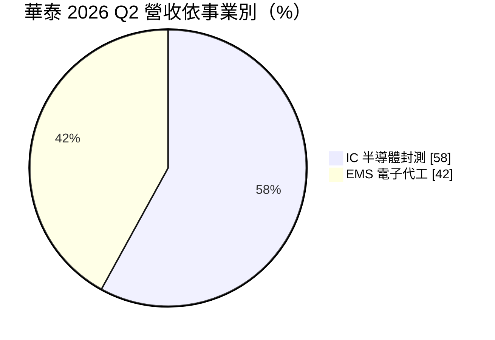
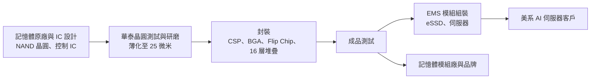
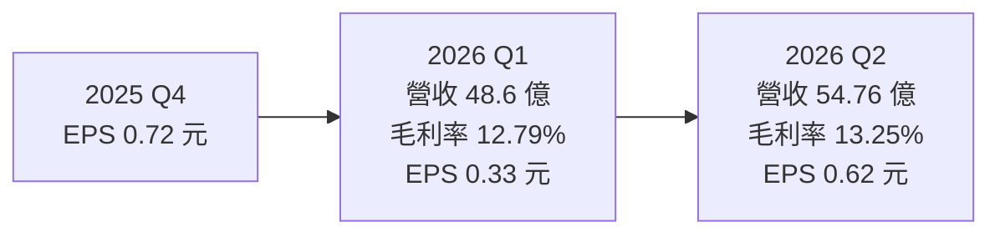
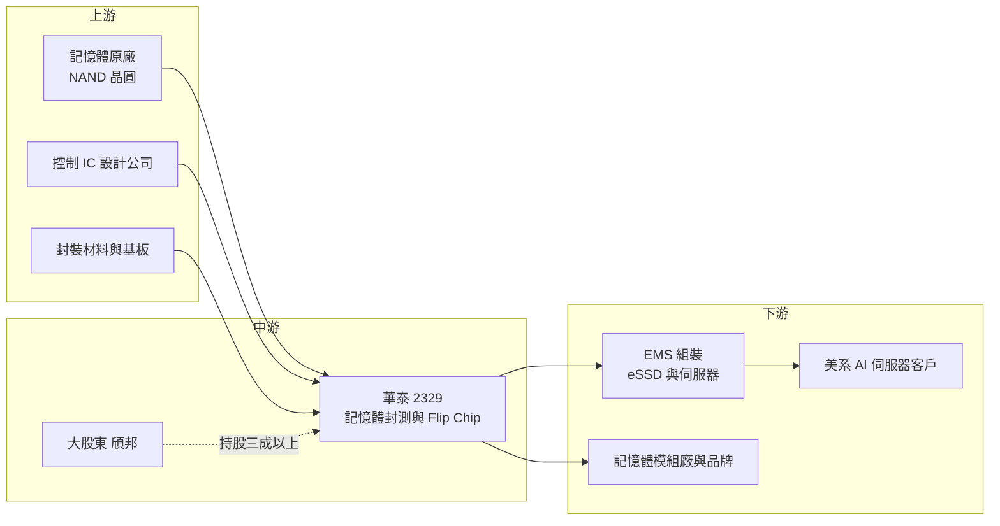

# 2329 華泰

> 上市｜[[產業索引-半導體業|半導體業]]｜上市（櫃）日期 1994/04/20

# 第一章：企業模式與商業藍圖

> [!info] 撰寫說明
> 本文由 Claude 依公開資料整理，架構比照 [[2330台積電]] 的四章研究，資料截至 2026-10-07。財務數字來源：富果研究華泰 2026 年 5 月與 10 月法說會整理、旺得富（中時）報導、nStock 公司資料、Yahoo 股市季 EPS；產業描述為整理性內容，尚未逐條比對原始文件。#待校對

在評估單一個股的長期投資價值時，首要步驟是拆解企業的底層獲利邏輯。本章針對華泰電子（股票代號：2329，以下簡稱華泰）的商業模式進行定性分析，說明一家以記憶體封測起家的高雄老廠，如何同時搭上 AI 伺服器的 [[EMS]] 代工訂單。

## 一、核心定位：NAND Flash 封測平台加上 AI 伺服器代工

華泰 1971 年 6 月在高雄設立，是台灣最早的電子代工與封裝業者之一，資本額約 65.89 億元。大股東是驅動 IC 封測廠 [[6147頎邦]]，持股三成以上。

華泰的業務分成兩大塊，2026 年第二季的營收比約 58 比 42：

* **IC 半導體封測：** 以 [[NAND Flash]] 記憶體封裝與測試為主，記憶體產品占該事業 72%，邏輯 IC 占 16%。封裝技術涵蓋 CSP、BGA 與覆晶封裝（[[Flip Chip]]），晶圓研磨可薄化到 25 微米、支援 16 層晶片堆疊。客戶包括記憶體原廠與國內 [[eMMC]] 控制 IC 業者，2025 年以來已有兩家記憶體原廠擠進前十大客戶。
* **EMS 電子代工：** 為伺服器、[[SSD]]、工業產品做系統組裝。依富果整理的法說資料，一家美系 AI 伺服器客戶占 EMS 營收七成以上，法說中提到的關鍵夥伴是美超微（Supermicro）。

華泰的定位不是先進封裝技術領先者，而是「記憶體供應鏈中從晶圓測試到模組組裝的一站式平台」。

## 二、終端應用／產品板塊：記憶體封測與 AI 伺服器

* **記憶體封測（約占 IC 事業 72%）：** NAND Flash 晶片的薄化、堆疊、封裝與測試，終端是手機、PC、伺服器的儲存裝置。記憶體景氣直接決定這塊的稼動率。
* **邏輯 IC 封測（約占 IC 事業 16%）：** 包括 eMMC 控制器等，公司將「邏輯 IC 委外訂單」列為成長支柱之一。
* **EMS：** AI 伺服器與企業級固態硬碟（[[eSSD]]）模組組裝，2026 年第二季 EMS 營收 23.09 億元。公司把 eSSD 模組定位為 2027 年的成長動能。

## 三、資本轉化邏輯（營運模式）：從晶圓到模組的一條龍

* **一站式服務：** 公司目標是從晶圓測試、封裝、成品測試一路做到模組組裝，客戶可以減少在不同供應商間轉運的時間與成本。這也讓 EMS 與封測兩個事業能互相導流。
* **稼動率決定獲利：** 2026 年第一季半導體產能利用率約 70%，公司預期逐季提升。封測屬固定成本高的行業，[[產能利用率]]每提升一段，毛利率就會跟著改善。
* **EMS 的低毛利、高營收：** EMS 營收規模大但毛利率低，拉低公司整體毛利率，卻能貢獻穩定的營業利益。

## 四、企業長期藍圖：Flip Chip 擴產與 AI 儲存

* **新廠擴產：** 新廠預計 2027 年第二季啟用，主要擴充 Flip Chip 產能。2026 年[[CapEx]]逾 20 億元，高於 2024 至 2025 年每年約 20 億元的水準。
* **四大成長支柱：** 記憶體原廠滲透、eSSD 服務、低容量 eMMC、邏輯 IC 委外訂單。
* **混合型封裝：** 依旺得富報導，華泰正進入高階覆晶封裝與混合型封裝的成熟量產階段，目標是提高單價與毛利率。

# 第二章：護城河深度與競爭優勢

在長期價值投資中，「護城河」指企業抵禦競爭、維持超額利潤的保護機制。本章分析華泰在記憶體封測與 EMS 兩個市場的競爭位置。

## 一、護城河的核心組成要素

華泰的護城河屬於「窄護城河」，主要來自製程經驗與客戶關係：

* **1. 記憶體封裝的薄化與堆疊經驗：** NAND Flash 需要把晶片磨到極薄再多層堆疊，[[良率]]控制是關鍵。華泰能做到 25 微米研磨與 16 層堆疊，在中型封測廠中具一定技術門檻。
* **2. 記憶體原廠的認證：** 記憶體原廠對外包封測的認證嚴格，2025 年以來新增兩家原廠進入前十大客戶，代表華泰通過了這道門檻。
* **3. 封測加 EMS 的整合能力：** 多數封測廠不做系統組裝，多數 EMS 廠不做晶片封測。華泰同時具備兩者，可以提供 eSSD 從晶片到模組的完整服務。
* **4. 頎邦的股東支持：** 頎邦持股三成以上，在財務與技術上提供一定程度的支撐（推估）。

## 二、全球主要競爭對手格局

| 對手 | 定位 | 對華泰的威脅 |
|---|---|---|
| [[6239力成]] | 全球最大記憶體封測廠 | 規模與原廠關係更深，可吸走大單 |
| [[3711日月光投控]] | 全球最大封測集團 | 先進封裝與產能規模領先 |
| [[AMKR艾克爾]] | 美系封測大廠 | 在美系客戶與先進封裝具優勢 |
| [[8150南茂]] | 記憶體與驅動 IC 封測 | 在記憶體封測市場直接競爭 |
| [[2382廣達]]、[[6669緯穎]]、[[2317鴻海]] | AI 伺服器 EMS 與 ODM | 規模遠大於華泰，客戶可隨時轉單 |

## 三、優勢轉化：守得住、守不住與觀察重點

* **守得住：** 中低容量記憶體與 eMMC 的封測，以及需要彈性交期的中型客戶。這些訂單對大型封測廠而言規模不夠大，華泰較有議價空間。
* **守不住：** EMS 的客戶集中度。美系 AI 伺服器客戶占 EMS 七成以上，客戶若轉單或自建產能，營收會大幅波動。EMS 本身毛利率低，也難以建立定價權。
* **觀察重點：** 第一，記憶體稼動率能否從七成往八成以上提升；第二，2027 年新廠 Flip Chip 產能能否順利滿載；第三，eSSD 模組能否成為新的高毛利產品。

# 第三章：財務體質與盈利規模

資料日期：2026-10-07。數字取自富果研究、nStock 與 Yahoo 股市，表格是撰寫當時的快照；最新月營收、毛利率、累計 EPS 由自動排程寫在本筆記的屬性欄位（月營收、毛利率、累計EPS 等）。#待校對

財務報表是檢驗護城河是否真實存在的最終標準。本章用三率、ROE、現金流與資本報酬，檢視華泰在記憶體景氣與 AI 伺服器需求交錯下的獲利品質。

## 一、獲利能力的基石：三率

| 項目 | 2025 全年 | 2026 Q1 | 2026 Q2 |
|---|---|---|---|
| 營收（新台幣） | 196.83 億 | 48.6 億 | 54.76 億 |
| [[毛利率]] | 未查得 | 12.79% | 13.25% |
| [[營業利益率]] | 未查得 | 5.61% | 6.31% |
| [[淨利率]] | 未查得 | 未查得 | 7.45% |
| EPS（元） | 2.13（四季加總） | 0.33 | 0.62 |
| 半導體產能利用率 | 未查得 | 約 70% | 約 70%（旺得富報導） |

* **[[毛利率]]：** 13% 左右的毛利率是封測與 EMS 混合後的結果。2026 年第二季毛利率低於前一年同期的 14.97%，可能與 EMS 比重與產品組合有關（推估）。
* **[[營業利益率]]：** 第二季回升到 6.31%，營收季增 12.67% 帶動費用攤提效果。
* **獲利波動：** 2025 年四季 EPS 分別為 0.27、0.54、0.60、0.72 元，逐季上升；2026 年第一季回落到 0.33 元，第二季又回到 0.62 元，季增 87.88%，第二季稅後淨利 4.08 億元。2026 年 1 至 8 月累計營收 138.95 億元，年增 8.67%。

## 二、[[ROE]]：資本效率

公司未直接揭露 ROE（未查得）。以 2025 年 EPS 2.13 元推估，ROE 約在一成上下（推估）。2026 年第二季負債比由 49.35% 降到 38.44%，財務結構改善，代表 ROE 主要靠本業獲利而非財務槓桿撐起。

## 三、資本支出與自由現金流

* **[[CapEx]]：** 2024 至 2025 年每年約 20 億元，2026 年逾 20 億元，主要用於新廠與 Flip Chip 產能。
* **[[自由現金流]]：** EMS 業務需要的資本支出較少，但營運資金（存貨、應收帳款）需求大，AI 伺服器出貨放大時會占用現金。整體自由現金流的具體數字未查得。
* **股利：** 近五年平均現金股利 1.01 元，平均殖利率約 3.2%。

## 四、[[ROIC]] 與 [[WACC]]：價值創造利差

封測是資本密集產業，EMS 是營運資金密集產業，兩者合計使華泰的投入資本規模不小。以 6% 左右的營業利益率與一成上下的 ROE 推估，ROIC 約略高於資金成本，但利差不大（推估，具體數值未查得）。新廠投產後若稼動率不足，短期內 ROIC 可能下滑。

# 第四章：總體風險與地緣政治

任何企業都無法脫離宏觀環境獨立存在。本章分析華泰未來必須面對的地緣政治、產業週期、營運與技術風險。

## 一、地緣政治

* **美系客戶與關稅：** EMS 主要客戶是美系 AI 伺服器業者，美國對伺服器的關稅與在地化政策，可能促使客戶把組裝移往美國或墨西哥，影響台灣 EMS 訂單。
* **記憶體供應鏈重組：** 美國對中國記憶體廠的出口管制，可能改變記憶體原廠的封測外包策略，對華泰有機會也有風險。

## 二、產業週期與市場結構

* **記憶體景氣循環：** 記憶體占半導體封測事業七成以上，NAND Flash 報價與原廠稼動率的循環，直接影響華泰的封測訂單。記憶體景氣下行時，原廠會先收回外包產能。
* **AI 伺服器需求波動：** AI 伺服器出貨受雲端業者資本支出影響，一旦放緩，EMS 營收可能快速下滑，且出現[[長鞭效應]]。

## 三、營運環境的隱性風險

* **客戶集中：** 單一美系 AI 伺服器客戶占 EMS 七成以上，客戶本身的營運或治理問題都會傳導到華泰。
* **新廠執行：** 2027 年第二季新廠啟用，若客戶認證或需求不如預期，折舊會先拖累毛利率。
* **消費性比重：** 依旺得富報導，消費性相關產品占比相對高，終端需求轉弱時影響明顯。

## 四、科技或法規演進

* **記憶體封裝技術升級：** NAND 堆疊層數持續增加，HBM 等先進記憶體需要更複雜的封裝製程。若華泰無法跟上，可能被侷限在中低階市場。
* **[[先進封裝]]集中化：** AI 晶片的封裝價值集中在 [[CoWoS]] 等先進封裝，主要由台積電與大型封測廠承接，中型封測廠能分到的比重有限。

# 專有名詞解析

## 半導體

- **[[NAND Flash]]**：斷電後仍能保存資料的快閃記憶體，是 SSD、手機儲存與記憶卡的核心元件。
- **[[Flip Chip]]**：覆晶封裝，把晶片翻面以凸塊直接接到基板，訊號路徑短、散熱好，適合高效能晶片。
- **[[eMMC]]**：把 NAND Flash 與控制器封裝在一起的嵌入式儲存方案，常見於中低階手機與物聯網裝置。
- **[[良率]]**：合格產品占總產出的比例，封裝測試的良率直接影響成本與客戶信任。
- **[[先進封裝]]**：把多顆晶片以中介層、混合鍵合等方式高密度整合的封裝技術，例如 CoWoS、SoIC。

## 應用

- **[[SSD]]**：固態硬碟，以 NAND Flash 儲存資料，速度遠快於傳統硬碟。
- **[[eSSD]]**：企業級固態硬碟，用於資料中心與伺服器，對耐用度與穩定性要求高於消費級 SSD。

## 金融

- **[[產能利用率]]**：實際產出占總產能的比例，封測廠的毛利率高度取決於此數字。
- **[[長鞭效應]]**：終端需求的小幅變動，沿供應鏈往上游傳遞時被逐級放大，造成上游庫存與訂單劇烈波動。

## 產業

- **[[EMS]]**：電子製造服務，替品牌或系統業者代工組裝電路板與整機，毛利率低但營收規模大。

# 核心供應鏈

## 1. 上游：晶圓與材料
- 記憶體原廠（NAND 晶圓）：[[005930三星電子]] 等國際原廠（實際委外名單公司未公開）
- 控制 IC 設計：國內 eMMC 控制 IC 業者，如 [[8299群聯]]（產業常見合作對象，未經公司證實）
- IC 載板與封裝材料：[[3037欣興]]、[[8046南電]]（產業常見供應來源，未經公司證實）

## 2. 中游：華泰本身與股東
- 大股東：[[6147頎邦]]
- 記憶體封測同業：[[6239力成]]、[[8150南茂]]
- 綜合封測同業：[[3711日月光投控]]、[[AMKR艾克爾]]

## 3. 下游：EMS 與終端客戶
- AI 伺服器：美超微（Supermicro）
- 伺服器 EMS 同業：[[2382廣達]]、[[6669緯穎]]、[[2317鴻海]]
- 終端：資料中心、手機與 PC 儲存裝置

## 最新新聞
<!-- news:start -->
<!-- news:end -->

## 相關連結
- [公開資訊觀測站](https://mopsov.twse.com.tw/mops/web/t05st03?step=1&firstin=1&co_id=2329)
- [Goodinfo](https://goodinfo.tw/tw/StockDetail.asp?STOCK_ID=2329)
- [Yahoo 股市](https://tw.stock.yahoo.com/quote/2329)
- [鉅亨網新聞](https://www.cnyes.com/twstock/2329/news)
