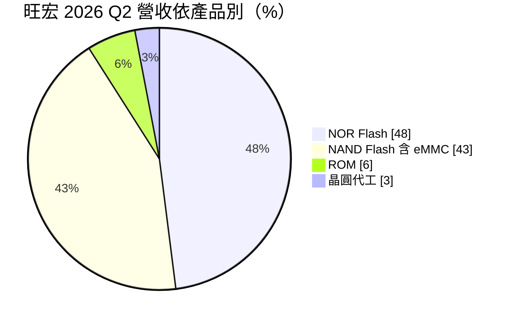
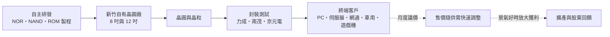
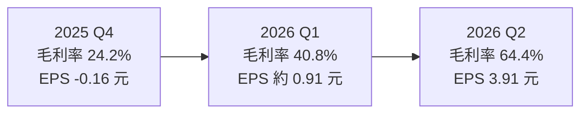
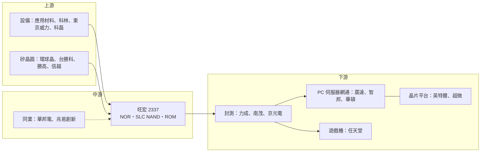

# 2337 旺宏

> 上市｜[[產業索引-半導體業|半導體業]]｜上市（櫃）日期 1995/03/15

# 第一章：企業模式與商業藍圖

> [!info] 撰寫說明
> 本文由 Claude 依公開資料整理，架構比照 [[2330台積電]] 的四章研究，資料截至 2026-10-07。財務數字來源：旺宏 2025 年第四季與 2026 年第二季法說會相關報導（科技新報、優分析）；產業描述為整理性內容，尚未逐條比對原始文件。#待校對

在評估單一個股的長期投資價值時，首要步驟是拆解企業的底層獲利邏輯。本章針對旺宏電子（股票代號：2337，以下簡稱旺宏）的商業模式進行定性分析，說明它為何選擇避開主流大容量記憶體戰場，以及如何在小容量、高可靠度的非揮發性記憶體市場中建立自己的位置。

## 一、核心定位：非揮發性記憶體專業廠

旺宏總部位於新竹科學園區，由董事長吳敏求創辦，是台灣少數擁有自主技術與自有晶圓廠的記憶體 [[IDM]]。旺宏專注於[[非揮發性記憶體]]，也就是斷電後資料不會消失的記憶體，主要產品包括 [[NOR Flash]]、[[SLC NAND]]（含 [[eMMC]]）與唯讀記憶體（[[ROM]]）。

旺宏的定位可以用「不做什麼」來理解：

* **不做 DRAM：** 旺宏不生產 [[DRAM]]，避開三星、SK 海力士、美光寡占且資本支出極高的市場。
* **不做主流大容量 3D NAND：** 固態硬碟與手機儲存使用的高層數 [[3D NAND]]，由三星、鎧俠、美光、SK 海力士主導，旺宏不正面競爭。
* **專攻小容量、高可靠度：** PC 與伺服器的開機韌體、網通設備、車用電子、工業設備與遊戲機卡匣，這些應用容量需求不大，但要求長期供貨、資料保存穩定。

旺宏長期是任天堂遊戲卡匣 ROM 的重要供應商，這是市場熟知的業務特色，也讓旺宏的營收帶有一定的遊戲機週期色彩。

## 二、終端應用／產品板塊：NOR 與 NAND 並重

2026 年第二季產品營收比重如下：

* **NOR Flash（48%）：** 季增 48%、年增 101%。主要應用為電腦（約 48%）與通訊（約 21%），AI 伺服器與 PC 的韌體容量提升帶動高容量 NOR 需求。NOR Flash 的特點是讀取速度快、可以直接執行程式碼，因此常用來存放開機程式與韌體。
* **[[NAND Flash]]，含 eMMC（43%）：** 季增 163%、年增 798%，是本波成長最快的產品。主要應用為通訊（約 55%）與消費性電子（約 23%）。旺宏 2025 年開始量產 16Gb eMMC，32Gb 規格預計 2026 年第二季底供貨。
* **ROM（6%）：** 季增 40%、年增 37%，主要用於遊戲機卡匣。
* **晶圓代工（3%）：** 利用部分產能替客戶代工。

由此可見，旺宏的營收結構已從過去高度依賴 NOR 與 ROM，轉為 NOR 與 NAND 並重。NAND 比重的快速拉升，反映的是三大 NAND 廠把產能移往高層數產品後，中低容量 NAND 出現供給缺口，旺宏得以趁勢補位。

## 三、資本轉化邏輯：自有晶圓廠加上景氣槓桿

* **IDM 模式的兩面：** 旺宏從技術開發、晶圓製造到銷售一手包辦，可以控制品質與交期，對車用與工業客戶是重要條件；但自有晶圓廠也代表固定成本高，營收下滑時折舊與人事費用無法同步縮減。
* **價格槓桿：** 記憶體屬於規格化程度高的產品，售價隨供需快速變動。2025 年旺宏全年[[毛利率]]僅 17.8%、營業虧損；2026 年第二季在價格大漲下毛利率衝上 64.4%，一年之內的振幅極大。
* **[[月度議價]]：** 公司表示 eMMC 與 SLC NAND 已改為按月議價，漲價期可以更快反映在營收上，跌價期則同樣會更快反映。

產能方面，旺宏的晶圓廠位於新竹科學園區，擁有 8 吋與 12 吋產能。依優分析報導，2026 年初宣布的擴產計畫將 12 吋月產能由約 2 萬片擴增到 3 萬多片，增幅超過五成；第二季法說會再追加資本支出 158 億元擴充先進製程產能，設備自 2026 年下半年起陸續進駐，2027 年開始貢獻產出。

## 四、企業長期藍圖：補位 NAND 缺口、深耕高可靠度 NOR

* **擴大 SLC NAND 與 eMMC：** 三大 NAND 廠把產能轉向高層數 3D NAND 與企業級固態硬碟，中低容量 NAND 與 eMMC 供給減少，旺宏趁勢擴大市占。
* **高容量 NOR 與車用：** 聚焦 AI 伺服器、車用 [[ADAS]] 與工業應用所需的高容量、高可靠度 NOR Flash。
* **3D NOR 與新世代記憶體：** 旺宏持續投入 [[3D NOR]] 等新技術研發，目標提高單位容量與降低成本（具體量產時程本次未查得）。
* **月度議價延續漲勢：** 公司表示 eMMC 與 SLC NAND 價格上漲動能預期延續到第四季。

整體而言，旺宏的長期藍圖並不是追趕三大記憶體廠，而是在大廠退出或不重視的利基市場中，以自有技術與產能補位，並藉由擴產放大景氣上行時的獲利。

# 第二章：護城河深度與競爭優勢

在長期價值投資中，「護城河」指企業抵禦競爭、維持超額利潤的保護機制。本章分析旺宏的護城河構成、全球主要競爭對手，以及這些優勢在記憶體價格循環中能守住多少。

## 一、旺宏護城河的核心組成要素

旺宏的護城河屬於「窄護城河」，主要由四個要素組成：

* **1. 自主技術與製造：** 擁有自行開發的 NOR、NAND 與 ROM 製程技術與自有晶圓廠，能控制品質與供貨。車用與工業客戶要求長期供貨與穩定品質，擁有自有產能是進入門檻之一。
* **2. ROM 與遊戲機的長期合作：** ROM 市場小眾，全球供應商極少，旺宏長期深耕，客戶轉換意願低。
* **3. 高可靠度市場經驗：** 車用與工業記憶體需要長期供貨與嚴格的[[車規驗證]]，旺宏在這些市場累積多年客戶關係，一旦通過驗證，替換成本高。
* **4. 專利組合：** 旺宏在非揮發性記憶體領域擁有大量專利，曾以專利訴訟保護市場地位。

## 二、全球主要競爭對手格局

| 對手 | 主要產品 | 對旺宏的威脅 |
|---|---|---|
| [[2344華邦電]] | 全球最大 NOR Flash 廠，另有 SLC NAND 與利基型 DRAM | 規模大於旺宏，NOR 與 SLC NAND 直接競爭 |
| 兆易創新（GigaDevice） | 中國 NOR Flash 與 MCU 廠 | 受國產替代政策支持，在中國市場以價格競爭 |
| 英飛凌（Cypress 產品線） | 車用與工業 NOR Flash | 在車用高可靠度市場與旺宏競爭 |
| 鎧俠（Kioxia）與三大 NAND 廠 | NAND Flash 舊產品線 | 若產能轉回中低容量，將壓低 SLC NAND 與 eMMC 價格 |
| 遊戲機儲存替代技術 | 其他儲存媒介 | ROM 業務的主要威脅來自技術替代，而非同業 |

## 三、優勢轉化：哪些市場守得住、哪些守不住

* **守得住：** 在供給緊張時，旺宏的 NOR 與 SLC NAND 成為客戶搶貨對象，2026 年第二季毛利率衝上 64.4%，創公司紀錄，顯示議價能力大幅提升。ROM 業務因供應商稀少，也較少面臨價格戰。
* **守不住：** 旺宏的規模小於華邦電，NOR Flash 在中國市場面臨兆易創新的價格競爭；SLC NAND 與 eMMC 本質上是商品，價格可能隨供需快速反轉。2025 年旺宏全年毛利率僅 17.8%、營業利益率 -12.8%，說明景氣低迷時的抗跌性有限。
* **觀察重點：** 新增 12 吋產能能否在 2027 年順利開出、NAND 與 eMMC 的價格趨勢，以及 ROM 業務是否隨新一代遊戲機維持成長。這三點決定旺宏的高獲利是一次性的景氣紅利，還是能轉化為更高的長期獲利基期。

# 第三章：財務體質與盈利規模

資料日期：2026-10-07。數字取自法說會相關財經報導（科技新報、優分析），表格是撰寫當時的快照；最新月營收、毛利率、累計 EPS 由自動排程寫在本筆記的屬性欄位（月營收、毛利率、累計EPS 等）。#待校對

財務報表是檢驗護城河是否真實存在的最終標準。本章用三率、ROE、資本支出與資本報酬，檢視旺宏在記憶體景氣循環中的獲利品質。

## 一、獲利能力的基石：三率

| 項目 | 2025 全年 | 2025 Q4 | 2026 Q1 | 2026 Q2 |
|---|---|---|---|---|
| 營收（新台幣） | 約 288.8 億 | 約 77 億 | 約 104.7 億（推算） | 191.3 億 |
| [[毛利率]] | 17.8% | 24.2% | 40.8% | 64.4% |
| [[營業利益率]] | -12.8% | -5.1% | 約 18.3%（推算） | 46.9% |
| 稅後淨利 | 虧損（金額未查得） | 虧損 | 約 17.8 億（推算） | 77.4 億 |
| EPS（元） | 未查得（虧損） | -0.16 | 約 0.91（推算） | 3.91 |

* **[[毛利率]]：** 2025 年營收年增約 12%，但毛利率年減 5.8 個百分點；第三季每股虧損 0.47 元，第四季虧損收斂至 0.16 元。2026 年起記憶體價格上漲，毛利率連續兩季大幅跳升，第二季 64.4% 創公司紀錄。
* **[[營業利益率]]：** 記憶體廠的固定成本高，售價上漲帶來的營收增加大部分直接轉為利潤，營業利益率從 2025 年的 -12.8% 翻升到 2026 年第二季的 46.9%，這是典型的營運槓桿。
* **上半年合計：** 2026 年上半年營收 295.9 億元，年增 129%，已超過 2025 年全年；上半年毛利率 56.1%、營業利益率 36.8%、EPS 4.82 元。第一季數字由上半年合計減去第二季推算，屬約略值。

## 二、[[ROE]]：資本效率

旺宏的 ROE 隨記憶體景氣大幅擺盪，2024、2025 年為負。第二季每股淨值升至 31.28 元（第一季為 25.6 元）。以 2026 年第二季 EPS 3.91 元對照每股淨值約 28 至 31 元，單季 ROE 已超過一成，年化可能超過四成（推估）。這種「虧損年與暴利年交替」的 ROE 型態，代表評估旺宏時應看完整景氣循環的平均，而不是單一年度。

## 三、資本支出與自由現金流

* **[[CapEx]]：** 2026 年初規劃 220 億元擴產，第二季法說會追加 158 億元，合計約 378 億元，是近年最大規模的投資，設備 2026 年下半年起到位、2027 年起貢獻產出。
* **[[自由現金流]]：** 2026 年上半年獲利回升，營業現金流大幅改善，有助於支應擴產。若景氣在新產能開出時反轉，大額資本支出將帶來折舊壓力，自由現金流可能再度轉弱（推估）。
* **股利：** 旺宏 2025 年虧損，配息能力受限。2026 年獲利轉強，後續配息可望恢復或提高（推估，本次未查得最新配息金額）。

## 四、[[ROIC]] 與 [[WACC]]：價值創造利差

企業創造價值的條件是投入資本報酬率高於資金成本。旺宏在 2024 至 2025 年營業虧損期間，ROIC 低於 WACC，屬於價值毀損期；2026 年在價格大漲下，ROIC 明顯高於 WACC（推估，具體數值未查得）。關鍵問題在於 378 億元的新投資能否在下一次景氣下行前回收，若新產能開出時價格已回落，整個循環的平均 ROIC 可能仍偏低。

# 第四章：總體風險與地緣政治

任何企業都無法脫離宏觀環境獨立存在。本章分析旺宏未來必須面對的地緣政治、產業週期、營運與技術風險。

## 一、地緣政治風險

* **中國競爭：** 中國兆易創新等業者在國產替代政策下擴大 NOR 與 SLC NAND 供給，對價格形成壓力，並可能逐步取代旺宏在中國客戶的份額。
* **美中貿易與關稅：** 網通、PC 與消費性電子終端若受關稅衝擊，記憶體需求會連帶受影響。
* **生產集中在台灣：** 晶圓廠全部位於新竹，面臨兩岸風險與水電、地震等營運風險。相較在海外有產能的同業，旺宏較難滿足客戶「台灣加一」的分散生產要求。

## 二、產業週期與市場結構風險

* **記憶體價格反轉：** 旺宏的獲利對價格極度敏感，2025 年營業虧損、2026 年第二季營業利益率 46.9%，顯示景氣循環的振幅極大。若三大 NAND 廠或中國業者把產能轉回中低容量產品，價格可能快速回落。
* **[[長鞭效應]]：** 記憶體漲價期間，客戶往往提前備貨、重複下單，實際終端需求被放大；一旦價格見頂，庫存去化會讓訂單急速萎縮。
* **遊戲機週期：** ROM 業務與遊戲機產品週期相關，新機推出時需求強，主機生命週期後段需求下滑。

## 三、營運環境的隱性風險

* **擴產時點：** 新產能 2027 年才開始貢獻，若屆時記憶體景氣已經轉弱，可能出現產能過剩與折舊壓力。
* **客戶集中：** ROM 業務客戶集中度高，若主要客戶改變儲存方案，營收將受影響。
* **月度議價：** 月度議價在漲價期有利，跌價期則會讓營收與毛利更快下滑。
* **匯率：** 記憶體多以美元報價，新台幣升值會壓縮以台幣計算的營收與毛利。

## 四、科技演進風險

* **技術替代：** 遊戲機與嵌入式設備若改採其他儲存技術，ROM 與部分 NOR 需求可能萎縮。
* **製程與規模：** 相較三大記憶體廠，旺宏的研發與資本規模有限，3D NOR 等新世代記憶體技術能否順利量產並取得成本優勢，仍有不確定性（推估）。
* **AI 帶來的結構變化：** AI 伺服器提高了高容量 NOR 的需求，是正面因素；但 AI 也讓三大廠集中資源在 HBM 與高階 NAND，若 AI 投資降溫、大廠產能回流，旺宏所在的利基市場將首當其衝。

# 專有名詞解析

## 半導體

- **[[非揮發性記憶體]]**：斷電後資料仍能保存的記憶體，包括 NOR Flash、NAND Flash 與 ROM，用來儲存程式碼與資料。
- **[[NOR Flash]]**：讀取速度快、可直接執行程式碼的快閃記憶體，容量較小，常用於存放開機程式與韌體。
- **[[NAND Flash]]**：單位容量成本低、適合大量儲存資料的快閃記憶體，用於固態硬碟、手機儲存與記憶卡。
- **[[SLC NAND]]**：每個記憶單元只存 1 位元的 NAND Flash，容量小但耐用度與可靠度高，常用於網通、工業與車用。
- **[[eMMC]]**：把 NAND Flash 與控制晶片封裝在一起的嵌入式儲存方案，常見於電視、機上盒與入門手機。
- **[[ROM]]**：唯讀記憶體，資料在製造時寫入、之後不能修改，遊戲機卡匣是代表性應用。
- **[[DRAM]]**：動態隨機存取記憶體，斷電後資料會消失，作為處理器運算時的主記憶體。
- **[[3D NAND]]**：把記憶單元垂直堆疊數百層以提高容量的 NAND Flash 技術，由三星、鎧俠、美光、SK 海力士主導。
- **[[3D NOR]]**：把 NOR Flash 記憶單元立體堆疊以提高容量、降低單位成本的新世代技術。
- **[[IDM]]**：垂直整合製造商，從晶片設計、晶圓製造到銷售都自己完成的半導體公司。

## 應用

- **[[ADAS]]**：先進駕駛輔助系統，例如車道維持與自動煞車，需要高可靠度的記憶體儲存演算法與韌體。
- **[[車規驗證]]**：車用晶片須通過 AEC-Q100 等可靠度測試與車廠認證，流程常需 2 至 3 年，因此轉換成本高。

## 金融

- **[[月度議價]]**：供應商與客戶每月重新協商售價，價格能更快反映供需變化，漲價期有利、跌價期不利。
- **[[長鞭效應]]**：終端需求的小幅變動，沿供應鏈往上游傳遞時被逐級放大，造成上游庫存與訂單劇烈波動。
- **[[自由現金流]]**：營業活動現金流減去資本支出，代表企業可自由用於配息、還債或併購的現金。

# 核心供應鏈

## 1. 上游：設備、材料與矽晶圓
- 半導體設備：[[AMAT應用材料]]、[[LRCX科林研發]]、[[8035東京威力科創]]、[[KLAC科磊]]
- 矽晶圓：[[6488環球晶]]、[[3532台勝科]]、[[3436勝高]]、[[4063信越化學]]

## 2. 中游：旺宏本身
- NOR Flash、SLC NAND、eMMC、ROM 設計與製造

## 3. 下游：封測與客戶
- 封裝測試：[[6239力成]]、[[8150南茂]]、[[2449京元電子]]
- 遊戲機：任天堂
- PC、伺服器與網通：[[2382廣達]]、[[2345智邦]]、[[2357華碩]]
- 晶片平台：[[INTC英特爾]]、[[AMD超微]]

## 4. 同業與競爭者
- 國內：[[2344華邦電]]
- 國外：兆易創新、英飛凌、鎧俠

## 最新新聞
<!-- news:start（自動產生，請勿手動編輯此範圍） -->
- 2026-10-07 📰 媒體 19:50｜營收速報 - 旺宏(2337)9月營收83.67億元年增率高達188.24％｜[鉅亨網](https://news.cnyes.com/news/id/6623949)

完整紀錄：[[2337旺宏 新聞]]
<!-- news:end -->

## 相關連結
- [公開資訊觀測站](https://mopsov.twse.com.tw/mops/web/t05st03?step=1&firstin=1&co_id=2337)
- [Goodinfo](https://goodinfo.tw/tw/StockDetail.asp?STOCK_ID=2337)
- [Yahoo 股市](https://tw.stock.yahoo.com/quote/2337)
- [鉅亨網新聞](https://www.cnyes.com/twstock/2337/news)
