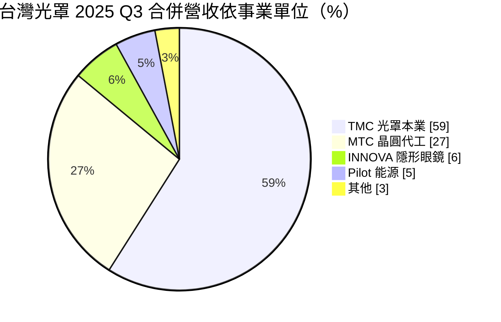
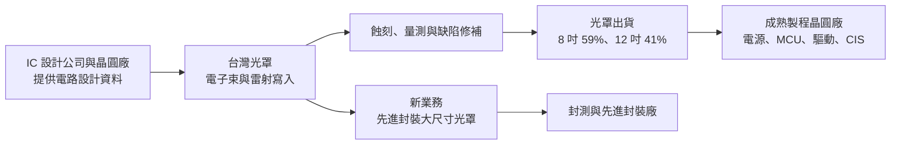
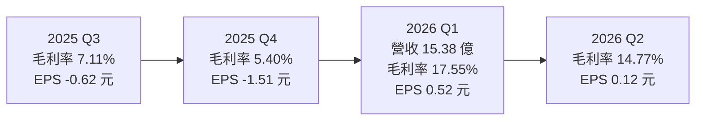
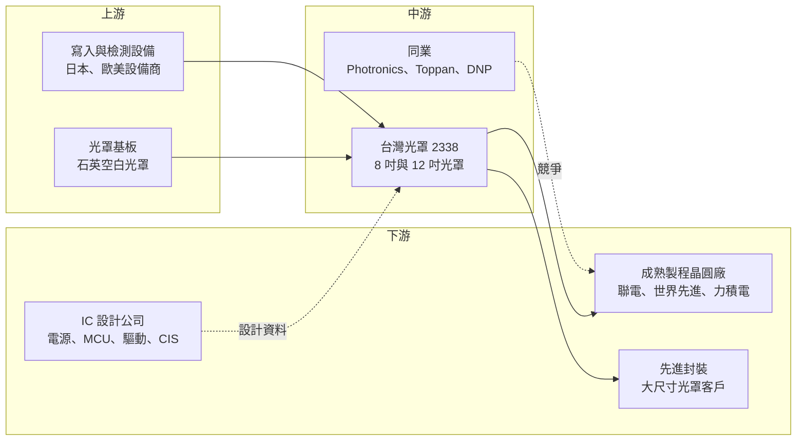

# 2338 光罩

> 上市｜[[產業索引-半導體業|半導體業]]｜上市（櫃）日期 1995/04/17

# 第一章：企業模式與商業藍圖

> [!info] 撰寫說明
> 本文由 Claude 依公開資料整理，架構比照 [[2330台積電]] 的四章研究，資料截至 2026-10-07。財務數字來源：poorstock 法說摘要、旺得富（中時）、工商時報、科技新報、優分析、HiStock 利潤比率、Yahoo 股市季 EPS、nStock；產業描述為整理性內容，尚未逐條比對原始文件。#待校對

在評估單一個股的長期投資價值時，首要步驟是拆解企業的底層獲利邏輯。本章針對台灣光罩（股票代號：2338，以下簡稱台灣光罩）的商業模式進行定性分析，說明台灣第一家專業[[光罩]]廠，如何在連續虧損後重新聚焦本業，並嘗試切入先進封裝光罩。

## 一、核心定位：台灣最早的獨立光罩廠

台灣光罩成立於 1988 年，是台灣第一家專業光罩製造商。光罩是晶片製造的「底片」：晶圓廠每一道微影製程，都要用光罩把電路圖形投影到晶圓上，一顆晶片往往需要數十片光罩。

光罩市場分成兩類：

* **自有光罩廠（Captive）：** 台積電、三星、英特爾等大廠自己做先進製程光罩。
* **獨立光罩廠（Merchant）：** 替其他晶圓廠與 IC 設計公司製作光罩，台灣光罩屬於此類，客戶集中在[[成熟製程]]與[[特殊製程]]。

依 poorstock 整理的法說資料，台灣光罩的光罩產品以 8 吋為主，但 12 吋比重由 2024 年的 34% 提升到 2025 年的 41%。製程技術則從 65/55 奈米往 40 奈米、28 奈米推進。

過去幾年公司大舉多角化，旗下有晶圓代工、封裝、隱形眼鏡、能源、3D 列印等子公司，結果多數子公司虧損，拖累集團連續七季淨虧損。2026 年起公司明確轉向「聚焦本業」，第一季終於轉虧為盈。

## 二、終端應用／產品板塊：本業光罩占六成

依 poorstock 整理，2025 年第三季合併營收依事業單位如下：

光罩本業依客戶的晶片應用，2025 年結構為：電源管理 IC（PMIC）38%、[[MCU]] 21%、驅動 IC 13%、影像感測器（[[CIS]]）13%、砷化鎵 6%、其他 6%。也就是說，台灣光罩的客戶主要是做電源、控制與顯示晶片的成熟製程廠，而不是 AI 先進製程。

地區上，台灣占 45%、中國 26%、東北亞 17%、東南亞 12%。中國比重由 2024 年的 35% 降到 26%，反映中國本土光罩廠的價格競爭。

## 三、資本轉化邏輯（營運模式）：接單即客製、設備決定能力

* **每片光罩都是客製品：** 光罩依客戶設計一片一片製作，不能大量預先生產。客戶每次改版、每次新設計定案（tape-out），都會帶來新的光罩訂單，因此光罩需求和 IC 設計活動的熱度高度相關。
* **設備與製程節點決定市場：** 寫入機與檢測設備昂貴，能做到哪個製程節點，就決定能接哪些客戶。台灣光罩 40 奈米已完成客戶驗證、預計 2026 年下半年量產；28 奈米關鍵設備已到位，目標年底完成驗證、2027 年第一季貢獻營收。
* **[[產能利用率]]：** 依旺得富報導，2026 年第一季產能利用率超過 90%，本業已接近滿載。

## 四、企業長期藍圖：聚焦本業、處分資產、切入先進封裝

* **[[先進封裝]]大尺寸光罩：** 總經理陳立惇表示，公司已布局 AI 相關供應鏈，包括先進封裝製程與大尺寸光罩（14 吋），相關資本支出約 3 至 4 億元，預期 2026 年下半年至 2027 年開始顯著貢獻營收。AI 晶片封裝的中介層（[[Interposer]]）與重布線層需要大尺寸光罩，是傳統光罩廠少數能參與 AI 的切入點。
* **處分竹南六廠：** 依工商時報報導，董事會通過以稅前 28 億元把竹南六廠出售給 [[3711日月光投控]] 旗下的矽品，預計處分利益約 18.24 億元，約貢獻稅前 EPS 6.38 元。該廠房於 2020 年 7 月以 10.38 億元購入。
* **財務結構改善：** 2026 年 3 月完成現金增資，加上處分資產，有助於改善流動比率與償債壓力。
* **2026 年目標：** 本業營收成長 10% 至 20%。

# 第二章：護城河深度與競爭優勢

在長期價值投資中，「護城河」指企業抵禦競爭、維持超額利潤的保護機制。本章分析台灣光罩在獨立光罩市場的位置，以及中國競爭者對它的衝擊。

## 一、護城河的核心組成要素

* **1. 客戶設計資料的信任：** 光罩廠握有客戶完整的電路設計資料，智慧財產保護非常重要。台灣 IC 設計公司長期與台灣光罩合作，信任關係是外來者難以短期建立的。
* **2. 地理就近與交期：** 成熟製程晶圓廠集中在台灣，光罩廠就近服務可縮短改版與重製的時間。
* **3. 製程經驗與修補能力：** 光罩缺陷修補與量測需要長期經驗，[[良率]]直接影響客戶晶圓的良率。

整體而言，台灣光罩的護城河屬「窄護城河」：在台灣本地成熟製程市場有地位，但面對國際大廠與中國補貼廠商時，規模與價格都不占優勢。

## 二、全球主要競爭對手格局

| 對手 | 定位 | 對台灣光罩的威脅 |
|---|---|---|
| Photronics（美國，含台灣子公司） | 全球最大獨立光罩廠之一 | 在台灣設廠，直接搶本地客戶 |
| Toppan、大日本印刷（DNP） | 日系光罩大廠 | 技術與規模領先，涵蓋較先進節點 |
| 中國光罩廠（清溢光電等） | 政府補貼、低價擴產 | 使台灣光罩中國營收比重由 35% 降至 26% |
| [[2330台積電]]、[[005930三星電子]] 自有光罩廠 | 先進製程光罩自製 | 先進製程光罩幾乎不外包 |

## 三、優勢轉化：守得住、守不住與觀察重點

* **守得住：** 台灣本地成熟製程客戶的 8 吋與 12 吋中階光罩。2026 年第一季利用率超過九成，代表本業需求穩定。
* **守不住：** 中國市場。中國光罩廠在價格與補貼上競爭，台灣光罩在中國的營收比重已明顯下滑，2025 年本業[[毛利率]]也因此大幅縮水。
* **觀察重點：** 第一，40 奈米與 28 奈米能否如期量產；第二，先進封裝大尺寸光罩在 2026 年下半年能否開始貢獻；第三，處分資產後，非本業子公司是否持續收斂。

# 第三章：財務體質與盈利規模

資料日期：2026-10-07。數字取自 HiStock、Yahoo 股市、旺得富與 poorstock 整理，表格是撰寫當時的快照；最新月營收、毛利率、累計 EPS 由自動排程寫在本筆記的屬性欄位（月營收、毛利率、累計EPS 等）。#待校對

財務報表是檢驗護城河是否真實存在的最終標準。本章用三率、ROE、現金流與資本報酬，檢視台灣光罩從連續虧損到轉盈的過程。

## 一、獲利能力的基石：三率

| 項目 | 2024 全年 | 2025 全年 | 2026 Q1 | 2026 Q2 |
|---|---|---|---|---|
| 營收（新台幣） | 未查得 | 前 10 月 51.02 億 | 15.38 億 | 未查得 |
| [[毛利率]] | 季度介於 17.9% 至 19.9% | 季度介於 5.4% 至 11.2% | 17.55% | 14.77% |
| [[營業利益率]] | 季度介於 -0.8% 至 7.3% | 季度介於 -14.8% 至 -7.1% | 0.93% | -0.80% |
| EPS（元） | -2.21（四季加總） | -5.18（四季加總） | 0.52 | 0.12 |

* **[[毛利率]]：** 2025 年前三季合併毛利率只有 8.6%，比前一年同期少 10.4 個百分點，原因包括中國價格競爭與子公司虧損。2026 年第一季回到 17.55%，第二季又降到 14.77%。
* **[[營業利益率]]：** 2025 年每一季都是營業虧損，2026 年第一季勉強轉正（0.93%），第二季又小幅轉負（-0.80%），本業獲利仍在損益兩平附近。
* **[[淨利率]]與業外：** 2026 年第一季稅後淨利 1.49 億元，其中業外收益約 1.54 億元，由前一季的業外損失 2.87 億元大幅改善。換句話說，第一季轉盈有相當比例來自業外，而非本業。
* **未來一次性利益：** 竹南六廠處分利益約 18.24 億元，認列後將大幅墊高當期 EPS，但屬一次性收益，評估本業時應排除。

## 二、[[ROE]]：資本效率

台灣光罩 2024 與 2025 年都是虧損，ROE 為負值。2026 年上半年 EPS 合計 0.64 元，加上處分利益，2026 年 ROE 可能轉正，但主要來自一次性收益（推估）。

## 三、資本支出與自由現金流

* **[[CapEx]]：** 先進封裝大尺寸光罩相關投資約 3 至 4 億元，28 奈米設備已到位；公司另有新廠區 Fab 7 規劃，金額未查得。
* **流動性：** 依 poorstock 整理，2025 年流動比率由 77% 降至 63%，一年內到期長期借款增加至 16.64 億元，是公司 2026 年辦理現金增資與處分廠房的主要背景。
* **股利：** 2025 年度未配發股利，近五年平均現金股利 1.2 元。

## 四、[[ROIC]] 與 [[WACC]]：價值創造利差

2024 至 2025 年營業虧損，ROIC 為負，明顯低於 WACC，屬於價值毀損期。2026 年本業回到損益兩平附近，處分非核心資產後，投入資本將縮小並更集中於光罩本業。若 40/28 奈米與先進封裝光罩如期貢獻，ROIC 才有機會回到資金成本之上（推估）。

# 第四章：總體風險與地緣政治

任何企業都無法脫離宏觀環境獨立存在。本章分析台灣光罩未來必須面對的地緣政治、產業週期、營運與技術風險。

## 一、地緣政治

* **中國光罩國產化：** 中國以補貼扶植本土光罩廠，對中國客戶的光罩逐步改由本土供應，台灣光罩的中國營收比重已由 35% 降至 26%，且可能持續下降。
* **供應鏈重組：** poorstock 整理指出，新加坡與美國的光罩競爭者崛起，國際客戶在「台灣加一」策略下，可能把部分光罩訂單分散到其他地區。
* **設備進口：** 高階寫入與檢測設備主要來自日本與歐美，出口管制或交期延長會影響擴產進度。

## 二、產業週期與市場結構

* **成熟製程週期：** 客戶集中在電源管理、MCU、驅動 IC，這些晶片的庫存調整會減少新設計案，進而減少光罩訂單。
* **IC 設計活動：** 光罩需求取決於新設計定案的數量，景氣不佳時 IC 設計公司延後新案，光罩廠首當其衝。

## 三、營運環境的隱性風險

* **多角化包袱：** 過去投資的封裝、隱形眼鏡、能源、3D 列印等子公司多數虧損，部分事業營收在 2025 年第三季已歸零，後續仍可能有資產減損。
* **財務槓桿：** 流動比率偏低，若處分資產或增資進度不如預期，可能面臨償債壓力。
* **管理層預期落差：** poorstock 指出，管理層對營運的樂觀說法與實際財報有落差，投資人宜以實際數字驗證。

## 四、科技或法規演進

* **製程節點追趕：** 獨立光罩廠在先進製程的市場有限，台灣光罩目前推進到 28 奈米，若成熟製程客戶也陸續升級到更先進節點，公司必須持續投資設備。
* **[[EUV]] 光罩：** 先進製程使用的 EUV 光罩技術門檻極高，幾乎由晶圓大廠自製，台灣光罩不在此市場。
* **先進封裝光罩的不確定性：** 先進封裝光罩規格仍在演進，若客戶改用無光罩或其他圖形化技術，相關投資的回收可能受影響。

# 專有名詞解析

## 半導體

- **[[光罩]]**：刻有電路圖形的石英玻璃板，晶圓廠在微影製程中用它把電路投影到晶圓上，每一層電路需要一片。
- **[[成熟製程]]**：一般指 28 奈米及更大線寬的製程，技術成熟、設備多已折舊，主要用於電源、驅動、車用與物聯網晶片。
- **[[特殊製程]]**：在成熟線寬上加入高壓、嵌入式記憶體、射頻等特殊功能的製程平台，差異化程度高於一般邏輯製程。
- **[[CIS]]**：CMOS 影像感測器，把光線轉成電子訊號，用於手機相機、車用鏡頭與監控設備。
- **[[先進封裝]]**：把多顆晶片以中介層、混合鍵合等方式高密度整合的封裝技術，例如 CoWoS、SoIC。
- **[[Interposer]]**：中介層，放在晶片與載板之間、內含細微線路的矽片，用來連接並排的多顆晶片。
- **[[EUV]]**：極紫外光微影，使用 13.5 奈米波長光源，是 7 奈米以下先進製程的關鍵技術。
- **[[良率]]**：合格產品占總產出的比例，光罩缺陷會直接降低客戶晶圓的良率。

## 應用

- **[[MCU]]**：微控制器，把處理器、記憶體與周邊介面整合在一顆晶片上，用於家電、車用與工業控制。

## 金融

- **[[產能利用率]]**：實際產出占總產能的比例，光罩廠與晶圓廠的毛利率高度取決於此數字。

# 核心供應鏈

## 1. 上游：基板與設備
- 空白光罩基板：日系材料商（名稱未查得）
- 寫入與量測設備：日本與歐美設備商（名稱未查得），檢測設備常見供應商包括 [[KLAC科磊]]

## 2. 中游：台灣光罩本身與同業
- 國際獨立光罩廠：Photronics、Toppan、大日本印刷
- 中國光罩廠：清溢光電等
- 晶圓大廠自有光罩：[[2330台積電]]、[[005930三星電子]]

## 3. 下游：主要客戶群
- 成熟製程晶圓廠：[[2303聯電]]、[[5347世界先進]]、[[6770力積電]]（產業常見客戶類型，個別客戶公司未公開）
- 電源管理、MCU、驅動 IC、CIS 設計公司
- 竹南六廠買方：矽品（[[3711日月光投控]]旗下）

## 最新新聞
<!-- news:start -->
<!-- news:end -->

## 相關連結
- [公開資訊觀測站](https://mopsov.twse.com.tw/mops/web/t05st03?step=1&firstin=1&co_id=2338)
- [Goodinfo](https://goodinfo.tw/tw/StockDetail.asp?STOCK_ID=2338)
- [Yahoo 股市](https://tw.stock.yahoo.com/quote/2338)
- [鉅亨網新聞](https://www.cnyes.com/twstock/2338/news)
