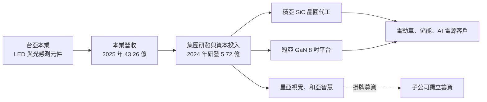
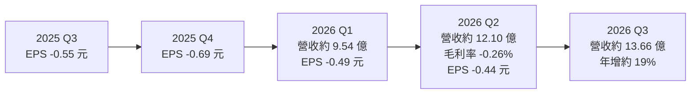
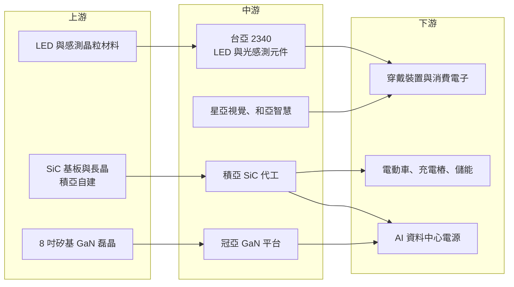

# 2340 台亞

> 上市｜[[產業索引-半導體業|半導體業]]｜上市（櫃）日期 1995/05/02

# 第一章：企業模式與商業藍圖

> [!info] 撰寫說明
> 本文由 Claude 依公開資料整理，架構比照 [[2330台積電]] 的四章研究，資料截至 2026-10-07。財務數字來源：HiStock 月營收、Yahoo 股市季 EPS、nStock 公司資料、鉅亨號（台亞股東會與半導體展報導）、自由時報、優分析、理財周刊；產業描述為整理性內容，尚未逐條比對原始文件。#待校對

在評估單一個股的長期投資價值時，首要步驟是拆解企業的底層獲利邏輯。本章針對台亞半導體（股票代號：2340，以下簡稱台亞）的商業模式進行定性分析，說明一家光電元件老廠，為何選擇以本業現金流「孵化」多家第三代半導體與感測子公司，以及這個策略目前的代價。

## 一、核心定位：光電感測元件本業加上控股孵化平台

台亞成立於 1983 年 12 月，資本額約 43.86 億元，營業項目為半導體元件的製造與銷售，以及系統產品的研發設計。本業產品是 [[LED]] 發光元件與光電感測元件，例如光感測器（[[PD]]）、紅外線元件等。依理財周刊報導，市場傳出台亞取得蘋果 AirPods Pro 3 的 PD 光感測器訂單（公司未證實）。

台亞今天的定位更像一個「集團控股平台」。公司在股東會上把策略形容為「孵化小金雞」，明確拒絕價格戰，改以技術差異化的子公司各自發展：

* **星亞視覺（7753）：** 視覺感測與顯示系統，2024 年 EPS 4.22 元，是集團第一家掛牌的子公司。
* **和亞智慧（7825）：** 集團的智慧製造部門，2024 年 EPS 2.81 元，已通過櫃買中心審議。
* **積亞半導體（7787）：** [[SiC]] 功率元件晶圓代工，製造[[蕭特基二極體]]與 [[MOSFET]]，650V、1200V、1700V 已完成量產認證。
* **冠亞半導體：** 8 吋 [[GaN]] 功率元件製程平台，D-mode 650V 已完成，E-mode 平台預計 2025 年下半年完成。

這個結構的優點是讓每個事業可以獨立募資、上市；缺點是第三代半導體子公司處於燒錢期，折舊與研發費用全數反映在台亞的合併報表上。

## 二、終端應用／產品板塊：光電本業、感測與第三代功率半導體

公司未公開產品別營收比重（未查得），以下依業務性質說明：

* **光電與感測元件（本業）：** LED 發光元件、光感測器與紅外線元件，用於消費電子、穿戴裝置、工業與車用感測。
* **視覺感測系統（星亞）：** 以影像感測與顯示系統為主，2024 年 7 月新一代顯示系統開始量產，訂單能見度約 6 個月。
* **SiC 功率元件（積亞）：** 應用在電動車、充電樁、太陽能、儲能與 AI 伺服器電源。
* **GaN 功率元件（冠亞）：** 高頻、高效率電源，應用在快充、資料中心電源與通訊設備。
* **醫療感測：** 台亞開發高精度非侵入式連續血糖監測技術（HUSD），屬長期題材。

依理財周刊報導，台亞把成長動能歸納為三條：AI 資料中心的電源與感測元件、電動車與充電樁的耐高壓元件，以及穿戴裝置的光感測器。

## 三、資本轉化邏輯（營運模式）：本業現金流餵養子公司

* **折舊先行：** 積亞 2024 年折舊費用 3.65 億元，比前一年倍增；冠亞 2024 年研發投入 2.93 億元。這些成本在客戶量產之前就已發生。
* **虧損的來源：** 公司在股東會說明，2024 年合併虧損約 12.6 億元，其中 9.67 億元來自子公司投資與研發。這代表台亞本業並非主要虧損來源，問題在於子公司的投入期。
* **子公司上市的資金循環：** 星亞與和亞掛牌後可以獨立募資，降低母公司持續注資的壓力，這是「孵化」策略能否走下去的關鍵。

## 四、企業長期藍圖：第三代半導體雙箭頭

* **SiC 與 GaN 雙平台：** 鉅亨號報導以「第三代半導體雙箭頭到位」描述積亞與冠亞的布局。積亞已具備 SiC 長晶與製造設備，冠亞以 8 吋 GaN 製程切入高頻電源。
* **一站式功率半導體服務：** 2025 年半導體展上，台亞以集團統籌公司的角色，對外提供從 SiC、GaN 晶圓代工到元件的一站式平台。
* **合作與補助：** 依 Yahoo 股市轉載的法說報導，台亞獲經濟部補助並與日本 NTT 合作（合作細節未查得）。

# 第二章：護城河深度與競爭優勢

在長期價值投資中，「護城河」指企業抵禦競爭、維持超額利潤的保護機制。本章分析台亞本業與子公司各自的競爭位置，以及第三代半導體市場的競爭強度。

## 一、護城河的核心組成要素

台亞目前的護城河尚不明確，較接近「正在建構中」的狀態：

* **1. 光感測元件的客戶認證：** 若穿戴裝置光感測器的訂單屬實，代表台亞通過國際品牌的嚴格認證，這是光電元件廠少數能建立轉換成本的途徑。
* **2. SiC 與 GaN 的製程平台：** 積亞已完成 650V 至 1700V 的量產認證，冠亞完成 GaN D-mode 650V。功率元件的認證週期長，先完成認證的業者能建立一定門檻。
* **3. 集團垂直整合：** 從光電元件、感測系統到功率半導體，集團可以對同一客戶提供多種產品（推估，實際綜效未查得）。

## 二、全球主要競爭對手格局

| 對手 | 定位 | 對台亞集團的威脅 |
|---|---|---|
| Wolfspeed、onsemi、意法半導體、英飛凌 | 全球 SiC 功率元件大廠，垂直整合基板到元件 | 規模、成本與車廠關係遠勝新進者 |
| [[3707漢磊]]、[[2342茂矽]] | 台灣 SiC 與功率元件晶圓代工 | 與積亞爭取同一批 IC 設計客戶 |
| [[2330台積電]]、[[5347世界先進]] | GaN 代工（台積電已宣布逐步退出 GaN 代工） | 世界先進等業者在 8 吋 GaN 具規模 |
| 中國 SiC 廠商 | 政策扶植、大幅擴產、價格低 | SiC 基板與元件價格快速下跌 |
| [[3714富采]]、[[2393億光]] 與國際光電大廠 | LED 與光感測元件 | 本業產品的價格競爭 |

## 三、優勢轉化：守得住、守不住與觀察重點

* **守得住：** 需要高可靠度認證的光感測元件與利基型 SiC 代工。這類產品量不大，但大廠不一定願意承接。
* **守不住：** 一般 LED 與標準感測元件的價格，以及 SiC 標準品的價格。中國 SiC 產能大幅開出，使 SiC 元件價格在 2024 至 2025 年明顯下滑（產業普遍現象），新進者很難靠規模取勝。
* **觀察重點：** 第一，積亞與冠亞何時能讓產能利用率提升、虧損收斂；第二，本業光感測元件在穿戴裝置與 AI 資料中心的出貨能否延續；第三，2026 年 6 月與 8、9 月營收年增 16% 至 34%，是否代表本業與子公司開始放量。

# 第三章：財務體質與盈利規模

資料日期：2026-10-07。數字取自 HiStock、Yahoo 股市與 nStock，表格是撰寫當時的快照；最新月營收、毛利率、累計 EPS 由自動排程寫在本筆記的屬性欄位（月營收、毛利率、累計EPS 等）。#待校對

財務報表是檢驗護城河是否真實存在的最終標準。本章用三率、ROE、現金流與資本報酬，檢視台亞在孵化子公司期間的財務壓力。

## 一、獲利能力的基石：三率

| 項目 | 2024 全年 | 2025 全年 | 2026 Q1 | 2026 Q2 | 2026 Q3 |
|---|---|---|---|---|---|
| 營收（新台幣） | 約 43.0 億（推算） | 43.26 億 | 約 9.54 億 | 約 12.10 億 | 約 13.66 億 |
| [[毛利率]] | 未查得 | 未查得 | 未查得 | -0.26% | 未公布 |
| [[營業利益率]] | 未查得 | 未查得 | 未查得 | -18.51% | 未公布 |
| EPS（元） | -1.17（四季加總） | -2.88（四季加總） | -0.49 | -0.44 | 未公布 |

註：季營收以 HiStock 月營收加總。2024 年營收由 2025 年年增 0.6% 回推。

* **[[毛利率]]：** 2026 年第二季合併毛利率為 -0.26%，代表營收連銷貨成本都無法完全支應。主因推估是 SiC 與 GaN 子公司的折舊與低稼動率，本業毛利被子公司虧損抵銷。
* **[[營業利益率]]：** -18.51%，研發與管理費用在營收規模不足時造成大幅營業虧損。
* **趨勢：** 每股虧損由 2025 年第二季的 -0.86 元，逐步收斂到 2026 年第二季的 -0.44 元；2026 年第三季營收年增約 19%，若毛利率轉正，虧損可望持續縮小（推估）。

## 二、[[ROE]]：資本效率

台亞自 2024 年起每季虧損，ROE 為負值。這是孵化策略的直接結果：股東權益持續被子公司虧損侵蝕，必須等子公司營收放量或掛牌募資，才能扭轉。

## 三、資本支出與自由現金流

* **[[CapEx]]：** 積亞的 SiC 長晶與製造設備已全面就位，冠亞的 8 吋 GaN 平台也已建置，大規模設備投資的高峰可能已過（推估）。
* **[[自由現金流]]：** 連續虧損加上設備投資，集團自由現金流推估為負，具體數字未查得。子公司掛牌募資是重要的資金來源。
* **股利：** 2025 年度未配發股利，近五年平均現金股利 0.9 元，主要是虧損前年度的配發。

## 四、[[ROIC]] 與 [[WACC]]：價值創造利差

目前 ROIC 為負，遠低於 WACC，集團處於價值消耗期。台亞的投資價值不在現階段的報酬率，而在於：子公司若成功掛牌或被市場重新評價，母公司持股價值可能高於帳面。這是典型的「控股折價與子公司價值」問題，需要逐一評估各子公司的前景。

# 第四章：總體風險與地緣政治

任何企業都無法脫離宏觀環境獨立存在。本章分析台亞未來必須面對的地緣政治、產業週期、營運與技術風險。

## 一、地緣政治

* **中國 SiC 產能：** 中國在 SiC 基板與元件大舉擴產，壓低全球價格，積亞若要在國際市場取得訂單，必須在品質與認證上明顯區隔。
* **美國關稅：** 台亞董事長在法說中表示「冷靜應對關稅風波」，穿戴裝置與電源產品若出口美國，關稅變化會影響客戶下單。
* **非中國供應鏈需求：** 反過來，國際車廠與電源廠希望建立中國以外的 SiC、GaN 供應來源，是台灣業者的機會。

## 二、產業週期與市場結構

* **電動車成長放緩：** SiC 需求高度依賴電動車，若電動車銷售成長放緩，SiC 產能過剩的情況會延長。
* **消費電子週期：** LED 與光感測元件依賴手機、穿戴裝置與家電，季節性與庫存調整明顯。

## 三、營運環境的隱性風險

* **持續虧損：** 自 2024 年起連續虧損，若子公司虧損收斂速度不如預期，可能需要增資或舉債，稀釋股東權益。
* **集團治理：** 多家子公司分別掛牌，母子公司間的交易與資源分配是否公平，需要持續觀察。
* **客戶集中：** 若穿戴裝置光感測器訂單屬實，單一國際品牌客戶的訂單變化會大幅影響本業。

## 四、科技或法規演進

* **SiC 與 GaN 技術路線：** SiC 正從 6 吋轉向 8 吋晶圓，GaN 則在高壓應用與 SiC 競爭。若積亞、冠亞的晶圓尺寸或製程落後於主流，競爭力會被削弱。
* **醫療法規：** 非侵入式血糖監測屬醫療器材，需要通過各國主管機關審查，時間長且結果不確定。

# 專有名詞解析

## 半導體

- **[[PD]]**：光電二極體，把光訊號轉成電流的感測元件，用於穿戴裝置的入耳偵測、心率與光通訊。
- **[[SiC]]**：碳化矽，屬第三代半導體材料，耐高壓、耐高溫，用於電動車與高功率電源。
- **[[GaN]]**：氮化鎵，屬第三代半導體材料，開關速度快，常用於快充與資料中心電源。
- **[[MOSFET]]**：金屬氧化物半導體場效電晶體，用電壓控制電流開關，是電源轉換最常用的功率元件。
- **[[蕭特基二極體]]**：以金屬與半導體接面構成的二極體，切換速度快、壓降低，英文簡稱 SBD。

## 應用

- **[[EV]]**：電動車，以電池驅動馬達的車輛，是 SiC 功率元件最大的應用市場。

## 金融

- **[[毛利率]]**：營收扣除銷貨成本後的毛利占營收比例，負值代表售價不足以支應直接成本。
- **[[營業利益率]]**：營業利益占營收的比例，代表扣除研發、管理與銷售費用後本業的獲利能力。

## 產業

- **[[LED]]**：發光二極體，通電後發光的半導體元件，用於照明、顯示、感測與紅外線傳輸。

# 核心供應鏈

## 1. 上游：材料與基板
- SiC 長晶與基板：積亞自建；台灣同業 [[6488環球晶]] 亦供應 SiC 基板（非台亞已證實供應商）
- GaN 磊晶：國內外磊晶廠（名稱未查得）

## 2. 中游：台亞集團
- 母公司：台亞，LED 與光感測元件
- 子公司：星亞視覺（7753）、和亞智慧（7825）、積亞半導體（7787）、冠亞半導體

## 3. 下游：終端應用
- 穿戴裝置光感測器：市場傳聞為 [[AAPL蘋果]] AirPods Pro 3（公司未證實）
- 電動車、充電樁、太陽能與儲能電源廠
- AI 資料中心電源

## 4. 同業
- 台灣功率半導體代工：[[3707漢磊]]、[[2342茂矽]]
- 國際 SiC 大廠：Wolfspeed、onsemi、意法半導體、英飛凌

## 最新新聞
<!-- news:start（自動產生，請勿手動編輯此範圍） -->
- 2026-10-07 📰 媒體 19:50｜營收速報 - 台亞(2340)9月營收4.97億元年增率高達34.27％｜[鉅亨網](https://news.cnyes.com/news/id/6623950)

完整紀錄：[[2340台亞 新聞]]
<!-- news:end -->

## 相關連結
- [公開資訊觀測站](https://mopsov.twse.com.tw/mops/web/t05st03?step=1&firstin=1&co_id=2340)
- [Goodinfo](https://goodinfo.tw/tw/StockDetail.asp?STOCK_ID=2340)
- [Yahoo 股市](https://tw.stock.yahoo.com/quote/2340)
- [鉅亨網新聞](https://www.cnyes.com/twstock/2340/news)
