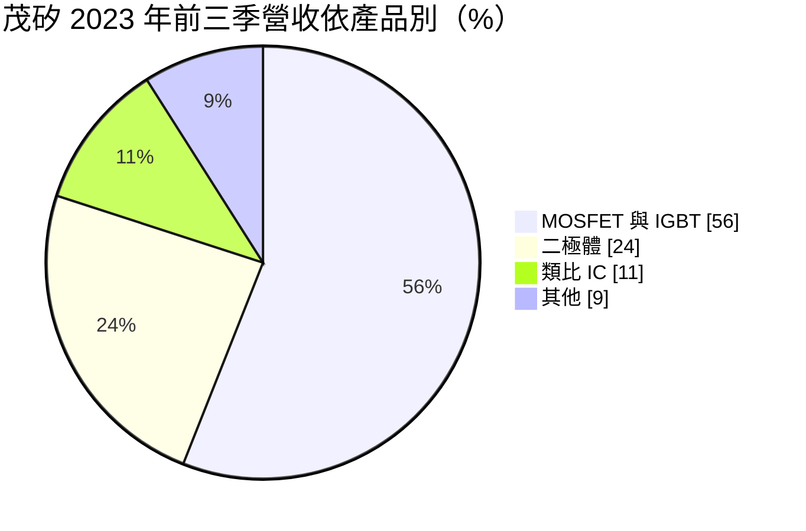
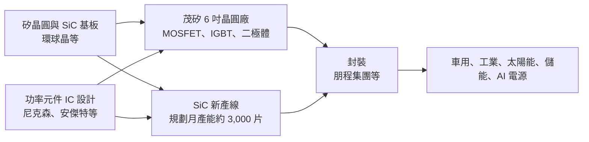
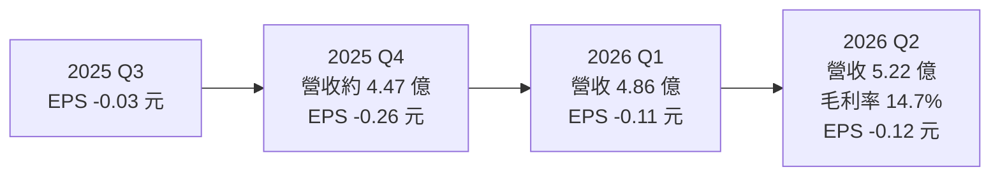
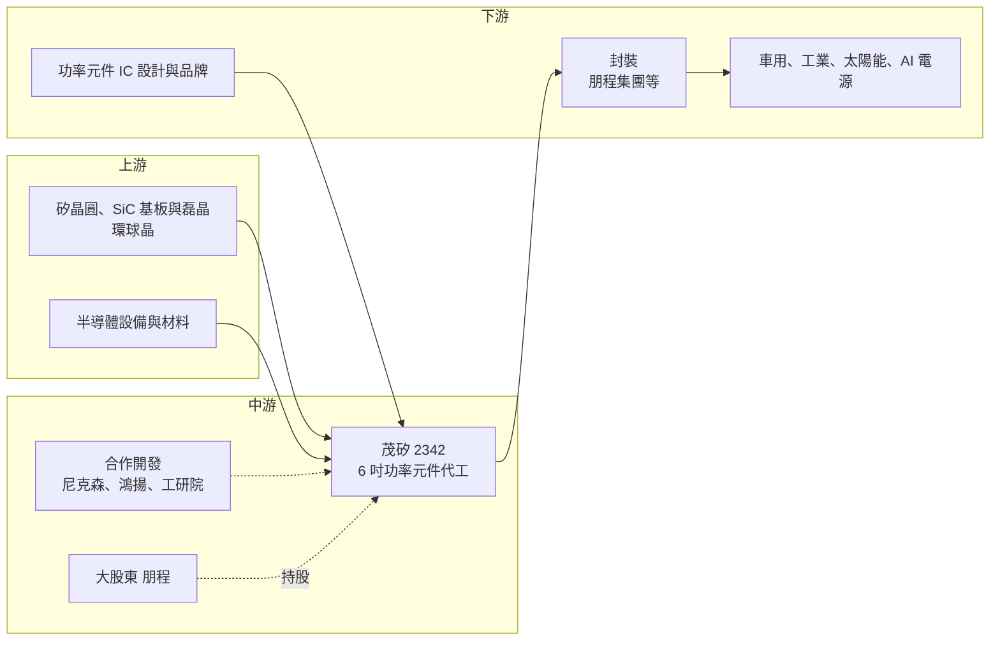

# 2342 茂矽

> 上市｜[[產業索引-半導體業|半導體業]]｜上市（櫃）日期 1995/09/19

# 第一章：企業模式與商業藍圖

> [!info] 撰寫說明
> 本文由 Claude 依公開資料整理，架構比照 [[2330台積電]] 的四章研究，資料截至 2026-10-07。財務數字來源：旺得富（中時）2025 年報與股東會報導、工商時報 2026 年第一季財報報導、理財周刊、富果研究法說整理、nStock、Yahoo 股市季 EPS；產業描述為整理性內容，尚未逐條比對原始文件。#待校對

在評估單一個股的長期投資價值時，首要步驟是拆解企業的底層獲利邏輯。本章針對茂矽電子（股票代號：2342，以下簡稱茂矽）的商業模式進行定性分析，說明一家早年的 DRAM 廠，如何轉型為小型功率半導體代工廠，並在 [[SiC]] 浪潮中尋找第二成長曲線。

## 一、核心定位：專注功率元件的 6 吋晶圓代工

茂矽早年以 DRAM 起家，經歷記憶體產業的整併與重整後，轉型為專注[[功率半導體]]元件與電源管理 IC 的晶圓代工廠，資本額約 15.75 億元。依理財周刊報導，大股東是車用整流元件廠 [[8255朋程]]，朋程集團承接後段封裝，旗下 IC 設計子公司安傑特也與茂矽形成上下游關係。

茂矽的產品包括功率 [[MOSFET]]、[[IGBT]]、類比 IC 與蕭特基二極體，應用在電腦、螢幕、手機電池、工具機、LED 照明與汽車電子。它的競爭策略是：

* **6 吋廠的利基代工：** 大型晶圓廠已轉向 8 吋與 12 吋，6 吋功率元件的代工需求由茂矽、漢磊等少數業者承接。依理財周刊報導，月產能約 4.7 萬片。
* **車用為主要支撐：** 富果整理的法說資料指出，車用產品營收比重達 47%（2023 年前三季）。
* **新世代產品：** Field-Stop IGBT（[[FS-IGBT]]）已部分量產、部分驗證中，SiC MOSFET 涵蓋 650V 到 3300V，是未來成長引擎。

## 二、終端應用／產品板塊：MOSFET 與 IGBT 過半

依富果整理的法說資料，茂矽 2023 年前三季的產品結構如下（較新的產品別比重未查得）：

* **MOSFET 與 IGBT：** 電源開關與馬達驅動的核心元件，車用、工業與太陽能逆變器都需要。
* **二極體：** 整流與保護用途，與大股東朋程的車用整流業務相關。
* **類比 IC：** 電源管理 IC，屬於較少量但附加價值較高的產品。
* **新產品：** 2025 年新產品占營收 16.8%，公司預期 2026 年持續提高。近兩年開發 32 家新客戶，日韓占 34%、台灣 25%、中國 21%、歐美 18%。

## 三、資本轉化邏輯（營運模式）：已折舊 6 吋廠加上新 SiC 產線

* **舊廠的成本優勢：** 6 吋廠設備多已折舊，[[產能利用率]]高時毛利率可以維持，利用率下降時固定成本壓力相對有限。2025 年上半年稼動率逾 90%、下半年約 85%，全年出貨 54 萬片、年增 9.6%。
* **SiC 新線的投資：** SiC 需要新的高溫製程設備，茂矽與尼克森、鴻揚半導體、工研院合作開發，SiC 新製程規劃月產能約 3,000 片。新產線在量產前會先帶來折舊與研發費用。
* **客戶結構：** 以 IC 設計公司與功率元件品牌為主，茂矽代工晶圓後交由封裝廠完成。

## 四、企業長期藍圖：國產 SiC 供應鏈與 AI 800V 電源

* **納入國產 SiC 供應鏈：** 依理財周刊報導，2026 年 9 月 SEMICON Taiwan 期間，經濟部宣布國產功率半導體供應鏈計畫，茂矽被納入「國產 SiC 供應鏈」負責晶圓代工，目標是因應 AI 資料中心 800V 直流供電的發展。
* **產品升級：** FS-IGBT、SiC MOSFET（650V、1200V、1700V、3300V）與 JFET，逐步取代傳統平面式 MOSFET 的營收比重。
* **管理層調整：** 依 2026 年 5 月報導，吳憲忠接任董事長，董事席次由 7 席減為 6 席。
* **轉虧為盈目標：** 依理財周刊稍早報導，公司曾以毛利率下半年提升到 20% 為目標，但 2026 年上半年仍在 15% 左右。

# 第二章：護城河深度與競爭優勢

在長期價值投資中，「護城河」指企業抵禦競爭、維持超額利潤的保護機制。本章分析茂矽在小型功率元件代工市場的位置，以及 SiC 新賽道的競爭格局。

## 一、護城河的核心組成要素

茂矽的護城河屬「窄護城河」，主要來自：

* **1. 6 吋功率製程的利基：** 6 吋功率元件屬於大廠不願投資、小廠又難以進入的市場。茂矽的舊廠設備已折舊，可以接受小量多樣的訂單。
* **2. 車用認證：** 車用占營收近半，車用功率元件需要長期可靠度驗證，一旦導入，客戶較少更換代工廠。
* **3. 朋程集團的上下游整合：** 大股東朋程承接後段封裝，並有 IC 設計子公司，集團內部可以形成設計、晶圓、封裝的完整鏈條（推估，實際內部交易比重未查得）。
* **4. 政策支持：** 納入國產 SiC 供應鏈計畫，可能帶來研發資源與國內系統廠的試用機會。

## 二、全球主要競爭對手格局

| 對手 | 定位 | 對茂矽的威脅 |
|---|---|---|
| [[3707漢磊]] | 台灣功率元件與 SiC、GaN 代工 | 定位最接近，SiC 與 GaN 布局較早 |
| [[5347世界先進]]、[[6770力積電]] | 8 吋功率與電源管理代工 | 規模大，可提供更低單位成本 |
| [[2340台亞]] 旗下積亞 | 台灣 SiC 晶圓代工 | 在 SiC 代工直接競爭 |
| 中國功率元件代工廠（華虹等） | 8 吋與 12 吋功率製程，政策扶植 | 以低價搶中國與新興市場客戶 |
| 英飛凌、意法半導體、onsemi | 功率元件 IDM | 主要自製，但也是茂矽客戶的競爭者 |

## 三、優勢轉化：守得住、守不住與觀察重點

* **守得住：** 6 吋車用與工業功率元件的長期訂單，以及需要台灣或非中國產地的日韓、歐美客戶。
* **守不住：** 一般消費性 MOSFET 與二極體的代工價格。2025 年毛利率由前一年的 20.69% 降到 14.87%，公司歸因於美國關稅與匯率波動造成客戶訂單萎縮，也反映中國低價競爭。
* **觀察重點：** 第一，SiC 何時通過客戶最終驗證並開始放量；第二，國產 SiC 供應鏈計畫能否帶來實際訂單；第三，毛利率能否回到 20% 以上、營業利益轉正。

# 第三章：財務體質與盈利規模

資料日期：2026-10-07。數字取自旺得富、工商時報、理財周刊、nStock 與 Yahoo 股市，表格是撰寫當時的快照；最新月營收、毛利率、累計 EPS 由自動排程寫在本筆記的屬性欄位（月營收、毛利率、累計EPS 等）。#待校對

財務報表是檢驗護城河是否真實存在的最終標準。本章用三率、ROE、現金流與資本報酬，檢視茂矽在功率元件低谷與 SiC 轉型期的財務狀況。

## 一、獲利能力的基石：三率

| 項目 | 2024 全年 | 2025 全年 | 2026 Q1 | 2026 Q2 |
|---|---|---|---|---|
| 營收（新台幣） | 約 18.94 億（推算） | 20.37 億 | 4.86 億 | 5.22 億 |
| [[毛利率]] | 20.69% | 14.87% | 未查得 | 14.7% |
| [[營業利益率]] | 2.39% | -4.27% | 約 -5.0%（推算） | 約 -4.3% |
| 稅後淨利 | 未查得 | -0.76 億 | -0.17 億 | -0.19 億 |
| EPS（元） | 0.58（四季加總） | -0.49 | -0.11 | -0.12 |

註：2024 年營收由 2025 年年增 7.56% 回推。2026 Q1 營業利益率以營業損失 2,452 萬元除以營收推算。

* **[[毛利率]]：** 2024 年 20.69%，2025 年降到 14.87%，2026 年第二季 14.7%，尚未回升。6 吋舊廠雖已折舊，但價格壓力與 SiC 新線的成本使毛利率維持低檔。
* **[[營業利益率]]：** 2025 年起轉為營業虧損，2026 年第一、二季的營業損失分別為 2,452 萬元與 2,245 萬元，虧損幅度不大，但仍未轉正。
* **營收趨勢：** 2026 年第一季營收年減 11.73%，第二季季增約 7%；7 月與 8 月營收分別年增 11.2% 與 3.95%，下半年營收有回溫跡象。

## 二、[[ROE]]：資本效率

2025 年與 2026 年上半年皆為虧損，ROE 為負值。依富果早期資料，茂矽每股淨值約 15 元（2023 年），以目前股價約 50 元計算，股價淨值比偏高，市場評價主要反映 SiC 與國產供應鏈的題材，而非現有獲利。

## 三、資本支出與自由現金流

* **[[CapEx]]：** 主要投入 SiC 機台設備與新製程，具體年度金額未查得。理財周刊報導公司預定 2026 年完成 SiC 機台建置。
* **[[自由現金流]]：** 營業虧損期間，加上 SiC 設備投資，自由現金流推估偏緊（具體數字未查得）。
* **股利：** 近五年平均現金股利 0.56 元，2025 年虧損，未配發股利。

## 四、[[ROIC]] 與 [[WACC]]：價值創造利差

2024 年營業利益率僅 2.39%，2025 年轉為虧損，ROIC 明顯低於 WACC。茂矽能否創造價值，取決於 SiC 產品能否以高於傳統矽元件的毛利率放量；若 SiC 價格持續被中國產能壓低，新投資的報酬率可能也不理想（推估）。

# 第四章：總體風險與地緣政治

任何企業都無法脫離宏觀環境獨立存在。本章分析茂矽未來必須面對的地緣政治、產業週期、營運與技術風險。

## 一、地緣政治

* **美國關稅：** 公司明確指出 2025 年虧損與美國關稅、匯率波動有關，客戶因關稅不確定性縮減訂單。
* **中國功率元件崛起：** 中國以政策扶植功率半導體自主化，中國客戶比重（新客戶中占 21%）可能逐步被本土代工廠取代。
* **國產化機會：** 國產 SiC 供應鏈計畫反映政府希望建立自主的功率半導體供應，對茂矽是政策面的支撐。

## 二、產業週期與市場結構

* **功率元件庫存循環：** 車用與工業功率元件在 2024 至 2025 年經歷庫存調整，訂單出現[[長鞭效應]]式的波動。
* **SiC 價格下跌：** 全球 SiC 產能快速擴張，SiC 元件價格下降，可能使新進代工廠在量產時面臨價格壓力。

## 三、營運環境的隱性風險

* **規模小：** 年營收約 20 億元，抗風險能力有限，單一大客戶流失就會明顯影響稼動率。
* **舊廠設備老化：** 6 吋廠設備使用年限長，維修與零件取得成本可能上升。
* **新產品認證時程：** SiC 與 FS-IGBT 的客戶驗證若延遲，新產線的折舊會持續拖累獲利。

## 四、科技或法規演進

* **晶圓尺寸轉換：** 功率元件產業正從 6 吋轉向 8 吋，SiC 也從 6 吋走向 8 吋。若茂矽長期停留在 6 吋，成本競爭力可能落後。
* **AI 資料中心 800V 直流供電：** 這是 SiC 與 [[GaN]] 的新應用，若技術路線偏向 GaN 而非 SiC，茂矽的 SiC 投資效益可能不如預期。

# 專有名詞解析

## 半導體

- **[[功率半導體]]**：負責電能轉換與控制的半導體元件，例如 MOSFET、IGBT、二極體，用於電源、馬達與電動車。
- **[[MOSFET]]**：金屬氧化物半導體場效電晶體，用電壓控制電流開關，是電源轉換最常用的功率元件。
- **[[IGBT]]**：絕緣閘雙極電晶體，結合 MOSFET 與雙極電晶體的優點，適合高電壓、大電流的馬達與逆變器。
- **[[FS-IGBT]]**：Field-Stop 結構的 IGBT，以場截止層降低導通損耗與切換損耗，是新一代 IGBT 主流設計。
- **[[SiC]]**：碳化矽，屬第三代半導體材料，耐高壓、耐高溫，用於電動車與高功率電源。
- **[[GaN]]**：氮化鎵，屬第三代半導體材料，開關速度快，常用於快充與資料中心電源。

## 金融

- **[[產能利用率]]**：實際投片量占總產能的比例，晶圓代工廠的毛利率高度取決於此數字。
- **[[毛利率]]**：營收扣除銷貨成本後的毛利占營收比例，反映產品本身的獲利能力。
- **[[長鞭效應]]**：終端需求的小幅變動，沿供應鏈往上游傳遞時被逐級放大，造成上游庫存與訂單劇烈波動。

# 核心供應鏈

## 1. 上游：晶圓與基板
- 矽晶圓、SiC 基板與磊晶層：[[6488環球晶]]

## 2. 中游：茂矽本身與合作夥伴
- 大股東與封裝夥伴：[[8255朋程]]（旗下 IC 設計子公司安傑特）
- SiC 合作開發：[[3317尼克森]]、鴻揚半導體、工研院
- 同業：[[3707漢磊]]、[[5347世界先進]]、[[6770力積電]]

## 3. 下游：客戶與應用
- 功率元件設計公司與品牌：日韓、台灣、中國、歐美客戶（名稱未查得）
- 終端應用：車用、工業、太陽能、儲能、AI 資料中心 800V 直流供電

## 最新新聞
<!-- news:start -->
<!-- news:end -->

## 相關連結
- [公開資訊觀測站](https://mopsov.twse.com.tw/mops/web/t05st03?step=1&firstin=1&co_id=2342)
- [Goodinfo](https://goodinfo.tw/tw/StockDetail.asp?STOCK_ID=2342)
- [Yahoo 股市](https://tw.stock.yahoo.com/quote/2342)
- [鉅亨網新聞](https://www.cnyes.com/twstock/2342/news)
