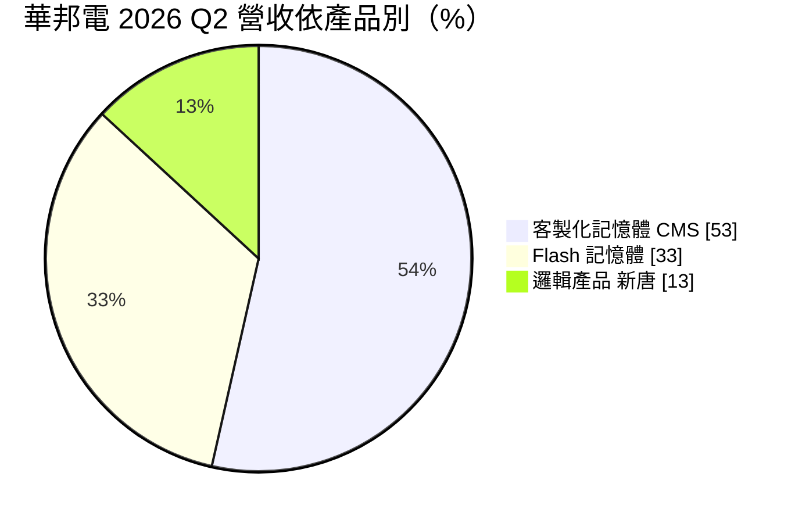
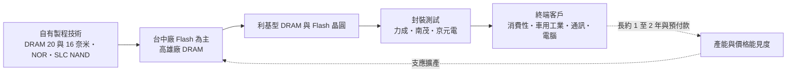
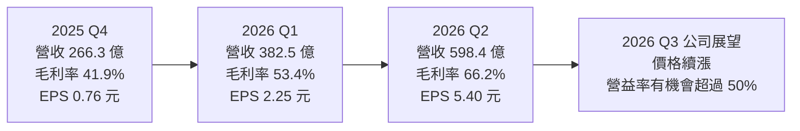
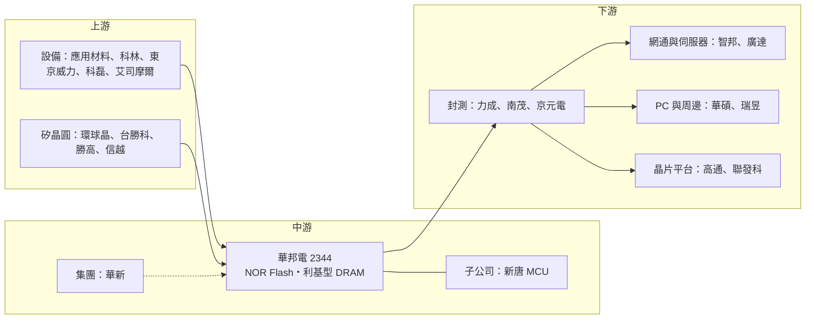

# 2344 華邦電

> 上市｜[[產業索引-半導體業|半導體業]]｜上市（櫃）日期 1995/10/18

# 第一章：企業模式與商業藍圖

> [!info] 撰寫說明
> 本文由 Claude 依公開資料整理，架構比照 [[2330台積電]] 的四章研究，資料截至 2026-10-07。財務數字來源：華邦電 2025 年第四季、2026 年第一季與第二季法說會相關報導（科技新報、優分析、財報狗、永豐金證券豐雲學堂、ETtoday 財經雲）；產業描述為整理性內容，尚未逐條比對原始文件。#待校對

在評估單一個股的長期投資價值時，首要步驟是拆解企業的底層獲利邏輯。本章針對華邦電子（股票代號：2344，以下簡稱華邦電）的商業模式進行定性分析，說明它如何以「利基型記憶體」避開三大廠的主戰場，以及子公司新唐帶來的邏輯產品業務如何影響合併財報。

## 一、核心定位：全球最大 NOR Flash 廠，兼營利基型 DRAM

華邦電隸屬華新麗華集團，總部位於台中科學園區，是台灣少數同時生產 [[DRAM]] 與 Flash 的記憶體 [[IDM]]。華邦電不與三星、SK 海力士、美光在主流 PC 與手機 DRAM 正面競爭，而是專注於容量較小、規格多樣、生命週期長的[[利基型記憶體]]，客戶遍及車用、工業、網通、消費性電子與 PC 周邊。

華邦電的定位有兩個關鍵：

* **NOR Flash 全球第一：** 華邦電穩居全球第一大 [[NOR Flash]] 供應商。NOR Flash 用於儲存開機程式碼與韌體，幾乎所有電子設備都需要，市場規模不大、多數大廠已退出，規模領先者具有成本與供貨優勢。
* **合併新唐：** 華邦電持有 IC 設計公司 [[4919新唐]] 過半股權並將其併入財報，新唐的 [[MCU]] 與邏輯 IC 構成華邦電的「邏輯產品」業務。因此華邦電的合併營收包含記憶體與邏輯兩大部分，2026 年第二季記憶體事業約占 86%。

## 二、終端應用／產品板塊：漲價讓 DRAM 躍居最大

2026 年第二季，記憶體漲價使營收結構明顯改變：

對照 2025 年全年，Flash 記憶體占 35%、邏輯產品占 34%、客製化記憶體 CMS 占 29%，可見一年之內 DRAM 相關的 CMS 比重大幅上升，邏輯產品則被稀釋。

* **客製化記憶體 CMS：** 利基型 DRAM，包括 DDR3、DDR4、LPDDR4 及客製化超高頻寬記憶體 [[CUBE]] 等，20 奈米製程產品快速成長。
* **Flash 記憶體：** 以 NOR Flash 為主，另有 [[SLC NAND]]。AI 伺服器、網通設備與車用電子帶動高容量 NOR Flash 需求。
* **邏輯產品：** 主要來自新唐的 MCU、電池管理與音訊等 IC。

依應用別（2025 年）：消費性電子 29%、車用與工業 27%、通訊 24%、電腦相關 20%，應用分布相當分散，沒有單一終端市場超過三成。

## 三、資本轉化邏輯：分散應用加上長約鎖量

* **台中廠：** 以 Flash 與部分 DRAM 為主。2025 年投資 46 億元、2026 年追加 24 億元，合計約 70 億元，月產能由 5 萬至 5.1 萬片提升至 5.7 萬至 5.8 萬片，第三季起新產能逐步開出，並保留 NOR 與 NAND 之間彈性調整的空間。
* **高雄廠：** DRAM 生產基地，首批設備於 2026 年 5 至 6 月進駐，目標開出 16 奈米製程產能，月產能規劃 1.5 萬片，年底前朝 2.5 萬片邁進。
* **高雄 Module B 擴建：** 第二季法說會宣布，預計 2027 年 1 月動工、2029 年投產。
* **[[長約]]與預付款：** 依 ETtoday 報導，約一半產能已以 1 至 2 年合約鎖定，部分客戶已在洽談 2029 至 2030 年產能，合約期間可能延長至 3 至 5 年、預付款比例 20% 至 30%。這種模式讓客戶分擔擴產資金，也提高華邦電的營收能見度。

## 四、企業長期藍圖：客製化 AI 記憶體與 NOR 規格升級

* **客製化 AI 記憶體：** 以 CUBE 等超高頻寬客製化 DRAM 切入[[邊緣 AI]] 裝置，避開與三大廠在 [[HBM]] 的正面競爭。
* **NOR Flash 規格升級：** AI 伺服器、車用 [[ADAS]] 與網通設備對高容量、高可靠度 NOR Flash 需求增加，華邦電以規模與產品線廣度擴大領先。
* **DRAM 製程推進：** 高雄廠 16 奈米產能開出，提升位元密度與成本競爭力。
* **長約化經營：** 把一半產能轉為長期合約並收取預付款，嘗試降低記憶體價格循環對獲利的衝擊。

# 第二章：護城河深度與競爭優勢

在長期價值投資中，「護城河」指企業抵禦競爭、維持超額利潤的保護機制。本章分析華邦電的護城河構成、國內外主要競爭對手，以及這些優勢在記憶體價格循環中能守住多少。

## 一、華邦電護城河的核心組成要素

華邦電的護城河屬於「窄到中等」，由四個要素組成：

* **1. NOR Flash 規模領先：** 全球 NOR Flash 市場規模不大，大廠多已退出，華邦電以最大產能與完整容量規格建立成本與供貨優勢。
* **2. 車用與工業的長期驗證：** 車用與工業客戶要求供貨 10 年以上、品質穩定，華邦電長期經營這些市場，一旦通過[[車規驗證]]就不易被替換。車用與工業占 2025 年營收 27%，是最大的營收來源之一。
* **3. 自有晶圓廠與技術：** 同時擁有 DRAM 與 Flash 製程與產能，能根據市場狀況在兩者之間調整。
* **4. 客製化能力：** CMS 與 CUBE 強調依客戶需求設計，比標準品有更高的轉換成本。

## 二、全球主要競爭對手格局

| 對手 | 主要產品 | 對華邦電的威脅 |
|---|---|---|
| [[2337旺宏]] | NOR Flash、SLC NAND、ROM | 高容量與車用 NOR 的主要對手 |
| 兆易創新（GigaDevice） | NOR Flash、MCU | 以中國市場與價格競爭 |
| 英飛凌（Cypress 產品線） | 車用與工業 NOR Flash | 在車用高可靠度市場競爭 |
| [[2408南亞科]] | 標準型與利基型 DRAM | 在 DDR4、LPDDR4 直接競爭，同樣布局客製化 AI 記憶體 |
| 長鑫存儲（CXMT） | 利基型與標準型 DRAM | 中國政策扶植，大量供應 DDR4 壓低價格 |
| 鎧俠（Kioxia） | NAND Flash | SLC NAND 市場的國際對手 |
| 意法半導體、恩智浦、瑞薩 | MCU | 新唐邏輯產品的國際大廠對手 |

## 三、優勢轉化：哪些市場守得住、哪些守不住

* **守得住：** 在記憶體供給緊張時，華邦電的 NOR Flash 與利基型 DRAM 成為客戶搶貨對象，2026 年第二季記憶體事業毛利率達 70.3%、[[產能利用率]] 100%，議價能力明顯提升。
* **守不住：** 利基型 DRAM 與 SLC NAND 本質上仍是商品，一旦三大廠或長鑫把產能轉回舊規格，價格可能迅速回落；NOR Flash 在中國市場則面臨兆易創新的價格競爭。
* **觀察重點：** 高雄廠 16 奈米 DRAM 產能爬坡進度、長約與預付款比重、CUBE 等客製化記憶體能否形成穩定營收，以及新唐邏輯事業能否擺脫低獲利。

# 第三章：財務體質與盈利規模

資料日期：2026-10-07。數字取自法說會相關財經報導（科技新報、優分析、財報狗、永豐金證券、ETtoday），表格是撰寫當時的快照；最新月營收、毛利率、累計 EPS 由自動排程寫在本筆記的屬性欄位（月營收、毛利率、累計EPS 等）。#待校對

財務報表是檢驗護城河是否真實存在的最終標準。本章用三率、ROE、資本支出與資本報酬，檢視華邦電在記憶體景氣循環中的獲利品質。

## 一、獲利能力的基石：三率

| 項目 | 2025 全年 | 2025 Q4 | 2026 Q1 | 2026 Q2 |
|---|---|---|---|---|
| 營收（新台幣） | 894.1 億 | 266.3 億 | 382.5 億 | 598.4 億 |
| [[毛利率]] | 35.0% | 41.9% | 53.4% | 66.2% |
| [[營業利益率]] | 未查得 | 未查得 | 約 32.8%（推算） | 48.4% |
| 歸屬母公司淨利 | 39.6 億 | 34.2 億 | 約 101 億（推算） | 243.2 億 |
| EPS（元） | 0.88 | 0.76 | 2.25 | 5.40 |

* **[[毛利率]]：** 2025 年營收年增 9.6%，EPS 由 2024 年的 0.14 元大增至 0.88 元；2025 年第一季仍虧損每股 0.24 元，下半年起受惠記憶體漲價轉強。2026 年第二季合併毛利率 66.2%，連續多季攀升。
* **記憶體事業單獨看：** 不含新唐，第二季營收約 517 億元，季增 72.8%，毛利率 70.3%，營業利益率 56.9%。CMS 營收季增 78%，位元出貨量季減約 10%，但綜合平均單價上漲超過 100%；Flash 營收季增 65%，位元出貨量增加 15% 至 16%。
* **[[營業利益率]]：** 2026 年第二季合併營業利益率 48.4%，新唐邏輯產品毛利率遠低於記憶體，拉低了合併數字。第一季營業利益率與淨利依第二季數字與季變化推算，屬約略值。
* **展望：** 2026 年第二季營收季增 56.4%、年增 184.7%，上半年 EPS 合計 7.65 元。公司預期第三季價格持續上漲，營業利益率有機會超過 50%，並估計 2027 年供需可能比 2026 年更緊。

## 二、[[ROE]]：資本效率

華邦電過去因利基型記憶體價格低迷與新唐獲利波動，ROE 長期偏低；2026 年記憶體漲價使獲利大幅跳升，ROE 隨之大幅提高（本次未查得具體數值）。以上半年 EPS 7.65 元觀察，2026 年單半年獲利已是 2025 年全年的八倍以上，ROE 有機會創下近年新高（推估）。

## 三、資本支出與自由現金流

* **[[CapEx]]：** 董事會於 2026 年 2 月通過全年資本支出 421 億元，約 95% 用於生產設備與產能擴充；第一季法說報導的全年擴產金額約 405 億元，兩者差異可能來自口徑不同。
* **[[自由現金流]]：** 2026 年獲利大增使營業現金流改善；長約預付款（20% 至 30%）若落實，可提前回收現金並降低擴產的財務壓力。
* **股利：** 華邦電過去配息金額隨獲利浮動，2024、2025 年獲利低，配息有限。2026 年獲利大增，後續股利可望提高，但同時面臨高雄廠擴產的大額資本支出（推估，本次未查得最新配息金額）。

## 四、[[ROIC]] 與 [[WACC]]：價值創造利差

利基型記憶體在景氣低谷時常常無法賺回資金成本，華邦電 2024 年 EPS 僅 0.14 元，當時 ROIC 推估低於 WACC。2026 年在價格大漲、產能滿載的情況下，ROIC 明顯高於 WACC（推估，具體數值未查得）。長約與預付款若能延續到 2029 年以後，將有助於拉高整個循環的平均 ROIC；反之若新產能開出時價格反轉，高雄廠的巨額投資會拉低資本報酬。

# 第四章：總體風險與地緣政治

任何企業都無法脫離宏觀環境獨立存在。本章分析華邦電未來必須面對的地緣政治、產業週期、營運與技術風險。

## 一、地緣政治風險

* **中國競爭與市場：** 中國兆易創新、長鑫存儲在國家政策支持下擴產，對 NOR Flash 與利基型 DRAM 價格形成長期壓力；同時中國也是重要的消費性與網通客戶市場。
* **美國出口管制與關稅：** 美國限制對中國供應先進記憶體與設備，一方面延緩中國對手的技術進展，另一方面也可能影響華邦電對中國客戶的出貨。
* **生產集中在台灣：** 晶圓廠位於台中與高雄，面臨兩岸風險與天災、水電等營運風險。

## 二、產業週期與市場結構風險

* **記憶體價格反轉：** 利基型記憶體價格波動劇烈。2026 年的高獲利來自 AI 帶動的供給緊張，若三大廠或中國業者擴產、AI 投資降溫，價格可能快速回落。
* **[[長鞭效應]]：** 記憶體漲價期間客戶提前備貨，訂單可能高於真實需求；價格見頂後，庫存去化會讓訂單快速萎縮。
* **終端需求被排擠：** 記憶體漲價推高消費性電子與網通設備成本，可能導致終端出貨減少。

## 三、營運環境的隱性風險

* **擴產執行：** 高雄廠 16 奈米 DRAM 爬坡、高雄 Module B 擴建與台中廠擴產同步進行，若[[良率]]或時程不如預期，成本將上升。
* **新唐邏輯事業：** 邏輯產品毛利率遠低於記憶體，若 MCU 市場競爭加劇或庫存調整，會拖累合併獲利。
* **長約風險：** 長約在價格上漲期保障出貨，但若價格反轉，客戶可能要求重新議價。
* **匯率：** 記憶體以美元報價為主，新台幣升值會壓縮台幣計價的獲利。

## 四、科技演進風險

* **製程追趕：** 華邦電的 DRAM 製程（20 奈米、16 奈米）落後三大廠多個世代，成本競爭力有限，必須靠客製化與利基市場彌補。
* **NOR Flash 替代：** 部分應用可能以其他記憶體技術取代 NOR Flash，長期需留意技術替代（推估）。
* **客製化 AI 記憶體路線：** CUBE 這類客製化方案需要與客戶共同設計，量產規模能否放大、能否在邊緣 AI 形成標準，仍有不確定性（推估）。

# 專有名詞解析

## 半導體

- **[[DRAM]]**：動態隨機存取記憶體，斷電後資料會消失，作為處理器運算時的主記憶體。
- **[[NOR Flash]]**：讀取速度快、可直接執行程式碼的快閃記憶體，容量較小，常用於存放開機程式與韌體。
- **[[SLC NAND]]**：每個記憶單元只存 1 位元的 NAND Flash，容量小但耐用度與可靠度高，常用於網通、工業與車用。
- **[[利基型記憶體]]**：容量較小、規格多樣、產品生命週期長的記憶體，例如 DDR3、DDR4 與 NOR Flash，主要供應工業、車用與網通。
- **[[CUBE]]**：華邦電的客製化超高頻寬 DRAM 方案，以垂直堆疊與寬介面提高頻寬，鎖定邊緣 AI 裝置。
- **[[HBM]]**：高頻寬記憶體，把多顆 DRAM 垂直堆疊並與 GPU 封裝在一起，是 AI 加速器的關鍵元件。
- **[[IDM]]**：垂直整合製造商，從晶片設計、晶圓製造到銷售都自己完成的半導體公司。
- **[[MCU]]**：微控制器，把處理器、記憶體與輸入輸出介面整合在一顆晶片，用於家電、工業與車用控制。
- **[[良率]]**：一片晶圓上合格晶片所占的比例，直接影響每顆晶片的成本。

## 應用

- **[[邊緣 AI]]**：在終端裝置本身執行 AI 運算，而不是把資料傳回雲端處理，可降低延遲與保護隱私。
- **[[ADAS]]**：先進駕駛輔助系統，例如車道維持與自動煞車，需要高可靠度的記憶體儲存演算法與韌體。
- **[[車規驗證]]**：車用晶片須通過 AEC-Q100 等可靠度測試與車廠認證，流程常需 2 至 3 年，因此轉換成本高。

## 金融

- **[[長約]]**：供應商與客戶簽訂一年以上的供貨合約，鎖定數量與價格區間，有時附帶預付款。
- **[[產能利用率]]**：實際投片量占總產能的比例，製造業者的毛利率高度取決於此數字。
- **[[長鞭效應]]**：終端需求的小幅變動，沿供應鏈往上游傳遞時被逐級放大，造成上游庫存與訂單劇烈波動。
- **[[自由現金流]]**：營業活動現金流減去資本支出，代表企業可自由用於配息、還債或併購的現金。

# 核心供應鏈

## 1. 上游：設備、材料與矽晶圓
- 半導體設備：[[AMAT應用材料]]、[[LRCX科林研發]]、[[8035東京威力科創]]、[[KLAC科磊]]、[[ASML艾司摩爾]]
- 矽晶圓：[[6488環球晶]]、[[3532台勝科]]、[[3436勝高]]、[[4063信越化學]]

## 2. 中游：華邦電本身與子公司
- 記憶體設計、製造與銷售
- 邏輯 IC 子公司：[[4919新唐]]
- 集團母公司：[[1605華新]]

## 3. 下游：封測與客戶
- 封裝測試：[[6239力成]]、[[8150南茂]]、[[2449京元電子]]
- 網通與伺服器：[[2345智邦]]、[[2382廣達]]
- PC 與周邊：[[2357華碩]]、[[2379瑞昱]]
- 晶片平台客戶：[[QCOM高通]]、[[2454聯發科]]

## 4. 同業與競爭者
- 國內：[[2337旺宏]]、[[2408南亞科]]
- 國外：[[005930三星電子]]、兆易創新、長鑫存儲、英飛凌

延伸閱讀：[[聯發科供應鏈]]

## 最新新聞
<!-- news:start（自動產生，請勿手動編輯此範圍） -->
- 2026-10-06 📰 媒體 13:00｜華邦電(2344)前三季營收已是去年全年2倍！記憶體還能旺多久？2027下半年可能迎來關鍵轉折｜[鉅亨網](https://news.cnyes.com/news/id/6622630)
- 2026-10-05 📰 媒體 18:50｜營收速報 - 華邦電(2344)9月營收282.49億元年增率高達256.67％｜[鉅亨網](https://news.cnyes.com/news/id/6621907)

完整紀錄：[[2344華邦電 新聞]]
<!-- news:end -->

## 相關連結
- [公開資訊觀測站](https://mopsov.twse.com.tw/mops/web/t05st03?step=1&firstin=1&co_id=2344)
- [Goodinfo](https://goodinfo.tw/tw/StockDetail.asp?STOCK_ID=2344)
- [Yahoo 股市](https://tw.stock.yahoo.com/quote/2344)
- [鉅亨網新聞](https://www.cnyes.com/twstock/2344/news)
