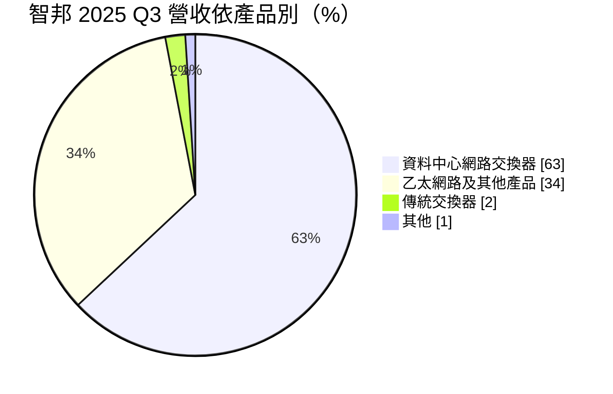
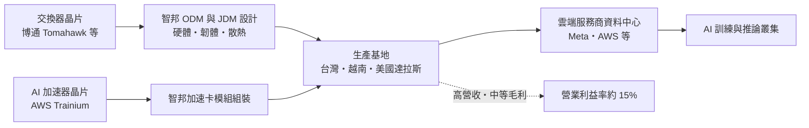
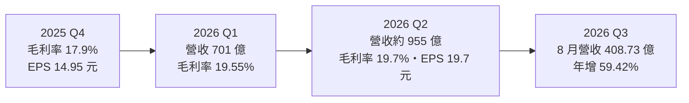
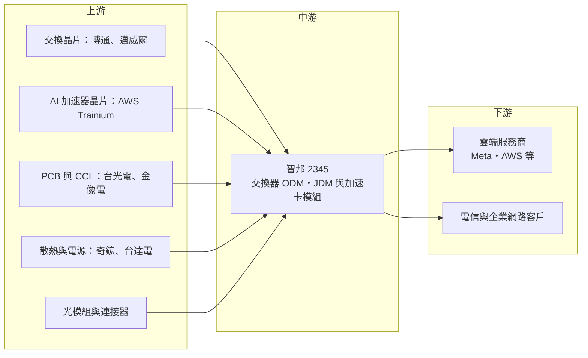

# 2345 智邦

> 上市｜[[產業索引-通信網路業|通信網路業]]｜上市（櫃）日期 1995/11/15

# 第一章：企業模式與商業藍圖

> [!info] 撰寫說明
> 本文由 Claude 依公開資料整理，架構比照 [[2330台積電]] 的四章研究，資料截至 2026-10-07。財務數字來源：智邦 2025 年第三季法說會報導（優分析）、2025 年財報與 2026 年第一季報導（理財周刊、聯合新聞網）、2026 年第二季財報新聞（旺得富、鏡週刊）、8 月營收與擴產報導（優分析）；產業描述為整理性內容，尚未逐條比對原始文件。#待校對

在評估單一個股的長期投資價值時，首要步驟是拆解企業的底層獲利邏輯。本章針對智邦科技（股票代號：2345，以下簡稱智邦）的商業模式進行定性分析，說明這家網通設備廠如何從傳統企業網路轉型為雲端與 AI 資料中心交換器的核心供應商，以及為何它的營收在兩年內成長一倍以上。

## 一、核心定位：雲端資料中心白牌交換器龍頭

智邦是台灣最大的網路交換器設計製造廠，以 ODM（原廠委託設計製造）與 JDM（共同開發製造）模式，替美國大型雲端服務商（[[CSP]]）設計與製造資料中心[[白牌交換器]]。2025 年營收 2,483.2 億元，年增約 125%，EPS 47.13 元，均創歷史新高。

智邦的定位有三個特點：

* **直接服務雲端巨頭：** 美洲地區占 2025 年第三季營收約 81%，主要客戶為美國大型雲端服務商。依 2026 年財報新聞，[[META臉書]] 的 800G 交換器需求與 [[AMZN亞馬遜]] 的 Trainium 3 AI 加速卡是主要成長動能。
* **從交換器延伸到 AI 加速卡模組：** 2026 年第二季起大量出貨 AWS 自研 AI 晶片 Trainium 3 的 [[OAM]] 加速卡模組，讓智邦從「網路」跨入「運算」。
* **技術世代領先：** 800G 交換器是目前出貨主力，[[1.6T交換器]]已於 2026 年上半年量產，光交換器（[[OCS]]）與[[CPO]]（共同封裝光學）列為 2027 年成長來源。

## 二、終端應用板塊：產品結構

* **資料中心網路交換器（63%）：** 400G、800G 與 1.6T 高速交換器，2025 年第三季年增 361%，是營收主體。AI 叢集需要大量交換器把數萬顆 GPU 或 AI 加速器連在一起，資料中心網路的頻寬需求隨模型規模快速上升。
* **乙太網路及其他產品（34%）：** 依法說會分類，包括企業與電信網路設備，以及 AI 加速卡等新產品（分類口徑待校對）。
* **傳統交換器（2%）：** 企業與中小型網路設備，比重持續下降。
* **AI 加速卡模組：** 2026 年第二季起放量，法人認為是第二季營收季增 36% 的主要原因之一。

## 三、資本轉化邏輯：設計能力換取雲端長約

* **以設計換訂單：** 雲端服務商自己寫網路軟體（[[SONiC]] 等開源網路作業系統），硬體則委託智邦依規格設計製造，省下品牌設備商的溢價。智邦的價值在於能比對手更快把新一代交換晶片做成穩定、可量產的系統。
* **高營收、中等毛利：** 毛利率長期在 17% 至 21% 之間，屬於「規模型」獲利。2026 年第二季毛利率 19.7%、[[營業利益率]] 15%，營收放大時費用率下降，營業利益率提升。
* **產能就是接單能力：** 雲端客戶要求快速交貨與美國在地生產，智邦持續擴建台灣、越南與美國產能。

## 四、企業長期藍圖：四大支柱與全球擴產

* **四大支柱：** 董事長黃國修提出 ODM、JDM、開放基礎架構部門，以及戰略技術投入與合作四大方向。
* **擴產：** 台灣桃園新廠 2026 年第三季量產、新竹廠 2027 年啟用；越南第三座廠規劃生產 800G 與 1.6T；美國達拉斯廠 2026 年底完成裝機、2027 年量產。法人預估 2026 年整體產能增加三至五成。
* **新技術：** 1.6T 交換器、光交換器、CPO 與液冷方案，是 2027 年的主要成長來源。代理式 AI（Agentic AI）帶動推論需求，法人認為可能加速企業客戶升級至 1.6T。

# 第二章：護城河深度與競爭優勢

在長期價值投資中，「護城河」指企業抵禦競爭、維持超額利潤的保護機制。本章分析智邦的護城河構成、全球主要競爭對手，以及這些優勢在 AI 資料中心快速迭代中能守住多少。

## 一、智邦護城河的核心組成要素

* **1. 高速交換器的設計與量產經驗：** 800G、1.6T 交換器的訊號完整性、散熱與功耗設計難度高，智邦長年與雲端客戶共同開發，累積大量設計資料與驗證經驗。
* **2. 與雲端客戶的深度綁定：** JDM 模式讓智邦在客戶的規格制定階段就參與，客戶要換供應商必須重新驗證整套硬體與軟體，轉換成本高。
* **3. 規模與全球產能：** 台灣、越南、美國多地生產，符合雲端客戶的供應鏈分散要求；龐大的採購規模也讓智邦在關鍵零組件（交換晶片、光模組、PCB）上取得較好的供貨條件。

## 二、全球主要競爭對手格局

| 對手 | 定位 | 對智邦的威脅 |
|---|---|---|
| Arista Networks | 美國品牌資料中心交換器龍頭 | 以自有軟體與品牌直接服務雲端客戶 |
| [[CSCO思科]] | 全球最大網通品牌 | 企業與電信市場，並積極切入 AI 網路 |
| [[NVDA輝達]] | Spectrum-X 乙太網路與 InfiniBand | 以 GPU 整套方案綁定網路設備 |
| Celestica | 加拿大 EMS 大廠，白牌交換器主要對手 | 搶雲端客戶的 ODM 訂單 |
| [[2317鴻海]]、[[2382廣達]] 等 | 伺服器 ODM 大廠 | 以整櫃 AI 伺服器方案延伸到網路設備 |

## 三、優勢轉化：哪些市場守得住、哪些守不住

* **守得住：** 美國雲端客戶的 800G 與 1.6T 白牌交換器。智邦在這個市場的設計經驗與量產規模，使它成為多家雲端業者的主要供應商。
* **守不住：** 毛利率。AI 加速卡模組等新產品初期毛利較低，加上客戶議價能力強，2025 年第四季毛利率曾降到 17.9%。營收成長再快，毛利率大致被限制在二成上下。
* **觀察重點：** 1.6T 交換器與光交換器的放量速度、AI 加速卡模組的毛利率改善，以及 Arista、Celestica 在同一批雲端客戶中的份額變化。

# 第三章：財務體質與盈利規模

資料日期：2026-10-07。數字取自公司財報新聞與財經媒體整理，表格是撰寫當時的快照；最新月營收、毛利率、累計 EPS 由自動排程寫在本筆記的屬性欄位（月營收、毛利率、累計EPS 等）。#待校對

財務報表是檢驗護城河是否真實存在的最終標準。本章用三率、ROE、現金流與資本報酬，檢視智邦在 AI 資料中心建置潮中的獲利品質。

## 一、獲利能力的基石：三率

| 項目 | 2025 全年 | 2025 Q4 | 2026 Q1 | 2026 Q2 |
|---|---|---|---|---|
| 營收（新台幣） | 2,483.2 億 | 約 720 億（推算） | 701.21 億 | 約 955 億 |
| [[毛利率]] | 未查得 | 17.9% | 19.55% | 19.7% |
| [[營業利益率]] | 未查得 | 未查得 | 約 14.3%（推算） | 15.0% |
| 稅後淨利 | 263.42 億 | 未查得 | 未查得 | 110.53 億 |
| EPS（元） | 47.13 | 14.95 | 14.92 | 19.70 |

註：2025 年第四季營收以全年減前三季累計 1,763 億元推算；2026 年第一季營業利益率依第二季「季增 0.7 個百分點」反推。

* **[[毛利率]]：** 2024 年全年 20.64%，2025 年因產品組合不利降至 17% 至 18% 區間，2026 年回升到 19% 以上。智邦毛利率的關鍵在於高階交換器與加速卡的組合比例。
* **[[營業利益率]]：** 營收規模擴大使費用率下降，2026 年第二季達 15%，高於 2025 年第三季的 12.3%。
* **成長速度：** 2026 年 1 至 8 月累計營收 2,460.04 億元，年增 61.86%，8 月單月首度突破 400 億元。

## 二、[[ROE]]：資本效率

智邦屬於輕資產的設計製造模式，營收快速成長時 ROE 會被大幅推升。以 2026 年上半年 EPS 34.7 元推估，ROE 處於歷史高檔（具體數值未查得）。高 ROE 主要來自資產周轉率，而非高利潤率，這是 ODM 模式的典型特徵。

## 三、資本支出與自由現金流

* **[[CapEx]]：** 台灣桃園、新竹，越南第三廠與美國達拉斯廠同時擴建，2026 至 2027 年資本支出明顯高於過去（金額未查得）。
* **營運資金：** 營收快速成長需要大量備料與應收帳款，存貨與應收帳款增加會吃掉部分營業現金流，[[自由現金流]]成長可能落後於獲利成長（推估）。
* **股利政策：** 2025 年度每股配發現金股利 15 元，配息率約三成，低於過去水準，推估是為保留擴產資金。

## 四、[[ROIC]] 與 [[WACC]]：價值創造利差

智邦投入的資本主要是組裝產線與營運資金，相對營收規模不大，推估 ROIC 遠高於 WACC。風險在於雲端資本支出若反轉，存貨與新產能的報酬會迅速下降，ROIC 可能從高檔快速回落。

# 第四章：總體風險與地緣政治

任何企業都無法脫離宏觀環境獨立存在。本章分析智邦未來必須面對的地緣政治、產業週期與營運風險。

## 一、地緣政治風險

* **美國關稅與在地製造：** 營收八成以上來自美洲，美國對進口電子產品的關稅政策直接影響成本。達拉斯廠是因應美國在地生產要求的關鍵布局。
* **生產據點分散：** 越南與台灣是主要生產地，兩地的地緣政治與貿易政策變化都會影響出貨。
* **出口管制：** 高速網路設備與 AI 加速器屬敏感產品，美國對中國等地的出口管制可能限制部分市場。

## 二、產業週期與市場結構風險

* **雲端資本支出循環：** 2026 年全球雲端業者資料中心資本支出預估超過 6,000 億美元。若 AI 投資回報不如預期而放緩，交換器與加速卡需求會同步下修。
* **客戶集中：** 前幾大雲端客戶占營收比重高，單一客戶的採購策略改變就會影響營收。
* **[[長鞭效應]]：** 雲端客戶在建置高峰期大量拉貨，一旦進入消化期，訂單可能急凍。

## 三、營運環境的隱性風險

* **新產品良率與毛利：** AI 加速卡模組初期毛利較低，若良率與成本優化不如預期，會拖累整體毛利率。
* **擴產執行：** 多地同時建廠，人力、供應鏈與品質管理難度高。
* **零組件短缺：** 交換晶片、光模組、高階 PCB 與[[CCL]]等關鍵零件若供不應求，會限制出貨。

## 四、科技演進風險

* **網路架構改變：** CPO、光交換器等新技術可能改變交換器的價值分配，光學元件比重上升，系統組裝的附加價值可能下降。
* **乙太網路與 InfiniBand 之爭：** 輝達推動自家網路方案，若 AI 叢集更多採用 GPU 廠商的整套網路設備，白牌交換器的市場空間會受壓縮。目前乙太網路在大型雲端業者中仍為主流。

# 專有名詞解析

## 半導體

- **[[CPO]]**：共同封裝光學，把光學收發元件與交換晶片封裝在一起，縮短電訊號距離以降低功耗。

## 應用

- **[[白牌交換器]]**：由 ODM 廠依雲端業者規格設計製造、不掛品牌的網路交換器，客戶自行搭配網路作業系統。
- **[[CSP]]**：雲端服務供應商，例如 AWS、微軟 Azure、Google Cloud、Meta，是 AI 資料中心最大的採購者。
- **[[1.6T交換器]]**：單一連接埠傳輸速率達每秒 1.6 Tb 的資料中心交換器，是 800G 之後的新世代規格。
- **[[OAM]]**：開放加速器模組，由開放運算計畫制定的 AI 加速卡規格，方便不同廠商的加速器裝入同一種伺服器。
- **[[SONiC]]**：由微軟發起的開源網路作業系統，讓雲端業者能在白牌交換器上執行自己的網路軟體。
- **[[OCS]]**：光路交換器，以光學方式直接切換光訊號路徑，不需轉換成電訊號，可降低 AI 叢集的網路功耗。
- **[[AI加速卡]]**：搭載 AI 專用晶片的運算模組，用於模型訓練與推論，例如 AWS 的 Trainium。

## 金融

- **[[長鞭效應]]**：終端需求的小幅變動，沿供應鏈往上游傳遞時被逐級放大，造成上游庫存與訂單劇烈波動。

## 產業

- **[[ODM]]**：原廠委託設計製造，代工廠負責產品設計與製造，客戶以自己的品牌或規格出貨。
- **[[JDM]]**：共同開發製造，代工廠與客戶在規格制定階段就共同開發產品。
- **[[CCL]]**：銅箔基板，印刷電路板的核心材料，高速交換器需要低損耗等級的 CCL。

# 核心供應鏈

## 1. 上游：晶片與關鍵零組件
- 交換晶片：[[AVGO博通]]、[[MRVL邁威爾]]
- AI 加速器晶片：AWS Trainium（由 [[AMZN亞馬遜]] 自研）
- 銅箔基板與 PCB：[[2383台光電]]、[[2368金像電]]（推估供應關係）
- 散熱與電源：[[3017奇鋐]]、[[2308台達電]]（推估供應關係）

## 2. 中游：智邦本身與同業
- 白牌交換器同業：Celestica
- 品牌交換器對手：Arista、[[CSCO思科]]、[[NVDA輝達]]

## 3. 下游：雲端與企業客戶
- 雲端服務商：[[META臉書]]、[[AMZN亞馬遜]]，以及其他美國大型雲端業者
- 電信與企業網路客戶

延伸閱讀：[[台積電供應鏈]]

## 最新新聞
<!-- news:start（自動產生，請勿手動編輯此範圍） -->
- 2026-10-06 📰 媒體 16:50｜營收速報 - 智邦(2345)9月營收403.99億元年增率高達66.13％｜[鉅亨網](https://news.cnyes.com/news/id/6622753)
- 2026-10-06 📰 媒體 08:10｜鉅亨速報 - Factset 最新調查：智邦(2345-TW)EPS預估下修至85.56元，預估目標價為3500元｜[鉅亨網](https://news.cnyes.com/news/id/6622249)

完整紀錄：[[2345智邦 新聞]]
<!-- news:end -->

## 相關連結
- [公開資訊觀測站](https://mopsov.twse.com.tw/mops/web/t05st03?step=1&firstin=1&co_id=2345)
- [Goodinfo](https://goodinfo.tw/tw/StockDetail.asp?STOCK_ID=2345)
- [Yahoo 股市](https://tw.stock.yahoo.com/quote/2345)
- [鉅亨網新聞](https://www.cnyes.com/twstock/2345/news)
