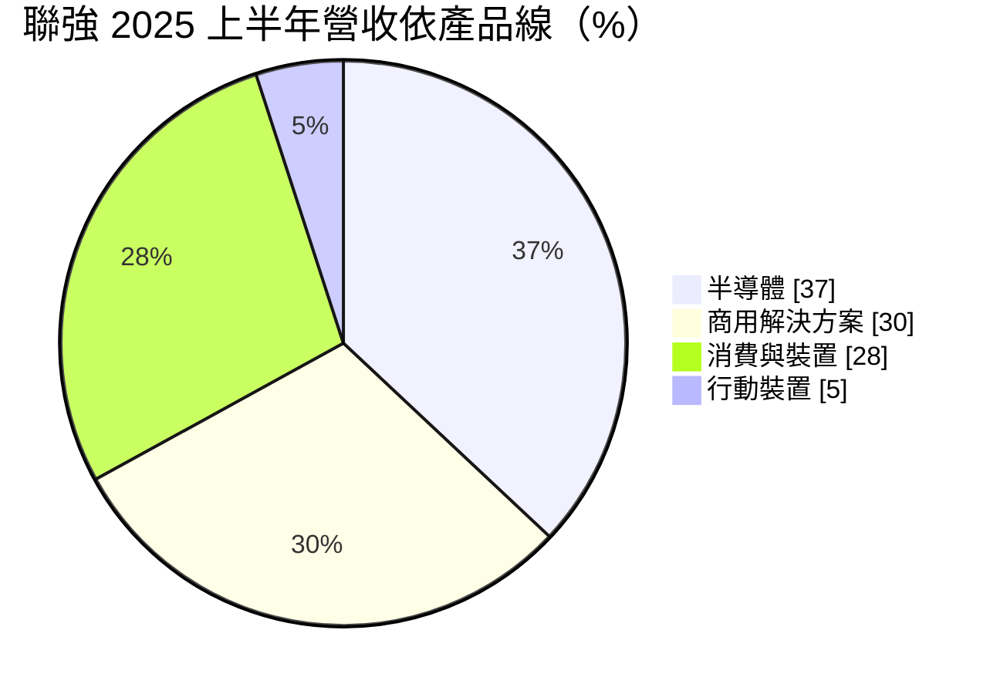
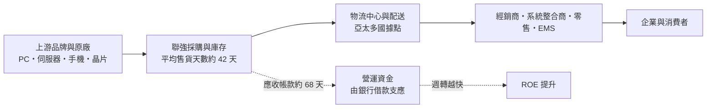
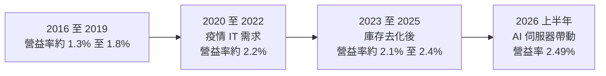
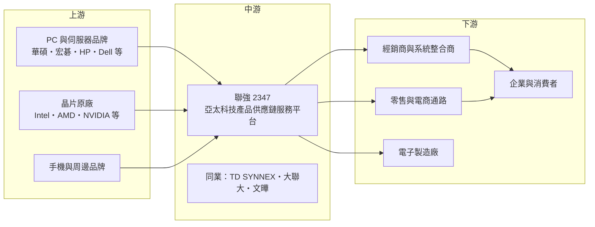

# 2347 聯強

> 上市｜[[產業索引-電子通路業|電子通路業]]｜上市（櫃）日期 1995/12/13

# 第一章：企業模式與商業藍圖

> [!info] 撰寫說明
> 本文由 Claude 依公開資料整理，架構比照 [[2330台積電]] 的四章研究，資料截至 2026-10-08。財務數字來源：Goodinfo 年度經營績效、現金流量與股利政策頁、MoneyDJ 理財網財務比率、營收比重與資產負債表、富果研究法說會備忘錄（2025 年 8 月、2026 年 3 月）、證交所開放資料（基本資料、資產負債、綜合損益、營益分析、股利）；產業描述為整理性內容，尚未逐條比對原始文件。#待校對

在評估單一個股的長期投資價值時，首要步驟是拆解企業的底層獲利邏輯。本章針對聯強國際（股票代號：2347，以下簡稱聯強）的商業模式進行定性分析。聯強是亞太地區最大的 3C 通路商之一，它不生產任何產品，卻能在毛利率只有 4% 左右的生意裡長期維持兩位數的 ROE。關鍵在於它把「物流、資金與資訊」三件事做到極致的效率。

## 一、核心定位：亞太區的科技產品供應鏈服務平台

聯強成立於 1988 年，1995 年在台灣證券交易所上市，總部位於台北市南港區，董事長為苗豐強、總經理為杜書伍。聯強自我定位為「供應鏈服務平台」：向上游的國際品牌與晶片原廠採購產品，再配送給下游數以萬計的經銷商、系統整合商、零售通路與電子製造廠。

聯強作為[[代理商]]的價值，可以從上下游兩端來理解：

* **對上游原廠：** 品牌商與晶片原廠無法自己服務成千上萬的小型經銷商。聯強替原廠承擔庫存、配送、收款與售後維修，讓原廠可以把資源集中在研發與行銷。
* **對下游客戶：** 中小型經銷商與系統整合商無法向每個原廠直接下單。聯強提供一站式採購、即時配送與信用額度，等於替客戶提供了倉庫與短期融資。

在這個位置上，聯強賺的不是產品本身的利潤，而是「服務費」，也就是毛利率約 4% 的價差。真正決定獲利高低的，是費用控制與資金週轉速度。

## 二、終端應用／產品板塊：電子產品為主、半導體為輔

依 MoneyDJ 理財網整理的 2025 年營收比重，電子產品（包括商用 IT、消費電子與行動裝置）占 62.80%、半導體產品占 36.60%、服務及其他占 0.60%。富果研究整理的 2025 年上半年法說會資料則把營收分為四大類：半導體 37%、商用解決方案 30%、消費與裝置 28%、行動裝置 5%。

* **商用解決方案：** 伺服器、儲存、網通設備、軟體授權與雲端訂閱服務，客戶是企業與系統整合商。依富果研究整理，伺服器業務過去兩年平均成長約 30%，AI 伺服器相關營收預期在 2026 年至少翻倍，是聯強最重要的成長動能。
* **消費與裝置：** 筆電、桌機、電競零組件、周邊與智慧裝置，透過零售與電商通路銷售。這是聯強的傳統本業，成熟且競爭激烈。
* **行動裝置：** 手機與平板的配銷，規模較小。
* **半導體：** 代理晶片、記憶體與被動元件，客戶以電子製造廠為主，應用在消費性電子與車用領域。這部分讓聯強同時具備 IT 通路與 IC 通路的雙重身分。

依地區來看，聯強的主要市場包括台灣、中國大陸與香港、澳洲、紐西蘭、印尼與泰國等。富果研究整理的法說會資料指出，2025 年澳洲與印尼營收創新高，台灣下半年年增近 40%，中國大陸則相對疲弱。法說會也會揭露「集團口徑」，涵蓋印度與中東等透過轉投資經營的市場（相關轉投資公司持股與名稱待校對）。

## 三、資本轉化邏輯（營運模式）：薄利多銷，靠週轉創造報酬

通路商的獲利公式可以簡化為：**ROE ＝ 營業利益率 × 資產週轉率 × 財務槓桿**。聯強的營業利益率只有約 2%，但它透過以下方式把 ROE 推高到 10% 以上：

* **極致的費用控制：** 2025 年營業費用率約 2.2%（毛利率 4.26% 減營業利益率 2.08%，推算）。富果研究整理的法說會資料指出，自 2019 年以來聯強人力減少約 30%，人均營收提升近 60%，這是長期導入數位化與自動化的成果。
* **快速週轉：** 聯強的「淨營業天數」（存貨天數加應收天數減應付天數）在 2025 年降到 56 天，為歷史新低（富果研究）。週轉越快，同樣的資金可以做越多生意。
* **適度槓桿：** 營運資金主要由銀行借款支應，負債比率長期在 62% 至 67% 之間（MoneyDJ）。在低利率環境下，借款成本低於營運報酬，槓桿可以放大 ROE。

## 四、企業長期藍圖：從搬箱子走向數位與 AI 平台

聯強經營層的長期策略可以歸納為「極致營運效率」與「雙平台策略」（富果研究整理的 2026 年 3 月法說會資料）：

* **數位智能平台（MSP）：** 為企業客戶提供雲端、軟體訂閱與管理服務，把一次性的硬體銷售延伸為經常性收入。
* **AI 加速平台：** 協助系統整合商與企業導入 AI 伺服器與相關解決方案。AI 伺服器單價高、技術門檻高，通路商若能提供整合、測試與融資服務，就能分到比一般硬體更高的附加價值。
* **區域擴張：** 在澳洲、印尼等成長市場擴大市占，降低對中國市場的依賴。

聯強的長期經營哲學是「管理比規模重要」，總經理杜書伍長期強調流程、紀律與數據管理，這種文化是聯強在低毛利產業中維持獲利穩定的核心（此為整理性描述）。

# 第二章：護城河深度與競爭優勢

在長期價值投資中，「護城河」指企業抵禦競爭、維持超額利潤的保護機制。本章分析聯強在毛利極薄的通路產業中，如何建立難以複製的效率優勢，以及這些優勢面對原廠直營與電商崛起時的韌性。

## 一、護城河的核心組成要素

聯強的護城河屬於「營運效率型」，主要由以下要素構成：

* **1. 規模經濟與物流網路：** 通路業的固定成本主要是倉儲、物流與資訊系統，營收規模越大，每一元營收分攤的成本越低。聯強在亞太多國建立的物流中心與配送網路，需要數十年時間與大量投資才能建立，小型通路商很難在成本上與它競爭。
* **2. 流程與資訊系統：** 聯強長期自行開發供應鏈管理系統，從下單、庫存、配送到收款都高度自動化。淨營業天數降到 56 天、人力減少 30% 的同時營收持續成長，代表這套系統帶來的是可累積的效率優勢。
* **3. 信用管理能力：** 通路商的最大風險是下游客戶倒帳。聯強服務數萬家中小型客戶，靠長期累積的信用資料庫控制呆帳。不過這個優勢並非萬無一失，2025 年上半年仍提列約 8.2 億元呆帳（富果研究）。
* **4. 上游原廠的依賴：** 國際品牌與晶片原廠需要一個可靠的亞太通路夥伴，聯強多年來代理眾多品牌，形成雙向的依賴關係。

## 二、全球主要競爭對手格局

| 對手 | 定位 | 對聯強的影響 |
|---|---|---|
| TD SYNNEX、Ingram Micro | 全球最大 IT 通路商 | 在澳洲等市場直接競爭（TD SYNNEX 與聯強的歷史淵源與持股關係待校對） |
| [[3702大聯大]]、[[3036文曄]] | 亞洲最大半導體通路商 | 在半導體代理業務上競爭，規模遠大於聯強的半導體部門 |
| 神腦、燦坤等台灣零售與通路 | 3C 零售與配銷 | 在台灣消費市場部分重疊（未經本次來源確認，待校對） |
| 原廠直營與電商平台 | 品牌商自建通路、亞馬遜、蝦皮等 | 長期削弱傳統消費性產品通路的角色 |

## 三、優勢轉化：守得住／守不住／觀察重點

* **守得住：** 商用 IT 與 AI 伺服器通路。企業級產品需要技術支援、系統整合與信用額度，原廠難以直接服務中小型系統整合商，這是聯強最具議價力、也最有成長性的業務。
* **守不住：** 消費性產品的毛利。PC、手機等消費性產品標準化程度高，電商與原廠直營持續擠壓通路的價值，這部分業務長期只能維持低毛利。
* **觀察重點：** 第一，AI 伺服器與商用業務的成長能否抵銷消費性產品的成熟。第二，淨營業天數能否維持在 60 天以下，這是聯強效率優勢的直接指標。第三，呆帳費用是否回到正常水準。第四，新台幣匯率變化，富果研究整理的法說會資料指出，若新台幣兌美元維持在 29 至 30 元，對營收與獲利的負面影響可能接近一成。

# 第三章：財務體質與盈利規模

資料日期：2026-10-08。數字取自 Goodinfo 年度經營績效、現金流量與股利政策頁、MoneyDJ 理財網財務比率與資產負債表、富果研究法說會備忘錄與證交所開放資料，表格是撰寫當時的快照；最新月營收、毛利率、累計 EPS 由自動排程寫在本筆記的屬性欄位（月營收、毛利率、累計EPS 等）。#待校對

財務報表是檢驗護城河是否真實存在的最終標準。對通路商而言，除了三率之外，存貨與應收帳款的週轉天數、[[營運資金]]的規模，才是判斷經營品質的核心。本章用十年的財務資料檢視聯強的獲利與資本效率。

## 一、獲利能力的基石：三率與通路指標

| 年度 | 營收（新台幣） | [[毛利率]] | [[營業利益率]] | EPS（元） | [[ROE]] |
|---|---|---|---|---|---|
| 2016 | 3,427 億 | 3.54% | 1.25% | 2.92 | 11.7% |
| 2017 | 3,642 億 | 3.53% | 1.35% | 3.67 | 14.2% |
| 2018 | 3,832 億 | 3.78% | 1.41% | 3.96 | 14.4% |
| 2019 | 3,400 億 | 4.33% | 1.76% | 4.09 | 14.3% |
| 2020 | 3,342 億 | 4.52% | 2.16% | 4.89 | 15.7% |
| 2021 | 4,088 億 | 4.31% | 2.28% | 10.35 | 29.0% |
| 2022 | 4,246 億 | 4.20% | 2.15% | 9.44 | 23.2% |
| 2023 | 3,960 億 | 4.44% | 2.18% | 4.37 | 10.5% |
| 2024 | 4,260 億 | 4.38% | 2.35% | 5.52 | 12.9% |
| 2025 | 4,112 億 | 4.26% | 2.08% | 5.08 | 11.1% |
| 2026 上半年 | 3,273.7 億 | 3.74% | 2.49% | 4.12 | 未查得 |

註：2016 至 2025 年取自 Goodinfo 合併報表；2026 上半年取自證交所營益分析與綜合損益開放資料。2021 至 2022 年 EPS 明顯高於營業利益所能解釋的水準，推估含有轉投資處分或評價等業外收益（未查得細項）。

| 年度 | 平均售貨天數 | 平均收帳天數 | 負債比率 |
|---|---|---|---|
| 2019 | 40.7 天 | 58.8 天 | 64.8% |
| 2020 | 35.8 天 | 63.5 天 | 64.4% |
| 2021 | 36.7 天 | 66.9 天 | 67.3% |
| 2022 | 47.1 天 | 70.8 天 | 66.2% |
| 2023 | 53.3 天 | 73.3 天 | 65.2% |
| 2024 | 45.2 天 | 67.5 天 | 64.4% |
| 2025 | 42.4 天 | 68.5 天 | 61.7% |

註：取自 MoneyDJ 理財網年度財務比率。

* **[[毛利率]]的穩定性：** 十年間毛利率在 3.5% 至 4.5% 之間，波動極小。這代表聯強的獲利不靠價格投機，而是穩定的服務價差。
* **[[營業利益率]]的提升：** 營業利益率從 2016 年的 1.25% 提升到近年的 2% 以上，增幅超過六成。在毛利率只上升約 0.7 個百分點的情況下，營業利益率大幅提升，主要來自費用率下降，這是人力精簡與數位化的直接成果。
* **營運資金週期：** 2022 至 2023 年供應鏈混亂時，售貨天數拉長到 53 天，之後降回 42 天；應收天數則長期在 60 至 73 天之間。2026 年第二季底存貨約 803 億元、應收帳款約 1,143 億元、應付帳款約 781 億元（MoneyDJ），存貨加應收減應付的營運資金約 1,165 億元（推算）。
* **營收趨勢：** 2020 至 2025 年營收年複合成長率約 4.2%（推算），屬於成熟的低速成長。2026 年上半年營收 3,273.7 億元，已接近 2025 年全年的八成，主要受 AI 伺服器與半導體帶動。

## 二、[[ROE]]：資本效率

2021 至 2025 年平均 ROE 約 17.3%（推算），扣除 2021 至 2022 年的特殊高點後，常態水準約 11% 至 15%。依杜邦分析，聯強的 ROE 由約 2% 的營業利益率、約 1.4 倍的資產週轉率（推估，以年營收約 4,100 億元除以約 3,000 億元總資產）與約 3.4 倍的權益乘數（以 2026 年第二季底總資產約 3,014 億元除以股東權益約 894 億元推算）構成，另有部分業外收益貢獻。這說明聯強的高 ROE 來自週轉與槓桿，而不是高利潤率。

## 三、資本支出、自由現金流與股利

| 年度 | 營業現金流 | 投資現金流 | [[自由現金流]] | 現金股利（元） |
|---|---|---|---|---|
| 2019 | 188 億 | -124 億 | 64.3 億 | 2.6 |
| 2020 | -49.2 億 | 92.8 億 | 43.5 億 | 3.3 |
| 2021 | -99.2 億 | -9.69 億 | -109 億 | 5.0 |
| 2022 | -151 億 | 24.9 億 | -126 億 | 3.5 |
| 2023 | 161 億 | -1.08 億 | 160 億 | 3.0 |
| 2024 | 234 億 | -105 億 | 129 億 | 4.0 |
| 2025 | 114 億 | 69.2 億 | 184 億 | 4.2 |

註：現金流取自 Goodinfo（自由現金流＝營業現金流＋投資現金流），股利依所屬年度列示。

* **通路商的現金流特性：** 聯強的營業現金流與營收成長方向相反。營收快速成長時（2021、2022 年），需要更多資金買庫存與墊付應收，營業現金流轉負；營收持平或庫存去化時（2023 至 2025 年），營運資金回收，現金流大幅轉正。因此評估通路商的現金流，要看多年平均而不是單一年度。
* **資本支出極輕：** 聯強的主要資產是倉庫與資訊系統，資本支出相對營收非常小，投資現金流的波動多來自轉投資的買賣（推估）。
* **股利政策：** 公司章程規定現金股利不低於當次股利的 15%，實務上聯強幾乎全以現金配發。2025 年度配發 4.2 元，以 EPS 5.08 元計算[[配發率]]約 83%（法說會資料）。2019 年以來每年現金股利在 2.6 至 5 元之間，屬於高配息、穩定配發的公司。

## 四、[[ROIC]] 與 [[WACC]]：價值創造利差

**ROIC 推算：** 2025 年營業利益約 85.5 億元（營收 4,112 億元 × 營業利益率 2.08%），扣除 20% 稅率後約 68.4 億元。投入資本以 2026 年第二季底計算：股東權益 894.2 億元（證交所），有息負債約 1,008 億元（短期借款 667.2 億元、短期票券 109.5 億元、長期借款 228.2 億元、租賃負債約 3 億元，MoneyDJ），合計約 1,902 億元，ROIC 約 3.6%（推算）。以 2026 年上半年營業利益 81.5 億元年化，ROIC 約 6.9%（推算）。需要注意，季底借款餘額會隨出貨旺季膨脹，若以全年平均借款計算，ROIC 可能略高。

**WACC 推估（CAPM）：** 假設台灣 10 年期公債殖利率約 1.75%、市場風險溢酬 6%、β 取 0.7（推估，IT 通路商常見值），股東權益成本約 5.95%；稅前負債成本假設 3%（推估，含部分外幣借款），稅後約 2.4%。以市值計算（股價淨值比約 1.85 倍，市值約 1,601 億元），權益約占 61%、負債約占 39%，WACC 約 4.6%（推算）。

**結論：** 聯強的 ROIC 約 3.6% 至 6.9%，與 WACC 約 4.6% 相比，利差很薄，甚至在部分年度為負。這說明通路商的本業資本報酬本身並不高，聯強的 ROE 之所以能長期維持兩位數，是因為以低成本借款放大了報酬，以及部分來自轉投資收益。在利率上升或週轉變慢時，這個利差可能消失。因此，聯強創造價值的關鍵在於持續壓低營運資金天數，並把業務組合往毛利較高的商用與 AI 伺服器移動。

# 第四章：總體風險與地緣政治

任何企業都無法脫離宏觀環境獨立存在。本章分析聯強未來必須面對的地緣政治、產業週期與營運風險。

## 一、地緣政治

* **中國市場的不確定性：** 中國大陸與香港是聯強的重要市場，但 2025 年表現疲弱。中美科技競爭下，美國品牌在中國的銷售受限、中國本土品牌崛起，都會改變聯強在中國的產品組合與獲利。
* **AI 晶片出口管制：** 美國對高階 AI 晶片與伺服器的出口限制，會影響通路商在特定地區銷售 AI 產品的範圍，也提高合規管理的成本。
* **區域多元化：** 聯強在澳洲、印尼與東南亞的布局，可以分散對單一市場的依賴，這是長期降低地緣政治風險的方向。

## 二、產業週期與市場結構

* **PC 與手機換機週期：** 消費性產品的需求跟著換機週期起伏，2023 年庫存調整時 EPS 從 9.44 元降到 4.37 元。
* **[[長鞭效應]]：** 通路商位於供應鏈中段，終端需求的小幅變化會放大成庫存與訂單的劇烈波動。景氣反轉時若庫存過高，就會出現跌價與資金積壓。
* **通路去中介化：** 原廠直營、電商平台與雲端服務直接銷售，長期會壓縮傳統通路在消費性產品上的角色。

## 三、營運環境的隱性風險

* **呆帳風險：** 下游客戶以中小企業為主，景氣反轉時倒帳風險上升。2025 年上半年約 8.2 億元的呆帳，就占了當期獲利相當大的比例。
* **匯率：** 進貨多以美元計價，在各國以當地貨幣銷售，匯率波動會影響毛利與匯兌損益。
* **利率：** 營運資金大量依賴銀行借款，有息負債約 1,008 億元，利率每上升 1 個百分點，年利息支出約增加 10 億元（推算），相當於年營業利益的一成以上。

## 四、科技或法規演進

* **AI 伺服器的技術門檻：** AI 伺服器需要液冷、高功率電源與系統整合能力，通路商若只做轉手買賣，價值會被原廠與系統整合商擠壓。聯強需要持續投資技術服務能力，才能在 AI 浪潮中保有角色。
* **雲端訂閱化：** 軟體與基礎設施轉向雲端訂閱，硬體採購減少，通路商需要轉型為雲端服務的配銷與管理平台。聯強的數位智能平台正是因應這個趨勢。

# 專有名詞解析

## 應用

- **[[AI伺服器]]**：搭載 GPU 等 AI 加速器、用於訓練與推論的伺服器，單價高且需要系統整合能力。

## 金融

- **[[營運資金]]**：存貨加應收帳款減應付帳款的金額，代表企業日常營運被占用的資金，通路商的核心指標。
- **[[淨營業天數]]**：存貨天數加應收帳款天數減應付帳款天數，天數越短代表資金週轉越快。
- **[[平均售貨天數]]**：存貨從購入到賣出平均需要的天數，數字越大代表庫存越多、週轉越慢。
- **[[杜邦分析]]**：把 ROE 拆解為利潤率、資產週轉率與權益乘數三個因子的分析方法。
- **[[長鞭效應]]**：終端需求的小幅變動，沿供應鏈往上游傳遞時被逐級放大，造成庫存與訂單劇烈波動。
- **[[配發率]]**：現金股利占當年度每股盈餘的比例，用來衡量公司把多少獲利分給股東。
- **[[呆帳]]**：應收帳款因客戶無力償還而無法收回的損失，是通路商主要的信用風險。
- **[[經常性收入]]**：訂閱、維護等可以每年重複產生的收入，穩定度高於一次性的產品銷售。

## 產業

- **[[代理商]]**：向原廠採購產品再轉售給下游客戶的通路業者，價值在於庫存、配送與信用服務。
- **[[系統整合商]]**：為企業客戶規劃並整合硬體、軟體與服務的業者，是 IT 通路商的重要下游。
- **[[MSP]]**：管理服務供應商，以訂閱方式替企業代管 IT 系統與雲端服務，收入較穩定。

# 核心供應鏈

## 1. 上游：品牌與原廠
- PC 與伺服器品牌：[[2357華碩]]、[[2353宏碁]]，以及 HP、Dell 等國際品牌（代理品牌名單為整理性描述，待校對）
- 晶片原廠：[[INTC英特爾]]、[[AMD超微]]、[[NVDA輝達]]（代理關係待校對）
- 手機與消費電子品牌：[[AAPL蘋果]] 等（待校對）

## 2. 中游：通路同業
- 半導體通路：[[3702大聯大]]、[[3036文曄]]
- 國際 IT 通路：TD SYNNEX、Ingram Micro

## 3. 下游：客戶
- 經銷商、系統整合商、零售與電商通路
- 電子製造服務廠（半導體元件客戶）
- 企業 IT 部門與一般消費者

## 最新新聞
<!-- news:start（自動產生，請勿手動編輯此範圍） -->
- 2026-10-08 📰 媒體 17:23｜營收速報 - 聯強(2347)9月營收903.09億元年增率高達158.67％｜[鉅亨網](https://news.cnyes.com/news/id/6624991)

完整紀錄：[[2347聯強 新聞]]
<!-- news:end -->

## 相關連結
- [公開資訊觀測站](https://mopsov.twse.com.tw/mops/web/t05st03?step=1&firstin=1&co_id=2347)
- [Goodinfo](https://goodinfo.tw/tw/StockDetail.asp?STOCK_ID=2347)
- [Yahoo 股市](https://tw.stock.yahoo.com/quote/2347)
- [鉅亨網新聞](https://www.cnyes.com/twstock/2347/news)
