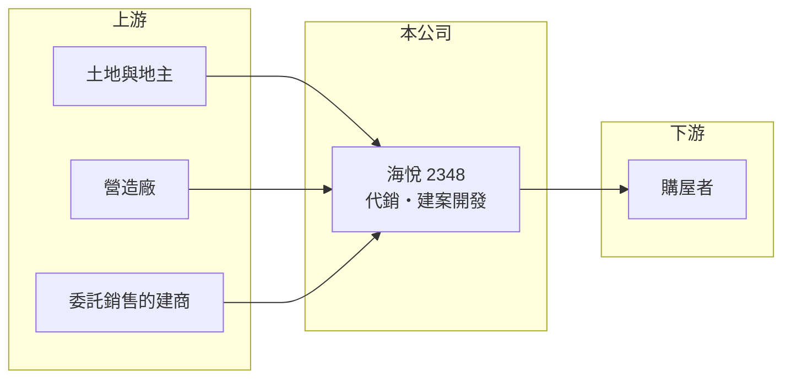

# 2348 海悅

> 上市｜[[產業索引-其他業|其他業]]｜上市（櫃）日期 1996/01/05

# 第一章：企業模式與商業藍圖

> [!info] 撰寫說明
> 精簡版，由 Claude 依公開資料整理，架構比照 [[2330台積電]]，資料截至 2026-10-07。來源：winvest 海悅營收快訊。#待校對

海悅以[[不動產代銷]]起家，並投入自有建案開發，營收隨建案完工交屋而大幅跳動。

- **核心業務：** 營業項目包括不動產代銷及仲介、廣告服務、管理顧問、住宅及大樓開發租售與國際貿易。
- **營收結構：** 本次未查到代銷與自建案的營收比重；2026 年 6、7 月營收大增，主要來自新知段與後壁田段等建案認列營建收入。
- **營運據點：** 公司 1987 年成立、1996 年上市，建案地點明細本次未查到。
- **長期方向：** 由收取代銷服務費，延伸到自行開發建案，追求較高的獲利（推估）。

# 第二章：護城河深度與競爭優勢

海悅的優勢在於代銷累積的市場資訊與銷售通路。

- **競爭優勢：** 長期經營代銷，熟悉各區域購屋需求與定價，有助於自有建案規劃與銷售（推估）。
- **主要對手：** 其他不動產代銷與建設公司，本次未查到具體名單。
- **觀察重點：** 7 月營收 20.78 億元，年增 982.24%，觀察下半年建案交屋進度與獲利認列。

# 第三章：財務體質與盈利規模

資料日期：2026-10-07，以下數字是撰寫當時的快照；最新月營收、毛利率、累計 EPS 由自動排程寫在本筆記的屬性欄位（月營收、毛利率、累計EPS 等）。#待校對

海悅 2026 年第一季獲利偏低，第三季起建案入帳帶動營收大增。

- **營收規模：** 2026 年 1 至 7 月累計營收 51.94 億元，年增 50.88%；6 月 14.98 億元、7 月 20.78 億元。
- **獲利：** 2026 年第一季 EPS 0.16 元，年減 93%；2025 年全年 EPS 6.85 元。
- **財務特色：** 資本額 18.19 億元、市值約 104.51 億元；建案採[[完工認列]]，單季獲利高度集中。

# 第四章：總體風險與地緣政治

海悅的風險在於房市景氣與建案認列時點。

- **產業週期：** 代銷與建案銷售都跟房市景氣高度連動，景氣下行時兩者同時受影響。
- **營運風險：** 營收與獲利集中在少數建案交屋的月份，季度之間落差大。
- **其他風險：** [[信用管制]]等房市政策與利率變化，會影響購屋需求與建案去化。

# 專有名詞解析

## 金融

- **[[完工認列]]**：建案完工並交屋後才一次認列營收與獲利，使獲利集中在交屋期間。
- **[[信用管制]]**：央行限制購屋與建商貸款成數的政策，會影響房市成交與建商資金。

## 產業

- **[[不動產代銷]]**：受建商委託負責建案廣告與銷售，依成交金額收取服務費。

# 核心供應鏈

- 上游：土地、營造廠，以及委託代銷的建商（推估）
- 下游／客戶：購屋者
- 同業：不動產代銷與中型建設公司（本次未查到具體名單）

## 最新新聞
<!-- news:start（自動產生，請勿手動編輯此範圍） -->
- 2026-10-05 📰 媒體 18:50｜營收速報 - 海悅(2348)9月營收14.81億元年增率高達96.3％｜[鉅亨網](https://news.cnyes.com/news/id/6621908)

完整紀錄：[[2348海悅 新聞]]
<!-- news:end -->

## 相關連結
- [公開資訊觀測站](https://mopsov.twse.com.tw/mops/web/t05st03?step=1&firstin=1&co_id=2348)
- [Goodinfo](https://goodinfo.tw/tw/StockDetail.asp?STOCK_ID=2348)
- [Yahoo 股市](https://tw.stock.yahoo.com/quote/2348)
- [鉅亨網新聞](https://www.cnyes.com/twstock/2348/news)
