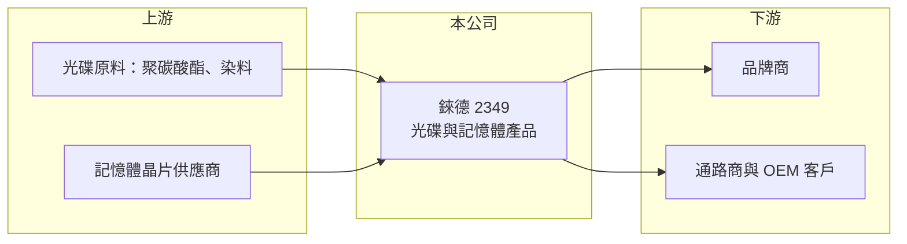

# 2349 錸德

> 上市｜[[產業索引-光電業|光電業]]｜上市（櫃）日期 1996/04/23

# 第一章：企業模式與商業藍圖

> [!info] 撰寫說明
> 精簡版，由 Claude 依公開資料整理，架構比照 [[2330台積電]]，資料截至 2026-10-07。來源：nstock、winvest 營收快訊。#待校對

錸德是老牌光碟製造商，目前靠光學儲存與記憶體產品維持營運，並嘗試分散業務來源。

- **核心業務：** 錸德成立於 1988 年，主要從事光學資訊產品、記憶體產品及相關生產設備的製造加工與材料買賣。
- **營收結構：** 以光碟等[[光儲存媒體]]與記憶體相關產品為主，詳細比重這次未查到；集團旗下另有光電、材料等轉投資事業（推估）。
- **營運據點：** 總部位於新竹縣湖口鄉，以外銷市場為主。
- **長期方向：** 在光碟市場萎縮下，持續發展記憶體與其他光電、材料相關業務，以分散營收來源。

# 第二章：護城河深度與競爭優勢

錸德的優勢在於長年累積的光碟量產規模，但記憶體產品的差異化有限。

- **競爭優勢：** 長年累積的光碟量產經驗與產能，在全球光碟供給減少下仍具一定地位。
- **主要對手：** 光碟領域有 [[2323中環]]；記憶體產品則面對 [[3260威剛]]、[[2451創見]] 等同業。
- **觀察重點：** 營收能否止跌回穩、毛利率能否維持兩成以上，以及本業轉盈的持續性。

# 第三章：財務體質與盈利規模

資料日期：2026-10-07，表格是撰寫當時的快照；最新月營收、毛利率、累計 EPS 由自動排程寫在本筆記的屬性欄位（月營收、毛利率、累計EPS 等）。#待校對

錸德營收仍在緩步下滑，獲利只在損益兩平附近。

- **營收規模：** 2025 年全年營收 74.98 億元；2026 年 1 至 7 月累計 44.91 億元，年減約 6%；8 月營收 5.40 億元，年減約 1%。
- **獲利：** 2026 年第一季 EPS 0.02 元，[[毛利率]] 21.21%、[[營業利益率]] 3.49%，淨利率 -1.16%。
- **財務特色：** 資本額約 69 億元，近五年沒有配息紀錄，獲利能力偏薄。

# 第四章：總體風險與地緣政治

錸德的主要風險是本業長期衰退，以及記憶體價格循環帶來的毛利波動。

- **產業週期：** 光碟為長期衰退市場，記憶體產品則受上游晶片價格循環影響，與 [[NAND Flash]] 報價連動。
- **營運風險：** 營收連續數月年減，若無新成長動能，獲利可能維持在損益兩平附近。
- **其他風險：** 外銷比重高，匯率波動與海外需求變化會影響營收與毛利；[[聚碳酸酯]]等原料價格也會影響成本。

# 專有名詞解析

## 半導體

- **[[NAND Flash]]**：斷電後仍能保存資料的快閃記憶體，用於 SSD、記憶卡與隨身碟，價格循環明顯。

## 應用

- **[[光儲存媒體]]**：以雷射讀寫資料的光碟類媒體，包括 CD、DVD、藍光，市場因雲端與串流長期萎縮。

## 產業

- **[[聚碳酸酯]]**：簡稱 PC，透明耐衝擊的工程塑膠，是光碟片基板的主要原料。

# 核心供應鏈

- 上游：光碟原料（聚碳酸酯、染料）、記憶體晶片供應商
- 下游／客戶：品牌商、通路商與 OEM 客戶
- 同業：[[2323中環]]、[[3260威剛]]、[[2451創見]]

## 最新新聞
<!-- news:start（自動產生，請勿手動編輯此範圍） -->
- 2026-10-08 📰 媒體 18:21｜營收速報 - 錸德(2349)9月營收7.73億元年增率高達42.29％｜[鉅亨網](https://news.cnyes.com/news/id/6625153)

完整紀錄：[[2349錸德 新聞]]
<!-- news:end -->

## 相關連結
- [公開資訊觀測站](https://mopsov.twse.com.tw/mops/web/t05st03?step=1&firstin=1&co_id=2349)
- [Goodinfo](https://goodinfo.tw/tw/StockDetail.asp?STOCK_ID=2349)
- [Yahoo 股市](https://tw.stock.yahoo.com/quote/2349)
- [鉅亨網新聞](https://www.cnyes.com/twstock/2349/news)
