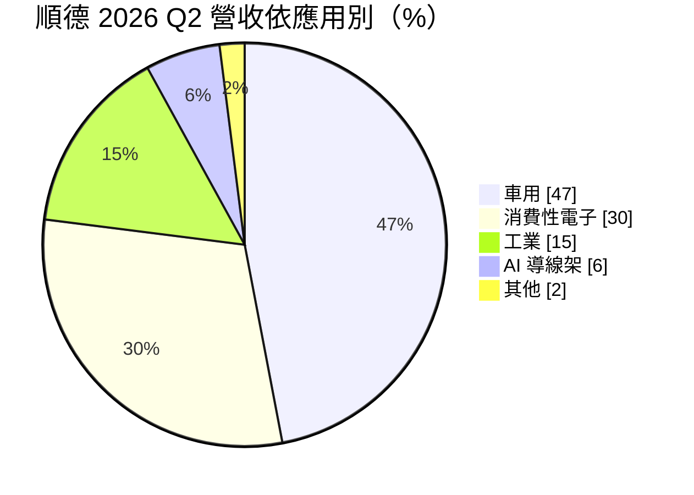
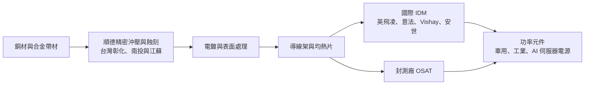
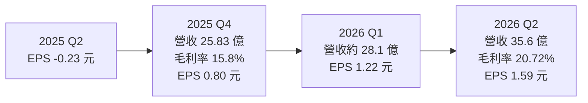
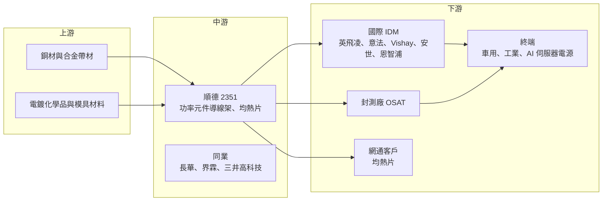

# 2351 順德

> 上市｜[[產業索引-半導體業|半導體業]]｜上市（櫃）日期 1996/04/25

# 第一章：企業模式與商業藍圖

> [!info] 撰寫說明
> 本文由 Claude 依公開資料整理，架構比照 [[2330台積電]] 的四章研究，資料截至 2026-10-07。財務數字來源：富果研究順德 2026 年 3 月與 8 月法說會整理、優分析、nStock 公司資料、Yahoo 股市季 EPS、winvest 營收快訊；產業描述為整理性內容，尚未逐條比對原始文件。#待校對

在評估單一個股的長期投資價值時，首要步驟是拆解企業的底層獲利邏輯。本章針對順德工業（股票代號：2351，以下簡稱順德）的商業模式進行定性分析，說明一家從文具起家的老廠，如何成為國際功率半導體大廠的[[導線架]]供應商，並在 2026 年搭上 AI 伺服器電源與散熱的成長列車。

## 一、核心定位：國際 IDM 的功率元件導線架供應商

順德成立於 1967 年，資本額約 19.37 億元，營業項目是半導體導線架、文具事務用品與模具。導線架是晶片封裝中承載晶片並把訊號、電流導出的金屬框架，對於需要大電流與散熱的功率元件尤其重要。

順德的競爭位置有三個特點：

* **以功率元件導線架為主：** 產品集中在車用、工控與電源使用的功率元件，而不是一般消費性 IC，這類導線架對散熱與可靠度要求較高。
* **客戶是國際 IDM 大廠：** 依富果整理的法說資料，[[IDM]] 客戶約占 65%，包括英飛凌（Infineon）、意法半導體（STMicroelectronics）、Vishay、安世（Nexperia）；封測廠（[[OSAT]]）約占 35%。前幾大客戶合計約占營收 75%。
* **兩岸生產：** 生產據點在台灣彰化、南投與中國江蘇，營收與產能比重約為台灣 65%、江蘇 35%。

## 二、終端應用／產品板塊：車用近半，AI 快速竄升

依富果整理的 2026 年 8 月法說會資料，2026 年第二季產品結構如下：

* **車用：** 電動車與再生能源的高功率元件、車身電子與 [[ADAS]] 相關產品，是最大且最穩定的板塊。
* **消費性電子：** 一般電源與家電用功率元件導線架。
* **工業：** 工控電源、馬達驅動與自動化設備。
* **AI 導線架：** 用於 AI 伺服器電源供應器（PSU）、備援電池（BBU）與 48V 轉換器的功率元件，2025 年切入，2026 年第二季占 6%，公司預期第三季達到雙位數。
* **[[均熱片]]：** 2024 年開始布局的散熱新事業，2026 年 3 月導入美系網通客戶，第二季開始放量，是新的成長引擎。
* **文具：** 2025 年占營收約 13%，是順德的起家事業，目前比重逐年下降。

## 三、資本轉化邏輯（營運模式）：精密沖壓、蝕刻與電鍍

* **製程核心：** 導線架以銅帶為原料，經精密沖壓或蝕刻成形，再電鍍表面。功率元件導線架通常較厚、需要更好的散熱設計，製程門檻高於一般 IC 導線架。
* **營運槓桿：** 導線架屬於固定成本比重高的製造業，2026 年第二季營收季增 26.9%，[[毛利率]]就從前一季明顯跳升到 20.7%。
* **客戶驗證：** 國際 IDM 對導線架供應商的認證流程長，尤其是車用；一旦通過，訂單通常延續多年。

## 四、企業長期藍圖：AI 電源、散熱與東南亞產能

* **AI 伺服器：** 依優分析報導，公司 2025 年切入 AI 伺服器領域，AI 相關營收單月貢獻有機會突破 10%。AI 伺服器的功率越來越大，電源模組中的功率元件數量與規格同步提升，帶動高階導線架需求。
* **均熱片：** 2026 年資本支出由 13 億元上修至 14 億元，主要用於均熱片產能；另需約 10 億元取得台灣新廠用地。
* **東南亞據點：** 公司正在評估東南亞設廠，目標占集團產能 5% 至 10%，以因應地緣政治與客戶的供應鏈分散要求。

# 第二章：護城河深度與競爭優勢

在長期價值投資中，「護城河」指企業抵禦競爭、維持超額利潤的保護機制。本章分析順德在全球導線架市場的位置，以及它與國際 IDM 的綁定關係。

## 一、護城河的核心組成要素

* **1. 國際 IDM 的長期認證：** 英飛凌、意法、Vishay、安世等大廠對車用功率元件的材料供應商有嚴格稽核，順德長期供貨，形成[[車規驗證]]帶來的轉換成本。
* **2. 功率元件導線架的專業化：** 功率導線架需要處理厚銅、散熱與高電流，與一般 IC 導線架不同。順德專注這個領域，在產品設計與模具開發上累積經驗。
* **3. 兩岸產能與即將到來的東南亞產能：** 台灣與江蘇雙基地，未來再加上東南亞，可以滿足客戶「多地供應」的要求。
* **4. 散熱新產品的延伸：** 精密沖壓與電鍍能力可延伸到均熱片，跨入 AI 與網通的散熱市場。

## 二、全球主要競爭對手格局

| 對手 | 定位 | 對順德的威脅 |
|---|---|---|
| 三井高科技（Mitsui High-tec，日本） | 全球大型導線架廠 | 技術與規模領先，綁定日系 IDM |
| 新光電氣（Shinko，日本） | 導線架與 IC 載板 | 在高階封裝材料具優勢 |
| Haesung DS（韓國） | 導線架與封裝材料 | 在車用與記憶體導線架競爭 |
| [[8070長華]]、[[5285界霖]] | 台灣導線架與封裝材料 | 在台灣封測客戶直接競爭 |
| 中國導線架廠 | 低價、擴產快 | 在消費性導線架以價格競爭 |

註：上表國外對手為產業常見整理，市占數字未查得。

## 三、優勢轉化：守得住、守不住與觀察重點

* **守得住：** 車用與工業功率元件導線架。客戶集中在國際 IDM，認證週期長，2026 年功率元件庫存回補時，順德可以第一時間受惠。
* **守不住：** 消費性導線架的價格與文具業務的利潤。文具受塑膠原料成本上漲影響，公司預計 2026 年 5 月後調整售價。
* **觀察重點：** 第一，AI 導線架比重能否在第三季突破 10%；第二，均熱片能否成為穩定的第二成長曲線；第三，第二季 20.7% 的毛利率能否維持，確認不是單季庫存回補造成的高點。

# 第三章：財務體質與盈利規模

資料日期：2026-10-07。數字取自富果研究、優分析、nStock 與 Yahoo 股市，表格是撰寫當時的快照；最新月營收、毛利率、累計 EPS 由自動排程寫在本筆記的屬性欄位（月營收、毛利率、累計EPS 等）。#待校對

財務報表是檢驗護城河是否真實存在的最終標準。本章用三率、ROE、現金流與資本報酬，檢視順德從 2025 年谷底到 2026 年回升的獲利品質。

## 一、獲利能力的基石：三率

| 項目 | 2025 全年 | 2025 Q4 | 2026 Q1 | 2026 Q2 |
|---|---|---|---|---|
| 營收（新台幣） | 102.47 億 | 25.83 億 | 約 28.1 億（推算） | 35.6 億 |
| [[毛利率]] | 13.3% | 15.8% | 未查得 | 20.72% |
| [[營業利益率]] | 未查得 | 未查得 | 未查得 | 11.71% |
| [[淨利率]] | 4.9% | 未查得 | 未查得 | 未查得 |
| EPS（元） | 1.66 | 0.80 | 1.22 | 1.59 |

註：2026 Q1 營收以第二季營收 35.6 億元與季增 26.9% 回推。

* **[[毛利率]]：** 2025 年全年 13.3%，第四季回升到 15.8%，2026 年第二季再升到 20.72%。營收成長、AI 與車用產品組合改善、產能利用率提高，三者同時推升毛利率。
* **[[營業利益率]]：** 2026 年第二季 11.71%，其中還包含一次性約 5,000 萬元的員工相關費用；排除後本業獲利能力更高。
* **EPS：** 2025 年第二季曾單季虧損 0.23 元，之後逐季改善；2026 年上半年 EPS 合計 2.81 元，已超過 2025 年全年的 1.66 元。
* **營收動能：** 2026 年 8 月營收 13.26 億元，年增 61.22%，下半年動能延續。

## 二、[[ROE]]：資本效率

公司未直接揭露 ROE（未查得）。2025 年歸屬母公司淨利 3.03 億元，ROE 推估只有中個位數；2026 年上半年獲利已接近 2025 年全年的 1.7 倍，ROE 可望明顯回升（推估）。

## 三、資本支出與自由現金流

* **[[CapEx]]：** 2025 年 9.3 億元；2026 年由 13 億元上修至 14 億元，其中均熱片擴產約 2 億元以上，其餘用於 AI 製程投資與既有產線；另需約 10 億元購置台灣新廠用地。
* **[[自由現金流]]：** 資本支出年增三至四成，加上購地，2026 年自由現金流可能被壓縮（推估）。若營收成長持續，營業現金流應能支應大部分投資。
* **股利：** 近五年平均現金股利 2.47 元，平均殖利率約 2.33%。

## 四、[[ROIC]] 與 [[WACC]]：價值創造利差

2025 年淨利率不到 5%，ROIC 推估接近或低於 WACC。2026 年毛利率回到兩成、營業利益率超過一成，ROIC 有機會明顯高於資金成本（推估，具體數值未查得）。新增的均熱片與 AI 產能能否維持高利用率，是利差能否持續的關鍵。

# 第四章：總體風險與地緣政治

任何企業都無法脫離宏觀環境獨立存在。本章分析順德未來必須面對的地緣政治、產業週期、營運與技術風險。

## 一、地緣政治

* **中國產能占比：** 江蘇廠占產能約 35%，美中貿易衝突與關稅，可能使國際 IDM 要求減少中國生產的材料比重。
* **東南亞布局：** 公司評估東南亞設廠，正是為了回應客戶的供應鏈分散要求，但新廠的建置成本與營運經驗都是挑戰。
* **歐洲客戶：** 主要客戶為歐洲 IDM，歐洲車市與能源政策的變化會影響訂單。

## 二、產業週期與市場結構

* **功率元件庫存循環：** 2024 至 2025 年功率元件經歷長時間庫存調整，順德 2025 年第二季出現虧損；2026 年上半年的回升部分來自庫存回補，屬[[長鞭效應]]的反向放大，未必能延續到每一季。
* **車用需求：** 車用占營收近半，電動車銷售放緩會直接影響功率元件需求。
* **銅價：** 導線架以銅為主要原料，銅價大幅上漲時若無法即時轉嫁，會壓縮毛利率。

## 三、營運環境的隱性風險

* **客戶集中：** 前幾大客戶約占營收 75%，單一 IDM 調整供應商或自製比重，都會明顯影響營收。
* **人力與一次性費用：** 2026 年第二季出現約 5,000 萬元的一次性員工相關費用，顯示產能擴張期的人力成本壓力。
* **新事業執行：** 均熱片與東南亞新廠都在早期階段，執行成效有待驗證。

## 四、科技或法規演進

* **封裝技術變化：** 部分功率元件改用無導線架的封裝或模組化設計，可能減少傳統導線架需求；反過來，AI 伺服器電源的高功率化則提高對高階導線架與散熱材料的需求。
* **SiC 與 [[GaN]]：** 第三代半導體功率元件需要更好的散熱與更高可靠度的封裝材料，若順德能配合 IDM 開發新規格，是升級機會。
* **環保法規：** 電鍍製程涉及重金屬與廢水處理，環保標準提高會增加營運成本。

# 專有名詞解析

## 半導體

- **[[導線架]]**：晶片封裝中承載晶片並把訊號與電流導出的金屬框架，以銅材沖壓或蝕刻製成。
- **[[均熱片]]**：貼在晶片或模組上方、把熱量快速平均擴散的金屬片，常見於高效能晶片與網通設備。
- **[[IDM]]**：整合元件製造商，自行設計、製造與銷售晶片的公司，例如英飛凌、意法半導體。
- **[[OSAT]]**：委外封裝測試廠，替 IC 設計公司或 IDM 提供封裝與測試服務的業者。
- **[[GaN]]**：氮化鎵，屬第三代半導體材料，開關速度快，常用於快充與資料中心電源。

## 應用

- **[[ADAS]]**：先進駕駛輔助系統，包括自動煞車、車道維持等功能，需要大量感測與運算晶片。
- **[[AI伺服器]]**：搭載 GPU 或 AI 加速器的伺服器，功耗遠高於一般伺服器，帶動電源與散熱元件升級。
- **[[車規驗證]]**：車用零組件須通過可靠度測試與車廠認證，流程常需 2 至 3 年，因此轉換成本高。

## 金融

- **[[毛利率]]**：營收扣除銷貨成本後的毛利占營收比例，反映產品本身的獲利能力。
- **[[長鞭效應]]**：終端需求的小幅變動，沿供應鏈往上游傳遞時被逐級放大，造成上游庫存與訂單劇烈波動。

# 核心供應鏈

## 1. 上游：原物料
- 銅材與合金帶材：國內外銅材業者（名稱未查得）
- 電鍍化學品與模具材料

## 2. 中游：順德本身與同業
- 生產據點：台灣彰化、南投與中國江蘇
- 台灣同業：[[8070長華]]、[[5285界霖]]
- 國際同業：三井高科技、新光電氣、Haesung DS

## 3. 下游：主要客戶
- 國際 IDM：英飛凌、意法半導體、Vishay、安世、恩智浦
- 封測廠：國內外 OSAT（名稱未查得）
- 均熱片：美系網通客戶（名稱未查得）
- 終端：車用、工業、AI 伺服器電源（PSU、BBU、48V 轉換器）

## 最新新聞
<!-- news:start -->
<!-- news:end -->

## 相關連結
- [公開資訊觀測站](https://mopsov.twse.com.tw/mops/web/t05st03?step=1&firstin=1&co_id=2351)
- [Goodinfo](https://goodinfo.tw/tw/StockDetail.asp?STOCK_ID=2351)
- [Yahoo 股市](https://tw.stock.yahoo.com/quote/2351)
- [鉅亨網新聞](https://www.cnyes.com/twstock/2351/news)
