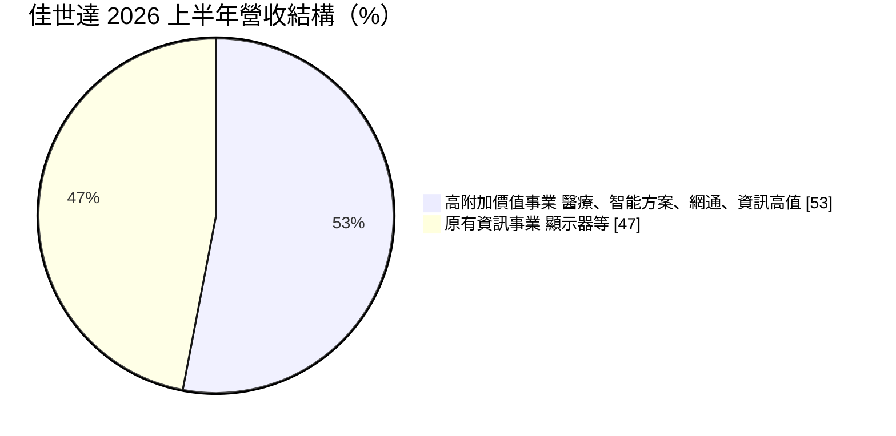
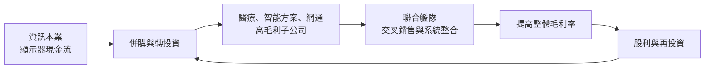
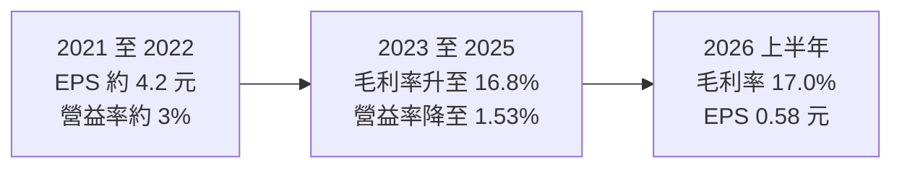
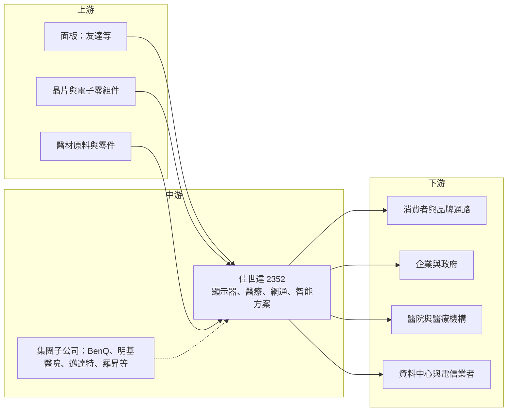

# 2352 佳世達

> 上市｜[[產業索引-電腦及週邊設備業|電腦及週邊設備業]]｜上市（櫃）日期 1996/07/22

# 第一章：企業模式與商業藍圖

> [!info] 撰寫說明
> 本文由 Claude 依公開資料整理，架構比照 [[2330台積電]] 的四章研究，資料截至 2026-10-08。財務數字來源：Goodinfo 年度經營績效頁（2020 至 2025 年）、證交所開放資料（基本資料、2026 年第二季資產負債與綜合損益、營益分析、股利）、富果研究 2026 年 8 月佳世達法說會整理、經濟日報法說報導；產業描述為整理性內容，尚未逐條比對原始文件，憑既有知識撰寫的部分已標「待校對」。#待校對

在評估單一個股的長期投資價值時，首要步驟是拆解企業的底層獲利邏輯。本章針對佳世達科技（股票代號：2352，以下簡稱佳世達）的商業模式進行分析，說明它如何從一家電腦周邊代工廠，透過併購與轉投資，轉型成以「大艦隊」形式經營的多元化科技集團。

## 一、核心定位：以控股集團模式經營的多元科技公司

佳世達成立於 1984 年，1996 年上市，實收資本額約 158 億元，董事長為陳其宏、總經理為柯淑芬（證交所開放資料）。公司前身為宏碁集團的明碁電腦，後來發展出 BenQ 品牌，2007 年品牌與製造分家後，製造本體更名為佳世達，BenQ 品牌則成為旗下子公司。#待校對

佳世達最重要的特色是「大艦隊」或「聯合艦隊」經營模式：母公司本身保有顯示器等資訊產品的設計製造，同時透過併購與轉投資，持有醫療、智能解決方案、網通、工業自動化等多家子公司，其中不少子公司本身也是上市櫃公司。2026 年第二季底，佳世達權益總計約 712 億元，其中非控制權益約 314 億元（證交所開放資料），接近一半的權益屬於子公司的其他股東，正好反映這種集團結構。

## 二、終端應用與產品板塊：五大事業群

佳世達把業務分為五大事業群：資訊科技（ITG）、醫療（MSG）、智能方案（BSG）、網路通訊（NCG），以及商業暨工業用（CIG）。2026 年上半年，高附加價值事業（智能方案、醫療、網通與資訊高值產品）營收約 552 億元，占總營收 53%，首度超越原有的資訊事業（富果研究整理）。

* **資訊科技：** 以 BenQ 等品牌的顯示器、投影機與代工業務為主，包含廣用、商用高階顯示器，以及強固型顯示器（船舶、工控、特殊車用）。這是佳世達最早的本業，規模大但利潤率較低。
* **醫療：** 包含醫療器材、專業醫療顯示器、醫療耗材，以及明基醫院的醫療服務。2026 年上半年營收創新高、年增 8%。
* **智能方案：** 提供企業與政府的資訊系統整合、雲端服務與智慧製造方案，旗下包含邁達特（雲端整合，與 AWS、微軟、Google Cloud 合作）與羅昇（智慧製造）等子公司。2026 年上半年營收與營業淨利雙創新高。
* **網路通訊：** 交換器、Wi-Fi、寬頻設備等，正在開發 1.6T 液冷交換器，2026 年第三季提供北美一線客戶測試。
* **AI 伺服器：** 已取得訂單，目標 2026 年第四季小量出貨，是佳世達切入 AI 基礎設施的新業務（經濟日報、富果研究）。

## 三、資本轉化邏輯：以併購拼出高毛利事業

佳世達的資本配置邏輯，是用本業的現金流與財務槓桿去併購較高毛利的公司，再把這些公司組成可以互相支援的「艦隊」。這種模式有三個特點：

* **毛利率提升：** 佳世達的毛利率由 2020 年的 14.0% 提高到 2026 年上半年的 17.0%（Goodinfo、證交所營益分析），反映高毛利事業比重上升。
* **營業費用也同步增加：** 每併購一家公司，就帶進一組研發、業務與管理團隊。2026 年上半年營業費用約 163.6 億元，幾乎吃掉了 177 億元的毛利，營業利益率只剩 1.29%（證交所開放資料）。
* **歸屬母公司的獲利被稀釋：** 許多子公司並非 100% 持有，子公司的獲利有相當比例屬於非控制權益。2026 年上半年本期淨利 14.2 億元中，歸屬母公司約 9.1 億元。

## 四、企業長期藍圖

佳世達的長期策略是「全面 AI 化」：以伺服器、高速交換器與散熱方案切入 AI 運算基礎設施，同時在視覺顯示、智慧製造與醫療照護中導入 AI 應用。另一個長期方向是持續提高高附加價值事業的比重，讓醫療與智能方案成為獲利的主要來源。

這個轉型方向在營收結構上已經看到成果，但在獲利上尚未明顯反映。2023 年後 EPS 由 4 元以上降到 1 元左右，2025 年只有 0.64 元。未來的關鍵是，集團能否從「把公司買進來」進入「讓公司彼此產生綜效」的階段。

# 第二章：護城河深度與競爭優勢

本章針對佳世達的競爭優勢進行分析。佳世達的護城河不在單一產品，而在多元事業的組合與系統整合能力。

## 一、護城河的核心組成要素

* **顯示器的設計與製造經驗：** 佳世達在顯示器與投影機領域累積數十年經驗，旗下 BenQ 品牌在設計、攝影與電競顯示器等利基市場具有知名度。#待校對 這是集團現金流的基本來源。
* **醫療事業的進入門檻：** 醫療器材需要取得各國法規認證，醫院經營需要專業團隊與在地關係。佳世達透過併購取得醫療器材廠與明基醫院，這些資產的進入門檻高，競爭者不容易在短期內複製。
* **系統整合與一站式服務：** 智能方案事業群整合軟體、硬體與雲端服務，能提供企業從設備到系統的完整方案。集團內部的子公司可以互相推薦客戶，形成交叉銷售。
* **多元化帶來的韌性：** 不同事業的景氣週期不同，消費性電子低迷時，醫療與企業 IT 的需求相對穩定，可以降低整體營運的波動。

## 二、全球主要競爭對手格局

| 業務 | 主要競爭者 | 佳世達的定位 |
|---|---|---|
| 顯示器 | Dell、LG、三星、[[2357華碩]]、[[2353宏碁]]、中國 TPV 冠捷 | 中高階利基品牌與代工 |
| 醫療器材 | 國際醫材大廠與台灣醫材公司 | 以併購建立產品線 |
| 系統整合 | [[2480敦陽科]]、[[6214精誠]] 等資訊服務商 #待校對 | 結合硬體與雲端服務 |
| 網通 | [[2345智邦]]、[[3596智易]]、[[2332友訊]] #待校對 | 規模較小，切入高速交換器 |
| AI 伺服器 | [[2382廣達]]、[[3231緯創]]、[[2317鴻海]] | 新進者 |

佳世達在每一個業務領域都不是龍頭，它的競爭策略是透過多個事業的組合，提供客戶整合性的方案，而不是在單一產品上和專業大廠正面對決。

## 三、優勢轉化：守得住、守不住與觀察重點

* **守得住：** 醫療與智能方案這類需要認證、服務與長期客戶關係的業務。這些業務的毛利率較高，客戶黏著度也較高。
* **守不住：** 一般顯示器與代工業務的價格。中國面板與顯示器廠的價格競爭激烈，佳世達在這類產品上很難維持利潤。
* **觀察重點：** 第一，高附加價值事業的營收比重超過一半後，營業利益率能否明顯提升；第二，AI 伺服器與 1.6T 交換器能否在 2026 至 2027 年形成實際營收；第三，集團是否會整併或處分綜效不佳的子公司，以提高資本效率。

# 第三章：財務體質與盈利規模

資料日期：2026-10-08。多年度數字取自 Goodinfo 年度經營績效頁，2026 年上半年取自證交所開放資料，表格是撰寫當時的快照；最新月營收、毛利率、累計 EPS 由自動排程寫在本筆記的屬性欄位（月營收、毛利率、累計EPS 等）。#待校對

財務報表是檢驗護城河是否真實存在的最終標準。本章用多年度的三率、ROE、現金流與資本報酬，檢視佳世達轉型過程中的獲利品質。

## 一、獲利能力的基石：三率

| 年度 | 營收（新台幣） | [[毛利率]] | [[營業利益率]] | EPS（元） | [[ROE]] |
|---|---|---|---|---|---|
| 2020 | 1,917 億 | 14.0% | 3.45% | 2.54 | 11.9% |
| 2021 | 2,260 億 | 14.4% | 3.26% | 4.22 | 16.8% |
| 2022 | 2,398 億 | 14.4% | 2.44% | 4.20 | 16.7% |
| 2023 | 2,036 億 | 16.2% | 2.46% | 1.51 | 6.93% |
| 2024 | 2,017 億 | 16.5% | 2.24% | 1.11 | 4.31% |
| 2025 | 2,079 億 | 16.8% | 1.53% | 0.64 | 2.20% |
| 2026 上半年 | 1,042.7 億 | 17.0% | 1.29% | 0.58 | 未查得 |

* **毛利率上升、營益率下滑：** 這是佳世達財報最值得注意的特徵。毛利率由 14% 提升到接近 17%，代表產品組合確實改善；但營業利益率由 3.45% 降到 1.53%，代表營業費用成長得比毛利更快。原因包括併購帶來的費用、醫療與系統整合業務本身的高人力成本，以及新業務的研發投入（推估）。
* **營收停滯：** 2020 至 2025 年營收年複合成長率約 1.6%（推算），2022 年後營收大致停在 2,000 億元上下。
* **業外與評價收益：** 佳世達持有友達等策略性投資，股價波動帶來的評價利益主要列在其他綜合損益。2026 年上半年其他綜合損益約 121.6 億元，遠高於本期淨利 14.2 億元（證交所開放資料），代表股東權益的變化很大一部分來自投資部位，而不是本業。

## 二、[[ROE]]：資本效率

2021 至 2025 年平均 ROE 約 9.4%（推算），但趨勢是由 16.8% 一路降到 2.2%。2026 年第二季底總負債約 1,593 億元、權益總計約 712 億元，負債比約 69%（證交所開放資料）。高負債比加上低 ROE，代表佳世達的併購擴張目前尚未轉化為足夠的獲利。

## 三、資本支出與自由現金流

佳世達的資本支出除了廠房設備，更大的部分是併購與轉投資，具體金額本次未查得。2026 年第二季存貨季增 39 億元、年增 92 億元，存貨週轉天數 102 天（富果研究整理），顯示營運資金壓力正在升高，[[自由現金流]]可能受到影響（推估）。

股利方面，2025 年度每股配發現金股利 1.0 元，高於當年 EPS 0.64 元，配發率超過 100%（證交所股利資料，推算）。公司動用過去的保留盈餘維持配息，這種做法短期內能穩定股東回報，但長期必須靠獲利回升才能持續。

## 四、[[ROIC]] 與 [[WACC]]：價值創造利差

* **ROIC（推算）：** 2025 年營業利益約 2,079 億元 × 1.53% ≈ 31.8 億元，稅後約 25.4 億元。投入資本以 2026 年第二季底權益總計 712 億元，加上假設的有息負債約 640 億元（開放資料未拆分借款，以總負債約四成推估，併購型集團的借款比例通常較高），合計約 1,352 億元，ROIC 約 1.9%（推算）。
* **WACC（推算）：** 無風險利率 1.75%、市場風險溢酬 6%，β 取電子股常見值 0.9，股東權益成本約 7.15%；負債成本 2.5%、稅後約 2.0%；權益約占 53%，WACC 約 4.7%（推算）。
* **結論：** 佳世達目前的 ROIC 明顯低於 WACC，代表以本業營業利益衡量，集團的併購與擴張尚未創造經濟價值。若把友達等投資的評價利益納入，整體報酬會較高，但那屬於投資收益而非本業競爭力。要讓利差轉正，關鍵在於降低營業費用率、提高高毛利事業的獲利貢獻。

# 第四章：總體風險與地緣政治

任何企業都無法脫離宏觀環境獨立存在。本章分析佳世達長期必須面對的地緣政治、產業週期與營運風險。

## 一、地緣政治風險

* **生產據點：** 佳世達的顯示器等產品在中國有大量產能，美中貿易摩擦與關稅可能迫使產能移轉，帶來額外成本。#待校對
* **海外醫療與系統整合：** 佳世達在歐洲等地併購醫療與系統整合公司，需要面對當地法規、匯率與經營管理的挑戰。#待校對
* **AI 伺服器出口管制：** 切入 AI 伺服器後，將受到美國高階晶片出口規範的約束。

## 二、產業週期與市場結構風險

* **消費性電子週期：** 顯示器與投影機需求受 PC 換機週期與消費景氣影響，2023 年後的需求下滑，是佳世達獲利衰退的主要原因之一。
* **[[長鞭效應]]：** 品牌與通路的庫存調整會放大訂單波動，2026 年存貨大幅增加，若需求不如預期，可能面臨跌價損失。
* **企業 IT 支出：** 智能方案業務依賴企業與政府的資訊支出，經濟衰退時預算可能被削減。

## 三、營運環境的隱性風險

* **併購整合風險：** 子公司數量眾多，管理複雜度高。若部分子公司長期虧損或綜效不如預期，可能需要認列商譽減損。
* **投資部位波動：** 友達等策略性投資的股價波動，會讓股東權益大幅變化，也可能影響公司的財務決策。
* **費用控制：** 營業費用占營收的比例持續上升，是本業獲利的最大壓力來源。

## 四、科技演進風險

AI 正在改變佳世達幾乎所有的業務：顯示器需要整合更多 AI 功能，醫療器材朝 AI 輔助診斷發展，資料中心需要更高速的交換器與液冷散熱。佳世達的優勢在於業務範圍廣，能在多個場景導入 AI；但風險在於資源分散，每一個領域都面對更專注、規模更大的對手。在 1.6T 交換器與 AI 伺服器等快速演進的領域，若產品推出時間落後一個世代，可能就失去市場機會。

# 專有名詞解析

## 金融

- **[[非控制權益]]**：子公司股東權益中不屬於母公司的部分，也就是子公司其他股東的持分。
- **[[商譽減損]]**：併購價格高於被併公司淨值的部分列為商譽，若被併公司獲利不如預期，就須認列損失。
- **[[毛利率]]**：營業毛利占營收的比例，反映產品定價能力與生產成本控制。
- **[[營業利益率]]**：扣除營業費用後的營業利益占營收的比例，衡量本業整體獲利能力。
- **[[ROE]]**：股東權益報酬率，稅後淨利除以股東權益，衡量公司運用股東資金的效率。
- **[[ROIC]]**：投入資本報酬率，稅後營業利益除以股東權益與有息負債的合計，衡量本業對所有資金提供者的報酬。
- **[[WACC]]**：加權平均資金成本，依股東權益與負債的比重加權計算的資金成本，ROIC 高於它才代表創造價值。
- **[[自由現金流]]**：營業活動現金流減去資本支出，代表企業可自由用於配息、還債或併購的現金。
- **[[長鞭效應]]**：終端需求的小幅變動，沿供應鏈往上游傳遞時被逐級放大，造成上游庫存與訂單劇烈波動。

## 產業

- **[[ODM]]**：原始設計製造，代工廠替品牌客戶負責產品設計與生產，品牌商負責行銷與銷售。
- **[[大艦隊模式]]**：佳世達以母公司帶領多家子公司，各自經營專業領域並互相支援的集團經營策略。
- **[[系統整合]]**：把軟體、硬體、網路與雲端服務整合成可直接使用的完整解決方案，提供給企業或政府。
- **[[強固型顯示器]]**：能承受震動、高低溫、潮濕等嚴苛環境的顯示器，用於船舶、工業控制與特殊車輛。
- **[[交換器]]**：在資料中心或企業網路中轉送資料封包的網路設備，AI 資料中心需要 800G、1.6T 等高速規格。
- **[[液冷]]**：以液體帶走伺服器晶片熱量的散熱方式，效率高於傳統氣冷，是高功率 AI 伺服器的主流方向。

# 核心供應鏈

## 1. 上游：面板與零組件
- 面板：[[2409友達]]（佳世達亦為策略性投資人）。
- 晶片、電子零組件、機構件與醫材原料。

## 2. 中游：佳世達與集團子公司
- 品牌：BenQ 顯示器與投影機。#待校對
- 醫療：明基醫院、鈺緯（醫療顯示器）等。
- 智能方案：[[6112邁達特]]、[[8374羅昇]]。#待校對
- 其他集團成員：[[8163達方]]、[[8215明基材]]、[[2397友通]]、[[3564其陽]]。#待校對

## 3. 下游：客戶
- 消費者與通路、企業與政府客戶、醫院、電信業者與北美一線資料中心客戶。

## 4. 同業與競爭者
- 顯示器：[[2357華碩]]、[[2353宏碁]]、冠捷。
- 網通：[[2345智邦]]、[[3596智易]]。
- AI 伺服器：[[2382廣達]]、[[3231緯創]]、[[2317鴻海]]。

## 最新新聞
<!-- news:start -->
<!-- news:end -->

## 相關連結
- [公開資訊觀測站](https://mopsov.twse.com.tw/mops/web/t05st03?step=1&firstin=1&co_id=2352)
- [Goodinfo](https://goodinfo.tw/tw/StockDetail.asp?STOCK_ID=2352)
- [Yahoo 股市](https://tw.stock.yahoo.com/quote/2352)
- [鉅亨網新聞](https://www.cnyes.com/twstock/2352/news)
