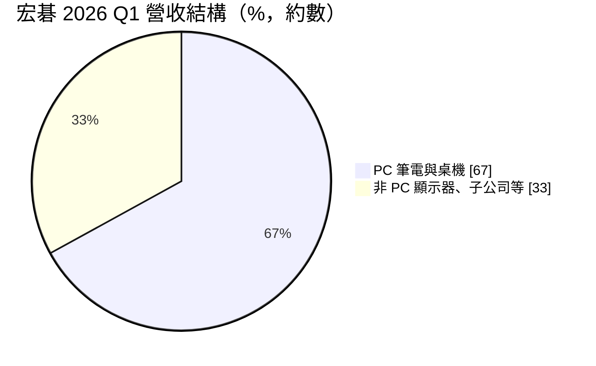
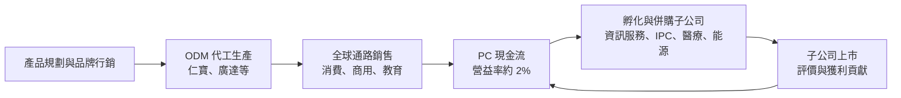
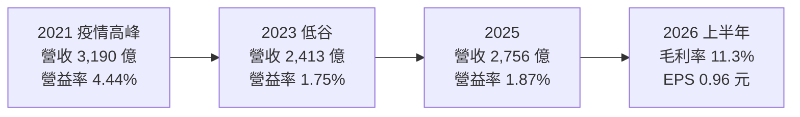
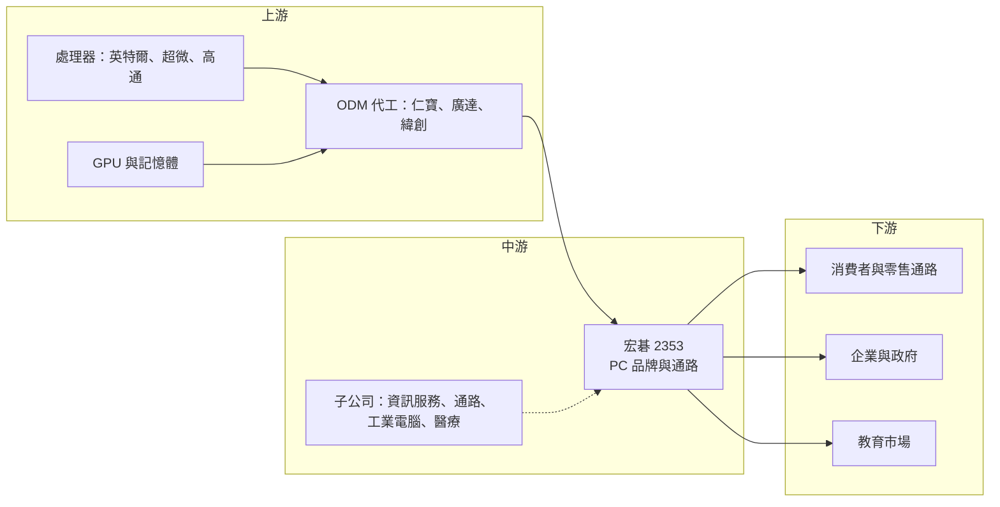

# 2353 宏碁

> 上市｜[[產業索引-電腦及週邊設備業|電腦及週邊設備業]]｜上市（櫃）日期 1996/09/18

# 第一章：企業模式與商業藍圖

> [!info] 撰寫說明
> 本文由 Claude 依公開資料整理，架構比照 [[2330台積電]] 的四章研究，資料截至 2026-10-08。財務數字來源：Goodinfo 年度經營績效頁（2020 至 2025 年）、證交所開放資料（基本資料、2026 年第二季資產負債與綜合損益、營益分析、股利）、富果研究 2026 年 5 月宏碁法說會整理、優分析 2026 年 2 月宏碁新春團拜報導；產業描述為整理性內容，尚未逐條比對原始文件，憑既有知識撰寫的部分已標「待校對」。#待校對

在評估單一個股的長期投資價值時，首要步驟是拆解企業的底層獲利邏輯。本章針對宏碁（股票代號：2353）的商業模式進行分析，說明一家台灣 PC 品牌如何在全球大廠夾擊下維持市場地位，以及它為何把長期成長押在「孵化子公司」上。

## 一、核心定位：專注品牌與通路的 PC 公司

宏碁由施振榮等人創立，公司登記成立日期為 1979 年，1996 年上市，實收資本額約 304.8 億元，董事長為陳俊聖、總經理為簡慧祥（證交所開放資料）。#待校對 宏碁早年同時經營品牌與代工，2000 年前後把代工業務分割為 [[3231緯創]]，自此專注於品牌經營，主要產品為筆記型電腦、桌上型電腦、顯示器與電競產品（Predator 品牌）。#待校對

宏碁屬於「品牌商」：它負責產品規劃、行銷、通路與售後服務，生產則大多委由 [[2324仁寶]]、[[2382廣達]] 等 [[ODM]] 代工。這個模式不需要龐大的工廠，資產較輕，但利潤來自品牌溢價與通路效率，而在 PC 這個高度標準化的產品上，品牌溢價有限。宏碁的毛利率長期約 10% 至 12%，營業利益率約 2% 至 4%（Goodinfo）。

## 二、終端應用與產品板塊：PC 與非 PC

宏碁的業務分為 PC 與非 PC 兩大類。依 2026 年第一季法說內容，非 PC 業務約占營收三分之一，而且非 PC 的獲利貢獻高於營收貢獻（富果研究整理）。

* **PC：** 筆電與桌機是宏碁的核心。PC 與顯示器之中，約 45% 是政府、中小企業與教育等商用機種（優分析）。宏碁在教育市場與 Chromebook 長期具備優勢。#待校對
* **[[AI PC]]：** 2025 年宏碁 AI PC 滲透率約 37%，管理層預期 2026 年突破 50%。AI PC 是推動換機與平均售價提升的主要動能。
* **非 PC：** 包含顯示器、電競周邊，以及由集團子公司經營的資訊服務、通路、工業電腦、醫療與能源等業務。2025 年 7 月宏碁合併工業電腦廠 [[8114振樺電]]，2026 年第一季振樺貢獻約 5% 營收，也拉高了整體毛利率。

## 三、資本轉化邏輯：輕資產品牌加孵化子公司

宏碁的資本配置可以拆成兩層：

* **第一層：PC 品牌。** 不需要大量資本支出，但需要龐大的營運資金來支應存貨與通路應收帳款。2026 年第一季末存貨約 777 億元，去年同期為 445 億元（富果研究整理），顯示零組件漲價與備貨會在短期內吃掉大量現金。
* **第二層：子公司孵化。** 宏碁把 PC 業務產生的現金與人才，投入新事業並推動子公司獨立上市。依 2026 年新春團拜的說法，集團內 17 家公開發行公司的獲利貢獻已超過集團的 50%，並已併購 7 家工業電腦相關企業（優分析）。這是宏碁與其他 PC 品牌最不同的地方。

## 四、企業長期藍圖

宏碁在 2026 年重新定調戰略：原有子公司全數升格為核心事業，營收占比超過 90%；並把工業電腦、醫療、能源與家電列為四大新領域，目前占比不到 10%，長期目標是讓核心與新事業接近 5 比 5（優分析）。能源領域透過特殊目的實體或跟投參與，部分標的可能進行首次公開發行。

這個藍圖的意義在於，宏碁承認 PC 品牌本身的成長與利潤空間有限，因此要把公司從「賣電腦的品牌」，逐步轉型為「以 PC 現金流支撐多元事業的集團」。長期觀察重點是新事業能否真正成長到足以影響集團獲利，而不只是增加子公司的數量。

# 第二章：護城河深度與競爭優勢

本章針對宏碁的競爭優勢進行分析。PC 品牌的護城河主要來自通路、品牌認知與成本效率，而宏碁在全球大廠之間，屬於規模較小但靈活的挑戰者。

## 一、護城河的核心組成要素

* **全球通路與在地經營：** 宏碁在歐洲、亞太、美洲等地長期經營零售與商用通路，在部分歐洲與亞洲市場具有較高的品牌知名度。#待校對 通路關係需要多年累積，新品牌難以在短期內建立。
* **教育與政府市場：** 教育市場重視價格、耐用度與管理功能，宏碁在 Chromebook 與教育筆電上具備長期經驗，這類標案的客戶關係與服務能力是進入門檻。#待校對
* **成本與營運效率：** 在毛利率約 11% 的產業中，宏碁必須以精簡的營業費用維持獲利。它採取「穩健定價」策略，成本上升時逐步調價，而不是一次全額轉嫁，以維持市占率（富果研究整理）。
* **集團子公司的多元收益：** 非 PC 子公司提供較高的利潤率與不同的景氣週期，讓宏碁的獲利不完全受 PC 市場左右。

## 二、全球主要競爭對手格局

| 公司 | 國家 | 定位 | 與宏碁的比較 |
|---|---|---|---|
| Lenovo | 中國 | 全球 PC 龍頭 | 規模、供應鏈與商用市場優勢 |
| HP | 美國 | 全球前二 | 商用與印表機業務 |
| Dell | 美國 | 商用 PC 與伺服器 | 企業客戶基礎深厚 |
| [[AAPL蘋果]] | 美國 | 高階 Mac | 自有晶片與生態系 |
| [[2357華碩]] | 台灣 | 消費與電競 PC、主機板 | 最直接的台灣同業 |
| [[2377微星]] | 台灣 | 電競 PC 與板卡 | 電競市場的競爭者 |

宏碁在全球 PC 品牌中屬於第二梯隊，市占率明顯低於 Lenovo、HP、Dell。#待校對 它的競爭策略不是正面與大廠拚規模，而是在教育、Chromebook、電競與特定區域市場建立利基。

## 三、優勢轉化：守得住、守不住與觀察重點

* **守得住：** 教育、商用與既有通路市場。這些市場重視服務與長期關係，宏碁在這些領域有穩定的基本盤。
* **守不住：** PC 的平均利潤率。PC 規格標準化，價格透明，品牌之間很難長期維持價差；零組件漲價時，品牌商往往只能吸收部分成本。2021 年營業利益率 4.44% 是疫情高峰的特例，之後長期回到 2% 以下。
* **觀察重點：** 第一，非 PC 子公司的獲利貢獻能否持續提升；第二，AI PC 能否帶動換機並提高平均售價；第三，宏碁的配息能力，因為 2025 年配息已超過當年 EPS。

# 第三章：財務體質與盈利規模

資料日期：2026-10-08。多年度數字取自 Goodinfo 年度經營績效頁，2026 年上半年取自證交所開放資料，表格是撰寫當時的快照；最新月營收、毛利率、累計 EPS 由自動排程寫在本筆記的屬性欄位（月營收、毛利率、累計EPS 等）。#待校對

財務報表是檢驗護城河是否真實存在的最終標準。本章用多年度的三率、ROE、現金流與資本報酬，檢視宏碁在 PC 循環中的獲利品質。

## 一、獲利能力的基石：三率

| 年度 | 營收（新台幣） | [[毛利率]] | [[營業利益率]] | EPS（元） | [[ROE]] |
|---|---|---|---|---|---|
| 2020 | 2,771 億 | 10.9% | 3.22% | 2.01 | 10.1% |
| 2021 | 3,190 億 | 11.7% | 4.44% | 3.63 | 17.6% |
| 2022 | 2,754 億 | 10.8% | 2.52% | 1.67 | 8.21% |
| 2023 | 2,413 億 | 10.7% | 1.75% | 1.64 | 7.47% |
| 2024 | 2,647 億 | 10.6% | 1.84% | 1.84 | 7.59% |
| 2025 | 2,756 億 | 10.9% | 1.87% | 1.26 | 6.35% |
| 2026 上半年 | 1,577.3 億 | 11.3% | 1.64% | 0.96 | 未查得 |

* **毛利率極度穩定：** 2020 至 2026 年上半年，毛利率幾乎都落在 10.6% 至 11.7% 之間。這反映 PC 品牌的定價模式：零件成本上升時調價、下降時降價，毛利率維持在固定區間，獲利主要取決於出貨量與費用控制。
* **營收長期持平：** 2020 至 2025 年營收年複合成長率接近 0%（推算），2021 年的高峰之後回落，2024 年起逐步回升。
* **業外比重高：** 2026 年上半年營業利益約 25.9 億元，營業外收入約 30.7 億元，業外已超過本業（證交所開放資料）。業外來源包括外匯評價利益與轉投資收益，代表宏碁的 EPS 有相當部分不是來自 PC 本業。

## 二、[[ROE]]：資本效率

2021 至 2025 年平均 ROE 約 9.4%（推算），疫情後大致穩定在 6% 至 8%。2026 年第二季底總負債約 2,089 億元、權益總計約 998 億元，其中非控制權益約 226 億元（證交所開放資料），反映多家子公司上市後由外部股東持有部分股權。

## 三、資本支出與自由現金流

宏碁是輕資產的品牌公司，廠房設備的[[CapEx]]不高，主要的資金需求來自存貨與應收帳款，以及併購與轉投資。2025 年以振樺電子等工業電腦公司為主的併購，是近年最大的資本配置。#待校對 由於營運資金會隨 PC 景氣大幅波動，[[自由現金流]]在旺季備貨時可能轉負，在去化庫存時轉正（推估）。

股利方面，2025 年度每股配發現金股利 1.3 元，略高於當年 EPS 1.26 元，配發率約 103%（證交所股利資料，推算）。公司章程採平衡股利政策，現金股利至少占全部股利的 10%。宏碁長期維持高配息率，但盈餘不足時動用保留盈餘配息，長期的可持續性取決於本業與子公司的獲利。

## 四、[[ROIC]] 與 [[WACC]]：價值創造利差

* **ROIC（推算）：** 2025 年營業利益約 2,756 億元 × 1.87% ≈ 51.5 億元，稅後約 41.2 億元。投入資本以 2026 年第二季底權益總計 998 億元，加上假設的有息負債約 500 億元（開放資料未拆分借款，以總負債約四分之一推估，品牌商負債中應付帳款占比高），合計約 1,498 億元，ROIC 約 2.8%（推算）。
* **WACC（推算）：** 無風險利率 1.75%、市場風險溢酬 6%，β 取 PC 品牌股常見值 0.9，股東權益成本約 7.15%；負債成本 2.5%、稅後約 2.0%；權益約占 67%，WACC 約 5.4%（推算）。
* **結論：** 以本業營業利益計算，宏碁的 ROIC 低於 WACC，PC 品牌本身難以創造經濟價值。宏碁的整體報酬（ROE 約 6% 至 8%）較高，主要是因為業外收益與子公司投資的貢獻。這也說明宏碁為何要把成長押在子公司：只有讓非 PC 事業成為主要的獲利來源，整體資本報酬才可能長期高於資金成本。

# 第四章：總體風險與地緣政治

任何企業都無法脫離宏觀環境獨立存在。本章分析宏碁長期必須面對的地緣政治、產業週期與營運風險。

## 一、地緣政治風險

* **美國關稅：** 宏碁的產品大多在中國與東南亞生產，美國關稅會直接提高進口成本。宏碁先前已就受美國關稅影響的款項申請退款（富果研究整理），顯示關稅對品牌商的成本影響實際存在。
* **供應鏈移轉：** 代工夥伴把產能從中國移往越南、泰國、印度等地，品牌商需要配合調整物流與認證，過渡期可能影響出貨。
* **區域市場風險：** 宏碁在歐洲、亞太等地的營收比重較高，各地經濟與政策變化都會影響需求。#待校對

## 二、產業週期與市場結構風險

* **PC 換機週期：** PC 需求通常每 3 至 5 年出現一次換機潮，2020 至 2021 年的疫情帶來超額需求，之後經歷長時間的庫存調整。AI PC 與作業系統更新被視為下一波換機動能，但效果仍待觀察。
* **[[長鞭效應]]：** 通路與品牌在需求旺盛時大量備貨，需求轉弱時同步去庫存。2026 年第一季存貨大幅增加，若需求不如預期，可能面臨降價促銷與跌價損失。
* **市場集中：** 全球 PC 市場由少數大廠主導，前三大的規模優勢持續擴大，第二梯隊品牌的生存空間受到壓縮。

## 三、營運環境的隱性風險

* **零組件價格：** 記憶體、儲存與處理器價格上漲時，品牌商難以立即轉嫁，毛利會受到壓縮。
* **匯率：** 宏碁以美元採購、以多種貨幣銷售，歐元、新台幣與其他貨幣的匯率變化會影響營收與毛利。
* **子公司管理：** 子公司數量眾多，若部分新事業長期虧損，可能拖累集團獲利，也可能需要認列投資減損。

## 四、科技演進風險

AI PC 是 PC 產業近年最重要的技術轉變。處理器內建 NPU 後，PC 可以在本機執行 AI 功能，這可能縮短換機週期，也可能讓 [[AAPL蘋果]] 等擁有自有晶片的公司進一步拉開差距。宏碁本身不開發處理器，依賴 [[INTC英特爾]]、[[AMD超微]]、[[QCOM高通]] 等平台，差異化主要來自產品設計、軟體與服務。長期而言，若 PC 的價值越來越集中在晶片與作業系統，品牌商的議價能力可能進一步下降，這也是宏碁積極發展非 PC 業務的根本原因。

# 專有名詞解析

## 金融

- **[[業外收益]]**：營業活動以外的收入，例如投資收益、匯兌利益與處分資產利益，穩定性通常低於本業。
- **[[毛利率]]**：營業毛利占營收的比例，反映產品定價能力與生產成本控制。
- **[[營業利益率]]**：扣除營業費用後的營業利益占營收的比例，衡量本業整體獲利能力。
- **[[ROE]]**：股東權益報酬率，稅後淨利除以股東權益，衡量公司運用股東資金的效率。
- **[[ROIC]]**：投入資本報酬率，稅後營業利益除以股東權益與有息負債的合計，衡量本業對所有資金提供者的報酬。
- **[[WACC]]**：加權平均資金成本，依股東權益與負債的比重加權計算的資金成本，ROIC 高於它才代表創造價值。
- **[[CapEx]]**：資本支出，企業用於購置廠房、設備等長期資產的支出。
- **[[自由現金流]]**：營業活動現金流減去資本支出，代表企業可自由用於配息、還債或併購的現金。
- **[[長鞭效應]]**：終端需求的小幅變動，沿供應鏈往上游傳遞時被逐級放大，造成上游庫存與訂單劇烈波動。

## 產業

- **[[ODM]]**：原始設計製造，代工廠替品牌客戶負責產品設計與生產，品牌商負責行銷與銷售。
- **[[AI PC]]**：內建神經網路處理器（NPU）、能在本機執行 AI 運算的個人電腦。
- **[[NPU]]**：神經網路處理器，專門用來執行 AI 運算的晶片單元，耗電比 CPU 或 GPU 低。
- **[[Chromebook]]**：搭載 Google ChromeOS 作業系統的筆電，價格較低、管理方便，廣泛用於教育市場。
- **[[工業電腦]]**：用於工廠、交通、醫療等場域的電腦，強調耐用、長期供貨與客製化，利潤率高於一般 PC。
- **[[換機週期]]**：消費者或企業更換電腦的平均時間間隔，常見為 3 至 5 年，決定 PC 市場的需求高低。

# 核心供應鏈

## 1. 上游：平台與代工
- 處理器與 GPU：[[INTC英特爾]]、[[AMD超微]]、[[QCOM高通]]、[[NVDA輝達]]。
- 作業系統：[[MSFT微軟]]、[[GOOGL谷歌]]（ChromeOS）。
- ODM 代工：[[2324仁寶]]、[[2382廣達]]、[[3231緯創]]。#待校對

## 2. 中游：宏碁與子公司
- 宏碁 PC 品牌（含 Predator 電競）。
- 工業電腦：[[8114振樺電]]（2025 年合併）。
- 其他子公司：宏碁資訊、展碁國際、安碁資訊等。#待校對

## 3. 下游：客戶
- 消費者與零售通路、企業與政府標案、教育市場。

## 4. 同業與競爭者
- Lenovo、HP、Dell、[[AAPL蘋果]]、[[2357華碩]]、[[2377微星]]。

## 最新新聞
<!-- news:start（自動產生，請勿手動編輯此範圍） -->
- 2026-10-07 🏛️ 重訊 16:31｜代子公司雲川興業股份有限公司公告申請持有之振樺電子股份有限公司 甲種特別股轉換為普通股｜[觀測站](https://mops.twse.com.tw/mops/#/web/t05st01)

完整紀錄：[[2353宏碁 新聞]]
<!-- news:end -->

## 相關連結
- [公開資訊觀測站](https://mopsov.twse.com.tw/mops/web/t05st03?step=1&firstin=1&co_id=2353)
- [Goodinfo](https://goodinfo.tw/tw/StockDetail.asp?STOCK_ID=2353)
- [Yahoo 股市](https://tw.stock.yahoo.com/quote/2353)
- [鉅亨網新聞](https://www.cnyes.com/twstock/2353/news)
