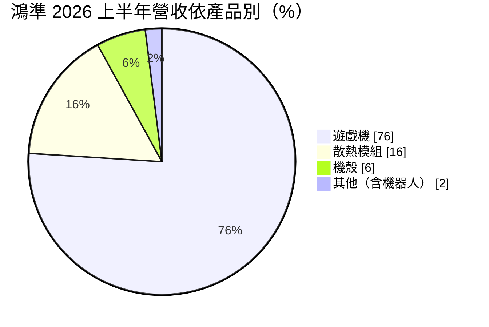
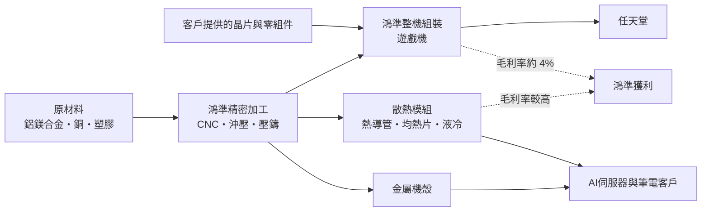
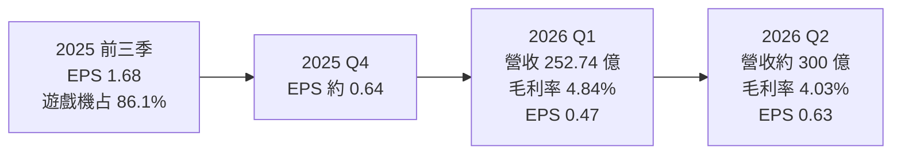
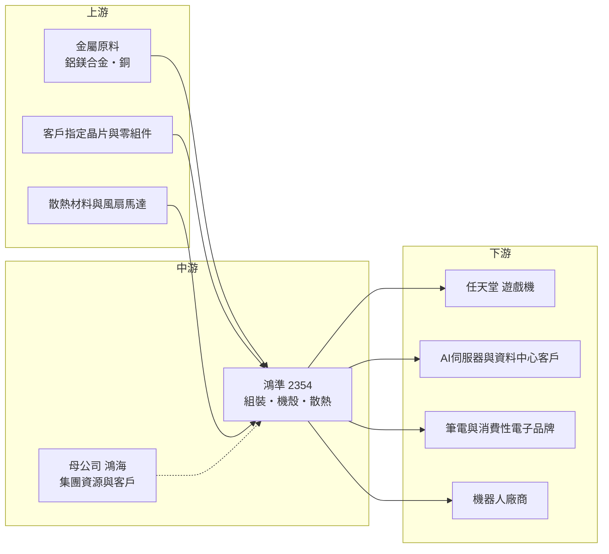

# 2354 鴻準

> 上市｜[[產業索引-其他電子業|其他電子業]]｜上市（櫃）日期 1996/10/08

# 第一章：企業模式與商業藍圖

> [!info] 撰寫說明
> 本文由 Claude 依公開資料整理，架構比照 [[2330台積電]] 的四章研究，資料截至 2026-10-07。財務數字來源：富果研究（鴻準 2025 年 12 月、2026 年 6 月與 9 月法說會摘要）、旺得富／工商時報（2026 年第一季財報與股東會報導）、winvest（2025 年財報與除權息資料）、鉅亨網專欄（2025 年 8 月產業研究）、nstock 公司資料；產業描述為整理性內容，尚未逐條比對原始文件。#待校對

在評估單一個股的長期投資價值時，首要步驟是拆解企業的底層獲利邏輯。本章針對鴻準精密（股票代號：2354，以下簡稱鴻準）的商業模式進行定性分析，說明一家以金屬機殼與散熱模組起家的鴻海集團子公司，為何在 2025 年營收暴增後毛利率只剩約 4%，以及它如何嘗試轉向 AI 散熱與機器人。

## 一、核心定位：鴻海集團的機構件與遊戲機組裝平台

鴻準成立於 1990 年 4 月 26 日，資本額約 141.45 億元，是 [[2317鴻海]] 集團旗下的上市子公司。過去鴻準以筆電與手機的金屬機殼、[[CNC]] 精密加工與散熱模組聞名，近年營收結構大幅改變：

* **遊戲機組裝成為主體：** 鴻準是任天堂新一代遊戲機 Switch 2 的機殼與組裝供應商。Switch 2 於 2025 年上市後熱賣，鴻準 2025 年上半年營收年增超過 218%，全年營收達 1,560.65 億元。
* **散熱模組與機殼退居第二：** 散熱模組占比由 2024 年的約 20% 降到 2025 年前三季的 8.4%，但金額大致持平；2026 年起受 AI 伺服器帶動重新成長。

這種轉變讓鴻準的營收規模放大數倍，但組裝業務的附加價值低，毛利率也隨之從過去的雙位數降到個位數。

## 二、終端應用／產品板塊：遊戲機占近八成

2026 年上半年的產品營收結構如下：

* **遊戲機：** 任天堂 Switch 2 的機殼與整機組裝。2025 年前三季遊戲機占營收 86.1%，2026 年第一季降到 78%、上半年 76%，反映新機上市第一年的拉貨高峰過後，出貨量回到正常水準。
* **[[散熱模組]]：** 包括筆電、伺服器用的熱導管、均熱片、風扇與[[液冷]]元件。2026 年第一季散熱模組年增超過 40%，主要來自[[AI伺服器]]需求；鴻準已通過輝達 GB200 機櫃風扇散熱認證（依 2025 年 8 月報導）。
* **機殼：** 筆電與消費性電子的金屬機殼，2026 年第一季年增超過 30%。
* **其他與機器人：** 鴻準參與鴻海 FoxBot 工業機器人製造，並向全球主要機器人廠送樣，機器人業務 2026 年第一季接近倍增，但占營收比重仍只有約 2%。

## 三、資本轉化邏輯（營運模式）：大量低毛利的組裝營收

* **營收大、毛利薄：** 整機組裝的料件多由客戶指定，鴻準只賺組裝加工費。2026 年第二季營收約 300 億元，[[毛利率]]只有 4.03%、[[營業利益率]] 1.13%，淨利率 2.89% 反而高於營業利益率，顯示業外收入是獲利的重要部分。
* **產品組合決定毛利：** 散熱與機殼的毛利率高於組裝，遊戲機占比下降、散熱占比上升時，毛利率會改善。2026 年第一季遊戲機占比降到 78%，毛利率回升到 4.84%，為近一年半高點。
* **鴻海集團資源：** 鴻準與鴻海共享客戶、供應鏈與海外據點，機器人與資料中心業務也與鴻海的布局連動。

## 四、企業長期藍圖：「機、智、材、料、通」五大主軸

公司把未來發展歸納成五大主軸：

* **機（機器人服務）：** 發展人形與服務型機器人零組件與 [[RaaS]]（機器人即服務）模式，公司預期機器人業務在 3 至 5 年內成為核心產品。
* **智（智慧平台與 AI 自動化）：** 以 AI 製程優化與自動化檢測提升工廠效率。
* **材（高效散熱材料）：** 自製碳纖維、玻璃纖維與新型散熱材料。
* **料（資料中心）：** 資料中心算力與散熱解決方案，預期 2026 年下半年開始貢獻營收。
* **通（通訊元件）：** 光通訊與[[低軌衛星]]通訊元件。

在美國布局上，董事會已批准 10 億美元戰略投資計畫，肯塔基州路易維爾工廠預計 2026 年第四季試產，主攻高毛利的 AI 裝置與智慧自動化產品，公司目標投產後 1 至 2 年內損益兩平。另外，鴻準也取得二類醫材代工訂單，嘗試跨入醫療領域。

# 第二章：護城河深度與競爭優勢

在長期價值投資中，「護城河」指企業抵禦競爭、維持超額利潤的保護機制。本章分析鴻準的護城河構成、主要競爭對手，以及這些優勢能否支撐它從組裝廠轉型。

## 一、鴻準護城河的核心組成要素

鴻準的護城河屬於「窄護城河」，主要來自：

* **1. 精密金屬加工能力：** 過去替國際品牌大量生產 CNC 金屬機殼，累積了精密加工、表面處理與量產良率的經驗，可延伸到散熱元件與機器人關節零件。
* **2. 單一大客戶的深度綁定：** 鴻準是任天堂 Switch 2 的主要組裝與機殼供應商，在遊戲機生命週期內（通常 5 年以上）訂單相對穩定。
* **3. 鴻海集團的規模與資源：** 背靠全球最大 [[EMS]] 集團，在採購議價、海外設廠、客戶開發與 AI 伺服器生態系上都有支援。

但這些優勢都不是鴻準獨有的技術壁壘，組裝業務本身的護城河很淺。

## 二、全球主要競爭對手格局

| 對手 | 定位 | 對鴻準的威脅 |
|---|---|---|
| [[3324雙鴻]] | AI 伺服器液冷散熱領導廠 | 在液冷水冷板與機櫃散熱領先，規模與認證優於鴻準 |
| [[3017奇鋐]] | 散熱模組大廠，氣冷與液冷並進 | 在 AI 伺服器散熱市占高 |
| [[2324仁寶]]、[[4938和碩]] | 大型 ODM 與 EMS | 在遊戲機與消費性電子組裝爭取訂單 |
| [[2312金寶]] | 消費性電子代工 | nstock 列為同業競爭者 |
| [[2317鴻海]] 集團內其他事業 | 集團資源分配 | 同集團內部的業務分工可能限制鴻準的接單範圍 |

## 三、優勢轉化：哪些市場守得住、哪些守不住

* **守得住：** 任天堂遊戲機組裝。在 Switch 2 生命週期內，客戶更換組裝廠的成本高，訂單相對穩定，但成長性會隨週期下滑。
* **守不住或需證明：** AI 伺服器散熱。液冷市場由雙鴻、奇鋐等專業散熱廠主導，鴻準屬後進者，散熱模組占營收只有約 16%。
* **觀察重點：** 散熱模組能否持續以 40% 以上的速度成長、肯塔基廠能否如期試產並轉盈，以及機器人業務能否從送樣進入規模量產。這些新業務若無法放大，鴻準的獲利將持續隨遊戲機週期起伏。

# 第三章：財務體質與盈利規模

資料日期：2026-10-07。數字取自富果研究、工商時報、winvest 與 nstock 整理的財報資料，表格是撰寫當時的快照；最新月營收、毛利率、累計 EPS 由自動排程寫在本筆記的屬性欄位（月營收、毛利率、累計EPS 等）。#待校對

財務報表是檢驗護城河是否真實存在的最終標準。本章用三率、ROE、現金流與資本報酬，檢視鴻準在遊戲機週期下的獲利品質。

## 一、獲利能力的基石：三率

| 項目 | 2025 全年 | 2025 前三季 | 2026 Q1 | 2026 Q2 |
|---|---|---|---|---|
| 營收（新台幣） | 1,560.65 億 | 未查得 | 252.74 億 | 約 300 億 |
| [[毛利率]] | 未查得 | 未查得 | 4.84% | 4.03% |
| [[營業利益率]] | 未查得 | 未查得 | 1.48% | 1.13% |
| [[淨利率]] | 約 2.0%（推算） | 未查得 | 2.59% | 2.89% |
| 稅後淨利 | 31.19 億 | 23.7 億 | 6.63 億 | 未查得 |
| EPS（元） | 2.32 | 1.68 | 0.47 | 0.63 |

2025 年淨利率以稅後淨利 31.19 億元除以營收 1,560.65 億元推算；2025 年第四季 EPS 約 0.64 元（全年減前三季推算）。

* **營收：** 2025 年營收 1,560.65 億元，相較 2024 年大幅成長，主因是 Switch 2 上市。2026 年第一季營收季減 40.54%、年減 15.75%，拉貨高峰已過；7、8 月營收明顯回升，公司預期下半年營運持續改善。
* **[[毛利率]]與[[營業利益率]]：** 組裝業務拉低整體毛利率至 4% 至 5%，營業利益率只有約 1%，對營收或匯率的小幅變化非常敏感。
* **業外收入：** 淨利率高於營業利益率，代表業外收入（利息、投資收益等）是獲利的重要支柱；2025 年第二季新台幣升值時，匯損也曾明顯侵蝕獲利。

## 二、[[ROE]]：資本效率

鴻準 2025 年 EPS 2.32 元，相較其股本與歷年累積的淨值，ROE 屬中低水準（推估，具體數值未查得）。鴻準帳上長期保有較多現金與轉投資，資產周轉率雖因遊戲機營收放大而提高，但低毛利使資本報酬受限。

## 三、資本支出與[[自由現金流]]

* **[[CapEx]]：** 美國 10 億美元戰略投資計畫是近年最大的資本承諾，肯塔基廠 2026 年第四季試產；若全數執行，相對於鴻準一年約 30 億元的淨利，屬於大規模投資（推估執行時程將分多年）。
* **股利：** 2025 年度配發現金股利 1.5 元，於 2026 年 7 月 2 日除息，總發放金額約 21.22 億元，配息率約 65%，殖利率約 2.7%。
* **自由現金流：** 組裝業務需要大量營運資金支應存貨與應收帳款，加上美國投資，未來兩年自由現金流可能轉弱（推估）。

## 四、[[ROIC]] 與 [[WACC]]：價值創造利差

以營業利益率約 1% 的水準，鴻準本業的 ROIC 很可能低於或接近資金成本（推估，具體數值未查得），獲利仰賴業外收入。要創造價值，鴻準需要把營收結構轉向毛利率較高的 AI 散熱、機器人與美國高附加價值產品；美國投資若無法在 1 至 2 年內損益兩平，將進一步稀釋資本報酬。

# 第四章：總體風險與地緣政治

任何企業都無法脫離宏觀環境獨立存在。本章分析鴻準未來必須面對的地緣政治、產業週期、營運與技術風險。

## 一、地緣政治風險

* **美國關稅與遊戲機產地：** 遊戲機大量銷往美國，美國對中國或越南產品的關稅變化，會影響任天堂的生產地分配與鴻準的組裝訂單。
* **美國設廠的機會與成本：** 肯塔基廠有助於爭取美國在地化訂單，但美國人力與營運成本高，損益兩平需要時間。
* **中國產能集中：** 鴻準與鴻海集團在中國有大量生產基地，美中摩擦升溫時面臨轉移產能的壓力。

## 二、產業週期與市場結構

* **遊戲機生命週期：** 遊戲機通常在上市首年出貨最高，之後逐年下滑，直到下一代機種推出。鴻準營收約四分之三來自遊戲機，2026 年第一季營收已年減約 16%，未來幾年營收可能隨週期遞減。
* **[[長鞭效應]]：** 遊戲機與消費性電子的需求變化，透過品牌商的庫存調整放大到組裝廠，季度營收波動很大。
* **匯率：** 營收以美元計價，營業利益率又只有約 1%，新台幣升值很容易讓本業轉為虧損。

## 三、營運環境的隱性風險

* **單一客戶集中：** 任天堂占營收比重極高，若客戶分散組裝訂單或銷售不如預期，影響直接且巨大。
* **新業務執行：** 機器人、資料中心、低軌衛星等新業務都還在早期，營收貢獻小，投入卻持續增加。
* **集團分工：** 作為鴻海子公司，業務範圍可能受到集團內部分工影響，與母公司及其他子公司的關係人交易也需留意。

## 四、科技或法規演進

* **散熱技術路線：** AI 伺服器從氣冷轉向液冷、甚至[[浸沒式冷卻]]，散熱廠需要持續投資新技術，鴻準在液冷領域需追趕領先者。
* **機器人產業標準：** 人形機器人仍在早期，技術路線與商業模式尚未定型，提早投入的風險與機會並存。
* **醫材法規：** 跨入二類醫材代工需要符合醫療器材品質系統與法規，認證時間長。

# 專有名詞解析

## 應用

- **[[AI伺服器]]**：搭載 GPU 或 AI 加速器、用於訓練與推論的伺服器，功耗與散熱需求遠高於一般伺服器。

## 金融

- **[[毛利率]]**：毛利除以營收，代表產品扣除直接成本後的獲利空間；組裝業務的毛利率通常只有個位數。
- **[[營業利益率]]**：營業利益除以營收，反映本業扣除研發、管銷費用後的獲利能力。
- **[[淨利率]]**：稅後淨利除以營收，包含業外收支，代表每一元營收最後留給股東的獲利。
- **[[長鞭效應]]**：終端需求的小幅變動，沿供應鏈往上游傳遞時被逐級放大，造成上游庫存與訂單劇烈波動。

## 產業

- **[[散熱模組]]**：由熱導管、均熱片、散熱鰭片與風扇組成，把晶片產生的熱帶走，是筆電與伺服器的必要零件。
- **[[液冷]]**：以液體流經貼在晶片上的冷板帶走熱量，散熱效率遠高於風扇氣冷，是高功耗 AI 伺服器的主流方案。
- **[[浸沒式冷卻]]**：把伺服器整個浸泡在不導電的冷卻液中散熱，效率更高，但系統改動大。
- **[[CNC]]**：電腦數值控制加工，以程式控制刀具切削金屬，用於生產精密的金屬機殼與零件。
- **[[EMS]]**：電子製造服務，替品牌客戶代工電路板組裝、測試與整機組裝的產業，代表廠商為鴻海、和碩。
- **[[RaaS]]**：機器人即服務，客戶以租用或按使用量付費的方式取得機器人與服務，而非一次買斷。
- **[[低軌衛星]]**：在距地表約數百至兩千公里軌道運行的通訊衛星，需要大量地面終端與衛星通訊元件。

# 核心供應鏈

## 1. 上游：原材料與零組件
- 金屬與散熱材料：鋁鎂合金、銅材供應商（個別名稱未查得）
- 遊戲機晶片與零組件：由客戶指定，例如 [[NVDA輝達]] 提供 Switch 2 處理器（依產業常見資料，未逐一比對）

## 2. 中游：鴻準本身與集團
- 母公司：[[2317鴻海]]
- 散熱同業：[[3324雙鴻]]、[[3017奇鋐]]

## 3. 下游：主要客戶
- 遊戲機：任天堂
- AI 伺服器：輝達 GB200 機櫃供應鏈（已通過風扇散熱認證）
- 機器人：鴻海 FoxBot 與國際機器人廠

## 4. 組裝同業
- [[2324仁寶]]、[[4938和碩]]、[[2312金寶]]

## 最新新聞
<!-- news:start -->
<!-- news:end -->

## 相關連結
- [公開資訊觀測站](https://mopsov.twse.com.tw/mops/web/t05st03?step=1&firstin=1&co_id=2354)
- [Goodinfo](https://goodinfo.tw/tw/StockDetail.asp?STOCK_ID=2354)
- [Yahoo 股市](https://tw.stock.yahoo.com/quote/2354)
- [鉅亨網新聞](https://www.cnyes.com/twstock/2354/news)
