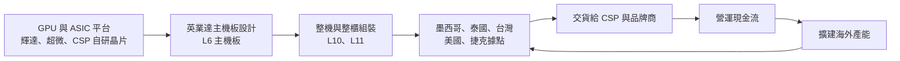
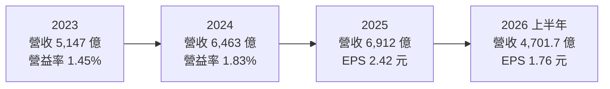
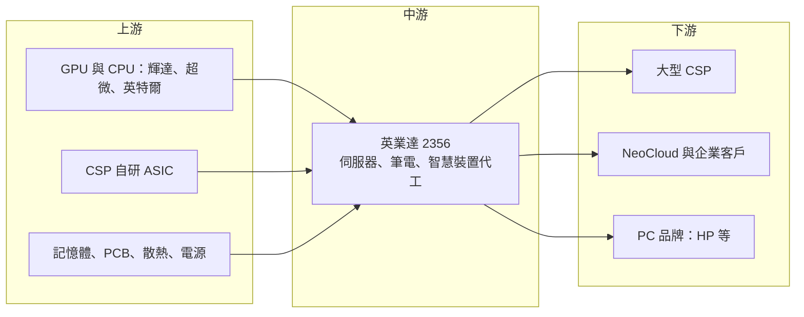

# 2356 英業達

> 上市｜[[產業索引-電腦及週邊設備業|電腦及週邊設備業]]｜上市（櫃）日期 1996/11/13

# 第一章：企業模式與商業藍圖

> [!info] 撰寫說明
> 本文由 Claude 依公開資料整理，架構比照 [[2330台積電]] 的四章研究，資料截至 2026-10-08。財務數字來源：Goodinfo 年度經營績效頁（2020 至 2025 年）、證交所開放資料（基本資料、2026 年第二季資產負債與綜合損益、營益分析、股利）、優分析 2025 至 2026 年英業達法說與營收報導；產業描述為整理性內容，尚未逐條比對原始文件，憑既有知識撰寫的部分已標「待校對」。#待校對

在評估單一個股的長期投資價值時，首要步驟是拆解企業的底層獲利邏輯。本章針對英業達（股票代號：2356）的商業模式進行分析，說明這家以伺服器主機板起家的代工廠，如何在 AI 伺服器浪潮中調整角色，以及它和其他電子代工廠的差異。

## 一、核心定位：伺服器比重最高的台灣代工廠之一

英業達成立於 1975 年，1996 年上市，實收資本額約 358.7 億元，董事長為葉力誠、總經理為蔡枝安（證交所開放資料）。創辦團隊包括李詩欽、葉國一與溫世仁等人，早期以計算機與電子字典起家，之後進入筆電與伺服器代工。#待校對

英業達與其他筆電代工廠最大的差別在於，伺服器長期是它的核心業務。英業達很早就成為國際伺服器品牌的主機板與整機供應商，累積了伺服器設計、驗證與量產的經驗。#待校對 在 AI 伺服器興起後，這段經驗讓英業達能夠承接 [[NVDA輝達]] HGX 平台主機板、[[ASIC]] 伺服器與 [[AMD超微]] 平台等多種 AI 伺服器訂單。

## 二、終端應用與產品板塊

英業達的業務分為伺服器、筆電與智慧裝置三大類。各業務的營收比重本次未查得精確數字，以下依法說內容整理：

* **伺服器：** 英業達最重要的業務。2025 年 AI 伺服器約占伺服器營收 40% 至 45%，排除買賣料（Buy and Sell）後的 AI 伺服器營收年增約 40%；2026 年 AI 伺服器占比預期超過五成（優分析）。AI 伺服器客戶組合中，輝達 HGX 平台貢獻最大，ASIC 伺服器第二，AMD 平台第三。大型 [[CSP]] 的成長速度預期高於企業伺服器，2025 年起也開始有 [[NeoCloud]] 客戶貢獻營收。
* **筆電：** 以 HP 等品牌為主要客戶，2026 年 7 月單月出貨約 160 萬台（優分析）。#待校對 筆電是英業達的基本盤，提供穩定的現金流，但成長有限。
* **智慧裝置：** 包含穿戴式裝置、智慧家庭與其他消費性電子產品，預期維持個位數成長。

## 三、資本轉化邏輯：伺服器設計能力加全球製造

英業達的商業模式和其他代工廠相似，都是以龐大營收換取薄利，但它有兩個特點：

* **主機板設計是核心能力：** AI 伺服器的主機板層數多、訊號速度高、功耗大，設計難度遠高於一般伺服器。英業達在 [[L6]] 主機板階段的設計與製造經驗，讓它能在每一代新平台推出時，及早參與客戶的設計。
* **買賣料影響營收的解讀：** 代工廠替客戶採購 GPU 等高價零件再轉售時，營收會大幅放大，但利潤率會被稀釋。若客戶改為自行採購關鍵零件（不經代工廠帳上），營收會變小，但毛利率反而會提高。英業達法說也提到，L10 採購方式的調整可能讓營收分母縮小、毛利率改善（優分析）。

## 四、企業長期藍圖

英業達的長期策略是以 AI 伺服器作為成長主軸，並擴建海外產能。2025 年 12 月董事會通過約 146 億元的新一波資本支出，其中包括在桃園自有土地委建廠房約 88 億元、增資美國子公司 1.1 億美元、增資泰國子公司 61 億泰銖（優分析）。墨西哥廠已成為伺服器出貨的核心據點，具備 L6 主機板與 L10、[[L11]] 整機的組裝測試能力，並持續把部分 L6 產線由亞洲移入。

這代表英業達正在從「以亞洲為中心的代工廠」轉型為「亞洲與北美雙聚落的伺服器製造商」。長期而言，靠近客戶的北美產能能降低關稅與運輸成本，也提高大型專案的接單機會。

# 第二章：護城河深度與競爭優勢

本章針對英業達的競爭優勢進行分析。在 AI 伺服器代工市場，鴻海、廣達、緯創都是強勁對手，英業達的優勢在於長期累積的伺服器設計經驗與多元的平台布局。

## 一、護城河的核心組成要素

* **伺服器主機板的設計與量產經驗：** 英業達長期是國際伺服器品牌的主要主機板供應商。#待校對 伺服器主機板的可靠度要求遠高於消費性產品，需要長時間的驗證與客戶信任。這種經驗讓英業達能承接 AI 伺服器最複雜的主機板設計。
* **多平台客戶組合：** 英業達同時承接輝達 HGX、ASIC 與 AMD 平台的 AI 伺服器，不完全依賴單一 GPU 廠。若 CSP 自研 ASIC 晶片的比重提高，英業達在 ASIC 伺服器的布局能分散風險。
* **北美產能：** 墨西哥廠已具備從主機板到整櫃的完整能力。在美國關稅與在地化要求下，北美產能是爭取美國 CSP 訂單的重要條件。
* **客戶關係的延續性：** 伺服器代工與品牌、CSP 的合作通常跨越多個世代，一旦進入供應鏈，後續平台的訂單延續性較高。

## 二、全球主要競爭對手格局

| 公司 | AI 伺服器定位 | 與英業達的比較 |
|---|---|---|
| [[2317鴻海]] | 全球最大，從零組件到整櫃垂直整合 | 規模與垂直整合遠勝 |
| [[2382廣達]] | CSP 整櫃主要供應商 | 整櫃與 CSP 關係領先 |
| [[3231緯創]] | 輝達 GPU 模組與主機板主要供應商 | 在主機板上直接競爭 |
| [[6669緯穎]] | 專注 CSP 資料中心 | 大型 CSP 整機優勢 |
| [[2324仁寶]] | 新進 AI 伺服器廠商 | 起步較晚 |
| 美國 Supermicro、Celestica 等 | 品牌與北美代工 | 在北美市場競爭 #待校對 |

在 AI 伺服器代工市場，英業達屬於第二梯隊：技術與客戶基礎紮實，但規模與整櫃能力不及鴻海、廣達。它的優勢在主機板設計與多平台布局，劣勢在整櫃交付的規模。

## 三、優勢轉化：守得住、守不住與觀察重點

* **守得住：** AI 伺服器主機板與 ASIC 伺服器的設計代工。這類訂單需要深厚的設計能力與長期驗證，英業達的經驗是實質的進入門檻。
* **守不住：** 筆電代工的利潤率，以及一般伺服器的價格。筆電市場成熟，伺服器整機組裝的附加價值也持續被壓縮。
* **觀察重點：** 第一，AI 伺服器占伺服器營收能否如期超過五成並持續提高；第二，墨西哥、泰國與桃園新產能的利用率；第三，ASIC 伺服器的客戶能否擴大，降低對輝達平台的依賴。

# 第三章：財務體質與盈利規模

資料日期：2026-10-08。多年度數字取自 Goodinfo 年度經營績效頁，2026 年上半年取自證交所開放資料，表格是撰寫當時的快照；最新月營收、毛利率、累計 EPS 由自動排程寫在本筆記的屬性欄位（月營收、毛利率、累計EPS 等）。#待校對

財務報表是檢驗護城河是否真實存在的最終標準。本章用多年度的三率、ROE、現金流與資本報酬，檢視英業達在 AI 伺服器轉型中的獲利品質。

## 一、獲利能力的基石：三率

| 年度 | 營收（新台幣） | [[毛利率]] | [[營業利益率]] | EPS（元） | [[ROE]] |
|---|---|---|---|---|---|
| 2020 | 5,083 億 | 4.15% | 0.87% | 2.10 | 11.4% |
| 2021 | 5,197 億 | 4.29% | 0.91% | 1.82 | 10.4% |
| 2022 | 5,418 億 | 4.80% | 1.23% | 1.71 | 10.5% |
| 2023 | 5,147 億 | 5.12% | 1.45% | 1.71 | 10.1% |
| 2024 | 6,463 億 | 5.16% | 1.83% | 2.03 | 11.1% |
| 2025 | 6,912 億 | 5.31% | 1.84% | 2.42 | 12.6% |
| 2026 上半年 | 4,701.7 億 | 4.59% | 1.78% | 1.76 | 未查得 |

* **營收穩定成長：** 2020 至 2025 年營收年複合成長率約 6.3%（推算），2024 年起在 AI 伺服器帶動下明顯加速。2026 年上半年營收約 4,702 億元，前 7 月累計營收年增約 41%（優分析）。
* **毛利率緩步提升：** 毛利率由 2020 年的 4.15% 提升到 2025 年的 5.31%，營業利益率由 0.87% 提升到 1.84%，代表伺服器比重提高確實改善了獲利結構。2026 年上半年毛利率降到 4.59%，主要與 AI 伺服器整機出貨中高價零組件占比上升有關（推估）。
* **穩定性高：** 英業達的 EPS 在 1.7 元至 2.4 元之間，波動幅度在代工廠中相對小，反映伺服器業務的穩定性高於消費性產品。

## 二、[[ROE]]：資本效率

2021 至 2025 年平均 ROE 約 10.9%（推算），而且五年都維持在 10% 以上，在代工廠中屬於穩定的水準。2026 年第二季底總負債約 3,974 億元、權益總計約 780 億元，負債比約 84%（證交所開放資料）。英業達的 ROE 主要來自高財務槓桿與高資產周轉率，而不是高利潤率，這是代工模式的典型結構。

## 三、資本支出與自由現金流

2025 年 12 月通過約 146 億元的資本支出計畫，用於桃園、美國與泰國的伺服器產能，顯示英業達正進入資本支出擴張期。代工廠的[[自由現金流]]受營運資金影響很大：AI 伺服器單價高、備料多，營收快速成長時，存貨與應收帳款會吸收大量現金，自由現金流可能轉緊（推估）。

股利方面，2025 年度每股配發現金股利 2.0 元，配發率約 83%（證交所股利資料，推算）。公司章程規定，股利不低於當年度盈餘的 10%，現金股利不低於股利總數的 10%；實際上英業達長期維持高配息率。

## 四、[[ROIC]] 與 [[WACC]]：價值創造利差

* **ROIC（推算）：** 2025 年營業利益約 6,912 億元 × 1.84% ≈ 127 億元，稅後約 102 億元。投入資本以 2026 年第二季底權益總計 780 億元，加上假設的有息負債約 1,200 億元（開放資料未拆分借款，以總負債約三成推估，代工廠常以短期借款支應營運資金），合計約 1,980 億元，ROIC 約 5.1%（推算）。
* **WACC（推算）：** 無風險利率 1.75%、市場風險溢酬 6%，β 取伺服器代工股常見值 1.0，股東權益成本約 7.75%；負債成本假設 3%（含美元借款）、稅後約 2.4%；權益約占 39%，WACC 約 4.5%（推算）。
* **結論：** 英業達的 ROIC 略高於 WACC，代表在高財務槓桿下仍能小幅創造價值。不過利差很窄，對有息負債的假設也很敏感：若有息負債實際更高，ROIC 可能接近或低於 WACC。AI 伺服器比重提高後，若營業利益率能突破 2%，利差才會明顯擴大。

# 第四章：總體風險與地緣政治

任何企業都無法脫離宏觀環境獨立存在。本章分析英業達長期必須面對的地緣政治、產業週期與營運風險。

## 一、地緣政治風險

* **美中貿易與關稅：** 英業達的筆電與部分伺服器產能過去集中在中國，美國關稅迫使產能移往墨西哥、泰國、台灣與美國。#待校對 墨西哥廠能降低對美出口的關稅，但美墨貿易協定若生變，墨西哥的優勢可能縮小。
* **出口管制：** AI 伺服器使用高階 GPU，受美國出口管制規範，客戶身分與出貨地區都需要嚴格審查。
* **多國營運的複雜度：** 英業達在墨西哥、泰國、捷克、美國、越南與印度等地都有據點，各國的勞動法規、稅制與政治環境都不同，管理難度高。

## 二、產業週期與市場結構風險

* **AI 資本支出週期：** AI 伺服器需求取決於大型 CSP 的資本支出。若 AI 投資進入調整期，伺服器訂單可能快速下滑，代工廠首當其衝。
* **GPU 平台更替：** 輝達等 GPU 平台每一到兩年更新一次，每次換代都可能改變代工廠的訂單分配。
* **[[長鞭效應]]：** CSP 在需求旺盛時大量下單，在去庫存時同步縮減，訂單波動常比終端需求劇烈。

## 三、營運環境的隱性風險

* **營運資金與存貨：** AI 伺服器零組件單價高，若客戶延後拉貨或規格變更，存貨跌價與資金成本都會增加。
* **利潤率極薄：** 營業利益率不到 2%，任何成本上升或價格下降都可能大幅影響獲利。
* **海外新廠的效率：** 新產能在投產初期良率與效率較低，可能壓縮利潤率。

## 四、科技演進風險

AI 伺服器朝更高功率、[[液冷]]、整櫃交付與更高速的互連發展，代工廠必須跟上散熱、電力與系統整合的技術要求。另一方面，若 CSP 擴大自研 [[ASIC]] 晶片，伺服器設計會更依賴與 CSP 的直接合作，英業達在 ASIC 伺服器的布局是機會也是挑戰。若未來 AI 伺服器的價值越來越集中在 GPU、網路與散熱模組，代工廠的附加價值可能被進一步壓縮，這是整個伺服器代工產業的長期結構性問題。

# 專有名詞解析

## 半導體

- **[[ASIC]]**：特定應用積體電路，為特定用途量身設計的晶片，CSP 自研的 AI 加速晶片多屬此類。

## 金融

- **[[買賣料]]**：代工廠替客戶採購零件後再轉售給客戶，會放大營收但稀釋毛利率。
- **[[毛利率]]**：營業毛利占營收的比例，反映產品定價能力與生產成本控制。
- **[[ROE]]**：股東權益報酬率，稅後淨利除以股東權益，衡量公司運用股東資金的效率。
- **[[ROIC]]**：投入資本報酬率，稅後營業利益除以股東權益與有息負債的合計，衡量本業對所有資金提供者的報酬。
- **[[WACC]]**：加權平均資金成本，依股東權益與負債的比重加權計算的資金成本，ROIC 高於它才代表創造價值。
- **[[自由現金流]]**：營業活動現金流減去資本支出，代表企業可自由用於配息、還債或併購的現金。
- **[[長鞭效應]]**：終端需求的小幅變動，沿供應鏈往上游傳遞時被逐級放大，造成上游庫存與訂單劇烈波動。

## 產業

- **[[ODM]]**：原始設計製造，代工廠替品牌客戶負責產品設計與生產，品牌商負責行銷與銷售。
- **[[L6]]**：伺服器主機板層級的組裝，完成主機板上的元件焊接與測試。
- **[[L10]]**：伺服器整機組裝層級，把主機板、電源、散熱與儲存裝置組成完整伺服器並測試。
- **[[L11]]**：整櫃組裝層級，把多台伺服器、網路交換器與電源整合在機櫃內，完成系統測試後交貨。
- **[[CSP]]**：雲端服務供應商，例如亞馬遜 AWS、微軟 Azure、Google Cloud，是 AI 伺服器最大的買家。
- **[[NeoCloud]]**：專門出租 GPU 算力的新興雲端業者，規模小於大型 CSP，但近年快速成長。
- **[[HGX]]**：輝達提供的 AI 伺服器 GPU 基板平台，代工廠依此設計伺服器主機板與整機。
- **[[液冷]]**：以液體帶走伺服器晶片熱量的散熱方式，效率高於傳統氣冷，是高功率 AI 伺服器的主流方向。

# 核心供應鏈

## 1. 上游：關鍵零組件與平台
- GPU 與 CPU：[[NVDA輝達]]、[[AMD超微]]、[[INTC英特爾]]。
- 記憶體：[[005930三星電子]]、[[2408南亞科]] 等。
- 散熱與電源：[[3017奇鋐]]、[[2308台達電]]。#待校對

## 2. 中游：英業達本身
- 伺服器主機板與整機、整櫃組裝；筆電與智慧裝置代工。
- 據點：台灣桃園、墨西哥、泰國、美國、捷克、越南、印度合資等。

## 3. 下游：客戶
- 美系大型 CSP、NeoCloud 與企業客戶。
- 筆電品牌：HP 等。#待校對

## 4. 同業與競爭者
- [[2317鴻海]]、[[2382廣達]]、[[3231緯創]]、[[6669緯穎]]、[[2324仁寶]]、[[4938和碩]]。

## 最新新聞
<!-- news:start（自動產生，請勿手動編輯此範圍） -->
- 2026-10-08 📰 媒體 17:23｜營收速報 - 英業達(2356)9月營收986.36億元年增率高達62.87％｜[鉅亨網](https://news.cnyes.com/news/id/6624993)
- 2026-10-08 📰 媒體 16:57｜〈電子五哥營收〉英業達伺服器表現亮眼 Q3營收2720億元年增逾5成創單季高｜[鉅亨網](https://news.cnyes.com/news/id/6624902)

完整紀錄：[[2356英業達 新聞]]
<!-- news:end -->

## 相關連結
- [公開資訊觀測站](https://mopsov.twse.com.tw/mops/web/t05st03?step=1&firstin=1&co_id=2356)
- [Goodinfo](https://goodinfo.tw/tw/StockDetail.asp?STOCK_ID=2356)
- [Yahoo 股市](https://tw.stock.yahoo.com/quote/2356)
- [鉅亨網新聞](https://www.cnyes.com/twstock/2356/news)
