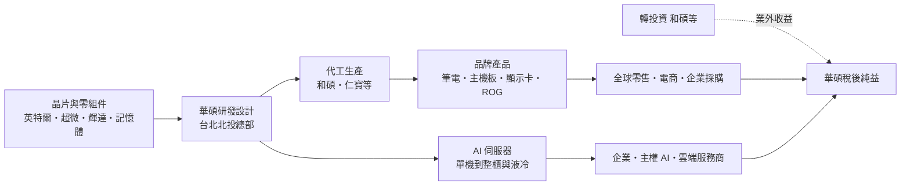
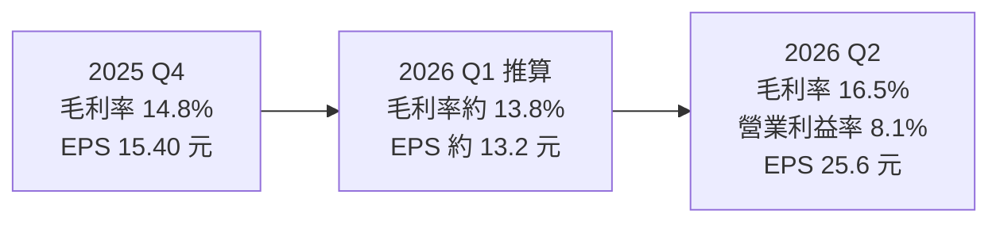
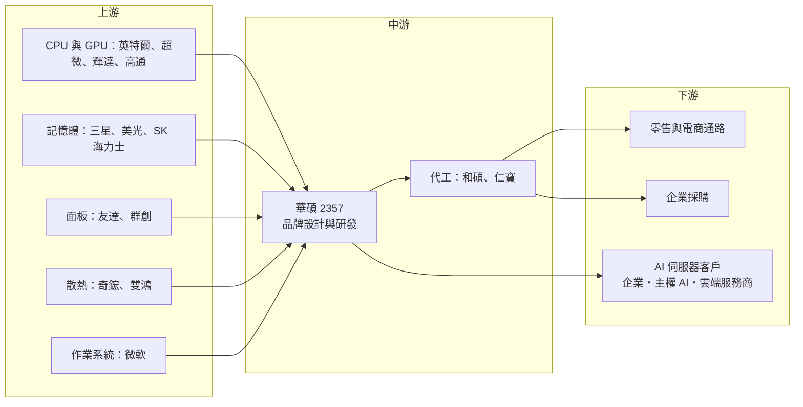

# 2357 華碩

> 上市｜[[產業索引-電腦及週邊設備業|電腦及週邊設備業]]｜上市（櫃）日期 1996/11/14

# 第一章：企業模式與商業藍圖

> [!info] 撰寫說明
> 本文由 Claude 依公開資料整理，架構比照 [[2330台積電]] 的四章研究，資料截至 2026-10-07。財務數字來源：華碩 2025 年第一季、2025 年第四季與 2026 年第二季法說會報導（優分析、科技新報、理財周刊）、2026 年股東會報導（工商時報旺得富）；產業描述為整理性內容，尚未逐條比對原始文件。#待校對

在評估單一個股的長期投資價值時，首要步驟是拆解企業的底層獲利邏輯。本章針對華碩電腦（股票代號：2357，以下簡稱華碩）的商業模式進行定性分析，說明一家以主機板起家的品牌公司，如何靠品牌溢價維持高於代工同業的毛利率，以及它切入 AI 伺服器時選擇了什麼樣的位置。

## 一、核心定位：台灣最大的自有品牌電腦廠

華碩由施崇棠等人於 1989 年創立，以主機板起家，後來擴展到筆記型電腦、桌上型電腦、顯示卡、顯示器、網通設備、手機與伺服器。2008 年華碩將代工業務分拆為 [[4938和碩]]，此後專注自有品牌，是台灣少數在全球消費電子市場擁有知名品牌的公司。

這個定位有兩個商業意義：

* **[[品牌溢價]]：** 華碩毛利率長期落在 13% 至 17%，明顯高於代工同業的 5% 至 10%，差距主要來自品牌與產品設計。
* **輕資產：** 生產多委由代工廠完成，華碩把資源集中在研發、行銷與通路，資本支出遠低於製造業。

華碩在主機板與[[電競]]顯示卡市場長期居全球領先地位，電競品牌 ROG（Republic of Gamers）是獲利最好的產品線之一。近兩年，AI 伺服器成為成長最快的新事業，2026 年第二季伺服器營收年增近 200%。

## 二、產品板塊：系統、零組件、電競與伺服器

本次未查得華碩各事業群的營收比重數字，因此不繪製營收結構圖，改以各板塊的近期變化說明。

* **系統產品（筆電、桌機）：** 營收最大宗，涵蓋消費型、[[商用 PC]]、電競筆電。2026 年第二季 PC 出貨量年增 20%，其中商用 PC 年增 58%；[[AI PC]] 占消費型筆電營收約 30%。2025 年第四季高階機種已占系統事業群約六成。
* **零組件（主機板、顯示卡）：** 以 [[DIY]] 與電競玩家市場為主，與 [[NVDA輝達]]、[[AMD超微]] 的新世代晶片推出高度連動。
* **電競產品（ROG）：** 品牌溢價高，是毛利率的重要支撐。
* **AI 伺服器與基礎架構：** 以輝達 B 系列、GB 系列 AI 伺服器為主，客戶涵蓋企業、[[主權 AI]] 與雲端服務商。公司於 2026 年將原伺服器事業單位（ISG）升格為基礎架構解決方案事業群（IS BG），擴充研發與業務團隊。

## 三、資本轉化邏輯：品牌、外包製造與全球通路

* **研發集中在台灣：** 總部位於台北北投，研發集中在台灣，生產主要委由代工廠與自有工廠完成。
* **全球通路：** 銷售通路遍及全球，歐洲、亞太、北美與中國都是重要市場；在美國、歐洲設有伺服器服務與整合團隊，以支援 AI 伺服器客戶。
* **存貨是主要資金需求：** 品牌廠不需要大量蓋廠，但必須承擔存貨。華碩在記憶體短缺期間採取策略備貨，存貨與[[營運資金]]因此上升。

## 四、企業長期藍圖：高階化、AI 伺服器與 Physical AI

* **高階化：** 把產品組合往電競、商用、AI PC 推進，提升平均售價與毛利率。
* **AI 伺服器：** 以品牌伺服器廠的角色，提供從單機到整櫃與[[液冷]]的方案，鎖定企業、主權 AI 與二線雲端業者，避開與 ODM 正面爭取超大型雲端業者訂單。
* **[[Physical AI]]：** 董事長施崇棠在 2026 年股東會表示，公司對 Physical AI 與人形機器人已有長期布局，相關技術持續研發中。

# 第二章：護城河深度與競爭優勢

在長期價值投資中，「護城河」指企業抵禦競爭、維持超額利潤的保護機制。本章分析華碩以品牌與通路為核心的護城河、各產品線的主要競爭對手，以及這些優勢在 PC 價格戰與 AI 伺服器競爭中能守住多少。

## 一、護城河的核心組成要素

華碩的護城河屬於「窄護城河」，主要由四個要素組成：

* **1. 品牌力：** ROG 電競品牌在玩家族群中有高辨識度，能支撐高於代工廠的毛利率。
* **2. 主機板與顯示卡的領先地位：** 與輝達、AMD、英特爾關係密切，新平台推出時通常能第一時間上市。
* **3. 全球通路：** 在零售、電商、企業採購等多種通路建立長期合作。
* **4. 研發能力：** 從主機板設計延伸出的硬體整合能力，可轉用於伺服器與 AI PC。

## 二、全球主要競爭對手格局

| 對手 | 定位 | 對華碩的威脅 |
|---|---|---|
| 聯想、HP、Dell | 全球前三大 PC 品牌 | 規模與商用市場優勢明顯，主導 PC 市場 |
| [[2353宏碁]] | 台灣 PC 品牌 | 國內最直接的對手，消費與教育市場重疊 |
| 蘋果 Mac | 高階筆電 | 在高階消費與創作者市場競爭 |
| [[2376技嘉]]、[[2377微星]]、華擎 | 主機板與顯示卡品牌 | 在 DIY 與電競市場正面競爭 |
| 美超微、Dell、HPE | 品牌伺服器廠 | 在企業與主權 AI 伺服器市場規模較大 |
| [[2382廣達]]、[[3231緯創]]、[[2317鴻海]] | 伺服器 ODM | 主攻大型雲端業者，規模經濟遠勝華碩 |

## 三、優勢轉化：哪些守得住、哪些守不住

* **守得住：** 電競與 DIY 零組件市場仰賴品牌與玩家口碑，華碩的地位穩固。
* **守不住：** 一般消費型筆電價格競爭激烈，PC 市場又被前三大品牌主導，華碩在商用市場仍處於追趕者位置。AI 伺服器方面，華碩規模遠小於 ODM 與美超微，主要靠服務與彈性取勝。
* **觀察重點：** 伺服器營收占比能否持續提高；記憶體成本上漲能否順利轉嫁；商用 PC 市占提升的持續性。

# 第三章：財務體質與盈利規模

資料日期：2026-10-07。數字取自公司法說會與財報的財經媒體整理（優分析、科技新報），表格是撰寫當時的快照；最新月營收、毛利率、累計 EPS 由自動排程寫在本筆記的屬性欄位（月營收、毛利率、累計EPS 等）。#待校對

財務報表是檢驗護城河是否真實存在的最終標準。本章用三率、ROE、現金流與資本報酬，檢視華碩在記憶體缺貨與 AI 伺服器成長期的獲利品質。

## 一、獲利能力的基石：三率

| 項目 | 2025 全年 | 2025 Q4 | 2026 Q1（推算） | 2026 Q2 |
|---|---|---|---|---|
| 營收（新台幣） | 6,889.4 億 | 1,898.2 億 | 約 1,940.5 億 | 2,410.6 億 |
| [[毛利率]] | 13.8% | 14.8% | 約 13.8% | 16.5% |
| [[營業利益率]] | 4.9% | 4.3% | 約 5.4% | 8.1% |
| 稅後純益（歸屬母公司） | 445.6 億 | 114.1 億 | 約 98 億 | 190.5 億 |
| EPS（元） | 60.0 | 15.40 | 約 13.2 | 25.6 |

* **推算說明：** 2026 年第一季為上半年累計（營收 4,351.1 億元、毛利率 15.3%、營業利益率 6.9%、EPS 38.8 元）減去第二季，以及第二季季增幅度推算。
* **第二季創新高：** 毛利率 16.5%、季增 2.7 個百分點，主因記憶體缺貨下產品漲價、高階機種與伺服器比重提升；單季 EPS 25.6 元創新高。
* **[[業外收益]]：** 2025 年毛利率年減 2.8 個百分點，但稅後純益年增 41.9%，部分來自利息、投資、匯兌與股利收入。華碩持有和碩等公司股權，業外收益占比常較同業高，評估本業時應以營業利益為準。

## 二、ROE：資本效率

華碩屬於輕資產的品牌公司，生產多外包，資本支出少，獲利主要轉化為現金與長期投資。[[ROE]] 在景氣好時可達雙位數中高段，在 PC 庫存調整年度則明顯下滑（確切數值未查得）。

## 三、資本支出、自由現金流與股利

* **[[CapEx]]：** 品牌業務的資本支出很低，主要現金需求來自存貨。
* **[[自由現金流]]：** 記憶體短缺期間的策略備貨使存貨上升，短期壓縮營業現金流（推估）；公司採動態匯率避險管理美元曝險。
* **股利：** 2026 年股東會通過配發 2025 年度現金股利每股 42 元，以 EPS 60 元計算配發率約七成。過去數年現金股利介於 14 元至 42 元，隨獲利波動，但配發率維持在高水準。

## 四、[[ROIC]] 與 [[WACC]]：價值創造利差

品牌公司投入資本主要是存貨與應收帳款，固定資產很少，因此只要營業利益率維持在 5% 以上，ROIC 推估可明顯高於 WACC（具體數值未查得）。風險在於 PC 庫存調整年度，存貨跌價會同時壓低利潤與推高投入資本，2022 至 2023 年就曾出現這種情況。

# 第四章：總體風險與地緣政治

任何企業都無法脫離宏觀環境獨立存在。本章分析華碩未來必須面對的地緣政治、PC 與記憶體週期、營運與技術風險。

## 一、地緣政治風險

* **美國關稅：** 華碩筆電與零組件多在中國、東南亞生產，美國對進口電子產品的關稅變化會影響北美售價與毛利。AI 伺服器出貨至美國同樣受關稅影響。
* **中國市場：** 中國是華碩的重要銷售市場，同時面臨聯想等本土品牌與國產替代政策的競爭。
* **出口管制：** 高階 GPU 的出口管制會限制顯示卡與 AI 伺服器銷往特定地區。

## 二、產業週期與市場結構風險

* **PC 週期：** PC 市場成熟，換機潮結束後需求可能下滑。2026 年股東會上公司亦提及下半年可能出現庫存調整的疑慮。
* **記憶體成本：** 2025 年底起記憶體價格大漲，公司預期缺貨可能延續到 2027 年下半年。若漲價無法轉嫁，將侵蝕毛利；若消費者因漲價延後購買，則影響出貨量。
* **[[長鞭效應]]：** 通路在缺貨時超額備貨、需求轉弱時急速去化，品牌廠的出貨波動常大於終端銷售。
* **電競與顯示卡需求波動：** 顯示卡需求過去曾因挖礦熱潮大起大落。

## 三、營運環境的隱性風險

* **庫存管理：** 品牌廠需承擔存貨風險，2022 至 2023 年 PC 庫存調整時，華碩曾因存貨跌價出現大幅虧損季度。
* **匯率：** 營收以美元、歐元計價，新台幣升值與歐元波動會影響營收與匯兌損益。
* **AI 伺服器執行：** 伺服器業務需要大量墊付 GPU 料件，若客戶延遲付款或專案取消，存貨與應收風險高。

## 四、科技演進風險

AI PC 的發展取決於晶片商（英特爾、AMD、[[QCOM高通]]、輝達）與 [[MSFT微軟]] 的軟體生態系，華碩較難主導規格。此外，Physical AI 與機器人仍處於早期，投入能否轉為營收尚待觀察。

# 專有名詞解析

## 應用

- **[[AI PC]]**：內建神經網路處理單元、能在本機執行 AI 運算的個人電腦。
- **[[主權 AI]]**：各國政府為確保資料與運算自主而自建的 AI 算力與模型。
- **[[Physical AI]]**：讓 AI 能感知並操作實體世界的技術，例如機器人、人形機器人與自動化設備。

## 金融

- **[[業外收益]]**：本業以外的收入，如利息、投資收益、股利與匯兌利益，持續性通常低於本業獲利。
- **[[營運資金]]**：流動資產減流動負債，主要是存貨與應收帳款，AI 伺服器料件昂貴使需求大增。
- **[[自由現金流]]**：營業活動現金流減去資本支出，代表企業可自由用於配息、還債或併購的現金。
- **[[長鞭效應]]**：終端需求的小幅變動，沿供應鏈往上游傳遞時被逐級放大，造成上游庫存與訂單劇烈波動。

## 產業

- **[[品牌溢價]]**：消費者願意為知名品牌多付的價格，讓品牌公司毛利率高於代工廠。
- **[[電競]]**：電子競技與高效能遊戲市場，玩家願意為高規格硬體支付較高價格。
- **[[DIY]]**：玩家自行選購主機板、顯示卡等零組件組裝電腦的市場。
- **[[商用 PC]]**：企業採購的筆電與桌機，重視穩定性、資安與售後服務，換機週期與企業 IT 預算相關。
- **[[液冷]]**：以液體帶走晶片熱量的散熱方式，高功率 AI 機櫃已從氣冷轉向液冷。

# 核心供應鏈

## 1. 上游：晶片與零組件
- CPU 與 GPU：[[INTC英特爾]]、[[AMD超微]]、[[NVDA輝達]]、[[QCOM高通]]
- 記憶體：[[005930三星電子]]、美光、SK 海力士
- 作業系統：[[MSFT微軟]]
- 面板：[[2409友達]]、[[3481群創]]
- 散熱：[[3017奇鋐]]、[[3324雙鴻]]

## 2. 中游：代工與集團
- 代工夥伴：[[4938和碩]]、[[2324仁寶]]
- 轉投資：[[4938和碩]]（華碩持股）

## 3. 下游：通路與客戶
- 零售與電商通路、企業採購
- AI 伺服器：企業、主權 AI 與雲端服務商

## 4. 同業
- PC 品牌：[[2353宏碁]]、聯想、HP、Dell
- 主機板與顯示卡：[[2376技嘉]]、[[2377微星]]
- 伺服器：美超微、Dell、HPE

## 最新新聞
<!-- news:start -->
<!-- news:end -->

## 相關連結
- [公開資訊觀測站](https://mopsov.twse.com.tw/mops/web/t05st03?step=1&firstin=1&co_id=2357)
- [Goodinfo](https://goodinfo.tw/tw/StockDetail.asp?STOCK_ID=2357)
- [Yahoo 股市](https://tw.stock.yahoo.com/quote/2357)
- [鉅亨網新聞](https://www.cnyes.com/twstock/2357/news)
