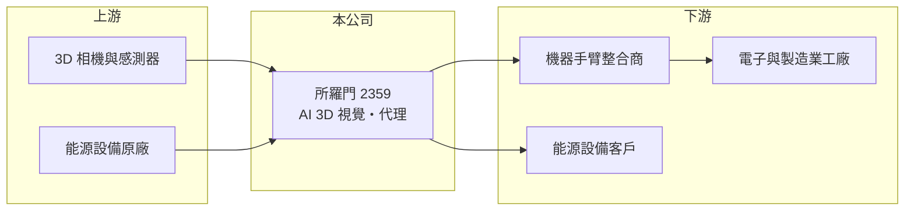

# 2359 所羅門

> 上市｜[[產業索引-其他電子業|其他電子業]]｜上市（櫃）日期 1996/12/19

# 第一章：企業模式與商業藍圖

> [!info] 撰寫說明
> 精簡版，由 Claude 依公開資料整理，架構比照 [[2330台積電]]，資料截至 2026-10-07。來源：工商時報 2026 年 6 月報導、Yahoo 股市營收新聞標題。#待校對

所羅門以 AI 與 3D [[機器視覺]]軟體為核心，讓機器手臂能辨識並夾取物件，同時經營能源設備等代理業務。

- **核心業務：** AI 與 3D 視覺辨識軟體、與機器手臂業者合作的軟硬整合方案，以及發電機等能源設備。
- **營收結構：** 營收包含 AI 視覺方案與能源設備等代理銷售；軟體毛利率高但單價較低，各業務比重未查得。
- **營運據點：** 總部在台灣，AI 視覺主力市場在歐美，能源設備主要市場為中國大陸與台灣。
- **長期方向：** 看好 [[Physical AI]] 帶動機器人視覺需求，擴大歐美市場與大型製造業客戶。

# 第二章：護城河深度與競爭優勢

所羅門的優勢在於 3D 視覺與 AI 演算法的累積，客戶分散。

- **競爭優勢：** 具自有 3D 視覺辨識軟體，可搭配多家機器手臂使用，客戶數 500 至 600 家、重購率接近 40%。
- **主要對手：** 國際機器視覺廠商如 Cognex、Keyence，以及機器手臂原廠自帶的視覺方案（推估）。
- **觀察重點：** AI 視覺營收占比能否提高、[[2356英業達]]等大廠的導入進度，以及能源設備交期拉長對出貨的影響。

# 第三章：財務體質與盈利規模

資料日期：2026-10-07，表格是撰寫當時的快照；最新月營收、毛利率、累計 EPS 由自動排程寫在本筆記的屬性欄位（月營收、毛利率、累計EPS 等）。#待校對

所羅門 2025 年獲利明顯成長，2026 年第一季 EPS 已超過 2025 年的一半。

- **營收規模：** 2025 年全年營收 42.48 億元，年增 21.27%；2026 年 5 月營收 5.25 億元，年增 66.8%，前五月累計 17.66 億元，年減 3.25%。
- **獲利：** 2025 年稅後純益 2.11 億元，EPS 1.23 元；2026 年第一季 EPS 0.78 元，前一年同期為 0.07 元。
- **財務特色：** 2025 年度每股配息 1 元；能源設備等代理業務毛利率通常低於軟體，整體[[毛利率]]會被拉低（推估），未查得具體數字。

# 第四章：總體風險與地緣政治

所羅門的風險在於題材熱度與實際營收貢獻之間的落差。

- **產業週期：** 製造業資本支出與自動化投資循環，會影響機器手臂與視覺系統的採購。
- **營運風險：** 能源設備供不應求、交期拉長，出貨時點可能遞延；AI 視覺業務規模仍小。
- **其他風險：** 中國市場的景氣與政策風險；機器人題材使股價波動大。

# 專有名詞解析

## 應用

- **[[機器視覺]]**：以相機與影像演算法讓機器辨識物體與檢測瑕疵，廣泛用於工廠自動化與檢測設備。
- **[[Physical AI]]**：讓 AI 能感知並操作實體世界的技術，例如機器人、人形機器人與自動化設備。

## 金融

- **[[毛利率]]**：毛利除以營收，反映產品或服務本身的獲利能力。

# 核心供應鏈

- 上游：3D 相機、感測器與 GPU 運算平台供應商、能源設備原廠（推估）
- 下游／客戶：機器手臂整合商、電子與製造業工廠（如 [[2356英業達]]）、能源設備客戶
- 同業：Cognex、Keyence（推估）

## 最新新聞
<!-- news:start -->
<!-- news:end -->

## 相關連結
- [公開資訊觀測站](https://mopsov.twse.com.tw/mops/web/t05st03?step=1&firstin=1&co_id=2359)
- [Goodinfo](https://goodinfo.tw/tw/StockDetail.asp?STOCK_ID=2359)
- [Yahoo 股市](https://tw.stock.yahoo.com/quote/2359)
- [鉅亨網新聞](https://www.cnyes.com/twstock/2359/news)
