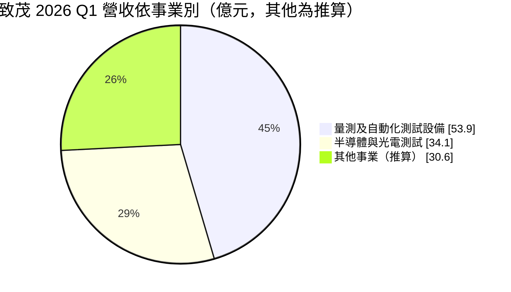
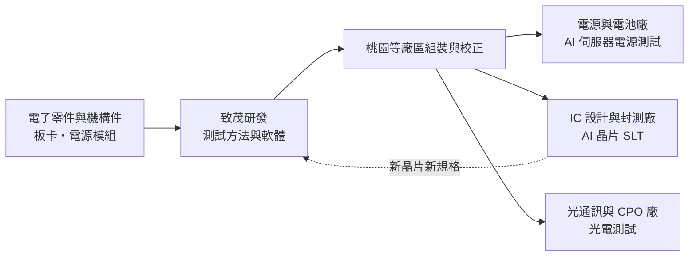
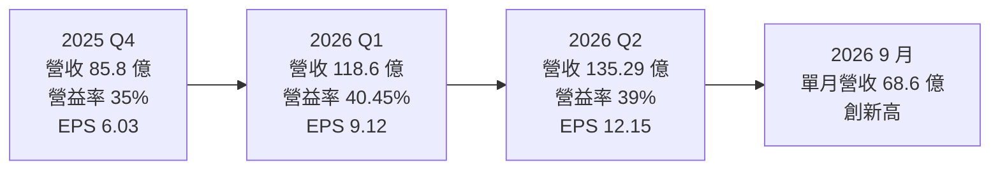
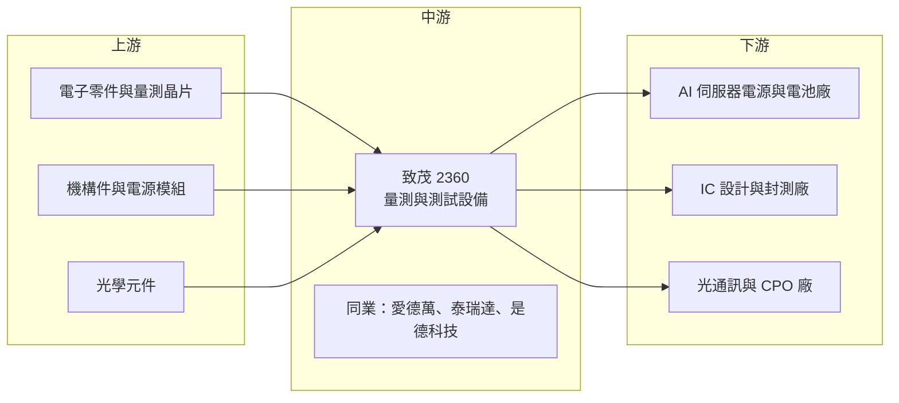

# 2360 致茂

> 上市｜[[產業索引-其他電子業|其他電子業]]｜上市（櫃）日期 1996/12/21

# 第一章：企業模式與商業藍圖

> [!info] 撰寫說明
> 本文由 Claude 依公開資料整理，架構比照 [[2330台積電]] 的四章研究，資料截至 2026-10-07。財務數字來源：優分析（2025 年報與 2026 年第二季財報報導）、科技新報 2026 年第一季財報報導、理財周刊 2026 年報導、NStock 公司介紹、Yahoo 股市公司基本資料；產業描述為整理性內容，尚未逐條比對原始文件。#待校對

在評估單一個股的長期投資價值時，首要步驟是拆解企業的底層獲利邏輯。本章針對致茂電子（股票代號：2360，以下簡稱致茂）的商業模式進行定性分析，說明一家以電源量測儀器起家的公司，如何把測試能力延伸到 AI 晶片的系統級測試與共同封裝光學，成為「AI 賣鏟子」的受惠者。

## 一、核心定位：精密量測與自動化測試設備廠

致茂成立於 1984 年 11 月 8 日，總部在桃園，1996 年上市，董事長為黃欽明。公司產品分為兩大事業：

* **量測儀器與自動化測試設備：** 電源供應器、電池、電動車動力系統、被動元件與光學元件的測試儀器與自動化測試系統。客戶是各種電子產品的製造商，用致茂的設備確認產品規格合格。
* **半導體與光電（Photonics）測試解決方案：** 包含 AI 與 [[HPC]] 晶片的系統級測試（[[SLT]]）設備，以及[[矽光子]]與 [[CPO]] 的光電測試設備。

致茂的商業模式是「賣測試設備」，自身不參與晶片或電子產品的量產競爭。當客戶的產品越複雜、測試越嚴格，設備需求與單價就越高。這是 2025 至 2026 年獲利倍增的核心原因：AI 晶片功耗與複雜度大增，測試時間拉長，客戶需要更多台設備。

## 二、終端應用板塊：量測自動化與半導體測試雙引擎

依科技新報報導，2026 年第一季量測及自動化測試設備營收 53.9 億元、半導體與光電測試解決方案 34.1 億元，與合併營收 118.6 億元的差額為其他事業，換算比重如下：

* **量測及自動化測試設備：** 第一季年增 145%，AI 伺服器電源、[[BBU]] 等電源相關產品的測試需求是主要動能。
* **半導體與光電測試：** 第一季年增 31%，第二季半導體事業部營收年增 62%。SLT 需求因 AI 晶片測試時間拉長而強於預期；CPO 方面，公司在多個測試站點取得訂單，光學訊號輸出入測試站點全數拿下，光引擎測試被視為最大市場機會。
* **其他事業：** 包含光學檢測、電動車與電池測試等（細項未查得）。

## 三、資本轉化邏輯：設計測試能力、外包部分製造

* **軟體與 know-how 創造毛利：** 測試設備的價值在測試方法、軟體與客製化，而非硬體本身，因此毛利率可長期維持在六成以上。
* **與客戶同步開發：** 新一代 AI 晶片、電源與光通訊元件在研發階段就要確定測試方案，致茂越早參與，越能鎖定量產時的設備訂單。
* **營運槓桿：** 2026 年上半年營收年增 91%，營益率從前一年約 33% 升到 40%。

## 四、企業長期藍圖：AI 測試的全面布局

* **CPO 與矽光子：** 公司規劃 2026 年試產、2027 年全面量產，涵蓋光子晶片、光引擎與光訊號輸出入等多個測試站點。
* **SLT 擴大：** AI 晶片從 GPU 擴及雲端業者自研 [[ASIC]]，SLT 設備的客戶基礎跟著擴大。
* **電源測試：** AI 伺服器電源功率持續提高，帶動高功率電源與儲能測試設備需求。

# 第二章：護城河深度與競爭優勢

在長期價值投資中，「護城河」指企業抵禦競爭、維持超額利潤的保護機制。本章分析致茂的護城河構成、全球主要競爭對手，以及這些優勢在 AI 測試需求起伏中能守住多少。

## 一、致茂護城河的核心組成要素

致茂屬於「中寬護城河」，由三個要素組成：

* **1. 測試方法的累積：** 電源、電池、光學與半導體測試各有專業標準，致茂累積四十年的量測經驗，產品線廣，能提供客戶一站式測試方案。
* **2. 早期參與的轉換成本：** 測試程式與治具在產品研發階段就和客戶共同開發，量產後更換設備商等於重寫測試流程。
* **3. 在台灣供應鏈的地利：** AI 伺服器電源、封測與光通訊供應鏈多在台灣，致茂能就近提供服務與快速客製。

## 二、全球主要競爭對手格局

| 對手 | 定位 | 對致茂的威脅 |
|---|---|---|
| 愛德萬測試 Advantest | 全球半導體測試機龍頭，也有 SLT 產品 | 在 AI 晶片測試市占高，產品線完整 |
| 泰瑞達 Teradyne | 美國半導體測試設備大廠 | 在 SoC 與 SLT 測試直接競爭 |
| Keysight 是德科技 | 電子量測儀器龍頭 | 在電源、通訊與光通訊量測重疊 |
| [[6515穎崴]]、[[7769鴻勁]] 等台廠 | 測試介面與分選機 | 在 AI 測試供應鏈互補也互相競爭 |

## 三、優勢轉化：哪些市場守得住、哪些守不住

* **守得住：** AI 伺服器電源與電池測試、已取得訂單的 CPO 測試站點，這些領域致茂具有先行者優勢。
* **守不住：** 標準化的量測儀器，國際大廠與中國廠以品牌或價格競爭。
* **觀察重點：** 毛利率從上半年 62% 的水準是否持續、CPO 能否在 2027 年如期量產，以及 SLT 在 GPU 與 ASIC 客戶的滲透率。

# 第三章：財務體質與盈利規模

資料日期：2026-10-07。數字取自優分析與科技新報的財報報導，表格是撰寫當時的快照；最新月營收、毛利率、累計 EPS 由自動排程寫在本筆記的屬性欄位（月營收、毛利率、累計EPS 等）。#待校對

財務報表是檢驗護城河是否真實存在的最終標準。本章用三率、ROE、現金流與資本報酬，檢視致茂在 AI 測試需求暴增下的獲利品質。

## 一、獲利能力的基石：三率

| 項目 | 2025 全年 | 2025 Q4 | 2026 Q1 | 2026 Q2 |
|---|---|---|---|---|
| 營收（新台幣） | 283.11 億 | 85.8 億 | 118.6 億 | 135.29 億 |
| [[毛利率]] | 61% | 61% | 62.6% | 61% |
| [[營業利益率]] | 32% | 35% | 40.45% | 39% |
| 稅後純益 | 116.92 億 | 25.49 億 | 38.64 億 | 51.23 億 |
| EPS（元） | 27.70 | 6.03 | 9.12 | 12.15 |

* **[[毛利率]]：** 維持在 61% 至 63%，代表即使營收倍增，產品組合與定價仍穩定。
* **[[營業利益率]]：** 2025 年從前一年約 25% 升到 32%，2026 年上半年再到 40%，是營收規模擴大帶來的費用槓桿。
* **業外：** 2025 年稅後純益年增 122%，遠高於營收成長，部分來自業外收益；2025 年第四季淨利季減 50% 但營益率上升，顯示業外波動大，評估時應以營業利益為準。

## 二、[[ROE]]：資本效率

2025 年 EPS 27.7 元創新高，2026 年上半年 EPS 已達 21.27 元，ROE 隨獲利倍增大幅提升（具體數值未查得）。致茂屬輕資產設備商，高 ROE 主要來自高營益率，而非財務槓桿。

## 三、資本支出與自由現金流

* **[[CapEx]]：** 設備組裝與研發為主，資本支出相對營收比例低（具體金額未查得）。
* **[[自由現金流]]：** 獲利擴大加上低資本支出，現金流充裕。依 NStock 資料，2025 年配發現金股利 19.5 元，近五年平均填息率 100%。
* **營運資金：** 營收快速成長時存貨與應收帳款同步增加，可能暫時壓抑營業現金流。

## 四、[[ROIC]] 與 [[WACC]]：價值創造利差

致茂的投入資本以研發團隊、廠房與營運資金為主，營益率達四成時 ROIC 推估遠高於 WACC。這種高利差能維持多久，取決於 AI 測試需求是否持續，以及競爭者是否在 SLT 與 CPO 測試上追上。

# 第四章：總體風險與地緣政治

任何企業都無法脫離宏觀環境獨立存在。本章分析致茂未來必須面對的地緣政治、產業週期與營運風險。

## 一、地緣政治風險

* **出口管制：** 半導體測試設備可能受美國或台灣出口管制規範，對中國客戶的銷售有不確定性。
* **客戶生產地轉移：** AI 伺服器與晶片封測逐步在美國、東南亞設點，致茂需要在當地提供服務。

## 二、產業週期與市場結構風險

* **設備業的週期性：** 測試設備需求取決於客戶擴產，AI 資本支出若放緩，設備訂單會比終端需求更早、更劇烈下滑。
* **[[長鞭效應]]：** 2025 至 2026 年的倍增成長，部分來自客戶集中擴產，未來可能出現訂單高峰後的回落。
* **電動車與消費性：** 電動車與電池測試需求受電動車市場景氣影響。

## 三、營運環境的隱性風險

* **高基期：** 2026 年營收年增逾一倍，2027 年要維持成長需要 CPO 量產接棒。
* **人才與交期：** 訂單暴增時，工程人力與零件供應可能成為瓶頸。
* **匯率：** 外銷比重高，新台幣升值影響獲利。

## 四、科技演進風險

測試技術隨晶片架構變化而改變。若 AI 晶片測試流程調整（例如把部分 SLT 前移到晶圓測試或[[先進封裝]]階段），或 CPO 標準採用不同架構，致茂需要重新開發設備。反過來說，每次架構變革也是取得新訂單的機會。

# 專有名詞解析

## 半導體

- **[[SLT]]**：系統級測試，把晶片放在接近實際使用環境的系統中長時間運作，檢查最終測試難以發現的缺陷。
- **[[矽光子]]**：在矽晶片上製作光學元件，以光取代電傳輸資料，可降低 AI 資料中心的傳輸耗電。
- **[[HPC]]**：高效能運算，泛指 AI 與資料中心等需要大量運算的應用。
- **[[ASIC]]**：特殊應用積體電路，為特定用途客製的晶片，例如雲端業者自研的 AI 加速器。
- **[[先進封裝]]**：把多顆晶片以中介層、混合鍵合等方式高密度整合的封裝技術，例如 CoWoS、SoIC。

## 應用

- **[[CPO]]**：共同封裝光學，把光學收發元件和交換器晶片封裝在一起，可降低高速傳輸的耗電。
- **[[光引擎]]**：CPO 或光模組中負責光電轉換的核心模組，由雷射、調變器與光偵測器組成。
- **[[BBU]]**：電池備援單元，在 AI 伺服器機櫃斷電時提供短時間電力，避免運算中斷。

## 金融

- **[[CapEx]]**：資本支出，企業購買土地、廠房與設備的支出。
- **[[自由現金流]]**：營業活動現金流減去資本支出，代表企業可自由用於配息、還債或併購的現金。
- **[[長鞭效應]]**：終端需求的小幅變動，沿供應鏈往上游傳遞時被逐級放大，造成上游庫存與訂單劇烈波動。

# 核心供應鏈

## 1. 上游：零件
- 電子零件、量測晶片與機構件：供應商未揭露

## 2. 中游：測試設備同業
- 國外：Advantest 愛德萬測試、Teradyne 泰瑞達、Keysight 是德科技
- 台灣測試供應鏈：[[6515穎崴]]、[[7769鴻勁]]

## 3. 下游：客戶類型
- AI 伺服器電源廠（推估，依產業結構）：[[2308台達電]]、[[2301光寶科]]
- 封測廠（推估）：[[3711日月光投控]]、[[2449京元電子]]
- AI 晶片設計（推估）：[[NVDA輝達]]、[[AVGO博通]]

延伸閱讀：[[台積電供應鏈]]

## 供應鏈關係
- 供應給 [[2330台積電]]：半導體系統級測試設備 (SLT)（台積電供應鏈 › 下游：測試介面與檢測設備）

## 最新新聞
<!-- news:start（自動產生，請勿手動編輯此範圍） -->
- 2026-10-07 📰 媒體 10:02｜致茂9月營收月增22%/連三月創高；光電可望添新動能- 新聞｜[MoneyDJ理財網](https://news.google.com/rss/articles/CBMikgFBVV95cUxNLVl6bi1iS01fcW5GMlk2S1FHZDRqOFVqYWliZzBWaE9fd0gyUjRwTjhIVzRCU05zSWNjbURkb1M3ZE0xendUaWhSbXJJaEp5bUV5OTdHZVBnYkhLS1JXVDBFWk5wYk1iZzVnRF90OWFidmh6Q3M4UGhRV0U3ODRwZkhnd016T0Y5Z3hxOXZIYmx2Zw?oc=5)
- 2026-10-07 📰 媒體 08:07｜《其他電》致茂9月業績攻頂 年增2倍｜[富聯網](https://news.google.com/rss/articles/CBMiiAFBVV95cUxOMTlVMm82X3Bxc2oxVm9qLWxUcU9ET29tVmxhRUNaWEExbW5qeTNjMDZzajNPTkpfVUVLSDBWVjdlWlBFN1M1bFgzM1NDbU1VSF9KWmg2aGZqbnQ0MXFSaVBRb05pcEFIYVVjemNEblZJM2lOck5nUVh2Uk5ka1FfMXgxT3FORXQw?oc=5)
- 2026-10-07 📰 媒體 07:54｜《個股重大訊息》個股動態：台積電、聯電、致茂｜[富聯網](https://news.google.com/rss/articles/CBMiiAFBVV95cUxPdGFFRm16cjEySDhVaDEwaEdxd0dGUk5RN2JUUThLaFN1N19hXzVDMjNqTy1xV0dZRHlTMVFpWWNxVDJwRGpWaHBTSzF1UFRRdEFsNGRPb0tBLTk4a2o1YmJmNjMwcnBVWTJZbHZmRmZlRlFZWjA3bEJXamItLWhJWXNIWFhJS0U0?oc=5)
- 2026-10-06 📰 媒體 17:50｜營收速報 - 致茂(2360)9月營收68.60億元年增率高達206.47％｜[鉅亨網](https://news.cnyes.com/news/id/6622820)
- 2026-10-06 📰 媒體 16:26｜致茂9月營收68.60 億元｜[TechNews 科技新報](https://news.google.com/rss/articles/CBMigAFBVV95cUxNZ1JHTnFxQmJjM1htYkxaZzhHRkxkaWpyS1U2NFNzTXUybFhQeVlHS09VcnBGcVNpT2VxRE02UWstN0YyTUw1ZWR6Z2xDaHBzd2pYLU1zNDJyU3czM1h1UUE0bldMWHdJYmZCWlBVVEJyaGg4djlSbHlfdjNKVWJKdA?oc=5)

完整紀錄：[[2360致茂 新聞]]
<!-- news:end -->

## 相關連結
- [公開資訊觀測站](https://mopsov.twse.com.tw/mops/web/t05st03?step=1&firstin=1&co_id=2360)
- [Goodinfo](https://goodinfo.tw/tw/StockDetail.asp?STOCK_ID=2360)
- [Yahoo 股市](https://tw.stock.yahoo.com/quote/2360)
- [鉅亨網新聞](https://www.cnyes.com/twstock/2360/news)
