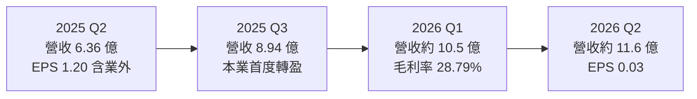
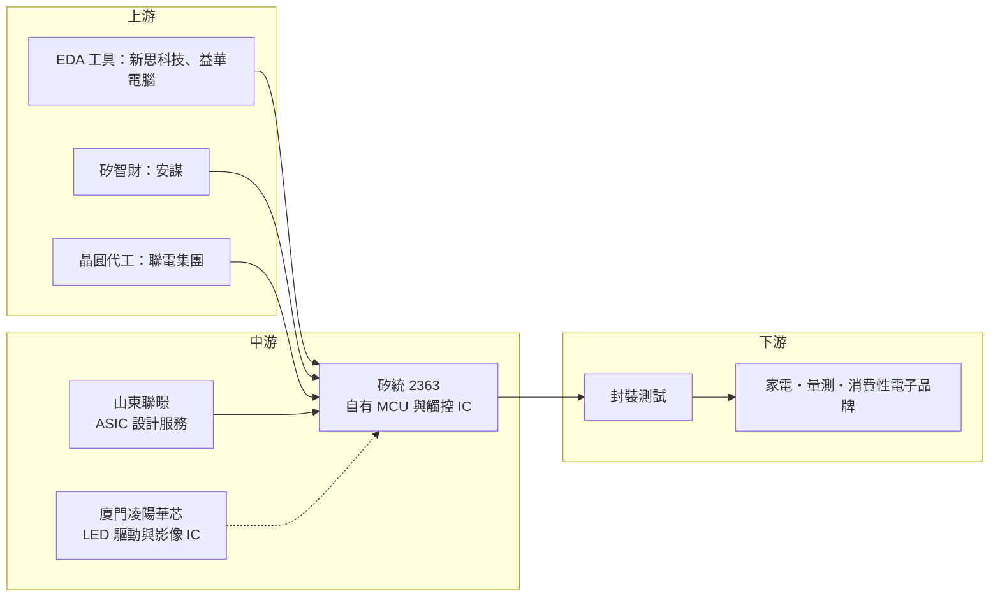

# 2363 矽統

> 上市｜[[產業索引-半導體業|半導體業]]｜上市（櫃）日期 1997/08/01

# 第一章：企業模式與商業藍圖

> [!info] 撰寫說明
> 本文由 Claude 依公開資料整理，架構比照 [[2330台積電]] 的四章研究，資料截至 2026-10-07。財務數字來源：中央社（2025 年財報新聞）、聯合報（2025 年第二季財報、2025 年 12 月法說會）、優分析、理財周刊、CMoney、nstock、Simply Wall St、MoneyLink 公司基本資料；產業描述為整理性內容，尚未逐條比對原始文件。#待校對

在評估單一個股的長期投資價值時，首要步驟是拆解企業的底層獲利邏輯。本章針對矽統科技（股票代號：2363，以下簡稱矽統）的商業模式進行定性分析，說明一家沉寂近十年的老牌晶片設計公司，如何在 [[2303聯電]] 集團主導下，透過一連串併購重新組成「ASIC 設計服務加自有 IC」的雙主軸結構。

## 一、核心定位：聯電集團旗下的 IC 設計整合平台

矽統成立於 1987 年，1997 年上市，早年以 PC 晶片組聞名，與 [[INTC英特爾]]、[[2388威盛]] 在主機板晶片組市場競爭。PC 晶片組被 CPU 廠整合後，矽統的業務大幅萎縮，依聯合報整理，從 2014 年第四季到 2024 年第二季，矽統將近十年單季營收都不到 1 億元。

轉折點在 2023 年 8 月：聯電董事長洪嘉聰親自兼任矽統董事長，這是聯電自 2003 年接手矽統以來的首次。之後矽統進行三項整併：

* **接手山東聯暻 100% 股權：** 由聯電手中承接，山東聯暻（報導亦寫作聯璟）專營 [[ASIC]] 與[[設計服務]]，成為矽統營收的主要來源。
* **換股併購紘康：** 紘康是 [[MCU]] 廠商，併入後與矽統原有 IC 產品整合為自有 IC 業務。
* **收購廈門凌陽華芯股權：** 山東聯暻在 2025 年 4 月以約人民幣 2.94 億元啟動收購，凌陽華芯的核心業務是 [[LED驅動IC]] 與影像 IC，依 2025 年 12 月法說會說法，年底前持股尚未超過五成。

因此今天的矽統已不是單純的 [[Fabless]] 公司，而是聯電集團內負責 IC 設計與設計服務的整合平台，母集團的晶圓代工產能是它的重要後盾（推估）。

## 二、終端應用／產品板塊：ASIC 與自有 IC 雙軸

矽統未公開具體的營收比重，依理財周刊與法說會整理，業務分為兩大主軸：

* **ASIC 設計服務（山東聯暻）：** 替客戶把晶片規格轉成可量產的設計並代為安排投片、封測，屬於「[[Turnkey]]」式服務。這塊是併購後營收倍增的主要來源，客戶以中國市場為主（推估，依子公司所在地）。
* **自有 IC（矽統與紘康）：** 包含 MCU、電池管理晶片（[[BMS]]）與觸控 IC。紘康原本擅長的是量測類 MCU，例如體重計、血壓計等小家電用的高精度類比前端加微控制器（推估）。
* **影像與 LED 驅動 IC（凌陽華芯）：** 尚未過半持股，若完成控制，可再增加一條顯示相關產品線。

營收比重未查得，因此本章不繪製圓餅圖。依營收規模推估，ASIC 設計服務占比仍高於自有 IC。

## 三、資本轉化邏輯（營運模式）：以併購換成長、以設計服務帶量

```mermaid
flowchart LR
    A["客戶晶片規格<br/>中國與國際系統廠"] --> B["山東聯暻<br/>ASIC 設計服務"]
    C["矽統與紘康<br/>自有 MCU / 觸控 / 電池管理 IC"] --> D[晶圓代工<br/>聯電集團等]
    B --> D
    D --> E[封裝測試]
    E --> F["出貨給客戶<br/>家電・量測・消費性電子"]
    F -. 設計服務收入與晶片銷售 .-> G[營收倍增]
    G -. 2025 年 EPS 1.53 元 .-> H[股東]
```

* **營收規模跳升：** 2025 年合併營收 28.21 億元，年增 281.98%，創 16 年新高；2026 年 1 至 8 月累計營收 31.28 億元，年增 92.6%，前八個月已超過 2025 年全年。
* **ASIC 帶量、自有 IC 帶毛利：** 設計服務的營收容易放大，但毛利率通常低於自有 IC；自有 IC 量小，但毛利率較高。矽統 2026 年上半年單季[[毛利率]]約 28% 至 29%，反映的正是兩者混合後的水準。
* **輕資產：** 矽統沒有自有晶圓廠，資本支出主要是研發人力與光罩，獲利的關鍵在於研發投入能否轉成量產訂單。

## 四、企業長期藍圖：新晶片 2026 年起轉化營收

依 2025 年 12 月 19 日法說會，矽統正在規劃開發多款 IC 新品，部分在 2026 年可轉化為營收，效益可能延續到 2027 至 2028 年。中長期的三個方向如下：

* **完成凌陽華芯整併：** 若持股過半並合併報表，可增加 LED 驅動與影像 IC 營收。
* **集團協同：** 借重聯電的[[特殊製程]]，例如嵌入式記憶體（[[eNVM]]）與高壓製程，開發 MCU 與電源相關晶片（推估）。
* **本業獲利穩定化：** 2025 年第三季是 2010 年第四季之後首度單季本業獲利，接下來要觀察的是本業能否穩定賺錢，而不再依賴業外。

# 第二章：護城河深度與競爭優勢

在長期價值投資中，「護城河」指企業抵禦競爭、維持超額利潤的保護機制。本章分析矽統在整併後的競爭優勢、國內外主要對手，以及這些優勢能否轉成穩定的超額利潤。

## 一、護城河的核心組成要素

矽統目前的護城河偏窄，屬於「整併中、尚待驗證」的階段，主要由三項要素構成：

* **1. 集團資源：** 聯電董事長兼任董事長，代表矽統在晶圓產能、製程平台與客戶介紹上可取得集團支援。對規模小的 IC 設計公司而言，景氣緊俏時能拿到產能本身就是競爭力（推估）。
* **2. 設計服務的客戶黏著度：** ASIC 客戶一旦把晶片交給某家設計服務公司完成 [[Tape-out]] 與量產，後續改版與衍生產品通常沿用同一團隊，轉換成本高於一般零組件採購。
* **3. 量測型 MCU 的利基：** 紘康在量測類 MCU 有既有客戶群，這類產品講究類比精度與長期供貨，價格競爭相對溫和（推估）。

## 二、全球主要競爭對手格局

| 對手 | 定位 | 對矽統的威脅 |
|---|---|---|
| [[3443創意]]、[[3661世芯-KY]] | 先進製程 ASIC 設計服務龍頭 | 搶高階 ASIC 案源，但主要在 AI 與先進製程，與矽統重疊有限 |
| [[3035智原]] | 聯電集團 ASIC 設計服務 | 同集團，成熟製程 ASIC 客戶可能重疊，分工有待觀察 |
| [[6202盛群]]、[[4919新唐]] | 台灣 MCU 主要廠商 | 在家電、量測與工控 MCU 直接競爭 |
| 中國本土 MCU 與設計服務業者 | 政策扶植、價格低 | 山東聯暻的中國客戶可能轉向本土供應商 |

## 三、優勢轉化：守得住／守不住／觀察重點

* **守得住：** 已導入量產的 ASIC 專案與量測類 MCU，只要客戶產品持續出貨，營收具延續性。
* **守不住：** 一般消費性 MCU 與觸控 IC 價格競爭激烈，中國同業報價低，毛利率容易被壓縮。2026 年第二季營業利益率約 4%，顯示本業利潤仍薄。
* **觀察重點：** 新 IC 的量產進度、凌陽華芯持股是否過半，以及本業營業利益能否連續數季維持正數。

# 第三章：財務體質與盈利規模

資料日期：2026-10-07。數字取自中央社、聯合報、理財周刊、nstock 與 Simply Wall St 的整理，表格是撰寫當時的快照；最新月營收、毛利率、累計 EPS 由自動排程寫在本筆記的屬性欄位（月營收、毛利率、累計EPS 等）。#待校對

財務報表是檢驗護城河是否真實存在的最終標準。本章用三率、ROE、現金流與資本報酬，檢視矽統在整併後的獲利品質。

## 一、獲利能力的基石：三率

| 項目 | 2025 全年 | 2025 Q4 | 2026 Q1 | 2026 Q2 |
|---|---|---|---|---|
| 營收（新台幣） | 28.21 億 | 約 8.2 億（推算） | 約 10.5 億 | 約 11.6 億 |
| [[毛利率]] | 未查得 | 未查得 | 28.79% | 28.08% |
| [[營業利益率]] | 未查得 | 未查得 | 7.20% | 約 4% |
| EPS（元） | 1.53 | 0.07 | 0.17 | 0.03 |



* **營收成長、獲利仍薄：** 2026 年第二季營收年增約八成，但單季 EPS 只有 0.03 元，上半年累計 0.20 元，遠低於 2025 年同期。
* **2025 年獲利有業外成分：** 2025 年歸屬母公司淨利 7.88 億元，創 20 年新高，但其中第二季淨利 6.17 億元、EPS 1.20 元，而同季營業利益仍為虧損，代表大部分來自[[業外收益]]（推估為併購相關認列或投資收益）。評估本業時應以營業利益為準。
* **營業利益率：** 2026 年第一季 7.2%、第二季約 4%，費用隨研發新品增加，營業槓桿尚未顯現。

## 二、[[ROE]]：資本效率

依 nstock 資料，2026 年第二季單季 ROE 僅約 0.05%，Simply Wall St 列示的近期 ROE 也不到 1%。2025 年全年因業外收益，帳面 ROE 較高，但不具持續性。依 2026 年 6 月理財周刊資料，股價淨值比約 1.92 倍、以 2025 年 EPS 計本益比約 50 倍，市場價格反映的是整併後的成長預期，而非目前的資本效率。

## 三、資本支出與自由現金流

* **[[CapEx]]：** 矽統沒有晶圓廠，資本支出規模小，具體金額未查得。主要支出是研發人力、光罩與併購對價。
* **[[自由現金流]]：** 未查得具體數字。設計服務業務在專案初期需墊付 NRE 與投片成本，營運資金需求會隨營收放大而增加（推估）。
* **股利：** 董事會決議 2025 年度每股配發現金股利 0.6 元，以 EPS 1.53 元計，配發率約四成。

## 四、[[ROIC]] 與 [[WACC]]：價值創造利差

扣除業外收益後，矽統本業的投入資本報酬率在 2026 年上半年仍很低，推估低於資金成本。整併的價值要在新 IC 量產、本業營業利益率提升到雙位數之後才會顯現，2026 下半年至 2027 年是觀察利差能否轉正的期間。

# 第四章：總體風險與地緣政治

任何企業都無法脫離宏觀環境獨立存在。本章分析矽統未來必須面對的地緣政治、產業週期與營運風險。

## 一、地緣政治

* **中國營運比重高：** 山東聯暻與廈門凌陽華芯都在中國，營收來源與研發團隊在中國的比重高。兩岸關係或中國對外資企業的政策若改變，可能影響營運。
* **美國出口管制：** 若客戶產品涉及管制項目，ASIC 專案可能受限；中國本土化政策也可能讓中國客戶優先選擇本土設計服務業者。

## 二、產業週期與市場結構

* **消費性電子週期：** MCU、觸控與 LED 驅動 IC 主要用在家電與消費性產品，終端需求轉弱時，[[長鞭效應]]會放大上游 IC 的庫存調整。
* **市場結構：** 中國 MCU 與設計服務業者數量多、報價低，屬於競爭激烈的紅海市場。

## 三、營運環境的隱性風險

* **整併執行風險：** 三家公司的組織、研發流程與客戶管理需要整合，若人才流失或產品規劃重疊，綜效可能打折。
* **業外與一次性損益：** 2025 年獲利有相當比例來自業外，未來若無類似收益，帳面 EPS 可能大幅波動。
* **集團內分工：** 與同集團 [[3035智原]] 的業務邊界需要明確，否則可能出現資源分配問題（推估）。

## 四、科技或法規演進

* **MCU 架構轉換：** 業界持續從 8 位元轉向 32 位元 Arm 架構與 RISC-V，若產品轉換不及，會失去新設計案。
* **邊緣 AI 整合：** 家電與量測產品開始要求簡單的 AI 功能，MCU 需要整合更多運算與連網能力，研發投入門檻提高。

# 專有名詞解析

## 半導體

- **[[ASIC]]**：特殊應用積體電路，依特定客戶或用途量身設計的晶片，相對於通用晶片功能更精簡、效率更高。
- **[[設計服務]]**：替客戶完成晶片設計、驗證、投片與封測安排的服務，收入包括一次性設計費與量產晶片銷售。
- **[[Turnkey]]**：一條龍服務，設計服務公司代客戶處理從設計到量產出貨的所有環節，客戶只需提出規格。
- **[[Tape-out]]**：設計定案，晶片設計完成後交付晶圓廠製作光罩，是量產前的重要里程碑。
- **[[MCU]]**：微控制器，把處理器、記憶體與輸入輸出介面整合在一顆晶片上，用於家電、量測儀器與工控設備。
- **[[LED驅動IC]]**：控制 LED 亮度與電流的晶片，用於顯示看板、背光與照明。
- **[[Fabless]]**：無晶圓廠的 IC 設計公司，只負責設計，製造委外給晶圓代工廠。
- **[[特殊製程]]**：在成熟線寬上加入高壓、嵌入式記憶體、射頻等特殊功能的製程平台，差異化程度高於一般邏輯製程。
- **[[eNVM]]**：嵌入式非揮發性記憶體，把斷電後仍能保存資料的記憶體做進同一顆晶片，常見於 MCU 與智慧卡。

## 應用

- **[[BMS]]**：電池管理系統，監控電池電壓、溫度與電量，避免過充過放並延長電池壽命。

## 金融

- **[[業外收益]]**：本業以外的收入，例如投資處分利益、股利或匯兌收益，通常不具持續性。
- **[[毛利率]]**：營業毛利占營收的比例，反映產品定價能力與成本結構。
- **[[ROE]]**：股東權益報酬率，稅後淨利除以股東權益，衡量公司運用股東資金賺錢的效率。
- **[[長鞭效應]]**：終端需求的小幅變動，沿供應鏈往上游傳遞時被逐級放大，造成上游庫存與訂單劇烈波動。

# 核心供應鏈



## 1. 上游：設計工具、矽智財與晶圓代工
- EDA 工具：[[SNPS新思科技]]、[[CDNS益華電腦]]
- 處理器矽智財：[[ARM安謀]]
- 晶圓代工與集團資源：[[2303聯電]]

## 2. 中游：矽統本身與子公司
- 自有 IC：矽統、紘康（MCU、觸控、電池管理）
- ASIC 設計服務：山東聯暻
- 轉投資：廈門凌陽華芯（LED 驅動與影像 IC，名稱與 [[2401凌陽]] 相近，是否源自凌陽體系未查證）
- 同集團設計服務：[[3035智原]]

## 3. 下游：封測與終端
- 封裝測試：[[3711日月光投控]]、[[2441超豐]]（推估，未查得實際往來）
- 終端應用：家電、量測儀器、消費性電子品牌

## 4. 同業
- MCU：[[6202盛群]]、[[4919新唐]]
- ASIC 設計服務：[[3443創意]]、[[3661世芯-KY]]、[[3035智原]]

## 最新新聞
<!-- news:start -->
<!-- news:end -->

## 相關連結
- [公開資訊觀測站](https://mopsov.twse.com.tw/mops/web/t05st03?step=1&firstin=1&co_id=2363)
- [Goodinfo](https://goodinfo.tw/tw/StockDetail.asp?STOCK_ID=2363)
- [Yahoo 股市](https://tw.stock.yahoo.com/quote/2363)
- [鉅亨網新聞](https://www.cnyes.com/twstock/2363/news)
