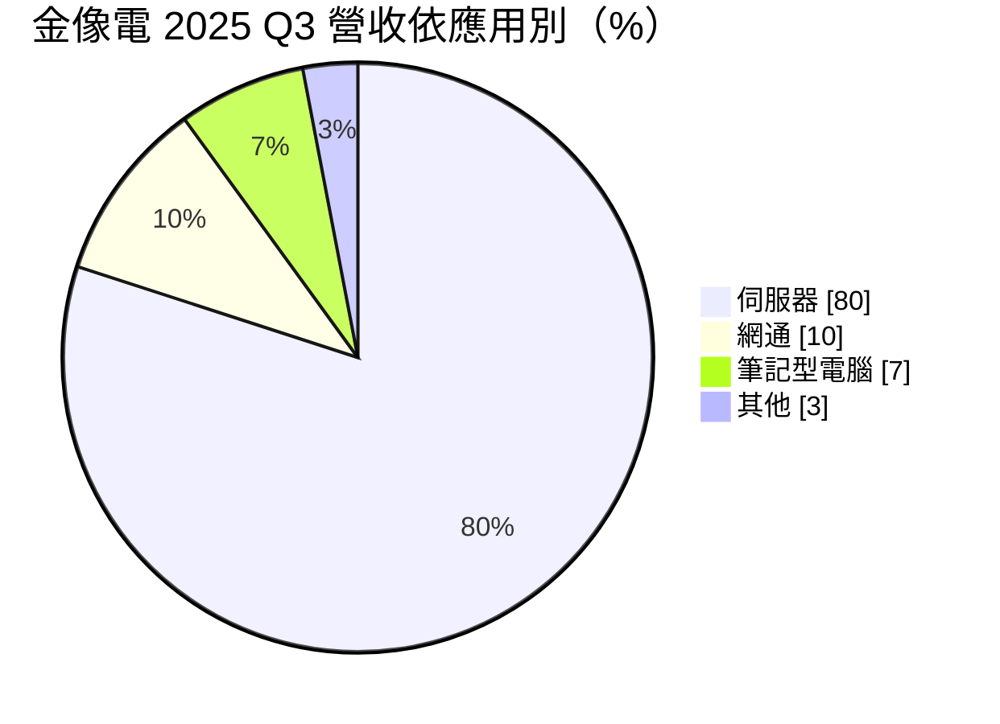
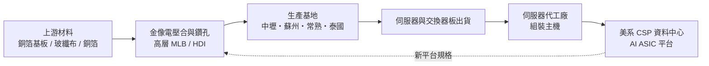
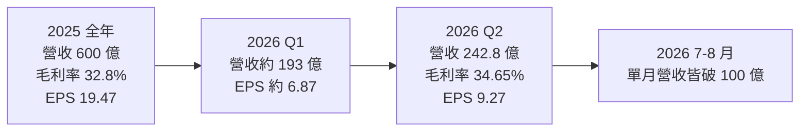
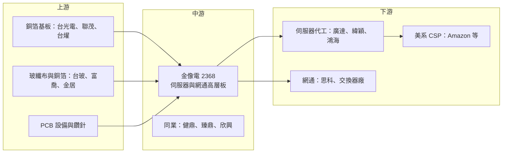

# 2368 金像電

> 上市｜[[產業索引-電子零組件業|電子零組件業]]｜上市（櫃）日期 1998/03/09

# 第一章：企業模式與商業藍圖

> [!info] 撰寫說明
> 本文由 Claude 依公開資料整理，架構比照 [[2330台積電]] 的四章研究，資料截至 2026-10-07。財務數字來源：優分析（2025 年報、2026 上半年財報與 Amazon 私募報導）、富果研究 2025 年 11 月法說會整理、理財周刊 2026 年 8 月報導、方格子公司介紹；產業描述為整理性內容，尚未逐條比對原始文件。#待校對

在評估單一個股的長期投資價值時，首要步驟是拆解企業的底層獲利邏輯。本章針對金像電子（股票代號：2368，以下簡稱金像電）的商業模式進行定性分析，說明一家傳統印刷電路板廠如何在 AI 伺服器浪潮中，轉型為雲端業者自研晶片平台的關鍵供應商。

## 一、核心定位：全球伺服器 PCB 的領導廠

金像電成立於 1981 年 9 月，總部位於桃園中壢，是國內最大的網通 [[PCB]] 製造商，也被公司與市場定位為全球最大的伺服器 PCB 供應商。PCB 是承載與連接所有電子元件的基板，看似是傳統產業，但伺服器與交換器使用的高層多層板（[[MLB]]），層數可達二三十層甚至 50 層以上，對材料、對位精度與訊號損耗的要求和一般消費電子板完全不同。

金像電的關鍵轉折，是在雲端業者開始自行設計 AI 加速晶片（[[ASIC]]）時，率先拿下美系雲端服務供應商（[[CSP]]）ASIC 伺服器主機板與加速卡的訂單。依方格子整理的公司資料，金像電在美系 CSP 的 ASIC 通用基板市占率約四成。2026 年 Amazon 以每股 856 元、約 15.9 億元參與金像電私募，取得約 0.3% 股權，是這個客戶關係最具體的證明。

* **以製程能力換取高單價：** 伺服器板的單價與毛利遠高於筆電板，伺服器比重從 2024 年第四季的 66% 升到 2025 年第三季的 80%，毛利率同步走高。
* **專注板廠，不做下游組裝：** 金像電只賣電路板，客戶是伺服器代工廠與雲端業者，本身不碰系統組裝，資本集中在鑽孔、壓合與電鍍等板廠核心設備。

## 二、終端應用板塊：伺服器與網通合計逾九成

依富果研究整理的 2025 年 11 月法說會資料，2025 年第三季營收結構如下：

* **伺服器：** 含一般伺服器與 [[AI伺服器]]，產品為主機板、加速卡與 [[OAM]] 模組板。主要成長來自美系 CSP 的自研 ASIC 平台，也供應 GPU 伺服器的部分板材。
* **網通：** 資料中心交換器與路由器，400G 與 800G 交換器板是近年成長最快的品項。理財周刊 2026 年 8 月報導指出網通占比已回升到約 15%，伺服器約 78%。
* **筆記型電腦：** 比重持續下降，屬於維持產能利用率的基本盤。
* **其他：** 汽車電子、IC 測試板等利基應用。

## 三、資本轉化邏輯：高層板產能就是營收天花板

* **產能決定營收上限：** 高層板的製程時間長、良率爬坡慢，訂單往往大於產能。2025 年營收 600 億元已創新高，2026 年 7、8 月單月營收都突破 100 億元，代表新產能一開出就被填滿。
* **多地布局：** 台灣中壢、中國蘇州與常熟、泰國巴真。依優分析 2025 年 7 月報導，泰國一期在 2025 年下半年投產，二期預計 2026 年下半年加入；桃園楊梅新產能也在 2026 年第三季開出。泰國廠是對應美國客戶「非中國產能」要求的主要基地。
* **規格升級帶動單價：** 每一代 ASIC 與交換器平台的層數、材料等級都往上提升，同樣的產能能創造更高營收。

## 四、企業長期藍圖：從板廠成為 AI 基礎建設夥伴

* **擴產：** 2025 年資本支出原訂 50 至 60 億元，2026 年原訂 60 至 70 億元；之後陸續追加，理財周刊估計全集團資本支出規模約 170 億元。2026 年下半年董事會又通過約 79 億元的台灣土地與設備投資。
* **深化 CSP 合作：** Amazon 入股之後，雙方從買賣關係延伸為股權關係，有助於爭取下一代平台的優先供應地位。
* **高速網通：** 隨 AI 叢集擴大，交換器從 800G 往 1.6T 演進，網通板是伺服器之外的第二成長引擎。

# 第二章：護城河深度與競爭優勢

在長期價值投資中，「護城河」指企業抵禦競爭、維持超額利潤的保護機制。本章分析金像電的護城河構成、全球主要競爭對手，以及這些優勢在 PCB 產能大舉擴充後能守住多少。

## 一、金像電護城河的核心組成要素

PCB 產業整體競爭激烈，金像電屬於「窄但正在變寬」的護城河，由三個要素組成：

* **1. 平台認證的轉換成本：** CSP 的 ASIC 平台從設計到量產，板廠需要參與早期的疊構設計與訊號完整性測試，通過認證後通常整個平台世代都由同一批供應商供貨。換供應商等於重做一次驗證。
* **2. 高層板製程能力：** 30 層以上、使用超低損耗材料的板子，鑽孔、壓合與對位的良率決定成本。金像電累積多年伺服器板經驗，[[良率]]與交期是它在 CSP 客戶眼中的主要賣點。
* **3. 規模與多地產能：** 同時擁有台灣、中國與泰國產能，可依客戶的地緣政治要求分配生產地點。

## 二、全球主要競爭對手格局

| 對手 | 定位 | 對金像電的威脅 |
|---|---|---|
| [[3044健鼎]] | 台灣大型板廠，伺服器與車用皆有 | 獲利規模相近，在伺服器板直接競爭 |
| [[4958臻鼎-KY]] | 全球最大 PCB 集團，積極切入 AI 伺服器 | 資本實力雄厚，可大舉擴產搶單 |
| [[3037欣興]] | ABF 載板與 [[HDI]] 龍頭 | 在高階 HDI 與 AI 加速卡板材部分重疊 |
| 滬電股份、勝宏科技 | 中國板廠，GPU 伺服器與交換器板 | 價格競爭力強，在 GPU 平台市占提升 |
| TTM Technologies | 美國最大 PCB 廠 | 具美國本土產能，受惠在地化採購 |

## 三、優勢轉化：哪些市場守得住、哪些守不住

* **守得住：** 已拿下的 CSP ASIC 平台，以及高層數交換器板。這些產品的認證期長，客戶重視供貨穩定。
* **守不住：** 規格較低的一般伺服器板與筆電板，同業擴產後價格競爭會加劇。
* **觀察重點：** 新一代 ASIC 平台的供應商分配比例、泰國二期與楊梅新廠的良率爬坡速度，以及 Amazon 入股後是否帶來更多平台訂單。另一個長期觀察點是 GPU 平台是否轉向更高比例的中國板廠供貨，壓縮台廠的議價空間。

# 第三章：財務體質與盈利規模

資料日期：2026-10-07。數字取自優分析與富果研究的財報與法說會整理，表格是撰寫當時的快照；最新月營收、毛利率、累計 EPS 由自動排程寫在本筆記的屬性欄位（月營收、毛利率、累計EPS 等）。#待校對

財務報表是檢驗護城河是否真實存在的最終標準。本章用三率、ROE、現金流與資本報酬，檢視金像電在 AI 伺服器循環中的獲利品質。

## 一、獲利能力的基石：三率

| 項目 | 2025 全年 | 2026 Q1 | 2026 Q2 | 2026 上半年 |
|---|---|---|---|---|
| 營收（新台幣） | 600.04 億 | 約 193.1 億（推算） | 242.79 億 | 435.92 億 |
| [[毛利率]] | 32.8% | 約 34.8%（推算） | 34.65% | 34.72% |
| [[營業利益率]] | 未查得 | 未查得 | 未查得 | 未查得 |
| 稅後淨利 | 96.07 億 | 約 34.8 億（推算） | 47.83 億 | 82.67 億 |
| EPS（元） | 19.47 | 約 6.87（推算） | 9.27 | 16.14 |

* **[[毛利率]]：** 從 2024 年約 29.3% 升到 2025 年的 32.8%，再到 2026 年上半年的 34.7%，主要來自伺服器比重提高與高層板組合優化，匯率也有幫助。
* **營運槓桿：** 2026 年第二季營收季增約 26%，稅後淨利季增 37%，獲利增幅大於營收，顯示固定成本攤提效果明顯。
* **[[淨利率]]：** 2026 年上半年稅後淨利率約 19%，以 PCB 產業而言屬於高檔。

## 二、[[ROE]]：資本效率

金像電 2025 年 EPS 19.47 元、2026 年上半年已達 16.14 元，獲利倍數成長，ROE 推估處於產業高檔（具體數值未查得）。需要注意的是，2026 年的私募增資會擴大股本與權益，短期可能稀釋 ROE。

## 三、資本支出與自由現金流

* **[[CapEx]]：** 2025 年原訂 50 至 60 億元，2026 年原訂 60 至 70 億元，之後多次追加（含向中環購置中壢土地廠房 72 億元、104 億元的台灣、蘇州與泰國擴產，以及約 79 億元台灣投資），理財周刊估計整體規模約 170 億元。
* **[[自由現金流]]：** 擴產期資本支出大幅增加，自由現金流會被壓縮，私募引進 Amazon 資金也有補充擴產資金的作用。
* **股利：** 2025 年度擬配發現金股利 10 元，配發率約五成。

## 四、[[ROIC]] 與 [[WACC]]：價值創造利差

在 AI 伺服器需求強勁、產能滿載的情況下，金像電新增產能的投資報酬率推估明顯高於資金成本。真正的考驗在於這輪大規模擴產完成後，若 AI 資本支出放緩或同業同步擴產造成供給過剩，新廠的折舊將拉低 ROIC，屆時利差能否維持是觀察重點。

# 第四章：總體風險與地緣政治

任何企業都無法脫離宏觀環境獨立存在。本章分析金像電未來必須面對的地緣政治、產業週期與營運風險。

## 一、地緣政治風險

* **中國產能比重高：** 蘇州與常熟仍是主要生產基地，美國對中國製電子零組件的關稅與採購限制，可能迫使客戶要求轉往泰國或台灣生產。
* **美國在地化：** 美國本土板廠受惠在地採購政策，若 CSP 要求部分產能設在美國，金像電需要評估新的投資。
* **台灣與泰國：** 泰國廠是分散風險的主要選項，但新廠的人力、供應鏈成熟度與良率都還在爬坡。

## 二、產業週期與市場結構風險

* **客戶集中：** 伺服器與網通合計超過九成，且集中在少數美系 CSP。單一客戶平台轉換或砍單，對營收影響很大。
* **AI 資本支出週期：** CSP 的資本支出若放緩，伺服器板需求會沿供應鏈放大下修，也就是[[長鞭效應]]。
* **全行業擴產：** 台灣、中國與東南亞板廠同時擴充高層板產能，2027 年後可能出現供過於求。

## 三、營運環境的隱性風險

* **材料供應：** 高階[[銅箔基板]]、低介電玻纖布與 HVLP 銅箔在 AI 需求下供應緊張，材料漲價或缺料會影響出貨與毛利。
* **新廠良率：** 泰國二期與楊梅新廠若良率爬坡不如預期，會壓縮毛利率。
* **匯率：** 以美元報價為主，新台幣升值會影響以台幣計的獲利。

## 四、科技演進風險

AI 伺服器的板材規格快速演進，從超低損耗材料到更高層數、更細線路，甚至可能出現以玻璃基板或共同封裝光學（[[CPO]]）改變交換器架構的情況。若下一代平台的關鍵板材轉向載板或 HDI 技術，而金像電未能及時跟上，就可能失去平台資格。

# 專有名詞解析

## 半導體

- **[[ASIC]]**：特殊應用積體電路，為特定用途客製的晶片，例如雲端業者自研的 AI 加速器。
- **[[良率]]**：合格產品占總產出的比例，高層板良率直接決定成本與交期。

## 應用

- **[[AI伺服器]]**：搭載 GPU 或 ASIC 加速器、用於 AI 訓練與推論的伺服器，對電路板層數與材料要求遠高於一般伺服器。
- **[[CSP]]**：雲端服務供應商，例如 Amazon、Google、Microsoft、Meta，是 AI 伺服器的主要買家。
- **[[OAM]]**：開放加速器模組，由開放運算計畫訂定的 AI 加速卡規格，讓不同廠商的加速器可共用主板。
- **[[CPO]]**：共同封裝光學，把光學收發元件和交換器晶片封裝在一起，可降低高速傳輸的耗電。

## 金融

- **[[CapEx]]**：資本支出，企業購買土地、廠房與設備的支出。
- **[[自由現金流]]**：營業活動現金流減去資本支出，代表企業可自由用於配息、還債或併購的現金。
- **[[長鞭效應]]**：終端需求的小幅變動，沿供應鏈往上游傳遞時被逐級放大，造成上游庫存與訂單劇烈波動。

## 產業

- **[[PCB]]**：印刷電路板，用來承載電子元件並以銅線路連接，是所有電子產品的基礎零組件。
- **[[MLB]]**：多層板，由多張銅箔與絕緣層壓合而成的電路板，伺服器板常達 20 層以上。
- **[[HDI]]**：高密度連接板，以雷射鑽微孔與細線路提高佈線密度的電路板。
- **[[銅箔基板]]**：CCL，PCB 的核心原料，由銅箔、玻纖布與樹脂組成，等級決定訊號損耗。

# 核心供應鏈

## 1. 上游：材料
- 銅箔基板：[[2383台光電]]、[[6213聯茂]]、[[6274台燿]]
- 玻纖布：[[1802台玻]]、[[1815富喬]]
- 銅箔：[[8358金居]]

## 2. 中游：PCB 同業
- [[3044健鼎]]、[[4958臻鼎-KY]]、[[3037欣興]]

## 3. 下游：伺服器代工與品牌
- 伺服器 ODM（推估，依產業結構）：[[2382廣達]]、[[6669緯穎]]、[[2317鴻海]]
- 網通設備：[[CSCO思科]]
- 雲端業者：[[AMZN亞馬遜]]（2026 年參與私募）與其他美系 CSP
- GPU 平台：[[NVDA輝達]]（公司資料所稱美系 GPU 大廠）

## 最新新聞
<!-- news:start（自動產生，請勿手動編輯此範圍） -->
- 2026-10-07 🏛️ 重訊 14:50｜代子公司蘇州金像電子公告取得設備｜[觀測站](https://mops.twse.com.tw/mops/#/web/t05st01)
- 2026-10-05 📰 媒體 11:05｜〈焦點股〉金像電將躋身年營收千億元PCB廠 股價深鎖漲停1215元｜[鉅亨網](https://news.cnyes.com/news/id/6621570)
- 2026-10-05 📰 媒體 09:31｜台光電(2383)5,700元漲停、金像電(2368)飆逾8%！AI高階CCL缺貨行情再點火｜[鉅亨網](https://news.cnyes.com/news/id/6621513)

完整紀錄：[[2368金像電 新聞]]
<!-- news:end -->

## 相關連結
- [公開資訊觀測站](https://mopsov.twse.com.tw/mops/web/t05st03?step=1&firstin=1&co_id=2368)
- [Goodinfo](https://goodinfo.tw/tw/StockDetail.asp?STOCK_ID=2368)
- [Yahoo 股市](https://tw.stock.yahoo.com/quote/2368)
- [鉅亨網新聞](https://www.cnyes.com/twstock/2368/news)
