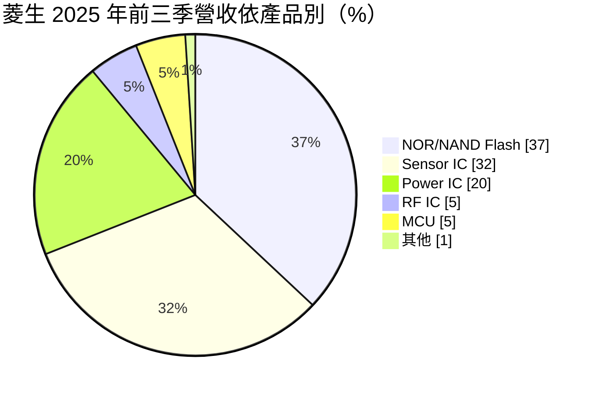
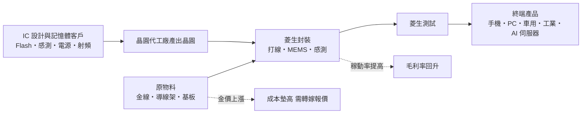
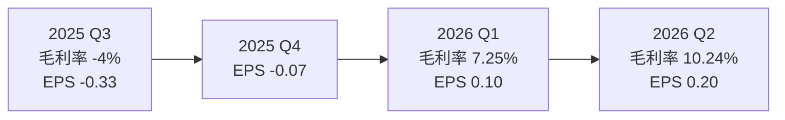
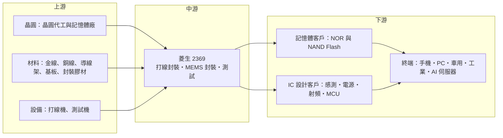

# 2369 菱生

> 上市｜[[產業索引-半導體業|半導體業]]｜上市（櫃）日期 1998/04/10

# 第一章：企業模式與商業藍圖

> [!info] 撰寫說明
> 本文由 Claude 依公開資料整理，架構比照 [[2330台積電]] 的四章研究，資料截至 2026-10-07。財務數字來源：富果研究（2025 年 12 月 3 日法說會整理）、理財周刊（2026 年 5 月）、CMoney、nstock、玩股網、Yahoo 股市季 EPS、MoneyLink 公司基本資料、鉅亨網舊報導（2021 年）；產業描述為整理性內容，尚未逐條比對原始文件。#待校對

在評估單一個股的長期投資價值時，首要步驟是拆解企業的底層獲利邏輯。本章針對菱生精密（股票代號：2369，以下簡稱菱生）的商業模式進行定性分析，說明這家以打線封裝為主的中型封測廠，為何在 2024 至 2025 年連續虧損後於 2026 年轉盈，以及它在記憶體、感測與類比 IC 封裝上的定位。

## 一、核心定位：以類比與記憶體為主的打線封裝廠

菱生成立於 1973 年，是台灣歷史最久的半導體封測廠之一，總部在台中潭子。主要業務是積體電路的封裝與測試，屬於專業封測代工（[[OSAT]]）。和 [[3711日月光投控]]、[[6239力成]] 這類大廠相比，菱生規模較小，產品集中在[[打線封裝]]，客戶以記憶體、感測器、電源管理與射頻晶片為主。

菱生的定位可以用三點概括：

* **小型、利基、類比為主：** 不追逐最先進的晶圓級封裝，而是服務出貨量大、對成本敏感、腳數不多的類比與記憶體晶片。
* **[[MEMS]] 與感測封裝經驗：** 感測器晶片常需要開孔、氣密或特殊材料，製程比一般封裝更客製化，這是菱生長期累積的專長。
* **對金價與產能利用率高度敏感：** 打線封裝需要金線或銅線，金價上漲會直接墊高成本；同時封測廠固定成本高，[[稼動率]]決定獲利。

## 二、終端應用／產品板塊：快閃記憶體與感測器為兩大支柱

依 2025 年 12 月 3 日法說會（富果研究整理），2025 年前三季營收結構如下：

* **快閃記憶體（37%）：** 包括 [[NOR Flash]] 與 [[NAND Flash]] 封裝，是最大業務，法說會指出受 AI 帶動，且現有產能不足以滿足記憶體客戶的長期需求。
* **感測器（32%）：** 包括 MEMS 麥克風、動作感測與光感測等封裝，CMoney 報導提到菱生持續推出感測元件新品。
* **電源管理（20%）：** [[電源管理IC]] 封裝，應用在消費性電子、車用與工業。
* **射頻（5%）：** 射頻元件封裝，受惠 [[Wi-Fi 7]] 世代交替，法說會預期 2026 年啟動。
* **MCU（5%）：** 微控制器封裝。

## 三、資本轉化邏輯（營運模式）：稼動率與金價決定毛利

* **成本結構：** 封測廠的機台折舊與人力屬於固定成本，產能利用率一旦拉高，毛利率會明顯改善。2021 年菱生在全產品線滿載、平均調漲 10% 至 15% 的情況下，第一季毛利率曾達 14.63%，是當時八年新高（鉅亨網 2021 年報導）。
* **金價的影響：** 2025 年前三季毛利率為負 3%，法說會指出最主要原因是金價與其他貴金屬價格上漲。菱生的對策是和客戶協商調整報價，把成本轉嫁出去。
* **2026 年轉盈：** 2026 年第一季毛利率 7.25%、EPS 0.10 元；第二季毛利率 10.24%、EPS 0.20 元，連續兩季獲利，顯示漲價與稼動率回升開始反映。

## 四、企業長期藍圖：記憶體產能、光通訊與扇出型封裝

* **記憶體產能優先：** 2025 年前三季資本支出 3.2 億元，策略是審慎投資、優先準備記憶體相關產能。
* **新興封裝業務：** 理財周刊整理的新方向包括 AI 應用記憶體封裝、光通訊傳輸元件封裝與扇出型（[[Fan-out]]）先進封裝。
* **Wi-Fi 7 與車用：** 射頻元件與車用 IC 產能持續擴充，法說會表示車用電子需求穩定。

# 第二章：護城河深度與競爭優勢

在長期價值投資中，「護城河」指企業抵禦競爭、維持超額利潤的保護機制。本章分析菱生的競爭優勢、國內外主要對手，以及這些優勢在成本上漲與價格競爭中能守住多少。

## 一、護城河的核心組成要素

菱生的護城河偏窄，主要由三項要素構成：

* **1. 感測器與 MEMS 封裝的製程經驗：** MEMS 元件需要依產品客製封裝結構，客戶導入一款產品往往要經過長時間驗證，一旦量產較少輕易更換封測廠（推估）。
* **2. 記憶體客戶的長期關係：** 快閃記憶體占營收近四成，2021 年菱生首度與客戶簽訂長期合約，代表部分客戶願意以長約鎖定產能。
* **3. 中小型客戶的服務彈性：** 大型封測廠優先服務大客戶，菱生可以承接量較小、規格多樣的訂單，對中小型 IC 設計公司具吸引力（推估）。

## 二、全球主要競爭對手格局

| 對手 | 定位 | 對菱生的威脅 |
|---|---|---|
| [[3711日月光投控]] | 全球最大封測廠，產品線完整 | 規模與議價能力遠大於菱生，可整包承接大客戶 |
| [[6239力成]]、[[2441超豐]] | 記憶體封測大廠與其子公司 | 在記憶體與打線封裝直接競爭 |
| [[8150南茂]]、[[8110華東]] | 記憶體與驅動 IC 封測 | 在記憶體封測爭奪相同客戶 |
| 中國封測廠（長電科技、華天、通富微電） | 政策扶植、成本低 | 以低價爭取中國與國際中低階訂單 |

## 三、優勢轉化：守得住／守不住／觀察重點

* **守得住：** MEMS 與感測封裝、需要長期驗證的車用與工業產品，以及記憶體缺貨時的長約訂單。
* **守不住：** 標準化的打線封裝報價。在金價飆漲、稼動率不足的 2024 至 2025 年，菱生無法把成本完全轉嫁，毛利率一度轉負。
* **觀察重點：** 2026 下半年毛利率能否維持在法人預期的 8% 至 10% 區間以上、金價變化，以及光通訊與扇出型封裝能否帶來新的高毛利營收。

# 第三章：財務體質與盈利規模

資料日期：2026-10-07。數字取自富果研究法說會整理、理財周刊、nstock、玩股網與 Yahoo 股市，表格是撰寫當時的快照；最新月營收、毛利率、累計 EPS 由自動排程寫在本筆記的屬性欄位（月營收、毛利率、累計EPS 等）。#待校對

財務報表是檢驗護城河是否真實存在的最終標準。本章用三率、ROE、現金流與資本報酬，檢視菱生從虧損走向轉盈的獲利品質。

## 一、獲利能力的基石：三率

| 項目 | 2025 全年 | 2025 Q3 | 2026 Q1 | 2026 Q2 |
|---|---|---|---|---|
| 營收（新台幣） | 55.58 億 | 14.39 億 | 約 16.9 億（推算） | 約 18.5 億（推算） |
| [[毛利率]] | 前三季 -3% | -4% | 7.25% | 10.24% |
| [[營業利益率]] | 未查得 | 未查得 | 未查得 | 4.71% |
| EPS（元） | 約 -1.04 至 -1.06 | -0.33 | 0.10 | 0.20 |

註：2026 年第一季營收以 1 至 4 月累計 22.61 億元減 4 月 5.72 億元推算；第二季以 1 至 8 月累計 48.21 億元扣除 7、8 月推算。2025 年全年 EPS 各來源略有差異。

* **[[毛利率]]：** 從 2025 年第三季的負 4% 回升到 2026 年第二季的 10.24%，一年內改善約 14 個百分點，主因是報價調整與稼動率提升（推估，依法說會說法與營收成長）。
* **[[營業利益率]]：** 2026 年第二季 4.71%，本業已轉為正數，但距離 2021 年景氣高峰時的水準仍有距離。
* **營收動能：** 2026 年 1 至 8 月累計營收 48.21 億元，年增 36.28%，8 月營收 6.42 億元，年增 32.9%。

## 二、[[ROE]]：資本效率

依 nstock，2026 年第二季單季 ROE 約 1.49%、ROA 約 0.98%，年化後仍屬偏低水準。2024 與 2025 年連續虧損侵蝕股東權益，2026 年的獲利主要用於修補體質。若下半年毛利率維持在 10% 上下，全年 ROE 可回到正值，但仍難以達到雙位數（推估）。

## 三、資本支出與自由現金流

* **[[CapEx]]：** 2025 年前三季資本支出 3.2 億元，以記憶體相關產能為優先。
* **[[自由現金流]]：** 具體數字未查得。封測廠的折舊金額通常不小，即使帳面虧損，營業現金流仍可能為正（推估）；但若要擴充記憶體與扇出型產能，資本支出勢必提高。
* **股利：** nstock 顯示 2025 年度未配發股利，近五年平均現金股利 0.44 元。

## 四、[[ROIC]] 與 [[WACC]]：價值創造利差

2024 至 2025 年菱生的投入資本報酬率為負，明顯低於資金成本。2026 年轉盈後利差縮小，但以第二季 4.71% 的營業利益率推估，ROIC 仍低於 WACC。要創造價值，需要毛利率穩定站上雙位數，並讓新產能投入高附加價值產品。

# 第四章：總體風險與地緣政治

任何企業都無法脫離宏觀環境獨立存在。本章分析菱生未來必須面對的地緣政治、產業週期與營運風險。

## 一、地緣政治

* **轉單機會：** 國際客戶推動「非中國」供應鏈，台灣中小型封測廠可能承接自中國移出的訂單。
* **台灣集中風險：** 菱生主要產能在台中，面臨與其他台灣半導體廠相同的兩岸風險。
* **關稅：** 封測位於供應鏈後段，美國對半導體或終端產品的關稅政策會間接影響客戶下單（推估）。

## 二、產業週期與市場結構

* **記憶體週期：** 快閃記憶體占營收近四成，記憶體價格與客戶庫存變化會直接影響封裝量。2026 年記憶體缺貨帶動需求，但記憶體循環向來劇烈。
* **[[長鞭效應]]：** 感測器與電源 IC 多用於手機與消費性電子，終端需求轉弱時，庫存調整會放大到封測端。
* **市場結構：** 打線封裝技術門檻相對低，供給者多，價格競爭激烈。

## 三、營運環境的隱性風險

* **金價：** 金價是 2025 年毛利率轉負的主因，若金價持續上漲且報價無法同步調整，毛利率會再度受壓。改用銅線可降低成本，但需要客戶重新驗證。
* **產能不足：** 法說會表示現有產能不足以滿足記憶體客戶長期需求，若擴產太慢可能流失訂單，擴產太快又可能在週期反轉時承擔折舊。
* **人力與自動化：** 打線封裝屬勞力與設備密集，人力成本上升需靠自動化抵銷。

## 四、科技或法規演進

* **封裝技術演進：** 高階晶片逐漸轉向[[覆晶封裝]]、晶圓級封裝與[[先進封裝]]，若菱生停留在打線封裝，可服務的市場會逐漸縮小。扇出型封裝與光通訊元件封裝是它的轉型方向。
* **環保法規：** 封裝製程使用化學品與貴金屬，環保與碳排規範趨嚴會增加合規成本。

# 專有名詞解析

## 半導體

- **[[OSAT]]**：專業封裝測試代工，替 IC 設計公司與晶圓廠完成晶片封裝與測試的廠商。
- **[[打線封裝]]**：以金線或銅線把晶片上的接點連接到導線架或基板的傳統封裝方式，成本低，適合腳數不多的晶片。
- **[[覆晶封裝]]**：把晶片翻面，以凸塊直接接合到基板的封裝方式，訊號路徑短，適合高速與高腳數晶片。
- **[[MEMS]]**：微機電系統，在晶片上製作微小機械結構，用於麥克風、加速度計、壓力感測器等。
- **[[NOR Flash]]**：可隨機讀取的快閃記憶體，常用來存放開機程式碼，用於網通、車用與 AI 伺服器。
- **[[NAND Flash]]**：高容量的快閃記憶體，用於 SSD、記憶卡與手機儲存。
- **[[電源管理IC]]**：負責電壓轉換、穩壓與電源分配的晶片，幾乎所有電子產品都需要。
- **[[Fan-out]]**：扇出型封裝，把晶片的連接線路向外延伸到晶片面積以外，不需傳統基板，可做得更薄。
- **[[先進封裝]]**：把多顆晶片以中介層、混合鍵合等方式高密度整合的封裝技術，例如 CoWoS、SoIC。

## 金融

- **[[稼動率]]**：產線實際運轉產量占可運轉產能的比例，封測廠的毛利率高度取決於此。
- **[[毛利率]]**：營業毛利占營收的比例，反映產品定價能力與成本結構。
- **[[營業利益率]]**：營業利益占營收的比例，反映扣除營業費用後本業的獲利能力。
- **[[長鞭效應]]**：終端需求的小幅變動，沿供應鏈往上游傳遞時被逐級放大，造成上游庫存與訂單劇烈波動。

## 產業

- **[[Wi-Fi 7]]**：最新一代 Wi-Fi 標準，傳輸速度與頻寬大幅提升，帶動網通晶片與射頻元件換代。

# 核心供應鏈

## 1. 上游：晶圓、材料與設備
- 晶圓來源：晶圓代工廠如 [[2330台積電]]、[[2303聯電]]，以及記憶體廠（推估）
- 封裝材料：金線、銅線、導線架、IC 載板與封裝膠材（具體供應商未查得）

## 2. 中游：菱生本身
- 封裝：打線封裝、MEMS 與感測器封裝
- 測試：成品測試

## 3. 下游：主要客戶類型
- 快閃記憶體：[[2337旺宏]]、[[2344華邦電]]（推估，NOR Flash 主要台灣廠商，未查證為實際客戶）
- 感測器、電源、射頻與 MCU 設計公司（客戶名單未揭露）

## 4. 同業
- [[3711日月光投控]]、[[6239力成]]、[[2441超豐]]、[[8150南茂]]、[[8110華東]]

## 最新新聞
<!-- news:start -->
<!-- news:end -->

## 相關連結
- [公開資訊觀測站](https://mopsov.twse.com.tw/mops/web/t05st03?step=1&firstin=1&co_id=2369)
- [Goodinfo](https://goodinfo.tw/tw/StockDetail.asp?STOCK_ID=2369)
- [Yahoo 股市](https://tw.stock.yahoo.com/quote/2369)
- [鉅亨網新聞](https://www.cnyes.com/twstock/2369/news)
