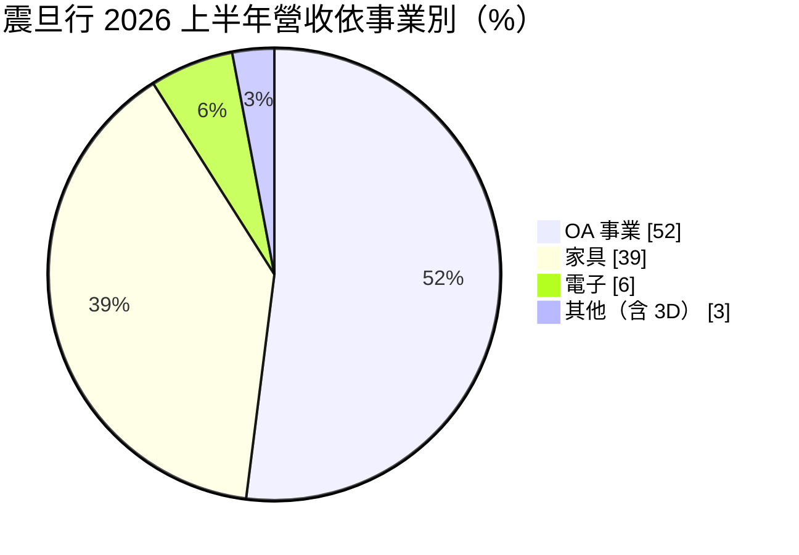
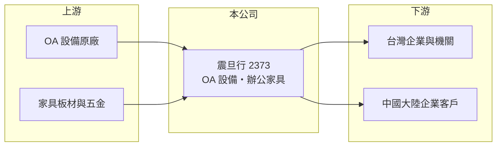

# 2373 震旦行

> 上市｜[[產業索引-其他電子業|其他電子業]]｜上市（櫃）日期 1991/08/01

# 第一章：企業模式與商業藍圖

> [!info] 撰寫說明
> 精簡版，由 Claude 依公開資料整理，架構比照 [[2330台積電]]，資料截至 2026-10-07。來源：震旦行 2026 年 8 月 19 日法說會簡報、winvest 營收快訊標題。#待校對

震旦行以辦公室自動化（OA）設備與辦公家具為兩大主業，市場橫跨台灣與中國大陸。

- **核心業務：** 銷售與租賃影印機、[[多功能事務機]]等 OA 設備並提供維修服務，以及辦公家具、電子與 [[3D列印]]業務。
- **營收結構：** 2026 年上半年 OA 事業占 52%、家具 39%、電子 6%、其他 3%；依地區，台灣 OA 31%、大陸 OA 23%、台灣家具 12%、大陸家具 27%。
- **營運據點：** 台灣與中國大陸為主要市場，在兩地設有銷售與服務網路。
- **長期方向：** 從設備銷售延伸到租賃、文件管理與辦公空間整體規劃服務，並經營 3D 列印等新事業（推估）。

# 第二章：護城河深度與競爭優勢

震旦行的優勢在於綿密的銷售服務網與長期累積的企業客戶。

- **競爭優勢：** OA 設備以租賃與維修合約帶來[[經常性收入]]，服務據點多、客戶轉換成本高；家具可搭配辦公空間規劃一併接案（推估）。
- **主要對手：** OA 方面有富士軟片商業創新、理光、佳能等品牌直營體系，家具方面有台灣與中國的辦公家具業者。
- **觀察重點：** 大陸家具與 OA 業務的景氣變化，以及台灣企業辦公室新建與搬遷需求。

# 第三章：財務體質與盈利規模

資料日期：2026-10-07，表格是撰寫當時的快照；最新月營收、毛利率、累計 EPS 由自動排程寫在本筆記的屬性欄位（月營收、毛利率、累計EPS 等）。#待校對

震旦行營收規模約每季 25 億元，獲利穩定。

- **營收規模：** 2026 年上半年合併營收 51.22 億元，第二季 26.34 億元；7 月營收 9.31 億元，年減 3.53%。
- **獲利：** 2026 年上半年歸屬母公司淨利 3.67 億元，EPS 1.63 元；第二季淨利 2.06 億元，EPS 0.92 元。
- **財務特色：** OA 租賃與維修收入較穩定，獲利波動低於一般設備銷售業者；[[毛利率]]未查得具體數字。

# 第四章：總體風險與地緣政治

震旦行的風險在於中國市場比重高，以及辦公設備需求的長期變化。

- **產業週期：** 企業辦公室投資隨景氣循環，景氣差時新購設備與家具需求延後。
- **營運風險：** 大陸 OA 與家具合計約占營收一半，中國景氣與當地競爭直接影響營收；無紙化趨勢讓影印機長期需求下滑。
- **其他風險：** 人民幣匯率變動、兩岸政治關係，以及原廠代理條件改變。

# 專有名詞解析

## 金融

- **[[經常性收入]]**：租賃、維修合約或訂閱等每期穩定發生的收入，可預測性高於一次性銷售。
- **[[毛利率]]**：毛利除以營收，反映產品或服務本身的獲利能力。

## 產業

- **[[多功能事務機]]**：整合影印、列印、掃描與傳真的辦公設備，通常以租賃加維修合約方式提供給企業。
- **[[3D列印]]**：以逐層堆疊材料的方式成形零件，金屬 3D 列印可做出傳統加工難以完成的複雜結構。

# 核心供應鏈

- 上游：影印機與事務機原廠、家具板材與五金供應商（推估）
- 下游／客戶：台灣與中國大陸的企業、學校與政府機關
- 同業：富士軟片商業創新、理光、佳能等 OA 業者，辦公家具業者

## 最新新聞
<!-- news:start -->
<!-- news:end -->

## 相關連結
- [公開資訊觀測站](https://mopsov.twse.com.tw/mops/web/t05st03?step=1&firstin=1&co_id=2373)
- [Goodinfo](https://goodinfo.tw/tw/StockDetail.asp?STOCK_ID=2373)
- [Yahoo 股市](https://tw.stock.yahoo.com/quote/2373)
- [鉅亨網新聞](https://www.cnyes.com/twstock/2373/news)
