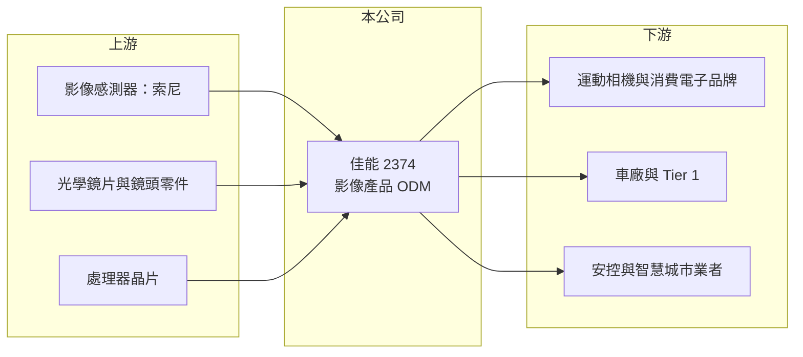

# 2374 佳能

> 上市｜[[產業索引-光電業|光電業]]｜上市（櫃）日期 1995/01/16

# 第一章：企業模式與商業藍圖

> [!info] 撰寫說明
> 精簡版，由 Claude 依公開資料整理，架構比照 [[2330台積電]]，資料截至 2026-10-07。來源：優分析（2026-08-07 財報報導）、winvest 營收快訊、工商時報。#待校對

佳能企業以代工方式替品牌客戶設計與生產影像產品，正把應用從消費相機延伸到車用、安控與 AI 視覺。

- **核心業務：** 佳能企業以數位相機 [[ODM]] 起家，目前產品涵蓋運動攝影機、車用鏡頭與影像模組、安控攝影機等高階光學影像產品。
- **營收結構：** 以影像產品代工為主，各產品線比重這次未查到；車用與安控等非消費相機應用比重推估逐步提高。
- **營運據點：** 總部在台灣，生產據點推估以中國與東南亞為主。
- **長期方向：** 公司深化 AI 合作，轉投資「佳捷智能」，整合高階光學影像、AI 視覺分析、[[邊緣運算]]與城市管理平台，切入[[智慧城市]]與機器人應用。

# 第二章：護城河深度與競爭優勢

佳能的護城河在於光學設計與影像系統整合能力，可在不同終端應用之間移轉。

- **競爭優勢：** 長期累積的光學設計與影像系統整合能力，可延伸到車用、安控與機器人視覺。
- **主要對手：** 光學影像同業有 [[3019亞光]]、[[3504揚明光]]、[[3059華晶科]]，安控領域則有 3454晶睿。
- **觀察重點：** 營收能否如市場報導挑戰百億元、毛利率下滑的原因，以及 AI 視覺方案的商轉進度。

# 第三章：財務體質與盈利規模

資料日期：2026-10-07，表格是撰寫當時的快照；最新月營收、毛利率、累計 EPS 由自動排程寫在本筆記的屬性欄位（月營收、毛利率、累計EPS 等）。#待校對

佳能 2026 年營收與獲利大幅成長，但毛利率下滑，獲利品質需要再觀察。

- **營收規模：** 2026 年上半年營收 57.92 億元；8 月營收 13.13 億元，年增約 35%。
- **獲利：** 2026 年上半年稅後純益 5.11 億元，年增 1.51 倍，EPS 1.55 元；第二季 EPS 0.82 元。上半年 [[毛利率]] 24.18%，年減 4.41 個百分點。
- **財務特色：** 營收與獲利同步大幅成長，但毛利率下滑，顯示產品組合或價格條件有變化。

# 第四章：總體風險與地緣政治

佳能的風險集中在消費電子景氣、客戶集中與生產據點的地緣政治。

- **產業週期：** 運動相機屬消費性電子，需求受景氣影響；車用與安控需求相對穩定，但[[車規驗證]]期長。
- **營運風險：** 代工模式下客戶集中度推估偏高，主要客戶訂單變動會直接影響營收。
- **其他風險：** 生產據點與中國相關，需留意關稅與地緣政治；匯率也會影響代工毛利。

# 專有名詞解析

## 應用

- **[[邊緣運算]]**：在攝影機或終端裝置上直接處理資料，不必全部傳回雲端，可降低延遲與頻寬。
- **[[智慧城市]]**：以攝影機、感測器與資料平台管理交通、治安與公共設施的城市應用。
- **[[車規驗證]]**：車用晶片須通過 AEC-Q100 等可靠度測試與車廠認證，流程常需 2 至 3 年，因此轉換成本高。

## 產業

- **[[ODM]]**：原廠委託設計製造，代工廠負責產品設計與生產，再貼上客戶品牌出貨。

# 核心供應鏈

- 上游：影像感測器（如 [[SONY索尼]]）、光學鏡片與鏡頭零件、處理器晶片
- 下游／客戶：運動相機與消費電子品牌、車廠與 Tier 1、安控與智慧城市業者
- 同業：[[3019亞光]]、[[3504揚明光]]、[[3059華晶科]]、3454晶睿

## 最新新聞
<!-- news:start -->
<!-- news:end -->

## 相關連結
- [公開資訊觀測站](https://mopsov.twse.com.tw/mops/web/t05st03?step=1&firstin=1&co_id=2374)
- [Goodinfo](https://goodinfo.tw/tw/StockDetail.asp?STOCK_ID=2374)
- [Yahoo 股市](https://tw.stock.yahoo.com/quote/2374)
- [鉅亨網新聞](https://www.cnyes.com/twstock/2374/news)
