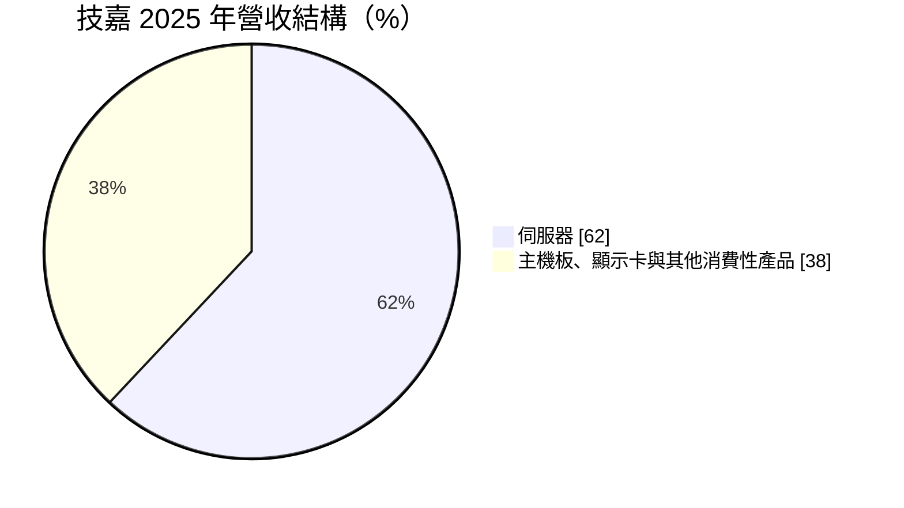
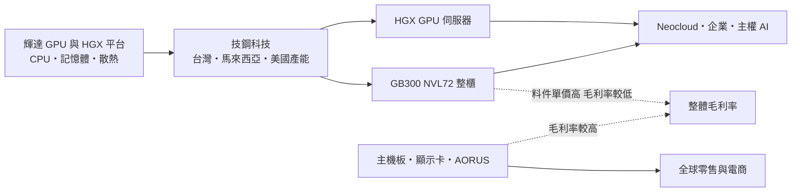
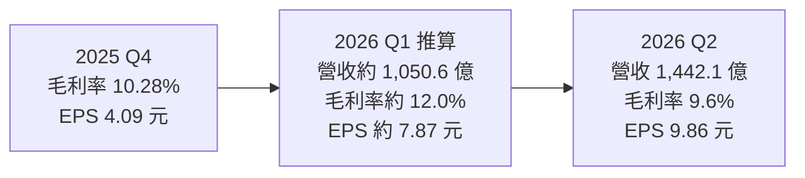
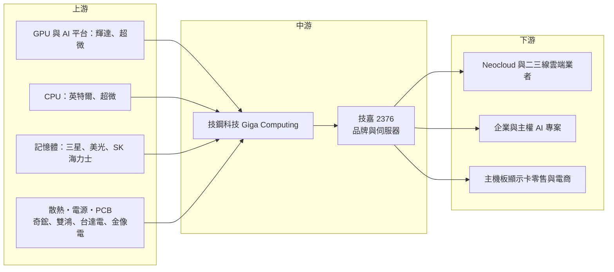

# 2376 技嘉

> 上市｜[[產業索引-電腦及週邊設備業|電腦及週邊設備業]]｜上市（櫃）日期 1998/09/24

# 第一章：企業模式與商業藍圖

> [!info] 撰寫說明
> 本文由 Claude 依公開資料整理，架構比照 [[2330台積電]] 的四章研究，資料截至 2026-10-07。財務數字來源：技嘉 2025 年財報與 2026 年第二季法說會報導（優分析、聯合新聞網、理財周刊、科技新報）；產業描述為整理性內容，尚未逐條比對原始文件。#待校對

在評估單一個股的長期投資價值時，首要步驟是拆解企業的底層獲利邏輯。本章針對技嘉科技（股票代號：2376，以下簡稱技嘉）的商業模式進行定性分析，說明這家主機板品牌如何在三年內把伺服器做成營收主力，以及它為什麼把目標放在新興雲端業者，而不是超大型雲端業者。

## 一、核心定位：從主機板品牌轉型為 AI 伺服器供應商

技嘉成立於 1986 年，以主機板起家，長期與 [[2357華碩]]、[[2377微星]] 並列台灣三大主機板與顯示卡品牌。近年技嘉的營收重心快速移到伺服器，2025 年伺服器已占營收 62%，2026 年第一季更升至約七成，其中 AI 伺服器占伺服器營收八成以上。

技嘉的伺服器業務由子公司技鋼科技（Giga Computing）負責，提供從單機 GPU 伺服器到 [[NVDA輝達]] GB 系列整櫃（[[NVL72]]）的方案。這個定位有兩個商業意義：

* **鎖定 [[Neocloud]]：** 約八成 AI 營收來自新興雲端服務商與二、三線雲端業者，是這波 Neocloud 擴產潮的主要受惠者之一。
* **雙引擎結構：** 伺服器提供規模與成長，主機板、顯示卡等消費性產品提供較高毛利的現金流，兩者互相平衡。

## 二、產品板塊：伺服器占六成以上

2025 年營收結構如下：

* **伺服器：** 以輝達 [[HGX]] 平台 GPU 伺服器與 GB200、GB300 NVL72 整櫃為主，2025 年 GB 系列約占伺服器業務兩成。客戶包括 Neocloud、企業、[[主權 AI]] 專案與二、三線雲端業者。
* **主機板：** 以 [[DIY]] 與[[電競]]市場為主，毛利率高於伺服器。
* **顯示卡：** 搭配輝達與 [[AMD超微]] 新世代 GPU，需求隨遊戲與 AI 個人應用起伏。
* **其他消費性產品：** 電競筆電（AORUS 品牌）、顯示器、周邊。

## 三、資本轉化邏輯：產品組合決定毛利率

* **產品組合與毛利率：** 主機板與顯示卡毛利率較高，AI 整櫃則因 GPU 料件單價高而毛利率較低。2026 年第二季因 NVL72 整櫃出貨比重升高，毛利率由第一季的約 12.0% 降到 9.6%。
* **產能布局：** 伺服器產能分布在台灣、馬來西亞與美國，公司計劃 2026 年全球伺服器產能較 2025 年倍增，美國廠預計 2026 年第三季開始正式出貨。
* **資本支出：** 2026 年資本支出由原先 23 至 25 億元上修為 28 至 30 億元，上半年已支出約 18.2 億元。

## 四、企業長期藍圖：用彈性服務爭取非頂級雲端客戶

超大型雲端業者的訂單多由鴻海、廣達、緯創等 ODM 承接，技嘉則鎖定資源較少、需要快速交機與一站式服務的 Neocloud 與企業客戶，並透過美國廠滿足在地交貨需求。公司預期 2026 年 AI 伺服器營收維持三位數成長，營業利益率維持 5% 至 6% 區間。

# 第二章：護城河深度與競爭優勢

在長期價值投資中，「護城河」指企業抵禦競爭、維持超額利潤的保護機制。本章分析技嘉的護城河構成、品牌伺服器與 ODM 兩群競爭對手，以及它在 Neocloud 市場的優勢能守住多少。

## 一、護城河的核心組成要素

技嘉的護城河屬於「窄護城河」，主要由三個要素組成：

* **1. 品牌與快速交機能力：** 在 GPU 伺服器領域累積多年經驗，能在輝達新平台推出時快速提供多種機型，適合需要快速部署的 Neocloud 客戶。
* **2. 主機板設計底子：** 伺服器主機板與散熱設計能力來自長年的主機板研發。
* **3. 消費性品牌：** 主機板、顯示卡與電競產品提供較高毛利的現金流，平衡伺服器業務的低毛利。

不過，技嘉缺乏與超大型雲端業者的深度綁定，也缺乏 ODM 的規模經濟，Neocloud 客戶本身財務體質也較不穩定，因此護城河並不深。

## 二、全球主要競爭對手格局

| 對手 | 定位 | 對技嘉的威脅 |
|---|---|---|
| 美超微 | 美國品牌伺服器廠，同樣以 Neocloud 與企業為主 | 最直接的對手，液冷與整櫃經驗豐富 |
| Dell、HPE | 美國品牌伺服器廠 | 在企業 AI 伺服器市場份額大 |
| [[2357華碩]] | 台灣品牌伺服器與主機板廠 | 在伺服器、主機板、顯示卡全面重疊 |
| [[2317鴻海]]、[[2382廣達]]、[[3231緯創]]、[[6669緯穎]] | 伺服器 ODM | 主攻超大型雲端業者，也會承接大型 Neocloud 訂單 |
| [[2377微星]]、華擎 | 主機板與顯示卡品牌 | 在 DIY 與電競市場競爭 |

## 三、優勢轉化：哪些守得住、哪些守不住

* **守得住：** 中小型 Neocloud 與企業客戶重視交期與服務，技嘉的彈性在這個市場具競爭力。
* **守不住：** NVL72 整櫃的規模化生產與[[液冷]]整合，ODM 與美超微的經驗與產能更大；大型 Neocloud 若擴大到一定規模，可能轉向 ODM 直接下單。
* **觀察重點：** 美國廠出貨進度；NVL72 與 HGX 機種的比重變化對毛利率的影響；Neocloud 客戶的財務狀況與付款能力。

# 第三章：財務體質與盈利規模

資料日期：2026-10-07。數字取自公司法說會與財報的財經媒體整理（優分析、聯合新聞網、理財周刊），表格是撰寫當時的快照；最新月營收、毛利率、累計 EPS 由自動排程寫在本筆記的屬性欄位（月營收、毛利率、累計EPS 等）。#待校對

財務報表是檢驗護城河是否真實存在的最終標準。本章用三率、ROE、現金流與資本報酬，檢視技嘉轉型為 AI 伺服器供應商後的獲利品質。

## 一、獲利能力的基石：三率

| 項目 | 2025 全年 | 2025 Q4 | 2026 Q1（推算） | 2026 Q2 |
|---|---|---|---|---|
| 營收（新台幣） | 3,369.4 億 | 未查得 | 約 1,050.6 億 | 1,442.1 億 |
| [[毛利率]] | 未查得 | 10.28% | 約 12.0% | 9.6% |
| [[營業利益率]] | 未查得 | 未查得 | 約 7.0% | 5.6% |
| 稅後純益 | 未查得 | 未查得 | 約 52.6 億 | 66.1 億 |
| EPS（元） | 16.79 | 4.09 | 約 7.87 | 9.86 |

* **推算說明：** 2026 年第一季為上半年累計（營收 2,492.7 億元、毛利率 10.6%、營業利益率 6.2%、稅後純益 118.7 億元、EPS 17.73 元）減去第二季後推算。
* **量增、毛利率降：** 2026 年第二季營收季增 37.3%、年增 41.0%，單季 EPS 9.86 元創新高，年增 116.6%；但毛利率季減 2.4 個百分點，反映整櫃出貨占比升高。
* **[[業外收益]]：** 第二季業外有約 8.8 億元匯兌利益，屬非經常性成分。
* **第三季展望：** 公司預期主機板與顯示卡進入旺季，且 NVL72 比重可能下降，毛利率有機會較第二季改善。

## 二、ROE：資本效率

技嘉過去以品牌業務為主，屬輕資產模式；伺服器業務擴大後，存貨與應收帳款大幅增加，[[營運資金]]需求上升。2026 年上半年 EPS 已超過 2025 全年，推估 [[ROE]] 明顯提升（確切數值未查得）。

## 三、資本支出、自由現金流與股利

* **[[CapEx]]：** 2026 年上修至 28 至 30 億元，主要投入台灣、馬來西亞與美國伺服器產能，相對營收規模而言仍低。
* **[[自由現金流]]：** 主要現金壓力來自 GPU 等料件的備貨，以及 Neocloud 客戶的應收帳款；營收快速成長期間自由現金流可能低於淨利（推估）。
* **股利：** 2025 年度配發現金股利 12 元，以 EPS 16.79 元計算配發率約七成一，媒體報導當時殖利率約 4.3%。

## 四、[[ROIC]] 與 [[WACC]]：價值創造利差

技嘉固定資產投入少，ROIC 主要受營業利益率與營運資金周轉影響。在營業利益率 5% 至 7% 的水準下，推估 ROIC 高於 WACC（具體數值未查得）。若 Neocloud 客戶付款延遲、應收帳款與存貨累積，投入資本會快速膨脹，利差可能被壓縮，這是比毛利率更值得追蹤的指標。

# 第四章：總體風險與地緣政治

任何企業都無法脫離宏觀環境獨立存在。本章分析技嘉未來必須面對的地緣政治、AI 資本支出週期、客戶財務與技術風險。

## 一、地緣政治風險

* **美國關稅與在地生產：** AI 伺服器主要出貨至美國，關稅政策影響成本，技嘉以美國廠因應。
* **出口管制：** 美國對高階 GPU 的出口限制，影響對中國及部分地區的 AI 伺服器與顯示卡銷售。
* **台灣與中國生產集中：** 主機板與顯示卡產能部分位於中國，面臨美中貿易摩擦的影響。

## 二、產業週期與市場結構風險

* **Neocloud 的財務風險：** 約八成 AI 營收來自 Neocloud 與二、三線雲端業者，這些客戶多仰賴融資擴張，若資金環境轉差或 GPU 租賃價格下滑，可能延後或取消訂單。
* **AI 資本支出週期：** AI 伺服器占營收比重高，景氣反轉時營收波動大，[[長鞭效應]]會放大組裝與品牌廠的訂單變化。
* **消費性需求：** 主機板與顯示卡受 PC 換機與遊戲市場影響。

## 三、營運環境的隱性風險

* **產品組合與毛利率：** 整櫃比重升高會壓低毛利率，季度間波動大。
* **零組件供應：** GPU、記憶體與電源等零組件若短缺，可能延誤出貨與營收認列。
* **應收帳款與存貨：** 伺服器料件單價高，客戶付款延遲時資金壓力大。
* **匯率：** 營收以美元計價為主，匯率波動影響損益。

## 四、科技演進風險

AI 機櫃的液冷、電源與高速互連設計門檻快速上升，技嘉需持續投入研發才能跟上輝達平台世代（GB300、Vera Rubin）。若在新平台的設計與量產進度落後，可能失去 Neocloud 客戶的優先供應地位。

# 專有名詞解析

## 應用

- **[[Neocloud]]**：新興雲端服務商，以出租 GPU 算力為主要業務，多仰賴融資快速擴張。
- **[[主權 AI]]**：各國政府為確保資料與運算自主而自建的 AI 算力與模型。

## 金融

- **[[業外收益]]**：本業以外的收入，如利息、投資收益、股利與匯兌利益，持續性通常低於本業獲利。
- **[[營運資金]]**：流動資產減流動負債，主要是存貨與應收帳款，AI 伺服器料件昂貴使需求大增。
- **[[自由現金流]]**：營業活動現金流減去資本支出，代表企業可自由用於配息、還債或併購的現金。
- **[[長鞭效應]]**：終端需求的小幅變動，沿供應鏈往上游傳遞時被逐級放大，造成上游庫存與訂單劇烈波動。

## 產業

- **[[NVL72]]**：輝達 GB 系列整櫃方案，一座機櫃內以高速互連串接 72 顆 GPU，當作一台大型運算機使用。
- **[[HGX]]**：輝達提供給伺服器廠的 GPU 基板平台，一片基板通常搭載 8 顆 GPU。
- **[[DIY]]**：玩家自行選購主機板、顯示卡等零組件組裝電腦的市場。
- **[[電競]]**：電子競技與高效能遊戲市場，玩家願意為高規格硬體支付較高價格。
- **[[液冷]]**：以液體帶走晶片熱量的散熱方式，高功率 AI 機櫃已從氣冷轉向液冷。

# 核心供應鏈

## 1. 上游：晶片與零組件
- GPU 與 AI 平台：[[NVDA輝達]]、[[AMD超微]]
- CPU：[[INTC英特爾]]、[[AMD超微]]
- 記憶體：[[005930三星電子]]、美光、SK 海力士
- 散熱：[[3017奇鋐]]、[[3324雙鴻]]
- 電源：[[2308台達電]]、[[2301光寶科]]
- PCB：[[2368金像電]]

## 2. 中游：技嘉集團
- 伺服器子公司：技鋼科技（Giga Computing）

## 3. 下游：主要客戶
- Neocloud 與二、三線雲端業者、企業與主權 AI 專案
- 主機板與顯示卡：全球零售與電商通路

## 4. 同業
- 品牌伺服器：美超微、Dell、HPE、[[2357華碩]]
- ODM：[[2317鴻海]]、[[2382廣達]]、[[3231緯創]]
- 主機板與顯示卡：[[2357華碩]]、[[2377微星]]

## 最新新聞
<!-- news:start（自動產生，請勿手動編輯此範圍） -->
- 2026-10-07 📰 媒體 12:30｜技嘉(2376)9月營收衝631億元！超越市場預期8.2%，AI伺服器放量後獲利能跟上？｜[鉅亨網](https://news.cnyes.com/news/id/6623562)
- 2026-10-06 📰 媒體 18:50｜營收速報 - 技嘉(2376)9月營收630.99億元年增率高達125.45％｜[鉅亨網](https://news.cnyes.com/news/id/6622876)

完整紀錄：[[2376技嘉 新聞]]
<!-- news:end -->

## 相關連結
- [公開資訊觀測站](https://mopsov.twse.com.tw/mops/web/t05st03?step=1&firstin=1&co_id=2376)
- [Goodinfo](https://goodinfo.tw/tw/StockDetail.asp?STOCK_ID=2376)
- [Yahoo 股市](https://tw.stock.yahoo.com/quote/2376)
- [鉅亨網新聞](https://www.cnyes.com/twstock/2376/news)
