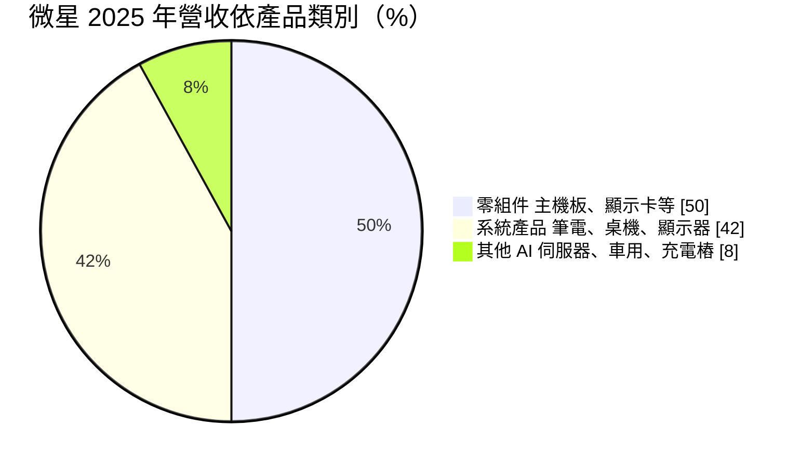
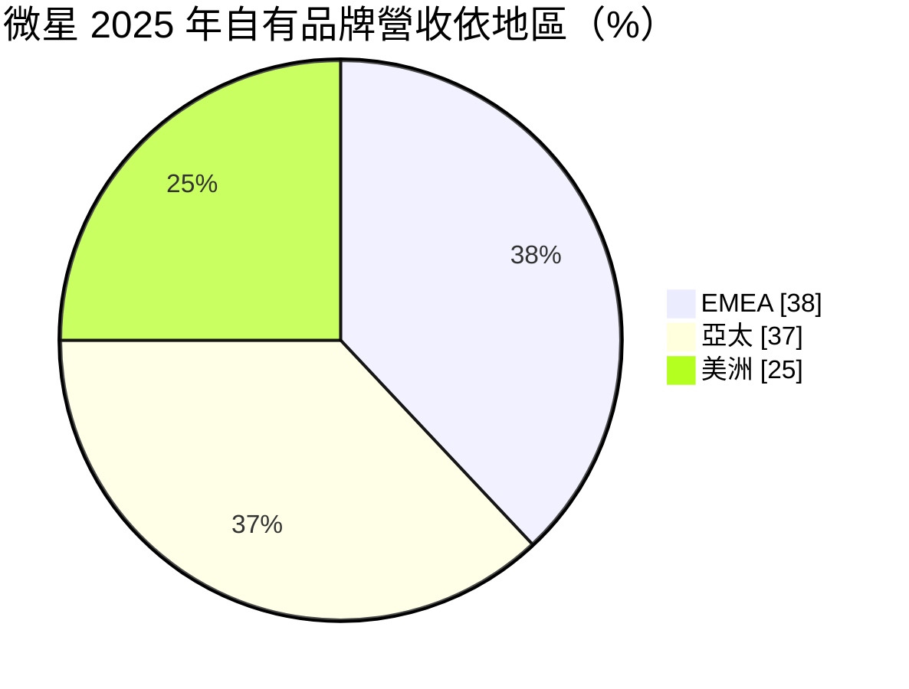
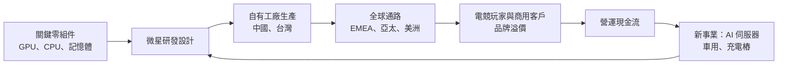
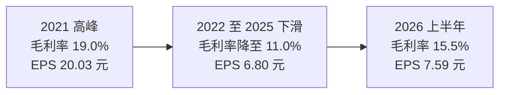
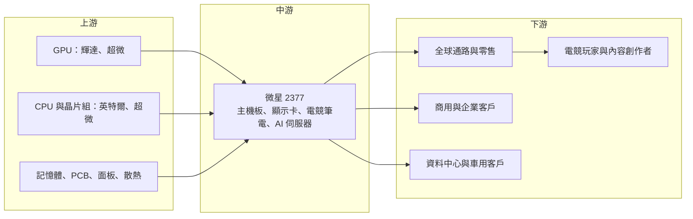

# 2377 微星

> 上市｜[[產業索引-電腦及週邊設備業|電腦及週邊設備業]]｜上市（櫃）日期 1998/10/31

# 第一章：企業模式與商業藍圖

> [!info] 撰寫說明
> 本文由 Claude 依公開資料整理，架構比照 [[2330台積電]] 的四章研究，資料截至 2026-10-08。財務數字來源：Goodinfo 年度經營績效頁（2020 至 2025 年）、證交所開放資料（基本資料、2026 年第二季資產負債與綜合損益、營益分析、股利）、富果研究 2026 年 3 月微星法說會整理、經濟日報與優分析法說報導；產業描述為整理性內容，尚未逐條比對原始文件，憑既有知識撰寫的部分已標「待校對」。#待校對

在評估單一個股的長期投資價值時，首要步驟是拆解企業的底層獲利邏輯。本章針對微星科技（股票代號：2377，以下簡稱微星）的商業模式進行分析，說明一家以主機板起家的公司，如何靠電競品牌建立全球知名度，以及它在 PC 與 AI 新事業之間的長期定位。

## 一、核心定位：以電競為核心的自有品牌電腦公司

微星成立於 1986 年，1998 年上市，實收資本額約 84.5 億元，董事長為徐祥、總經理為黃金請（證交所開放資料）。微星由幾位工程師共同創立，早期以主機板為主要產品，之後延伸到顯示卡、筆電、桌機、顯示器與周邊。#待校對

微星的定位是「自有品牌的電競硬體公司」。和宏碁、華碩等綜合 PC 品牌不同，微星把大部分資源集中在電競玩家與內容創作者，目標客群是 18 至 35 歲的族群（富果研究整理）。電競玩家重視效能與品牌形象，對價格的敏感度較一般消費者低，這讓微星能在高階市場維持較高的平均售價。

## 二、終端應用與產品板塊

2025 年的產品營收結構如下（富果研究整理之法說資料）：

* **零組件：** 主機板、顯示卡、機殼與電源供應器，占營收一半。主機板與顯示卡是微星的起家產品，DIY 玩家市場是品牌形象的根基。顯示卡業務高度依賴 [[NVDA輝達]] 的 GPU 供貨與新品節奏。
* **系統產品：** 電競與商用筆電、桌上型電腦與顯示器，占 42%。電競筆電是微星的主力系統產品，近年也開始拓展商用市場。
* **其他：** AI 伺服器、車用電子、充電樁、工業電腦與掌上型遊戲機等新事業，占 8%。2026 年法說會表示 AI 伺服器營收預期成長 50% 至 100%（經濟日報）。

依地區，2025 年自有品牌營收中歐洲、中東與非洲（EMEA）占 38%，是營收與獲利的主要來源；亞太占 37%，近年成長明顯；美洲占 25%。

## 三、資本轉化邏輯：品牌溢價加自有工廠

微星的模式介於品牌與製造之間：

* **自有工廠：** 和多數 PC 品牌委外代工不同，微星擁有自己的主機板與顯示卡工廠，產能主要在中國與台灣。#待校對 自有工廠讓微星能更快推出新品、掌控品質，也能在新 GPU 推出時迅速放量。
* **品牌溢價與營運槓桿：** 電競產品的毛利率高於一般 PC。在 GPU 新世代推出、玩家換機需求旺盛的年度，微星的獲利會明顯放大，2021 年營業利益率達 9.9% 就是一例。
* **營運資金管理：** 2025 年底存貨約 477.6 億元，存貨週轉天數約 75 天，現金循環天數 57 天（富果研究整理）。在零組件價格劇烈波動時，存貨控制直接影響毛利率。

## 四、企業長期藍圖

微星的長期策略有四個方向。第一，鞏固電競領導地位，提高高階產品比重。第二，拓展商用市場，管理層認為商用與消費市場的規模相當。第三，發展 AI 伺服器、車用電子、充電樁、工業電腦與 Edge AI PC 等新事業。第四，強化產能布局：桃園龜山工業區新廠占地約 3,424 坪，預計 2027 年完工，規劃生產 AI 伺服器、資料中心設備、充電樁、工業電腦與顯示卡，也可彈性調配筆電與主機板產能（富果研究整理）。

這些方向代表微星希望降低對 PC 與 GPU 週期的依賴，但新事業目前占營收不到一成，短期內 PC 與板卡仍是主要的獲利來源。

# 第二章：護城河深度與競爭優勢

本章針對微星的競爭優勢進行分析。電競硬體市場的護城河來自品牌、產品設計與與 GPU 廠的合作關係，但也面臨強大的同業競爭。

## 一、護城河的核心組成要素

* **電競品牌形象：** 微星長期贊助電競賽事與玩家社群，在全球電競玩家中具有高知名度。#待校對 品牌形象讓微星能在同規格產品上收取較高價格，這是它毛利率高於一般 PC 品牌的主要原因。
* **與 GPU 與 CPU 廠的合作：** 微星是輝達、[[AMD超微]]、[[INTC英特爾]] 的主要板卡合作夥伴之一，能在新平台推出時同步上市。這種合作關係需要長期累積，對新進者是進入門檻。
* **產品線完整：** 從主機板、顯示卡、電源、機殼到筆電與顯示器，微星能提供玩家完整的電競裝備，提高品牌黏著度與交叉銷售。
* **自有製造與快速反應：** 自有工廠讓微星在新 GPU 推出時能快速放量，也能根據市場需求調整產品組合。

## 二、全球主要競爭對手格局

| 公司 | 國家 | 主要競爭領域 | 與微星的比較 |
|---|---|---|---|
| [[2357華碩]] | 台灣 | 主機板、顯示卡、電競筆電 | 最直接的對手，規模較大 |
| [[2376技嘉]] | 台灣 | 主機板、顯示卡、AI 伺服器 | 板卡與伺服器同時競爭 |
| [[2353宏碁]] | 台灣 | 電競筆電（Predator） | 電競筆電市場競爭 |
| Lenovo、Dell、HP | 中、美 | 電競 PC 子品牌 | 規模與通路優勢 |
| 中國顯示卡品牌 | 中國 | 顯示卡 | 以價格競爭 #待校對 |

主機板與顯示卡市場由華碩、微星、技嘉三家台灣廠商主導，這是台灣在全球 PC 產業中最具優勢的領域之一。#待校對 電競筆電則面對 Lenovo、Dell 等大廠的電競子品牌競爭。

## 三、優勢轉化：守得住、守不住與觀察重點

* **守得住：** 高階主機板、顯示卡與電競筆電。這些產品重視效能與品牌，微星與華碩、技嘉共同主導市場，競爭格局相對穩定。
* **守不住：** 中低階產品與 GPU 週期造成的波動。2021 年的高獲利主要來自加密貨幣挖礦與疫情帶動的顯示卡需求，之後毛利率由 19% 降到 11%，說明板卡業務的獲利高度依賴 GPU 週期。
* **觀察重點：** 第一，2026 年調漲終端產品售價 15% 至 30% 後，能否同時維持出貨量與毛利率；第二，AI 伺服器與新事業能否占營收一成以上；第三，龜山新廠在 2027 年完工後的產能利用率。

# 第三章：財務體質與盈利規模

資料日期：2026-10-08。多年度數字取自 Goodinfo 年度經營績效頁，2026 年上半年取自證交所開放資料，表格是撰寫當時的快照；最新月營收、毛利率、累計 EPS 由自動排程寫在本筆記的屬性欄位（月營收、毛利率、累計EPS 等）。#待校對

財務報表是檢驗護城河是否真實存在的最終標準。本章用多年度的三率、ROE、現金流與資本報酬，檢視微星在 GPU 與 PC 週期中的獲利品質。

## 一、獲利能力的基石：三率

| 年度 | 營收（新台幣） | [[毛利率]] | [[營業利益率]] | EPS（元） | [[ROE]] |
|---|---|---|---|---|---|
| 2020 | 1,465 億 | 14.5% | 6.27% | 9.42 | 23.9% |
| 2021 | 2,018 億 | 19.0% | 9.90% | 20.03 | 41.0% |
| 2022 | 1,804 億 | 14.3% | 5.93% | 11.79 | 20.9% |
| 2023 | 1,830 億 | 12.5% | 4.82% | 8.92 | 15.3% |
| 2024 | 1,979 億 | 12.2% | 3.60% | 8.04 | 13.2% |
| 2025 | 2,302 億 | 11.0% | 2.78% | 6.80 | 10.7% |
| 2026 上半年 | 1,061.7 億 | 15.5% | 6.74% | 7.59 | 未查得 |

* **營收成長、利潤率下滑：** 2020 至 2025 年營收年複合成長率約 9.5%（推算），但毛利率由 2021 年的 19.0% 一路降到 2025 年的 11.0%，營業利益率由 9.9% 降到 2.78%。2025 年毛利率下滑的原因包括輝達新舊產品交替、美國關稅、新台幣升值、筆電產能移出中國，以及第四季關鍵零組件大漲 30% 至 50% 而來不及轉嫁（富果研究整理）。
* **2026 年上半年明顯回升：** 毛利率回到 15.5%、營業利益率 6.74%，上半年 EPS 7.59 元已超過 2025 全年（證交所營益分析）。這主要反映漲價策略與產品組合調整，也再次說明微星的獲利對定價與零組件成本高度敏感。
* **業外比重低：** 2026 年上半年營業外收入約 6.1 億元，占稅前淨利不到一成，獲利主要來自本業。

## 二、[[ROE]]：資本效率

2021 至 2025 年平均 ROE 約 20.2%（推算），即使在 2025 年的低點仍有 10.7%，在 PC 品牌中屬於高水準。微星沒有非控制權益，2026 年第二季底權益總計約 580.6 億元、總負債約 705.5 億元，負債比約 55%（證交所開放資料），負債主要是營運性的應付帳款。高 ROE 來自較高的利潤率與資產周轉率，而不是高財務槓桿。

## 三、資本支出與自由現金流

微星的[[CapEx]]主要用於工廠設備與龜山新廠，相對於營收規模不高，具體金額本次未查得。推估[[自由現金流]]長期為正，但在零組件漲價、需要大量備貨的年度，營運資金會吸收較多現金。

股利方面，2025 年度每股配發現金股利 4.2 元，配發率約 62%（證交所股利資料，推算）。公司章程規定現金股利不低於股東紅利總額的 30%。微星長年維持六成左右的配發率，股利隨獲利波動，但從未中斷。#待校對

## 四、[[ROIC]] 與 [[WACC]]：價值創造利差

* **ROIC（推算）：** 2025 年營業利益約 63.9 億元，稅後約 51.1 億元。投入資本以 2026 年第二季底權益總計 580.6 億元，加上假設的有息負債約 100 億元（開放資料未拆分借款，微星負債以應付帳款為主，推估借款比例低），合計約 681 億元，ROIC 約 7.5%（推算）。若以 2026 年上半年營業利益 71.6 億元年化，稅後約 114.5 億元，ROIC 約 17%（推算）。2021 年高峰時 ROIC 推估超過 25%。
* **WACC（推算）：** 無風險利率 1.75%、市場風險溢酬 6%，β 取電腦品牌股常見值 1.1，股東權益成本約 8.35%；負債成本 2.5%、稅後約 2.0%；權益約占 85%，WACC 約 7.4%（推算）。
* **結論：** 微星在大多數年度的 ROIC 高於 WACC，代表電競品牌確實創造了經濟價值。2025 年是例外，ROIC 與 WACC 幾乎相等；2026 年上半年回升後，利差重新擴大到約 10 個百分點（推算）。微星的價值創造能力是真實的，但會隨 GPU 與零組件週期大幅波動。

# 第四章：總體風險與地緣政治

任何企業都無法脫離宏觀環境獨立存在。本章分析微星長期必須面對的地緣政治、產業週期與營運風險。

## 一、地緣政治風險

* **美國關稅與中國產能：** 微星主要產能在中國，美國對中國產品加徵關稅，迫使筆電等產能移出中國，2025 年造成新品延後約一季（富果研究整理）。管理層表示目前沒有在泰國、馬來西亞、越南設廠的計畫，而是以台灣龜山新廠強化彈性。
* **歐洲市場依賴：** EMEA 占自有品牌營收約 38%，歐洲經濟與匯率變化會直接影響微星的營收與獲利。
* **GPU 出口管制：** 高階 GPU 受美國出口管制規範，顯示卡在部分市場的銷售可能受到限制。

## 二、產業週期與市場結構風險

* **GPU 週期：** 顯示卡需求高度依賴輝達與 AMD 的新品節奏。新世代 GPU 推出時，玩家換機帶動需求；新舊產品交替時，舊品清庫存會壓縮毛利率。
* **PC 換機週期：** 主機板與筆電需求受 PC 換機週期影響，AI PC 與作業系統更新可能帶動新一波需求。
* **[[長鞭效應]]：** 通路在需求旺盛時大量備貨，在需求轉弱時同步去庫存，2022 年後的毛利率下滑就有庫存調整的因素。

## 三、營運環境的隱性風險

* **零組件價格：** 記憶體、儲存與 GPU 價格大漲時，微星需要調漲終端售價，但轉嫁有時間落差，且可能影響出貨量。2026 年的漲價策略是否被市場接受，是重要的觀察點。
* **匯率：** 新台幣升值、歐元與其他貨幣的波動都會影響毛利率，2025 年第二季匯率對毛利率的影響約 2 個百分點（富果研究整理）。
* **新事業的投資風險：** AI 伺服器、車用電子與充電樁需要不同的技術與客戶關係，若無法達到規模，可能拖累整體利潤率。

## 四、科技演進風險

PC 產業正在經歷 AI PC 的轉變，GPU 與 NPU 的角色都在改變。微星的優勢在於與 GPU 廠的緊密合作，若 AI 運算越來越多在本機執行，高效能的電競硬體可能延伸為 AI 工作站。另一方面，雲端遊戲若普及，玩家對高階本機硬體的需求可能下降，這是電競硬體產業的長期不確定性。在新事業方面，AI 伺服器與車用電子的技術門檻與客戶結構都和 PC 不同，微星需要建立新的能力，才能把它們變成真正的第二成長曲線。

# 專有名詞解析

## 金融

- **[[存貨週轉天數]]**：存貨從購入到賣出平均需要的天數，天數越短代表存貨管理效率越高。
- **[[毛利率]]**：營業毛利占營收的比例，反映產品定價能力與生產成本控制。
- **[[營業利益率]]**：扣除營業費用後的營業利益占營收的比例，衡量本業整體獲利能力。
- **[[ROE]]**：股東權益報酬率，稅後淨利除以股東權益，衡量公司運用股東資金的效率。
- **[[ROIC]]**：投入資本報酬率，稅後營業利益除以股東權益與有息負債的合計，衡量本業對所有資金提供者的報酬。
- **[[WACC]]**：加權平均資金成本，依股東權益與負債的比重加權計算的資金成本，ROIC 高於它才代表創造價值。
- **[[CapEx]]**：資本支出，企業用於購置廠房、設備等長期資產的支出。
- **[[自由現金流]]**：營業活動現金流減去資本支出，代表企業可自由用於配息、還債或併購的現金。
- **[[長鞭效應]]**：終端需求的小幅變動，沿供應鏈往上游傳遞時被逐級放大，造成上游庫存與訂單劇烈波動。

## 產業

- **[[電競]]**：電子競技，以電腦或主機遊戲進行的競賽，帶動高效能顯示卡、電競筆電與周邊的需求。
- **[[主機板]]**：電腦中連接 CPU、記憶體、顯示卡與各種元件的電路板，是 DIY 電腦的核心零件。
- **[[顯示卡]]**：負責影像與 3D 運算的擴充卡，核心是 GPU，是電競玩家最重視的零件。
- **[[DIY]]**：玩家自行選購主機板、顯示卡等零件組裝電腦的市場，重視效能與品牌。
- **[[AI PC]]**：內建神經網路處理器（NPU）、能在本機執行 AI 運算的個人電腦。
- **[[Edge AI]]**：在終端裝置或現場設備上直接執行 AI 運算，而不是把資料送到雲端處理。
- **[[充電樁]]**：電動車的充電設備，包括家用與商用的交流與直流充電器。

# 核心供應鏈

## 1. 上游：關鍵零組件
- GPU：[[NVDA輝達]]、[[AMD超微]]。
- CPU 與晶片組：[[INTC英特爾]]、[[AMD超微]]、[[QCOM高通]]。
- 記憶體：[[005930三星電子]]、[[2408南亞科]] 等；PCB 與散熱元件。#待校對

## 2. 中游：微星本身
- 零組件（主機板、顯示卡、電源、機殼）、系統產品（筆電、桌機、顯示器）、新事業（AI 伺服器、車用、充電樁、工業電腦）。
- 產能：中國與台灣工廠，桃園龜山新廠預計 2027 年完工。

## 3. 下游：通路與客戶
- 全球零售與電商通路、電競玩家、商用與企業客戶、資料中心客戶。

## 4. 同業與競爭者
- [[2357華碩]]、[[2376技嘉]]、[[2353宏碁]]、Lenovo、Dell、HP。

## 最新新聞
<!-- news:start -->
<!-- news:end -->

## 相關連結
- [公開資訊觀測站](https://mopsov.twse.com.tw/mops/web/t05st03?step=1&firstin=1&co_id=2377)
- [Goodinfo](https://goodinfo.tw/tw/StockDetail.asp?STOCK_ID=2377)
- [Yahoo 股市](https://tw.stock.yahoo.com/quote/2377)
- [鉅亨網新聞](https://www.cnyes.com/twstock/2377/news)
