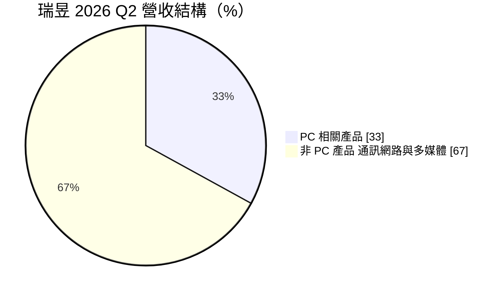
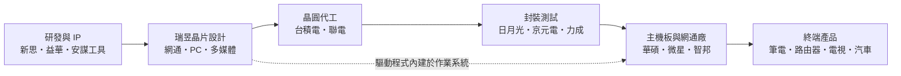
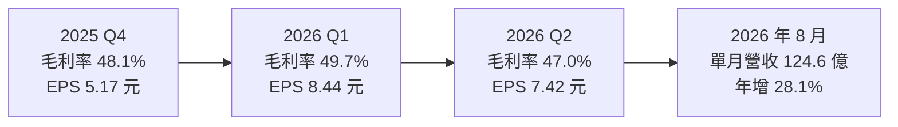
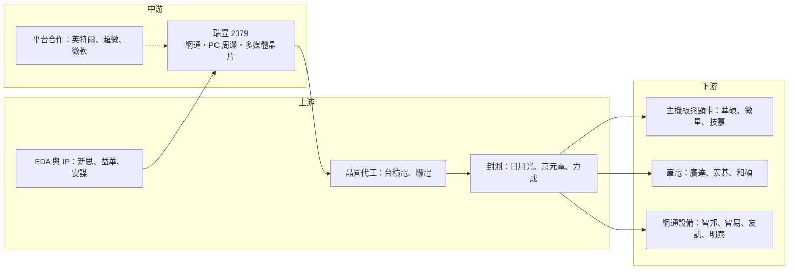

# 2379 瑞昱

> 上市｜[[產業索引-半導體業|半導體業]]｜上市（櫃）日期 1998/10/26

# 第一章：企業模式與商業藍圖

> [!info] 撰寫說明
> 本文由 Claude 依公開資料整理，架構比照 [[2330台積電]] 的四章研究，資料截至 2026-10-07。財務數字來源：瑞昱 2025 年第四季、2026 年第一季與第二季法說會相關報導（優分析、自由時報財經、工商時報、旺得富）、nstock 公司資料頁；產業描述為整理性內容，尚未逐條比對原始文件。#待校對

在評估單一個股的長期投資價值時，首要步驟是拆解企業的底層獲利邏輯。本章針對瑞昱半導體（股票代號：2379，以下簡稱瑞昱）的商業模式進行定性分析，說明一家以「看不見的晶片」為主的 IC 設計公司，如何靠規模、產品線廣度與長期客戶關係建立獲利基礎。

## 一、核心定位：連網與 PC 周邊晶片的「隱形冠軍」

瑞昱成立於 1987 年 10 月，總部位於新竹科學園區，是台灣第二大的 [[Fabless]] IC 設計公司，僅次於 [[2454聯發科]]。瑞昱不擁有晶圓廠，晶片設計完成後交由 [[2330台積電]]、[[2303聯電]] 等[[晶圓代工]]廠生產，再委由封測廠封裝測試。

瑞昱的產品幾乎出現在每一台個人電腦、路由器、交換器與電視裡，但多半不被消費者看見：

* **筆電與桌機：** 網路卡晶片、音效編解碼晶片、讀卡機控制晶片。
* **家用與企業網通設備：** [[乙太網路]]交換器晶片與 Wi-Fi 晶片。
* **電視與顯示器：** 控制晶片與 [[SoC]]。

這種「規格標準化、出貨量極大、單價不高」的產品特性，讓瑞昱的競爭關鍵在於成本控制、產品線廣度與長期客戶關係，而不是單一技術的絕對領先。

## 二、終端應用／產品板塊：PC 約三分之一，非 PC 約三分之二

依 2026 年第二季法說會資料：

* **PC 相關產品（約 33%）：** 網路卡晶片（有線乙太網路與 Wi-Fi／藍牙）、音效編解碼晶片、讀卡機、USB 與 Type-C 相關控制晶片，以及筆電使用的嵌入式控制器等。
* **通訊網路產品：** 乙太網路交換器晶片、實體層（[[PHY]]）晶片、Wi-Fi 路由器與閘道器晶片、寬頻接取設備晶片。這是近年成長最穩定的一塊，2026 年第一季需求集中在 AI 相關基礎設施帶動的高階路由器、交換器與 [[Wi-Fi 7]]。
* **多媒體產品：** 電視 SoC、顯示器控制晶片、機上盒與遊戲相關晶片。

非 PC 產品合計約占 67%（通訊網路與多媒體的個別比重本次未查得）。其中[[車用乙太網路]]是近年新增的成長項目，依優分析整理，目前約占營收個位數至接近 10%，已打入歐美、中國與日韓車廠供應鏈。

## 三、資本轉化邏輯：輕資產設計公司的營運模式

瑞昱以新竹為研發與營運總部，在中國（蘇州、深圳等地）與海外設有研發與技術支援據點，主要客戶為台灣與中國的 PC 品牌、主機板廠、網通設備廠與電視品牌。

* **輕資產：** 作為 Fabless 公司，瑞昱不必負擔晶圓廠的巨額折舊，主要投入是研發人力、光罩與 EDA 工具。
* **成本隨代工價格浮動：** 瑞昱的產能取決於晶圓代工與封測廠的供給。2026 年上半年記憶體、測試與[[成熟製程]]晶圓同時漲價，就直接壓縮了瑞昱的[[毛利率]]。
* **以量攤提研發：** 單一晶片出貨量以億顆計，研發成本可以攤到極大的出貨量上，這是瑞昱能以低價維持合理毛利的核心原因。

## 四、企業長期藍圖：規格升級與新市場

* **Wi-Fi 7 與 Wi-Fi 8：** 公司在第二季法說會估計 2026 年筆電 Wi-Fi 7 滲透率約 30%，Wi-Fi 8 終端產品最早 2028 年第一季推出。每一次 Wi-Fi 世代更替都會帶來單價提升。
* **高速有線網路：** 2.5G／5G／10G 乙太網路逐步普及，公司另規劃 100G 光學 PHY，預計 2027 年第一季量產，切入資料中心光通訊。
* **車用乙太網路：** 隨著汽車電子架構改為區域控制、車內資料量暴增，車用乙太網路是瑞昱未來 3 至 5 年最被看好的成長來源之一。
* **先進製程 [[ASIC]]：** 依優分析報導，瑞昱正以 5 奈米、4 奈米等先進製程承接遊戲機、資料中心、光通訊與[[邊緣 AI]] 相關的客製化晶片案，首批產品預計約 2026 年起送樣或量產。

# 第二章：護城河深度與競爭優勢

在長期價值投資中，「護城河」指企業抵禦競爭、維持超額利潤的保護機制。本章分析瑞昱的護城河構成、全球主要競爭對手，以及這些優勢在成本上漲與國產替代壓力下能守住多少。

## 一、瑞昱護城河的核心組成要素

瑞昱的護城河屬於「中等寬度」，主要來自規模與產品線廣度：

* **1. 規模經濟與成本優勢：** 乙太網路晶片、音效晶片等產品出貨量以億顆計，瑞昱能用龐大量能向晶圓代工與封測廠議價，並把研發成本攤到極大的出貨量上。財經媒體整理的資料指出，瑞昱在乙太網路晶片的全球市占率約五成以上。
* **2. 一站式產品組合：** 對主機板廠與網通廠來說，向瑞昱一次採購網路、音效、讀卡機、Wi-Fi 等多種晶片，可以降低整合與驗證成本，也讓瑞昱容易把新產品帶進既有客戶。
* **3. 長期驗證與軟體支援：** 網路與音效晶片需要與作業系統、驅動程式、韌體長期相容。瑞昱的驅動程式內建於主流作業系統，品牌廠更換供應商需要重新驗證，形成轉換成本。
* **4. 車用與網通的高門檻：** 車用晶片的[[車規驗證]]週期長、品質要求高，一旦進入車廠平台通常可供貨多年。

## 二、全球主要競爭對手格局

| 對手 | 主要重疊領域 | 對瑞昱的威脅 |
|---|---|---|
| [[AVGO博通]] | 企業與資料中心交換器、高階 Wi-Fi | 在高階網通居領先，是瑞昱往上延伸的主要障礙 |
| [[MRVL邁威爾]] | 車用乙太網路、資料中心 PHY | 車用乙太網路的直接競爭者 |
| [[QCOM高通]] | Wi-Fi、藍牙、路由器平台 | 在高階 Wi-Fi 與路由器平台競爭 |
| [[2454聯發科]] | Wi-Fi、路由器、電視 SoC | 電視 SoC 的主要對手，Wi-Fi 亦重疊 |
| [[INTC英特爾]] | 筆電 Wi-Fi 模組 | 搭配自家處理器平台銷售，具綁定優勢 |
| 裕太微、景略等中國業者 | 乙太網路 PHY | 受國產替代政策支持，在中國市場以價格競爭 |
| [[3034聯詠]] | 電視 SoC、顯示相關晶片 | 部分產品重疊 |

## 三、優勢轉化：哪些市場守得住、哪些守不住

* **守得住：** PC 網路卡與音效晶片、消費級與中小企業乙太網路交換器，瑞昱的市占率與成本優勢明顯，對手不易用價格撼動。
* **守不住：** 高階資料中心交換器、AI 叢集網路仍由博通、邁威爾主導，瑞昱短期內難以正面競爭；中國市場則面臨本土廠商的國產替代壓力。
* **毛利率是觀察窗口：** 瑞昱 2025 年毛利率 50.0%，2026 年第二季降到 47%，主因是記憶體、測試與晶圓成本同時上漲。公司自 6 月起與客戶議定新報價，若第三季起毛利率回到 49% 至 50% 區間，代表其議價能力足以轉嫁成本；若持續下滑，代表護城河正受到侵蝕。
* **觀察重點：** 車用乙太網路營收占比能否突破一成、先進製程 ASIC 案能否如期量產，以及 Wi-Fi 7 滲透率提升帶來的產品組合改善。

# 第三章：財務體質與盈利規模

資料日期：2026-10-07。數字取自法說會相關財經報導（優分析、自由時報財經、工商時報）與 nstock 公司資料頁，表格是撰寫當時的快照；最新月營收、毛利率、累計 EPS 由自動排程寫在本筆記的屬性欄位（月營收、毛利率、累計EPS 等）。#待校對

財務報表是檢驗護城河是否真實存在的最終標準。本章用三率、ROE、資本支出與資本報酬，檢視瑞昱在成本上漲期間的獲利品質。

## 一、獲利能力的基石：三率

| 項目 | 2025 全年 | 2025 Q4 | 2026 Q1 | 2026 Q2 |
|---|---|---|---|---|
| 營收（新台幣） | 1,227.1 億 | 262.8 億 | 約 364.2 億（推算） | 375.5 億 |
| [[毛利率]] | 50.0% | 48.1% | 49.7% | 47.0% |
| [[營業利益率]] | 11.7% | 8.9% | 11.9% | 9.9% |
| 稅後淨利 | 147.5 億 | 26.5 億 | 43.3 億 | 38.1 億 |
| EPS（元） | 28.77 | 5.17 | 8.44 | 7.42 |

* **[[毛利率]]：** 2025 年營收年增 8.2% 創新高，但稅後淨利年減 3.5%，第四季毛利率受呆滯庫存影響下滑，庫存週轉天數一度升至 127 天，2026 年第一季回落至 105 天。2026 年第二季毛利率年減 3.2 個百分點，呈現「營收成長、獲利不增」的格局。
* **[[營業利益率]]：** 瑞昱的營業費用率長期偏高，2026 年第一季約 37.8%，主要是研發費用。IC 設計公司的競爭力來自研發，高費用率是常態，但也代表毛利率每下滑 1 個百分點，營業利益率就會受到明顯影響。
* **數字說明：** 2026 年第一季營收依季增 38.6% 推算約 364.2 億元（部分報導數字有誤植，此處以季增率與第二季季增 3.1% 交叉推算）。2026 年上半年 EPS 合計 15.86 元，第二季營收年增 17.7%。8 月單月營收 124.6 億元，年增 28.1%，下半年營收動能延續。

## 二、[[ROE]]：資本效率

由於不需自建晶圓廠，瑞昱的資產相對輕，景氣正常時 ROE 可維持在偏高水準（具體數值本次未查得）。瑞昱的 ROE 主要受兩個因素影響：一是毛利率能否守住五成左右，二是高配息使股東權益不會無限膨脹，有助維持資本效率。

## 三、資本支出與自由現金流

* **[[CapEx]]：** 作為 Fabless 公司，瑞昱的資本支出主要用於研發大樓、測試設備與光罩，金額遠低於晶圓廠。
* **[[自由現金流]]：** 營業現金流的主要變數是庫存與應收帳款。庫存天數上升時會占用營運資金，2025 年第四季的呆料就是一例。
* **股利：** 瑞昱以高配息著稱。依 nstock 整理，最近一次現金股利為每股 25 元，近五年平均現金股利約 24 元、平均殖利率約 5.1%，歷年除息後平均約 23 天填息。股利金額大致隨前一年度獲利浮動。

## 四、[[ROIC]] 與 [[WACC]]：價值創造利差

輕資產的 IC 設計公司投入資本主要是營運資金與研發，瑞昱在毛利率維持五成上下時，ROIC 推估明顯高於 WACC（具體數值未查得）。需要留意的是先進製程 ASIC：5 奈米、4 奈米專案的光罩與研發投入金額大，若客戶量產規模不如預期，這部分新增投入的報酬率可能低於既有業務。

# 第四章：總體風險與地緣政治

任何企業都無法脫離宏觀環境獨立存在。本章分析瑞昱未來必須面對的地緣政治、產業週期、營運與技術風險。

## 一、地緣政治風險

* **中國市場依賴：** 瑞昱有相當比例客戶為中國的 PC、網通與電視組裝廠或品牌，中國推動半導體國產替代，對乙太網路 PHY、Wi-Fi 等標準化晶片的替代壓力持續升高。
* **美國關稅與出口管制：** 終端產品若被課徵高關稅，PC 與網通設備需求會受影響；先進製程 ASIC 若涉及資料中心或 AI 應用，也可能受到出口管制規範。
* **台灣供應鏈集中：** 晶圓代工與封測多在台灣，面臨與其他台灣半導體廠相同的兩岸風險。

## 二、產業週期與市場結構風險

* **PC 週期：** PC 相關產品約占三分之一營收。公司在第二季法說會指出，上半年提前拉貨、記憶體與 CPU 成本上升、整機售價上漲，使下半年 PC 需求承壓。
* **[[長鞭效應]]：** 上半年客戶因預期漲價而提前拉貨，若下半年終端需求不如預期，庫存調整會沿供應鏈放大。
* **消費性電子需求：** 電視與顯示器屬於成熟市場，成長有限且價格競爭激烈。
* **匯率：** 營收以美元計價為主，新台幣升值會壓縮以台幣計算的獲利。

## 三、營運環境的隱性風險

* **成本上漲：** 2026 年記憶體、測試與成熟製程晶圓同步漲價，若漲價無法完全轉嫁，毛利率將持續受壓。
* **庫存管理：** 2025 年第四季曾因呆料拖累毛利，需求轉弱時庫存跌價損失可能再出現。
* **封測產能：** 外資報告提到封裝測試產能緊張是潛在瓶頸，可能影響出貨。
* **新事業執行：** 先進製程 ASIC 需要大量光罩與研發投入，若客戶專案延後或取消，費用將先行侵蝕獲利。

## 四、科技演進風險

* **規格世代轉換：** Wi-Fi 7、Wi-Fi 8 與高速乙太網路每一代都需要重新投入研發，若產品推出時機落後對手，可能錯失一整個世代的設計導入。
* **高階市場門檻：** 資料中心與 AI 網路的技術門檻與客戶集中度高，瑞昱能否從消費級與企業級往上延伸，仍有不確定性（推估）。
* **光通訊轉型：** 100G 光學 PHY 是瑞昱跨入資料中心光通訊的第一步，若[[矽光子]]與共同封裝光學普及，元件形態可能改變，需要持續跟進。

# 專有名詞解析

## 半導體

- **[[Fabless]]**：無晶圓廠的 IC 設計公司，只負責設計晶片，生產交給晶圓代工廠，代表廠商為聯發科、瑞昱。
- **[[晶圓代工]]**：替其他公司製造晶片、本身不賣自有品牌晶片的商業模式，代表廠商為台積電、聯電。
- **[[成熟製程]]**：一般指 28 奈米及更大線寬的製程，技術成熟、設備多已折舊，主要用於電源、驅動、車用與物聯網晶片。
- **[[SoC]]**：系統單晶片，把處理器、記憶體控制、影像與介面等多種功能整合在一顆晶片上。
- **[[PHY]]**：實體層晶片，負責把數位資料轉換成線路或光纖上傳輸的電或光訊號，是網路連線的最底層。
- **[[ASIC]]**：特殊應用積體電路，為特定客戶與用途客製設計的晶片，例如雲端業者自研的 AI 加速器。
- **[[矽光子]]**：在矽晶片上製作光學元件，以光取代電傳輸資料，可降低 AI 資料中心的傳輸耗電。

## 應用

- **[[車用乙太網路]]**：把乙太網路用於汽車內部，連接攝影機、雷達與各區域控制器，以承載自駕與智慧座艙的大量資料。
- **[[邊緣 AI]]**：在終端裝置本身執行 AI 運算，而不是把資料傳回雲端處理，可降低延遲與保護隱私。
- **[[車規驗證]]**：車用晶片須通過 AEC-Q100 等可靠度測試與車廠認證，流程常需 2 至 3 年，因此轉換成本高。

## 金融

- **[[長鞭效應]]**：終端需求的小幅變動，沿供應鏈往上游傳遞時被逐級放大，造成上游庫存與訂單劇烈波動。
- **[[自由現金流]]**：營業活動現金流減去資本支出，代表企業可自由用於配息、還債或併購的現金。

## 產業

- **[[乙太網路]]**：最普遍的有線區域網路標準，電腦、交換器與路由器之間多以乙太網路連接。
- **[[Wi-Fi 7]]**：最新一代無線區域網路標準，以更寬頻道與多鏈路同時傳輸提高速度與穩定度。

# 核心供應鏈

## 1. 上游：晶圓代工、封測與 IP
- 晶圓代工：[[2330台積電]]、[[2303聯電]]
- 封裝測試：[[3711日月光投控]]、[[2449京元電子]]、[[6239力成]]
- EDA 與 IP：[[SNPS新思科技]]、[[CDNS益華電腦]]、[[ARM安謀]]

## 2. 中游：瑞昱本身與合作夥伴
- PC 平台合作：[[INTC英特爾]]、[[AMD超微]]
- 作業系統與驅動相容：[[MSFT微軟]]

## 3. 下游：主要客戶
- 主機板與顯示卡：[[2357華碩]]、[[2377微星]]、[[2376技嘉]]
- 筆電代工與品牌：[[2382廣達]]、[[2353宏碁]]、[[4938和碩]]
- 網通設備：[[2345智邦]]、[[3596智易]]、[[2332友訊]]、[[3380明泰]]

## 4. 同業與競爭者
- 國內：[[2454聯發科]]、[[3034聯詠]]
- 國外：[[AVGO博通]]、[[MRVL邁威爾]]、[[QCOM高通]]

延伸閱讀：[[台積電供應鏈]]

## 最新新聞
<!-- news:start（自動產生，請勿手動編輯此範圍） -->
- 2026-10-08 📰 媒體 12:10｜鉅亨速報 - Factset 最新調查：瑞昱(2379-TW)EPS預估下修至31.73元，預估目標價為740元｜[鉅亨網](https://news.cnyes.com/news/id/6624695)

完整紀錄：[[2379瑞昱 新聞]]
<!-- news:end -->

## 相關連結
- [公開資訊觀測站](https://mopsov.twse.com.tw/mops/web/t05st03?step=1&firstin=1&co_id=2379)
- [Goodinfo](https://goodinfo.tw/tw/StockDetail.asp?STOCK_ID=2379)
- [Yahoo 股市](https://tw.stock.yahoo.com/quote/2379)
- [鉅亨網新聞](https://www.cnyes.com/twstock/2379/news)
