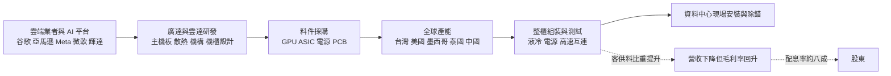
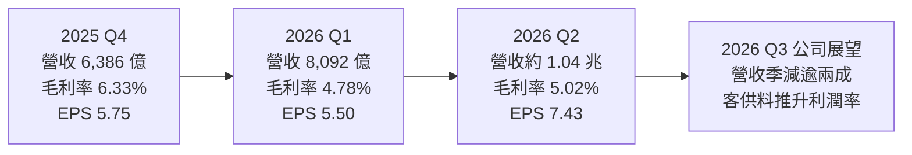
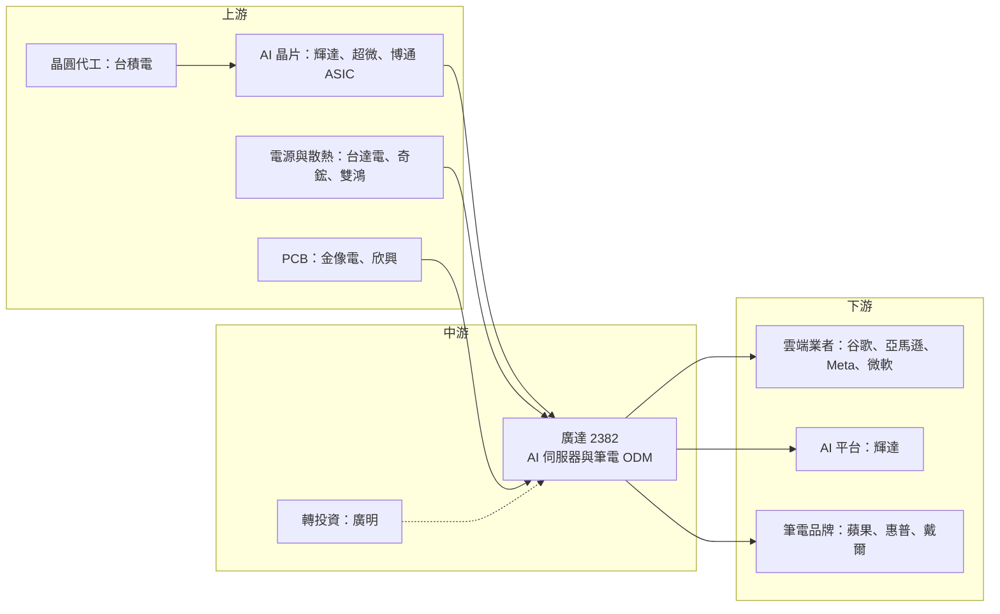

# 2382 廣達

> 上市｜[[產業索引-電腦及週邊設備業|電腦及週邊設備業]]｜上市（櫃）日期 1999/01/08

# 第一章：企業模式與商業藍圖

> [!info] 撰寫說明
> 本文由 Claude 依公開資料整理，架構比照 [[2330台積電]] 的四章研究，資料截至 2026-10-07。財務數字來源：廣達 2025 年財報與 2026 年第一季、第二季法說會內容（優分析、富果研究、DIGITIMES、自由時報整理）；產業描述為整理性內容，尚未逐條比對原始文件。#待校對

在評估單一個股的長期投資價值時，首要步驟是拆解企業的底層獲利邏輯。本章針對廣達電腦（股票代號：2382，以下簡稱廣達）的商業模式進行定性分析，說明一家筆電代工廠如何靠十多年前布局的雲端伺服器業務，在 AI 時代成為雲端業者最倚重的伺服器 [[ODM]] 之一。

## 一、核心定位：從全球最大筆電代工廠轉型為 AI 伺服器龍頭

廣達由林百里與梁次震於 1988 年創立，以筆記型電腦代工起家，長年是全球出貨量最大的筆電 ODM 廠，客戶涵蓋 [[AAPL蘋果]]、惠普、戴爾等主要品牌。廣達的商業模式是替品牌客戶從設計、驗證到量產一手包辦，賺取設計與製造服務的利潤。

2000 年代中期起，廣達透過子公司雲達科技（QCT）切入資料中心伺服器，率先採用「直接替雲端業者設計與生產白牌伺服器」的模式（[[ODM Direct]]），繞過傳統伺服器品牌商。這個布局在 AI 時代成為關鍵優勢，有兩個商業意義：

* **客戶關係早於 AI 浪潮：** 美系雲端業者大規模建置 AI 資料中心時，廣達已有長期合作的客戶關係與資料中心整櫃交付經驗，不需要從零開始爭取信任。
* **身分徹底轉換：** 到了 2026 年，伺服器營收占廣達整體營收八成以上，其中 AI 伺服器占伺服器營收超過七成五，廣達已從「筆電代工廠」轉為「AI 伺服器 ODM 龍頭」。

## 二、終端應用板塊：伺服器為主、筆電為輔

各產品線精確營收比重本次未查得，以下依法說內容整理定性結構：

* **AI 伺服器：** 包含 [[NVDA輝達]] GB200、GB300 等 GPU 機櫃，以及雲端業者自研 [[ASIC]] 晶片的伺服器。依 2026 年法說內容，AI 伺服器占伺服器營收約 75% 至 80%，公司目標 2026 年 AI 伺服器營收年增一倍以上（第一季法說時預估三位數百分比年增）。
* **通用伺服器：** 一般雲端運算與儲存伺服器，2026 年全年展望由持平上調為雙位數年成長。
* **筆記型電腦：** 2026 年第二季出貨約 1,150 萬台，季增 15%、年減 5%；公司預期全年筆電出貨雙位數年減，比重持續下降。
* **其他：** 車用電子、智慧穿戴、雲端運算軟體服務等，目前占比小。

| 產品線 | 2026 年定位 | 方向 |
|---|---|---|
| 伺服器（含 AI） | 占總營收八成以上 | AI 伺服器營收目標年增一倍以上 |
| 筆記型電腦 | 第二季出貨約 1,150 萬台 | 全年雙位數年減 |
| 車用與其他 | 占比小 | 德國擴產、長期布局 |

## 三、資本轉化邏輯：設計能力換取整櫃訂單

* **多地產能：** 廣達在台灣（桃園林口、龜山）、中國（上海、重慶、常熟）、美國（加州、田納西）、墨西哥、泰國、德國等地設有生產據點。擴產重心轉向美國與泰國：加州擴廠投資約 9.73 億美元，貼近美系雲端客戶並因應關稅與在地製造要求；泰國擴建 AI 伺服器產能，作為中國以外的亞洲生產基地；台灣以約 197 億元取得宏碁旗下華亞園區廠房；德國投資約 1.95 億歐元擴充車用電子產能。
* **[[客供料]]與帳面營收：** AI 機櫃中 GPU 等高價料件若由廣達採購，會灌大營收、稀釋[[毛利率]]；若改由客戶自行供應，營收下降但利潤率回升。因此評估廣達時，營業利益金額比營收更能反映實際賺錢能力。

## 四、企業長期藍圖：AI 伺服器、ASIC 與整櫃交付

* **AI 伺服器世代交替：** 廣達是輝達 GB200、GB300 機櫃的主要組裝廠之一，並持續承接下一代平台。
* **雲端業者自研 ASIC：** 廣達與 [[GOOGL谷歌]]（TPU）、[[AMZN亞馬遜]]、[[META臉書]] 等雲端業者合作 ASIC 伺服器，這類專案由雲端業者直接主導設計，長期合作關係是接單關鍵。
* **整櫃與資料中心交付：** 從主機板、伺服器、整櫃組裝、[[液冷]]到現場安裝測試，廣達提供完整交付服務。
* **資本支出：** 2026 年 [[CapEx]] 由原本預估 300 億元上修至約 400 億元，主要用於美國與泰國 AI 產能擴建。

# 第二章：護城河深度與競爭優勢

在長期價值投資中，「護城河」指企業抵禦競爭、維持超額利潤的保護機制。廣達同樣屬於低毛利的代工業，護城河來自客戶關係與工程能力，而不是定價權。本章分析這些優勢的構成、全球主要競爭對手，以及在 AI 伺服器多家分食的格局中，廣達能守住哪些市場。

## 一、廣達護城河的核心組成要素

* **1. 與雲端業者的長期直接合作：** 廣達很早就以 ODM Direct 模式直接服務雲端業者，熟悉其資料中心規格與營運需求。雲端業者自研 ASIC 伺服器時，往往優先找有長期合作紀錄的廠商。
* **2. 研發與系統設計能力：** 廣達擁有大規模研發團隊，能參與伺服器主機板、散熱、機構與機櫃的設計，而不只是組裝。AI 機櫃的電源、液冷、高速互連整合難度高，設計能力是重要門檻。
* **3. 整櫃交付與測試：** AI 機櫃出貨前需要整櫃測試，交付到資料中心後還需要安裝與除錯，廣達在美國當地的據點與服務團隊是競爭優勢。
* **4. 多地產能：** 台灣、美國、墨西哥、泰國等產能，讓客戶能分散地緣政治風險。

## 二、全球主要競爭對手格局

| 對手 | 定位 | 對廣達的威脅 |
|---|---|---|
| [[2317鴻海]] | 規模最大的 [[EMS]]，垂直整合最深 | 輝達 AI 機櫃組裝市占高，並目標 ASIC 伺服器四成市占 |
| [[3231緯創]]、[[6669緯穎]] | 緯創做輝達 GPU 基板，緯穎專注美系雲端 | 在 ASIC 與通用伺服器直接競爭 |
| [[2356英業達]]、[[2376技嘉]]、[[3706神達]] | 伺服器代工與品牌伺服器 | 在中小型雲端與企業伺服器競爭 |
| Dell、超微電腦 Supermicro、HPE | 美系伺服器品牌 | 企業與部分雲端客戶市場 |
| [[4938和碩]]、[[2324仁寶]]、華勤、龍旗 | 筆電代工 | 中國 ODM 以價格搶筆電訂單 |

## 三、優勢轉化：哪些市場守得住、哪些守不住

* **守得住：** 雲端業者的 ASIC 伺服器與客製化資料中心專案，廣達的長期合作關係與設計能力難以被快速取代。
* **守不住：** 輝達 GPU 機櫃的組裝訂單由多家 ODM 分食，廣達難以獨占；高單價 GPU 與料件拉高營收卻稀釋毛利率，2026 年第一季毛利率降到 4.78%。筆電則面臨中國 ODM 的價格競爭與市場萎縮。
* **觀察重點：** AI 伺服器營收能否如期年增一倍、客供料比重提升後毛利率能否回升，以及美國、泰國新產能的獲利表現。

# 第三章：財務體質與盈利規模

資料日期：2026-10-07。數字取自廣達財報、法說會內容與財經媒體整理，表格是撰寫當時的快照；最新月營收、毛利率、累計 EPS 由自動排程寫在本筆記的屬性欄位（月營收、毛利率、累計EPS 等）。#待校對

財務報表是檢驗護城河是否真實存在的最終標準。本章用三率、ROE、現金流與資本報酬，檢視廣達在 AI 伺服器營收爆發下的獲利品質，特別是營收灌水效應對三率的扭曲。

## 一、獲利能力的基石：三率

| 項目 | 2025 全年 | 2025 Q4 | 2026 Q1 | 2026 Q2 |
|---|---|---|---|---|
| 營收（新台幣） | 2.12 兆 | 6,386 億 | 8,092 億 | 約 1.04 兆 |
| [[毛利率]] | 6.98% | 6.33% | 4.78% | 5.02% |
| [[營業利益率]] | 4.12% | 3.76% | 2.85% | 3.30% |
| 稅後淨利 | 749.8 億 | 222.0 億 | 211.9 億 | 約 287 億 |
| EPS（元） | 19.45 | 5.75 | 5.50 | 7.43 |

* **營收：** 2025 年營收年增 50.2%，稅後淨利年增 25.5%，EPS 19.45 元創歷史新高。2026 年第一季營收年增 66.6%，第二季突破 1 兆元。
* **[[毛利率]]：** 2025 年年減 0.87 個百分點，2026 年第一季降至 4.78%，反映高單價 AI 伺服器拉高營收、但稀釋毛利率；第二季回升到 5.02%。
* **[[營業利益率]]：** 2026 年第二季回升到 3.30%，[[營運槓桿]]開始發揮。公司預期第三季營收季減逾兩成，主因是部分 AI 高價料件改由客戶自行供應，對毛利率與營業利益率有利，評估時應以營業利益金額為準。
* **[[淨利率]]：** 第二季約 2.8%（推算），維持代工業的薄利結構。

## 二、[[ROE]]：資本效率

廣達的 ROE 精確數值本次未查得。代工業毛利率低，ROE 主要來自高資產周轉率與營業槓桿；AI 伺服器營收放大後，營業利益金額大幅成長，有助於提升股東權益報酬。配息率約八成，代表大部分盈餘回到股東手上，股東權益累積速度較慢，也有助於維持 ROE。

## 三、資本支出與自由現金流

* **[[CapEx]]：** 2025 年上修至約 300 億元；2026 年原預估 300 億元，第二季法說上修至約 400 億元，用於美國、泰國 AI 產能。此外另以約 197 億元取得華亞廠房。
* **[[營運資金]]與[[自由現金流]]：** AI 伺服器出貨需要龐大營運資金支應存貨與應收帳款，自由現金流精確數值本次未查得。客供料比重提升可望減輕營運資金壓力。
* **股利：** 2025 年度配發現金股利 15.6 元，配息率約 80%，廣達長期維持高配息率政策。

## 四、[[ROIC]] 與 [[WACC]]：價值創造利差

廣達的 ROIC 精確數值本次未查得。代工廠投入的資本以營運資金為大宗，固定資產相對輕；2026 年上半年營業利益大幅成長，推估 ROIC 高於 WACC。後續觀察兩件事：資本支出由 300 億元上修到 400 億元、再加上華亞廠房，資本基數擴大後新產能能否維持現有報酬；以及客供料能否讓投入資本（存貨與應收）下降，這對 ROIC 是直接加分。

# 第四章：總體風險與地緣政治

任何企業都無法脫離宏觀環境獨立存在。本章分析廣達未來必須面對的地緣政治、AI 資本支出週期、營運風險，以及雲端業者主導設計所帶來的議價限制。

## 一、地緣政治風險

* **美國關稅與在地製造：** AI 伺服器主要出貨到美國，美國對進口伺服器的關稅政策變化會直接影響成本。廣達加州擴廠與墨西哥產能是因應措施，但美國製造成本較高。
* **中國產能：** 筆電與部分產品仍在中國生產，美中衝突可能影響出口與供應鏈。
* **台灣集中風險：** 研發總部與部分伺服器產能在台灣，面臨兩岸風險。

## 二、產業週期與市場結構風險

* **AI 資本支出週期：** 伺服器營收占八成以上，若美系雲端業者放緩 AI 投資，廣達營收與獲利會受到明顯影響。
* **[[長鞭效應]]：** 雲端業者調整建置節奏時，訂單變化沿伺服器供應鏈放大，ODM 的存貨與產能利用率首當其衝。
* **客戶集中：** 主要營收來自少數雲端業者與輝達平台，任一客戶轉單或砍單影響大。
* **筆電需求下滑：** 公司預期 2026 年筆電出貨雙位數年減，筆電業務持續萎縮。

## 三、營運環境的隱性風險

* **毛利率稀釋：** 高單價 GPU 與料件使毛利率降到 5% 上下，任何[[良率]]或交期問題都會快速吃掉利潤。
* **新平台量產調校：** AI 機櫃世代交替快，新平台量產初期的液冷、電源與高速互連問題可能延遲出貨。
* **營運資金與匯率：** 存貨與應收帳款規模大，需注意現金周轉與美元匯率變化。

## 四、科技演進風險

* **雲端業者設計主導：** ASIC 伺服器的規格由雲端業者主導，代工廠議價力有限，雲端業者也可能把訂單分散給多家 ODM。
* **AI 架構變化：** 若 AI 運算轉向不同的系統架構（例如更高整合度的機櫃或新的供電方式），代工廠需要持續投入新產線與測試能力。

# 專有名詞解析

## 半導體

- **[[ASIC]]**：特定應用積體電路，為單一用途客製的晶片，例如雲端業者自研的 AI 加速器。
- **[[良率]]**：合格產品占總產出的比例，組裝業的良率直接影響重工成本與交期。

## 金融

- **[[營運槓桿]]**：固定費用占比高時，營收小幅成長即可帶動營業利益大幅成長的現象。
- **[[營運資金]]**：支應存貨、應收帳款等日常營運所需的資金，出貨規模放大時占用會同步增加。
- **[[ROE]]**：股東權益報酬率，稅後淨利除以股東權益，衡量公司運用股東資本賺錢的效率。
- **[[ROIC]]**：投入資本報酬率，衡量公司投入營運的全部資本能產生多少稅後營業利潤。
- **[[WACC]]**：加權平均資金成本，股東與債權人要求報酬率的加權平均，是 ROIC 的比較基準。
- **[[自由現金流]]**：營業活動現金流減去資本支出，代表企業可自由用於配息、還債或併購的現金。
- **[[長鞭效應]]**：終端需求的小幅變動，沿供應鏈往上游傳遞時被逐級放大，造成上游庫存與訂單劇烈波動。

## 產業

- **[[ODM]]**：原廠委託設計製造，代工廠除了生產也負責產品設計，品牌商只提出規格，廣達、緯穎屬此類。
- **[[ODM Direct]]**：伺服器代工廠跳過品牌商，直接替雲端業者設計與生產白牌伺服器的模式。
- **[[EMS]]**：電子代工服務，替品牌客戶進行零組件採購、組裝與測試，本身不賣自有品牌產品，代表廠商為鴻海。
- **[[客供料]]**：由客戶自行採購並提供給代工廠的料件，代工廠只收加工費，營收下降但毛利率上升。
- **[[液冷]]**：以冷卻液取代風扇帶走晶片熱量的散熱方式，AI 機櫃功耗動輒上百千瓦，逐漸成為標配。

# 核心供應鏈

## 1. 上游：晶片與關鍵零組件
- GPU 與 AI 晶片：[[NVDA輝達]]、[[AMD超微]]、[[AVGO博通]]（ASIC）
- 晶圓代工：[[2330台積電]]
- 電源與散熱：[[2308台達電]]、[[3017奇鋐]]、[[3324雙鴻]]
- PCB：[[2368金像電]]、[[3037欣興]]

## 2. 中游：廣達本身與同業
- 伺服器 ODM：[[2317鴻海]]、[[3231緯創]]、[[6669緯穎]]、[[2356英業達]]
- 筆電 ODM：[[4938和碩]]、[[2324仁寶]]
- 廣達轉投資：[[6188廣明]]

## 3. 下游：主要客戶
- 雲端服務業者：[[GOOGL谷歌]]、[[AMZN亞馬遜]]、[[META臉書]]、[[MSFT微軟]]
- AI 平台：[[NVDA輝達]]
- 筆電品牌：[[AAPL蘋果]]、惠普、戴爾

延伸閱讀：[[台積電供應鏈]]

## 最新新聞
<!-- news:start -->
<!-- news:end -->

## 相關連結
- [公開資訊觀測站](https://mopsov.twse.com.tw/mops/web/t05st03?step=1&firstin=1&co_id=2382)
- [Goodinfo](https://goodinfo.tw/tw/StockDetail.asp?STOCK_ID=2382)
- [Yahoo 股市](https://tw.stock.yahoo.com/quote/2382)
- [鉅亨網新聞](https://www.cnyes.com/twstock/2382/news)
