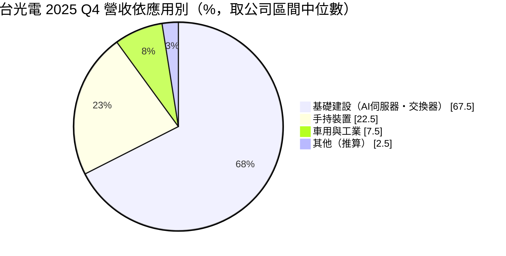
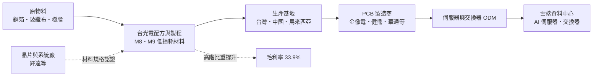
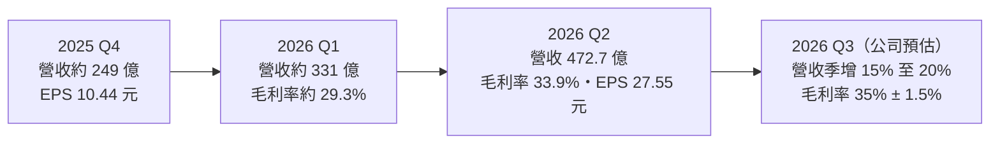
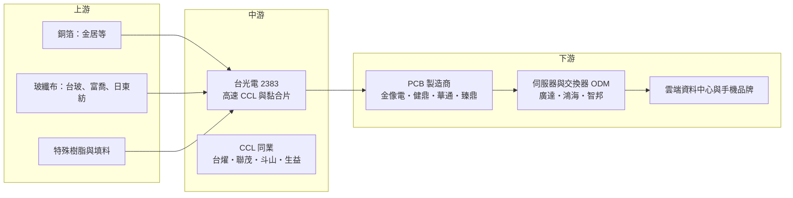

# 2383 台光電

> 上市｜[[產業索引-電子零組件業|電子零組件業]]｜上市（櫃）日期 1998/11/27

# 第一章：企業模式與商業藍圖

> [!info] 撰寫說明
> 本文由 Claude 依公開資料整理，架構比照 [[2330台積電]] 的四章研究，資料截至 2026-10-07。財務數字來源：台光電 2025 年財報報導（優分析）、2026 年 3 月與 8 月法說會摘要（富果研究）、2026 年上半年財報新聞（優分析）；產業描述為整理性內容，尚未逐條比對原始文件。#待校對

在評估單一個股的長期投資價值時，首要步驟是拆解企業的底層獲利邏輯。本章針對台光電子材料（股票代號：2383，以下簡稱台光電）的商業模式進行定性分析，說明一家「賣板材」的材料廠，如何在 AI 伺服器與高速交換器的浪潮中成為全球[[CCL]]（銅箔基板）市占第一，並取得接近半導體級的毛利率。

## 一、核心定位：全球最大的高速、無鹵素 CCL 供應商

台光電專注於生產[[CCL]]、黏合片（[[Prepreg]]）等印刷電路板（PCB）基礎材料。依 Prismark 資料，台光電 2025 年 CCL 全球市占率 16.2%，排名第一；公司自估在[[無鹵素材料]]高速材料市場的市占率超過 50%。2025 年營收約 943 億元，年增約 46%，EPS 41.67 元，創歷史新高。

台光電的定位有三個特點：

* **高階材料專家：** 公司產品以低損耗、高速傳輸的材料為主，目前 [[M8]] 等級材料為出貨主力，更高階的 [[M9]] 等級材料 2026 年下半年量產。
* **AI 基礎建設為主：** 2025 年第四季基礎建設（伺服器、交換器、基地台）占營收約 65% 至 70%，其中 AI 伺服器與交換器約占九成；公司預期 2026 年下半年基礎建設產品占比超過八成。
* **材料端的關鍵瓶頸：** AI 伺服器的 GPU 板、加速卡與 800G、1.6T 交換器都需要高層數、低損耗的 PCB，材料規格直接決定訊號能否高速傳輸，CCL 因此從過去的「大宗材料」變成需要認證的關鍵零件。

## 二、終端應用板塊：營收結構

* **基礎建設（約 65% 至 70%）：** AI 伺服器 GPU 主板、加速卡、交換器與網通設備，是成長最快、單價最高的板塊。1.6T 交換器用材料已於 2026 年第一季開始出貨。
* **手持裝置（約 20% 至 25%）：** 智慧型手機與平板使用的 [[HDI]] 與類載板材料，台光電長期是高階手機主板材料的主要供應商。
* **車用與工業（約 5% 至 10%）：** 車用電子與工業控制，需要高可靠度材料。

## 三、資本轉化邏輯：材料規格認證換取定價權

* **認證機制形成門檻：** 高速材料必須先通過晶片廠與系統廠的平台認證，列入指定材料清單後，PCB 廠才能採用。台光電在每一代 AI 平台的材料認證上都取得領先，因此能拿到大部分訂單。
* **產能滿載帶來定價權：** 2026 年台光電產能全年滿載，公司在 3 月法說會表示第二季全產品至少調漲一成，8 月法說會則提到下半年可能因原物料上漲再調價。
* **配方與製程是核心：** CCL 的樹脂配方、玻纖布與銅箔搭配決定電氣特性，這些配方屬於長期累積的技術訣竅，不容易被對手複製。

## 四、企業長期藍圖：產能倍增與新世代材料

* **擴產：** 月產能從 2025 年約 580 萬張擴充到 2028 年約 1,110 萬張，新產能分布在台灣、中國與馬來西亞。2025 年已完成中國黃石、中山與馬來西亞檳城擴產。
* **資本支出：** 2026 年規劃約 150 億至 230 億元（依法說會摘要換算，單位待校對）。
* **新世代材料：** M9 等級材料 2026 年下半年量產，搭配下一代 AI 平台與 1.6T 交換器；新世代材料單價更高，有助於毛利率持續提升。

# 第二章：護城河深度與競爭優勢

在長期價值投資中，「護城河」指企業抵禦競爭、維持超額利潤的保護機制。本章分析台光電的護城河構成、全球主要競爭對手，以及這些優勢在對手積極追趕時能守住多少。

## 一、台光電護城河的核心組成要素

* **1. 平台認證與先行者優勢：** 高速材料認證週期長，台光電在 AI 伺服器與交換器的多個世代平台都取得主要份額。客戶一旦設計定案，中途更換材料需要重新驗證，轉換成本高。
* **2. 配方技術與無鹵素高速材料的領先：** 公司自估在無鹵素高速材料市占超過 50%，代表在低損耗與環保規格的平衡上具有技術領先。
* **3. 規模與產能：** 全球最大的 CCL 產能，加上台灣、中國、馬來西亞多地布局，能同時滿足客戶的量與「中國以外」產地要求。

## 二、全球主要競爭對手格局

| 對手 | 定位 | 對台光電的威脅 |
|---|---|---|
| [[6274台燿]] | 台灣高速 CCL 廠 | 積極爭取 AI 伺服器與交換器材料認證 |
| [[6213聯茂]] | 台灣 CCL 廠 | 在網通與伺服器材料競爭 |
| 斗山電子（Doosan） | 韓國 CCL 廠 | 在部分 AI 加速器平台與台光電競爭 |
| Panasonic | 日本高階材料廠（Megtron 系列） | 高階伺服器材料的傳統領導者 |
| 生益科技 | 中國最大 CCL 廠 | 以規模與價格在中國市場競爭，逐步切入高階材料 |

## 三、優勢轉化：哪些市場守得住、哪些守不住

* **守得住：** 現行 AI 伺服器與 800G、1.6T 交換器的高階材料。2026 年第二季[[毛利率]] 33.9%，第三季公司預估 35% ± 1.5%，顯示定價能力仍在擴大。
* **守不住：** 中低階材料與消費性產品，這些市場價格競爭激烈，毛利率較低。另外，客戶為分散風險會刻意培養第二供應商，台光電在單一平台的份額可能被分走一部分。
* **觀察重點：** M9 材料能否在下一代平台維持主要份額、台燿與斗山的認證進度，以及擴產後產能利用率能否維持滿載。

# 第三章：財務體質與盈利規模

資料日期：2026-10-07。數字取自公司財報新聞與財經媒體整理，表格是撰寫當時的快照；最新月營收、毛利率、累計 EPS 由自動排程寫在本筆記的屬性欄位（月營收、毛利率、累計EPS 等）。#待校對

財務報表是檢驗護城河是否真實存在的最終標準。本章用三率、ROE、現金流與資本報酬，檢視台光電在 AI 材料需求爆發期的獲利品質。

## 一、獲利能力的基石：三率

| 項目 | 2025 全年 | 2025 Q4 | 2026 Q1 | 2026 Q2 |
|---|---|---|---|---|
| 營收（新台幣） | 約 943 億 | 約 249 億 | 約 330.7 億（推算） | 472.7 億 |
| [[毛利率]] | 29.8% | 未查得 | 約 29.3%（推算） | 33.9% |
| [[營業利益率]] | 未查得 | 未查得 | 未查得 | 未查得 |
| 稅後淨利 | 約 146.5 億 | 約 37.4 億 | 約 53.4 億（推算） | 98.7 億 |
| EPS（元） | 41.67 | 10.44 | 約 14.91（推算） | 27.55 |

註：2026 年第一季以上半年（營收 803.42 億元、毛利率 32.02%、淨利 152.13 億元、EPS 42.46 元）減第二季推算。

* **[[毛利率]]：** 從 2025 年的 29.8% 升到 2026 年第二季的 33.9%，主因是高階產品比重提高、產能滿載與第二季調漲價格。
* **營業槓桿：** 第二季營收季增 43%，淨利卻季增約 85%，顯示固定成本分攤效果明顯。
* **[[淨利率]]：** 第二季稅後淨利率約 20.9%（推算），遠高於一般 PCB 材料廠的水準。

## 二、[[ROE]]：資本效率

台光電 2025 年連續四季單季 EPS 超過 10 元，2026 年上半年 EPS 42.46 元已超過 2025 年全年，ROE 處於歷史高檔（具體數值未查得）。法人在 2026 年 5 月曾上修全年 EPS 預估至 92.6 元（推估值，非公司財測）。

## 三、資本支出與自由現金流

* **[[CapEx]]：** 2026 年大幅擴產，資本支出明顯高於過去（金額單位待校對），目標 2028 年月產能約 1,110 萬張。
* **[[自由現金流]]：** 獲利大幅成長帶來強勁營業現金流，但擴產與營運資金需求也同步增加，自由現金流具體數值未查得。
* **股利政策：** 2025 年度每股配發現金股利 25 元，創歷史新高，配息率約六成，2026 年 8 月 28 日除息。

## 四、[[ROIC]] 與 [[WACC]]：價值創造利差

CCL 屬於中度資本密集產業，台光電在毛利率超過 30%、產能滿載的情況下，推估 ROIC 遠高於 WACC。最大的風險在於大規模擴產完成後，若 AI 需求放緩或對手追上，產能利用率下滑會使 ROIC 快速回落（推估）。

# 第四章：總體風險與地緣政治

任何企業都無法脫離宏觀環境獨立存在。本章分析台光電未來必須面對的地緣政治、產業週期與營運風險。

## 一、地緣政治風險

* **中國產能比重：** 台光電在中國黃石、中山等地有大型產能，美中貿易摩擦與關稅可能影響中國產品出口到美國客戶。馬來西亞與台灣擴產是分散風險的布局。
* **美國關稅與在地化：** AI 伺服器最終多送往美國資料中心，美國對進口電子產品的關稅與在地製造要求會向上游傳導。

## 二、產業週期與市場結構風險

* **雲端資本支出循環：** 基礎建設產品占比預計超過八成，台光電的成長高度依賴 AI 資本支出。
* **[[長鞭效應]]：** CCL 位於 PCB 供應鏈上游，終端需求的小幅變動會被放大，PCB 廠在旺季前可能提前備料，需求轉弱時則急速去化庫存。
* **擴產週期：** 台光電與對手同時擴產，若 2027 至 2028 年需求成長不如預期，可能出現產能過剩與價格壓力。

## 三、營運環境的隱性風險

* **原物料價格：** 銅箔、玻纖布（特別是低介電玻纖布）與特殊樹脂價格上漲，若無法即時轉嫁會壓縮毛利率。部分高階玻纖布供應吃緊，可能限制出貨。
* **客戶集中：** AI 伺服器與交換器平台集中在少數晶片廠與雲端客戶，平台換代時的認證結果會大幅影響營收。
* **環保與製程安全：** 化學材料製程需符合嚴格的環保規範。

## 四、科技演進風險

* **材料世代交替：** 每一代 AI 平台都要求更低的訊號損耗，M9 之後的材料若由對手先取得認證，台光電的份額可能下降。
* **封裝技術改變：** [[CPO]]、[[玻璃基板]]等新技術若改變 PCB 與載板的角色，CCL 的需求結構也會跟著改變。

# 專有名詞解析

## 半導體

- **[[CPO]]**：共同封裝光學，把光學收發元件與交換晶片封裝在一起，縮短電訊號距離以降低功耗。
- **[[玻璃基板]]**：以玻璃取代有機材料作為晶片封裝基板的技術，可提供更好的平整度與線路密度。

## 應用

- **[[AI伺服器]]**：搭載 GPU 或 AI 加速器、用於訓練與推論 AI 模型的伺服器，功耗遠高於一般伺服器。
- **[[1.6T交換器]]**：單一連接埠傳輸速率達每秒 1.6 Tb 的資料中心交換器，是 800G 之後的新世代規格。

## 金融

- **[[長鞭效應]]**：終端需求的小幅變動，沿供應鏈往上游傳遞時被逐級放大，造成上游庫存與訂單劇烈波動。

## 產業

- **[[CCL]]**：銅箔基板，由銅箔、玻纖布與樹脂壓合而成，是製作印刷電路板的核心材料。
- **[[Prepreg]]**：黏合片（預浸材），玻纖布含浸樹脂後的半固化片，用來壓合多層電路板。
- **[[無鹵素材料]]**：不含鹵素阻燃劑的電路板材料，較環保，台光電在無鹵素高速材料市占居首。
- **[[M8]]**：業界對低損耗高速材料的等級稱呼之一，數字越大代表訊號損耗越低，M8 用於 800G 交換器與現行 AI 伺服器。
- **[[M9]]**：比 M8 更低損耗的新一代高速材料等級，用於 1.6T 交換器與下一代 AI 平台。
- **[[HDI]]**：高密度互連電路板，線路更細、層間以雷射鑽孔連接，主要用於智慧型手機主板。
- **[[低介電玻纖布]]**：介電常數與損耗較低的玻璃纖維布，是高速 CCL 的關鍵原料，供應集中在少數廠商。

# 核心供應鏈

## 1. 上游：銅箔、玻纖布與樹脂
- 銅箔：[[8358金居]]
- 玻纖布：[[1802台玻]]、[[1815富喬]]、日東紡
- 特殊樹脂與填料供應商

## 2. 中游：台光電本身與同業
- CCL 同業：[[6274台燿]]、[[6213聯茂]]、斗山電子、Panasonic、生益科技

## 3. 下游：PCB 製造商
- 伺服器與交換器板：[[2368金像電]]、[[3044健鼎]]
- 手機 HDI 與類載板：[[2313華通]]、[[4958臻鼎-KY]]
（以上為 CCL 產業常見客戶類型，個別採購關係推估，待校對）

## 4. 下游：系統與終端
- 伺服器與交換器：[[2382廣達]]、[[2317鴻海]]、[[2345智邦]]
- 晶片平台：[[NVDA輝達]]
- 終端：雲端服務商資料中心、[[AAPL蘋果]] 等手機品牌（推估）

延伸閱讀：[[台積電供應鏈]]

## 最新新聞
<!-- news:start（自動產生，請勿手動編輯此範圍） -->
- 2026-10-05 📰 媒體 17:50｜營收速報 - 台光電(2383)9月營收215.32億元年增率高達168.87％｜[鉅亨網](https://news.cnyes.com/news/id/6621836)
- 2026-10-05 📰 媒體 09:31｜台光電(2383)5,700元漲停、金像電(2368)飆逾8%！AI高階CCL缺貨行情再點火｜[鉅亨網](https://news.cnyes.com/news/id/6621513)

完整紀錄：[[2383台光電 新聞]]
<!-- news:end -->

## 相關連結
- [公開資訊觀測站](https://mopsov.twse.com.tw/mops/web/t05st03?step=1&firstin=1&co_id=2383)
- [Goodinfo](https://goodinfo.tw/tw/StockDetail.asp?STOCK_ID=2383)
- [Yahoo 股市](https://tw.stock.yahoo.com/quote/2383)
- [鉅亨網新聞](https://www.cnyes.com/twstock/2383/news)
