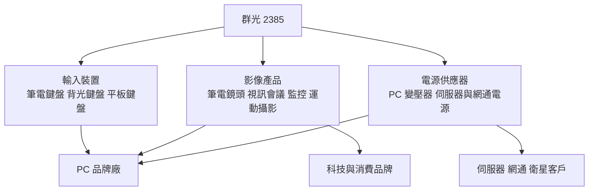
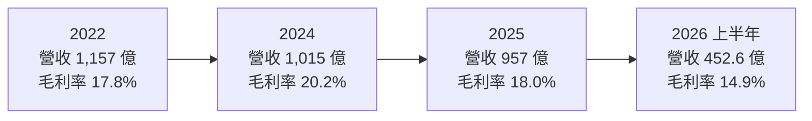
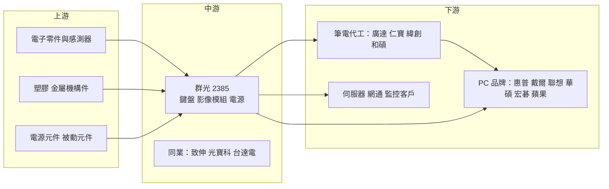

# 2385 群光

> 上市｜[[產業索引-電子零組件業|電子零組件業]]｜上市（櫃）日期 1999/01/05

# 第一章：企業模式與商業藍圖

> [!info] 撰寫說明
> 本文由 Claude 依公開資料整理，架構比照 [[2330台積電]] 的四章研究，資料截至 2026-10-08。財務數字來源：Goodinfo 經營績效頁（2020 至 2025 年度）、證交所開放資料快照（2026 年上半年損益、資產負債、股利）、旺得富與優分析的法說會報導；產業描述為整理性內容，尚未逐條比對原始文件。#待校對

在評估單一個股的長期投資價值時，首要步驟是拆解企業的底層獲利邏輯。本章針對群光電子（股票代號：2385，以下簡稱群光）的商業模式進行定性分析，說明一家以筆電鍵盤起家的零組件廠，如何靠產品組合調整與生產據點分散，在成長緩慢的個人電腦產業裡維持穩定的獲利與高配息。

## 一、核心定位

群光成立於 1983 年，1999 年在台灣證交所掛牌，是全球主要的筆記型電腦鍵盤、影像模組（筆電內建鏡頭、網路攝影機、監控與視訊會議攝影機）與電源供應器製造商。它不賣自有品牌產品給消費者，而是替 PC 品牌廠與科技品牌做設計與生產，屬於典型的 [[ODM]] 零組件供應商。

群光的定位可以用「PC 周邊的多產品平台」來理解。一台筆電裡的鍵盤、鏡頭模組、變壓器都是品牌廠必須外包的零件，群光同時具備這三類產品的設計與量產能力，品牌廠可以在同一家供應商完成多項零件的開發與認證，降低管理成本。這種一站式供貨，是群光和單一產品競爭者最大的差異。

群光的另一個特色是高度重視股東報酬。公司長年把大部分盈餘以現金股利發放，2025 年度配發每股 7.2 元現金股利（依證交所股利資料），以當年 EPS 9.05 元計算，配息率約八成（推算）。這讓群光在台股中常被歸類為「高殖利率的成熟型電子股」。

## 二、終端應用／產品板塊

依優分析整理的公司資料，群光的產品可分為三大塊，公開資料未查得最近一年的精確營收比重，因此本文不畫營收圓餅圖。

* **輸入裝置（鍵盤）：** 以筆電鍵盤為主，重點放在 LED 背光鍵盤、平板鍵盤與電競鍵盤等高單價品項。LED 背光鍵盤在 2024 年第三季的滲透率約 46%，法人預估 2025 至 2026 年逐步接近 50%。背光與特殊按鍵設計能提高單價，是鍵盤業務在出貨量不成長的情況下仍能維持獲利的原因。
* **影像產品：** 包括筆電鏡頭模組、外接網路攝影機、商用監控、視訊會議系統、運動攝影機與智慧家庭攝影機。公司近年刻意汰換低毛利的智慧家庭產品，智慧家庭占影像營收的比重從過去五成以上降到 2024 年前三季略高於三成。2026 年規劃擴大商用監控、視訊會議、車用駕駛監控與戶外運動攝影機等高單價產品。
* **電源供應器：** 從傳統的筆電與桌機變壓器，延伸到伺服器、衛星、網通與智慧建築的電源。電源業務的長期意義在於讓群光的客戶群跨出 PC 產業，降低對單一終端市場的依賴。

## 三、資本轉化邏輯（營運模式）

群光的獲利模式可以拆成三個環節。第一是「設計導入」：品牌廠開發新一代筆電時，群光的工程團隊就參與鍵盤手感、鏡頭模組尺寸與電源規格的設計，一旦被選用，整個產品生命週期內的訂單通常都由群光供應。第二是「大量生產」：群光在中國東莞、蘇州、重慶，以及泰國、捷克設有工廠，以規模壓低單位成本。第三是「組合調整」：公司不追求營收規模，而是持續淘汰低毛利產品、提高高單價產品比重。

這套模式的結果是：營收隨 PC 景氣起伏，但毛利率相對穩定。2020 至 2025 年營收在 951 億至 1,157 億元之間波動，毛利率卻維持在 17.6% 至 20.2%，營業利益率在 8% 至 10% 之間（Goodinfo）。對一家零組件代工廠來說，這是相當穩定的獲利表現。

生產據點的移轉是近年最重要的結構變化。泰國廠在 2019 年重啟，主要生產 AI 影像產品、監控、網通與高階鍵盤，占群光營收的比重從 2023 年的 18% 提高到 2024 年的 25%，法人預估 2025 年達 30% 至 35%。泰國廠享有 8 年免稅優惠，成熟後生產成本可望比中國廠低 1 至 2 個百分點。這一方面回應美國客戶「中國以外產能」的要求，一方面也改善了成本結構。

## 四、企業長期藍圖

群光的長期方向可以歸納為三點。其一，在 PC 產業維持領先份額，受惠 AI PC 與企業換機潮帶來的規格升級：AI PC 需要更好的鏡頭（用於人臉辨識與視訊會議）、更多功能鍵與更高瓦數的電源，單機零件價值有機會提高。其二，把影像與電源技術延伸到非 PC 市場，例如商用監控、車用駕駛監控、伺服器與衛星電源，讓營收來源多元化。其三，透過泰國等東南亞據點分散地緣政治風險。

群光的經營風格偏保守，重視現金與股利，較少進行大型併購或高額資本支出。這種資本配置習慣使它不容易出現爆發性成長，但也讓它在 PC 景氣低迷時仍能維持穩定的獲利與配息。

# 第二章：護城河深度與競爭優勢

本章分析群光的護城河構成、全球主要競爭對手，以及這些優勢在 PC 零組件價格競爭中能守住多少。

## 一、群光護城河的核心組成要素

群光的護城河屬於「窄護城河」，主要由以下三個要素組成：

* **1. 多產品整合與設計導入的轉換成本：** 鍵盤、鏡頭與電源都必須配合筆電機構設計一起開發，品牌廠一旦在某個機種選定供應商，中途換廠就要重新開模、測試與認證，時間與成本都高。群光能同時提供三類產品，品牌廠與它合作的整體轉換成本更高。
* **2. 規模經濟與長期客戶關係：** 群光與主要 PC 品牌合作數十年，在全球筆電鍵盤與鏡頭模組市場都有可觀份額（精確市占未查得）。大規模採購讓它在零件、塑膠與電子料的議價上占優勢，也能分攤研發與自動化投資。
* **3. 多地生產與財務穩健：** 中國、泰國、捷克的多據點布局，讓群光能依客戶需求調整出貨地點。公司長期維持淨現金與低負債的財務結構，景氣不好時也不必降價搶單求生存。

## 二、全球主要競爭對手格局

| 對手 | 定位 | 對群光的威脅 |
|---|---|---|
| [[4915致伸]] | 鍵盤、滑鼠與影像模組代工 | 在輸入裝置與影像模組直接競爭 |
| [[2301光寶科]] | 電源、光電與影像產品 | 在電源與部分影像產品競爭，規模大 |
| [[2308台達電]] | 全球電源龍頭 | 在 PC 與伺服器電源有技術與規模優勢 |
| 中國本土鍵盤與鏡頭模組廠 | 價格導向的中低階產品 | 以低價搶食中國品牌與入門機種 |

## 三、優勢轉化：哪些市場守得住、哪些守不住

* **守得住：** 商用筆電與高階機種的鍵盤與鏡頭模組。這類產品重視品質穩定與交期，品牌廠不會為了小幅價差冒險換供應商。群光在背光鍵盤與視訊會議鏡頭的技術累積，也讓它在規格升級時取得較高單價。
* **守不住：** 一般消費型攝影機與入門鍵盤的價格。這些產品技術門檻低，中國同業可以用更低價格供貨，所以群光選擇主動淘汰這類產品，代價是營收規模難以擴大，2025 年營收 957 億元仍低於 2022 年的 1,157 億元。
* **觀察重點：** 其一，泰國廠占營收比重能否持續提高、成本優勢是否落實在毛利率上。其二，電源業務能否在伺服器、網通等非 PC 市場取得可觀規模。其三，AI PC 是否真的帶動單機零件價值提升。這三點決定群光能否走出 PC 產業「低成長、高配息」的定位。

# 第三章：財務體質與盈利規模

資料日期：2026-10-08。數字取自 Goodinfo 經營績效頁與證交所開放資料快照，表格是撰寫當時的快照；最新月營收、毛利率、累計 EPS 由自動排程寫在本筆記的屬性欄位（月營收、毛利率、累計EPS 等）。#待校對

財務報表是檢驗護城河是否真實存在的最終標準。本章用多年度的三率、ROE、現金流與資本報酬，檢視群光在 PC 景氣循環中的獲利品質。

## 一、獲利能力的基石：三率

| 年度 | 營收（新台幣） | [[毛利率]] | [[營業利益率]] | EPS（元） | [[ROE]] |
|---|---|---|---|---|---|
| 2020 | 951 億 | 18.7% | 8.06% | 7.80 | 20.3% |
| 2021 | 1,075 億 | 17.6% | 8.01% | 8.71 | 22.0% |
| 2022 | 1,157 億 | 17.8% | 9.00% | 10.26 | 23.0% |
| 2023 | 983 億 | 19.4% | 9.57% | 10.35 | 20.3% |
| 2024 | 1,015 億 | 20.2% | 10.2% | 12.43 | 21.3% |
| 2025 | 957 億 | 18.0% | 8.33% | 9.05 | 14.4% |
| 2026 上半年 | 452.6 億 | 14.9% | 5.03% | 5.06 | 未查得 |

* **營收：** 2020 至 2025 年營收的年複合成長率約 0.1%（推算），幾乎沒有成長，反映 PC 是成熟產業，群光又主動淘汰低毛利產品。營收高點出現在 2022 年疫情後的筆電需求高峰，之後回落到 1,000 億元上下。
* **[[毛利率]]與[[營業利益率]]：** 2022 至 2024 年營收下滑，毛利率卻從 17.8% 升到 20.2%，說明產品組合調整確實有效。2025 年毛利率降到 18.0%，2026 年上半年進一步降到 14.9%，營業利益率降到 5.03%（證交所資料），旺得富報導公司將 2025 年的壓力歸因於美國關稅與匯率波動。毛利率能否回到 18% 以上，是檢驗群光組合調整能力的關鍵。
* **業外收益：** 2026 年上半年稅前純益率 9.86%，明顯高於營業利益率 5.03%，代表有相當比例的獲利來自利息收入與投資等[[業外收益]]。群光長年持有大量現金，利息收入是穩定的業外來源，但評估本業時仍應以營業利益為準。

## 二、[[ROE]]：資本效率

2021 至 2025 年平均 ROE 約 20.2%（推算，依 Goodinfo 年度數字），2020 至 2024 年每年都在 20% 以上，對一家零組件代工廠而言屬於優異水準。高 ROE 的來源不是高槓桿，而是穩定的利潤率加上高配息：公司把大部分盈餘發還股東，股東權益不會無限膨脹，ROE 因此維持在高檔。2025 年 ROE 降到 14.4%，主要反映獲利下滑。

## 三、資本支出與[[自由現金流]]

群光屬於組裝與模組製造，設備投資遠低於半導體或 PCB 產業，長期資本支出主要用於泰國廠擴建與自動化（年度金額未查得）。在這種輕資本模式下，營業現金流大多能轉成自由現金流，是群光能長期配發高現金股利的基礎。證交所資料顯示，2025 年度本期淨利約 65.8 億元，配發每股 7.2 元現金股利，以 7.66 億股計算約 55 億元（推算），配息率約八成。Goodinfo 統計的歷年平均現金股利約 3.01 元（統計期間包含較早的低獲利年度），近年配息金額隨獲利提高而上升。

## 四、[[ROIC]] 與 [[WACC]]：價值創造利差

* **ROIC（推算）：** 2025 年營業利益約 79.7 億元（957 億 × 8.33%），以 20% 稅率計算稅後營業利益約 63.8 億元。2026 年第二季底權益總計約 528.7 億元，總負債 573.6 億元，其中大多是應付帳款等營業負債；有息負債金額未查得，假設約占總負債 15%、約 86 億元，投入資本約 615 億元，ROIC 約 10.4%（推算）。群光持有大量現金，若扣除超額現金，本業的 ROIC 會更高。
* **WACC（推算）：** 以 CAPM 推估，無風險利率取 1.75%（台灣 10 年期公債約 1.5% 至 2%），市場風險溢酬 6%，β 未查得來源，採 PC 零組件同業常見值 0.8，股東權益成本約 6.55%。負債成本假設 2%，稅後約 1.6%；資本結構以權益 86%、負債 14% 計算，WACC 約 5.9%（推算）。
* **結論：** 群光的 ROIC 約 10%、WACC 約 6%，長期利差約 4 個百分點（推算），代表公司長年在創造價值。這個利差主要來自穩定的毛利率與輕資本模式，但 2025 至 2026 年利潤率下滑，若營業利益率長期停在 5% 左右，ROIC 會逼近資金成本，需要留意。

# 第四章：總體風險與地緣政治

任何企業都無法脫離宏觀環境獨立存在。本章分析群光未來必須面對的地緣政治、產業週期與營運風險。

## 一、地緣政治風險

* **中國產能比重仍高：** 群光主要工廠仍在東莞、蘇州與重慶。美國對中國製電子產品加徵關稅時，品牌客戶會要求供應商把產能移到中國以外。群光已用泰國廠回應，但移轉需要時間，移轉過程中的雙重成本會暫時壓低毛利率。
* **美國關稅政策反覆：** 旺得富報導指出，群光 2025 年營收下滑與美國關稅有關。關稅政策若持續變動，品牌客戶的訂單分配與出貨地點也會跟著調整，增加營運的不確定性。

## 二、產業週期與市場結構風險

* **PC 產業成熟、成長有限：** 全球 PC 出貨量長期大致持平，群光的營收規模很難大幅擴張。換機潮（例如 2025 年 Windows 10 停止支援帶動的企業換機）只能帶來短期起伏，結束後可能出現需求回落。
* **[[長鞭效應]]：** 品牌廠在景氣好時大量備貨、景氣差時一次砍單，庫存調整沿供應鏈放大，零組件廠的營收波動會比終端銷售更劇烈。2022 至 2023 年群光營收從 1,157 億元降到 983 億元，就是一次典型的庫存調整。
* **匯率：** 群光以美元計價出貨、成本部分以人民幣與泰銖支付，新台幣升值會直接壓縮以台幣計算的毛利率與獲利。

## 三、營運環境的隱性風險

* **客戶集中：** 群光的主要客戶是少數幾家 PC 品牌廠，任何一家調整供應商分配，都會明顯影響營收。
* **新據點的學習曲線：** 泰國廠的良率、人力與供應鏈成熟度仍在建立中，若擴產速度太快，可能出現效率不如中國廠的情況。
* **新業務規模不足：** 電源業務跨入伺服器與網通，面對的是台達電、光寶科等大型對手，能否取得足夠規模仍待觀察。

## 四、科技或法規演進風險

AI PC 是群光近年最重要的規格升級題材，但也帶來風險：如果 AI 功能主要靠處理器與軟體實現，鍵盤與鏡頭的規格升級幅度可能有限，零件價值提升不如預期。另一方面，筆電鍵盤設計若走向觸控或虛擬鍵盤，傳統鍵盤需求將受影響，這是長期可能的技術替代風險。歐盟等地對電子產品的環保與可維修性法規趨嚴，也會提高設計與材料成本。

# 專有名詞解析

## 應用

- **[[AI PC]]**：內建神經網路處理單元、能在本機執行 AI 運算的個人電腦，帶動鏡頭、電源等零件規格升級。

## 金融

- **[[業外收益]]**：非本業營運產生的收益，例如利息、投資收益與匯兌利益，波動較大、不一定能持續。
- **[[配息率]]**：現金股利占每股盈餘的比例，反映公司把多少獲利發還給股東。
- **[[自由現金流]]**：營業活動現金流減去資本支出，代表企業可自由用於配息、還債或併購的現金。
- **[[長鞭效應]]**：終端需求的小幅變動，沿供應鏈往上游傳遞時被逐級放大，造成上游庫存與訂單劇烈波動。
- **[[ROIC]]**：投入資本報酬率，衡量公司每投入一元營運資本能賺多少稅後營業利益。
- **[[WACC]]**：加權平均資金成本，股東與債權人要求報酬率的加權平均，是企業投資的最低報酬門檻。

## 產業

- **[[ODM]]**：原廠委託設計製造，由代工廠負責產品設計與生產，品牌廠只負責銷售與行銷。
- **[[LED背光鍵盤]]**：在按鍵底下加入發光層，讓使用者在暗處也能看清按鍵，單價高於一般鍵盤。
- **[[影像模組]]**：把鏡頭、影像感測器與電路板組合成的模組，用於筆電鏡頭、網路攝影機與監控設備。
- **[[電源供應器]]**：把市電轉換成電子設備所需電壓的裝置，例如筆電變壓器與伺服器電源。

# 核心供應鏈

## 1. 上游：電子零件與機構材料
- 被動元件：[[2327國巨]]、[[2492華新科]]
- 影像感測器與光學元件：[[SONY索尼]]、[[3406玉晶光]]
- 電源相關元件：功率半導體與磁性元件供應商（未查得具體名單）

## 2. 中游：群光本身與同業
- 同業競爭：[[4915致伸]]、[[2301光寶科]]、[[2308台達電]]

## 3. 下游：筆電代工廠
- [[2382廣達]]、[[2324仁寶]]、[[3231緯創]]、[[4938和碩]]（筆電代工廠是否直接向群光採購依機種而定，待校對）

## 4. 下游：PC 與科技品牌
- [[2357華碩]]、[[2353宏碁]]、[[AAPL蘋果]]、[[MSFT微軟]]；惠普、戴爾、聯想等國際品牌（主要客戶名單依產業常識整理，待校對）

## 最新新聞
<!-- news:start -->
<!-- news:end -->

## 相關連結
- [公開資訊觀測站](https://mopsov.twse.com.tw/mops/web/t05st03?step=1&firstin=1&co_id=2385)
- [Goodinfo](https://goodinfo.tw/tw/StockDetail.asp?STOCK_ID=2385)
- [Yahoo 股市](https://tw.stock.yahoo.com/quote/2385)
- [鉅亨網新聞](https://www.cnyes.com/twstock/2385/news)
