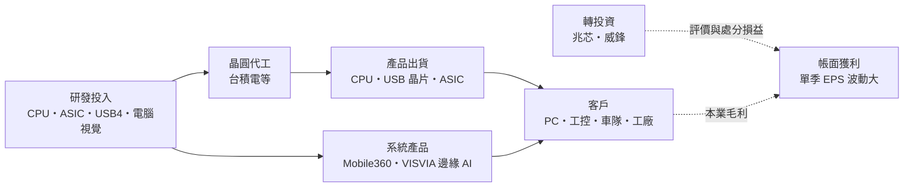
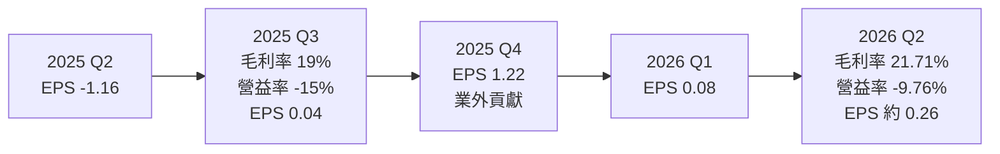
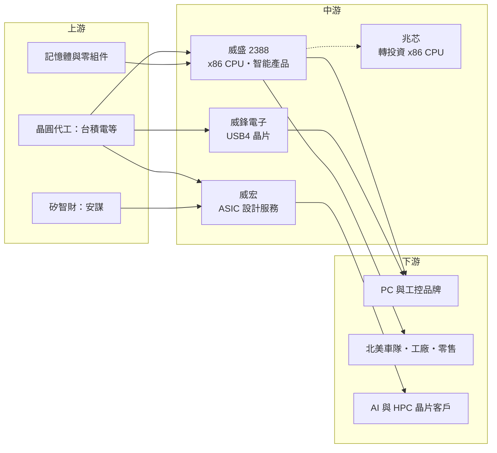

# 2388 威盛

> 上市｜[[產業索引-半導體業|半導體業]]｜上市（櫃）日期 1999/03/05

# 第一章：企業模式與商業藍圖

> [!info] 撰寫說明
> 本文由 Claude 依公開資料整理，架構比照 [[2330台積電]] 的四章研究，資料截至 2026-10-07。財務數字來源：優分析（2025 年 11 月法說會整理）、科技新報（2026 年 6 月股東會報導）、Yahoo 股市新聞與季 EPS、nstock、MoneyLink 公司基本資料；產業描述為整理性內容，尚未逐條比對原始文件。#待校對

在評估單一個股的長期投資價值時，首要步驟是拆解企業的底層獲利邏輯。本章針對威盛電子（股票代號：2388，以下簡稱威盛）的商業模式進行定性分析，說明這家曾與英特爾在 PC 晶片組與 CPU 市場正面競爭的老牌 IC 設計公司，如何轉型為「CPU、ASIC、USB 介面與邊緣 AI 系統」四個板塊並存的控股型集團，以及為何它的獲利高度依賴業外與轉投資。

## 一、核心定位：擁有 x86 授權的 IC 設計與系統集團

威盛於 1992 年在台灣設立，董事長陳文琦。威盛早年以 PC 晶片組聞名，同時是全球少數取得 x86 架構授權、能設計 x86 處理器的公司之一。晶片組被 CPU 廠整合後，威盛逐步轉型，今天的威盛更像一個集團：

* **母公司：** 低功耗 x86 CPU 與智能產品（AI 車載安全系統、工業工安系統）。
* **[[6756威鋒電子]]：** 上市子公司，專注 [[USB4]] 與 USB 集線器、PD 晶片。
* **威宏：** ASIC 子公司，提供 AI 與 [[HPC]] 晶片的[[設計服務]]，已加入 [[ARM安謀]] 生態系，設計能力已延伸到 6 奈米以下並朝 3 奈米發展。
* **兆芯集成電路：** 中國上海的轉投資公司，以 x86 架構 CPU 為核心，布局桌面、伺服器與嵌入式市場，2025 年 6 月向上海科創板申請上市。

這種結構讓威盛的帳面獲利由兩部分組成：本業（CPU、智能產品、威鋒、威宏）長期處於虧損或微利，而轉投資（尤其兆芯）的評價與處分損益則造成單季 EPS 大幅波動。

## 二、終端應用／產品板塊：四大事業

威盛在 2013 年採用 IFRS 後停止自願揭露業務比重，因此營收比重未查得，本章不繪製圓餅圖。依法說會整理，營收由四個部分組成：

* **CPU 部門：** 低功耗桌上型處理器，法說會表示 2026 年導入新製程並強化安全架構。
* **智能產品事業：** 新品牌 VISVIA 結合電腦視覺與生成式 AI，應用在工業檢測、智慧零售、門禁與車隊管理；Mobile360 AI 車載安全系統已導入北美重型車隊，工業工安系統已有多家工廠導入。
* **威鋒電子：** USB4 產品已獲多家主力品牌驗證，2026 年新增車用、工控與 AI PC 周邊產品線，目標營收與獲利雙成長。
* **威宏（[[ASIC]]）：** AI SoC 與 ASIC 設計服務，受美中出口管制影響部分出貨遞延，但公司長期看好。

## 三、資本轉化邏輯（營運模式）：本業投入研發、轉投資實現價值

* **本業規模：** 2025 年全年營收 95.47 億元，前三季營收 64.98 億元、年減 38%，毛利率 23%，稅後虧損 6.11 億元。2026 年 1 至 8 月累計營收 76.67 億元，年增 39.64%。
* **本業仍虧損：** 2026 年第二季[[毛利率]] 21.71%，但[[營業利益率]]為負 9.76%，代表研發與管理費用高於毛利。
* **業外撐起帳面獲利：** 2025 年第四季 EPS 1.22 元、2026 年第二季淨利率 3.44%，都是在本業虧損下由業外貢獻（推估，與兆芯等轉投資相關）。

## 四、企業長期藍圖：邊緣 AI、先進製程 ASIC 與光通訊

依 2026 年 6 月股東會報導，威盛的中長期重點如下：

* **邊緣 AI 與電腦視覺：** 以 VISVIA 品牌整合影像辨識與生成式 AI，把 AI 部署到工廠、零售、辦公室與車隊等真實場景。陳文琦表示 AI 的價值不只在模型訓練，更在實際落地。
* **先進製程 ASIC：** 威宏以 3 奈米為目標，爭取 AI 與 HPC 客製晶片案。
* **光通訊與[[矽光子]]：** 威盛投資光通訊並考慮海外併購，參與 [[2330台積電]] 的矽光子平台。
* **零組件缺貨：** 陳文琦指出目前記憶體與 CPU 供應比一年前更緊，對系統產品出貨是挑戰也是漲價機會。

# 第二章：護城河深度與競爭優勢

在長期價值投資中，「護城河」指企業抵禦競爭、維持超額利潤的保護機制。本章分析威盛的競爭優勢、國內外主要對手，以及這些優勢能否轉成本業獲利。

## 一、護城河的核心組成要素

威盛的護城河集中在「稀有授權與長期累積的技術」，但轉成獲利的能力有限：

* **1. x86 架構授權：** 全球能設計 x86 處理器的公司極少，這項授權是威盛與兆芯合作的基礎，也是兆芯在中國自主 CPU 市場的重要資產。
* **2. 系統整合經驗：** 從晶片到嵌入式板卡、軟體到 AI 演算法，威盛可以提供完整的車載與工業 AI 方案，對車隊與工廠客戶而言轉換成本較高（推估）。
* **3. USB 介面技術：** 威鋒在 USB4 與 USB 集線器累積多年經驗，已通過主力品牌驗證。

## 二、全球主要競爭對手格局

| 對手 | 定位 | 對威盛的威脅 |
|---|---|---|
| [[INTC英特爾]]、[[AMD超微]] | x86 CPU 主導者 | 在 PC 與伺服器 CPU 市場占絕對優勢，威盛只能做利基 |
| [[3443創意]]、[[3661世芯-KY]] | 先進製程 ASIC 設計服務 | 爭取 AI ASIC 案源，規模與晶圓廠關係遠勝威宏 |
| [[5269祥碩]]、[[2379瑞昱]] | 高速介面與 USB 晶片 | 與威鋒在 USB 與 PC 周邊晶片直接競爭 |
| Mobileye 等車用視覺方案商 | 車用 ADAS 與駕駛監控 | 在車載 AI 安全系統爭奪車隊與車廠訂單 |

## 三、優勢轉化：守得住／守不住／觀察重點

* **守得住：** 北美重型車隊與工業工安這類需要客製整合的系統訂單，以及中國自主 CPU 需求帶給兆芯的成長。
* **守不住：** 一般 PC 周邊與通用晶片的價格競爭，本業營業利益率在 2025 年第三季為負 15%、2026 年第二季仍為負 9.76%。
* **觀察重點：** 兆芯上市進度與評價、威鋒 USB4 新產品線能否帶動獲利，以及威宏能否拿到先進製程 ASIC 量產案。

# 第三章：財務體質與盈利規模

資料日期：2026-10-07。數字取自優分析、nstock 與 Yahoo 股市，表格是撰寫當時的快照；最新月營收、毛利率、累計 EPS 由自動排程寫在本筆記的屬性欄位（月營收、毛利率、累計EPS 等）。#待校對

財務報表是檢驗護城河是否真實存在的最終標準。本章用三率、ROE、現金流與資本報酬，檢視威盛本業與業外分別貢獻了多少。

## 一、獲利能力的基石：三率

| 項目 | 2025 全年 | 2025 Q3 | 2025 Q4 | 2026 Q1 | 2026 Q2 |
|---|---|---|---|---|---|
| 營收（新台幣） | 95.47 億 | 23.21 億 | 約 30.5 億（推算） | 未查得 | 未查得 |
| [[毛利率]] | 前三季 23% | 19% | 未查得 | 未查得 | 21.71% |
| [[營業利益率]] | 未查得 | -15% | 未查得 | 未查得 | -9.76% |
| EPS（元） | 0.12 | 0.04 | 1.22 | 0.08 | 約 0.26（推算） |

註：2026 年上半年累計 EPS 0.34 元，第二季以累計減第一季推算；上半年營收約 56 億元（以 1 至 8 月累計扣除 7、8 月推算）。

* **[[毛利率]]：** 維持在 20% 上下，屬 IC 設計業偏低的水準，反映產品以系統與中低價晶片為主。
* **[[營業利益率]]：** 長期為負，研發費用（尤其 ASIC 與 AI）高於本業毛利。
* **業外主導 EPS：** 2025 年第二季 EPS 負 1.16 元、第四季 1.22 元，全年合計 0.12 元，大幅波動主要來自業外與轉投資損益（推估）。

## 二、[[ROE]]：資本效率

依 nstock，2026 年第二季單季 ROE 約 0.5%、ROA 約 0.3%，資本效率偏低。威盛的股東權益中有相當比例是轉投資部位，帳面 ROE 主要受轉投資評價影響，不能反映本業效率。

## 三、資本支出與自由現金流

* **[[CapEx]]：** 威盛為 IC 設計與系統公司，沒有晶圓廠，資本支出規模小，具體金額未查得。
* **[[自由現金流]]：** 未查得。本業虧損代表營業現金流壓力，但轉投資處分可提供現金（推估）。
* **股利：** 2024 年度現金股利 0.2 元；2025 年第四季配發現金股利 0.05 元；近五年平均現金股利約 0.3 元。

## 四、[[ROIC]] 與 [[WACC]]：價值創造利差

以本業計算，威盛的投入資本報酬率為負，低於資金成本；集團價值主要來自轉投資的評價。投資人評估威盛時，較接近評估一家控股公司：需要分別估算兆芯、威鋒等持股價值，再扣掉本業虧損。

# 第四章：總體風險與地緣政治

任何企業都無法脫離宏觀環境獨立存在。本章分析威盛未來必須面對的地緣政治、產業週期與營運風險。

## 一、地緣政治

* **兆芯與中國自主 CPU：** 兆芯是中國推動自主 CPU 的一環，這讓它享有政策需求，但也可能受美國出口管制與實體清單影響，進而波及威盛的投資價值與技術合作。
* **ASIC 出口管制：** 法說會指出威宏的 ASIC 業務受美中出口管制影響，出貨遞延。
* **台灣與中國雙邊監管：** 台灣對赴中投資與技術輸出的規範，也可能限制威盛與兆芯的合作方式。

## 二、產業週期與市場結構

* **PC 與工控週期：** CPU 與 USB 晶片依賴 PC、工控需求，換機週期與庫存調整會影響出貨。
* **AI 投資週期：** AI 邊緣應用與 ASIC 案源依賴企業 AI 支出，若 AI 投資放緩，新業務成長可能延後。
* **零組件缺貨：** 記憶體與 CPU 供應緊縮可能推高系統產品成本，壓縮車載與工業方案的毛利（推估）。

## 三、營運環境的隱性風險

* **業外波動：** 帳面獲利高度依賴轉投資損益，單季 EPS 可在負 1.16 元到正 1.22 元之間擺盪，難以預測。
* **研發費用：** ASIC 與 AI 研發需長期投入，若未能取得量產案，費用會持續拖累本業。
* **集團治理：** 子公司與轉投資眾多，資訊揭露與關係人交易需要投資人額外留意。

## 四、科技或法規演進

* **CPU 架構轉移：** Arm 與 RISC-V 在 PC、伺服器與嵌入式市場的滲透，可能降低 x86 授權的稀缺價值。
* **車輛安全法規：** 全球車輛安全法規趨嚴，對 Mobile360 這類駕駛監控與盲點偵測產品是正面因素，但也要求通過各地認證。
* **AI 法規：** 影像辨識與生成式 AI 在隱私與資料保護上的規範，會影響 VISVIA 在零售與門禁場景的推廣。

# 專有名詞解析

## 半導體

- **[[x86]]**：英特爾開發的處理器指令集架構，PC 與伺服器主流，取得授權的設計公司極少。
- **[[ASIC]]**：特殊應用積體電路，依特定客戶或用途量身設計的晶片，相對於通用晶片功能更精簡、效率更高。
- **[[設計服務]]**：替客戶完成晶片設計、驗證、投片與封測安排的服務，收入包括一次性設計費與量產晶片銷售。
- **[[SoC]]**：系統單晶片，把處理器、記憶體控制、介面等多種功能整合在一顆晶片上。
- **[[矽光子]]**：在矽晶片上製作光學元件，以光取代電傳輸資料，可降低 AI 資料中心的傳輸耗電。

## 應用

- **[[USB4]]**：新一代 USB 傳輸標準，頻寬可達 40Gbps 以上，整合資料、影像與充電功能。
- **[[HPC]]**：高效能運算，用於 AI 訓練、科學運算與資料中心的大量平行運算。
- **[[邊緣AI]]**：在終端裝置或現場設備上直接執行 AI 推論，不必把資料傳回雲端，延遲低、隱私較佳。
- **[[電腦視覺]]**：讓電腦從影像或影片中辨識物體、人員與動作的技術，用於工業檢測與車載安全。
- **[[DMS]]**：駕駛監控系統，以攝影機偵測駕駛是否分心或疲勞，是車輛安全法規逐步要求的配備。

## 金融

- **[[業外收益]]**：本業以外的收入，例如投資處分利益、股利或匯兌收益，通常不具持續性。
- **[[權益法]]**：持股達重大影響時，依被投資公司損益按持股比例認列投資收益的會計方法。
- **[[營業利益率]]**：營業利益占營收的比例，反映扣除營業費用後本業的獲利能力。
- **[[ROE]]**：股東權益報酬率，稅後淨利除以股東權益，衡量公司運用股東資金賺錢的效率。

# 核心供應鏈

## 1. 上游：晶圓代工、矽智財與零組件
- 晶圓代工與矽光子平台：[[2330台積電]]
- 處理器矽智財：[[ARM安謀]]
- 記憶體與零組件：供應商未查得

## 2. 中游：威盛本身與子公司
- USB4 與 USB 晶片：[[6756威鋒電子]]
- ASIC 設計服務：威宏（未上市）
- 轉投資 x86 CPU：兆芯集成電路（中國上海）

## 3. 下游：主要客戶類型
- PC、工控與 AI PC 周邊品牌（名單未揭露）
- 北美重型車隊、工廠工安、零售與門禁場域

## 4. 同業
- x86 CPU：[[INTC英特爾]]、[[AMD超微]]
- ASIC 設計服務：[[3443創意]]、[[3661世芯-KY]]
- 介面晶片：[[5269祥碩]]、[[2379瑞昱]]

延伸閱讀：[[台積電供應鏈]]

## 最新新聞
<!-- news:start -->
<!-- news:end -->

## 相關連結
- [公開資訊觀測站](https://mopsov.twse.com.tw/mops/web/t05st03?step=1&firstin=1&co_id=2388)
- [Goodinfo](https://goodinfo.tw/tw/StockDetail.asp?STOCK_ID=2388)
- [Yahoo 股市](https://tw.stock.yahoo.com/quote/2388)
- [鉅亨網新聞](https://www.cnyes.com/twstock/2388/news)
