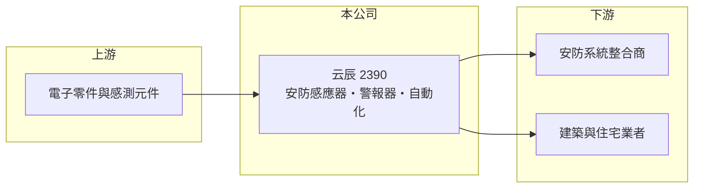

# 2390 云辰

> 上市｜[[產業索引-其他電子業|其他電子業]]｜上市（櫃）日期 1999/06/15

# 第一章：企業模式與商業藍圖

> [!info] 撰寫說明
> 精簡版，由 Claude 依公開資料整理，架構比照 [[2330台積電]]，資料截至 2026-10-07。來源：winvest 公司營收快訊頁與營收新聞標題。公開資料有限。#待校對

云辰是成立於 1980 年的安防設備公司，產品包括智慧安防、節能自動化系統與感應器、警報器。

- **核心業務：** 專業智慧安防與節能自動化系統、智能控制器、感應器、警報器產品，以及[[智慧建築]]方案。
- **營收結構：** 以安防感應器、警報器與控制器為主（推估）；各產品營收比重未查得。
- **營運據點：** 總部在台灣，1999 年上市（推估以外銷為主）。
- **長期方向：** 從單一安防元件延伸到智慧建築與節能自動化系統整合（推估）。

# 第二章：護城河深度與競爭優勢

云辰屬於安防設備中的小型利基廠商，公開資訊不多。

- **競爭優勢：** 長期經營安防感應器與警報器，具產品認證與通路經驗（推估）。
- **主要對手：** 國際安防設備大廠與中國大陸低價安防元件廠（推估）。
- **觀察重點：** 月營收能否延續 2026 年中的年增趨勢，以及本業能否穩定獲利。

# 第三章：財務體質與盈利規模

資料日期：2026-10-07，表格是撰寫當時的快照；最新月營收、毛利率、累計 EPS 由自動排程寫在本筆記的屬性欄位（月營收、毛利率、累計EPS 等）。#待校對

云辰營收規模小，2026 年第一季轉為獲利。

- **營收規模：** 2026 年 1 至 7 月累計營收 3.83 億元，年減 6.22%；8 月營收 5,801.6 萬元，年增 16.84%。
- **獲利：** 2025 年全年 EPS -0.14 元；2026 年第一季 EPS 0.54 元。
- **財務特色：** 資本額 19.26 億元，市值約 20 億元；以月營收規模推算，第一季獲利可能有部分來自[[業外收益]]（推估）。

# 第四章：總體風險與地緣政治

云辰的風險在於規模小、獲利不穩定。

- **產業週期：** 安防與建築設備需求受營建景氣與企業資本支出影響。
- **營運風險：** 營收規模小，獲利容易受單一訂單或業外項目影響，2025 年為虧損。
- **其他風險：** 中國安防元件低價競爭、電子零件成本與匯率變動。

# 專有名詞解析

## 應用

- **[[智慧建築]]**：以感測器、控制器與網路整合建築的照明、空調、門禁與安防，達到節能與自動化管理。

## 金融

- **[[業外收益]]**：本業以外的收入，例如投資收益、處分資產利益或匯兌利益。

# 核心供應鏈

- 上游：電子零件、感測元件與塑膠機構件供應商（推估）
- 下游／客戶：安防系統整合商、建築與住宅業者（推估）
- 同業：國際安防設備廠與中國安防元件廠（推估）

## 最新新聞
<!-- news:start -->
<!-- news:end -->

## 相關連結
- [公開資訊觀測站](https://mopsov.twse.com.tw/mops/web/t05st03?step=1&firstin=1&co_id=2390)
- [Goodinfo](https://goodinfo.tw/tw/StockDetail.asp?STOCK_ID=2390)
- [Yahoo 股市](https://tw.stock.yahoo.com/quote/2390)
- [鉅亨網新聞](https://www.cnyes.com/twstock/2390/news)
