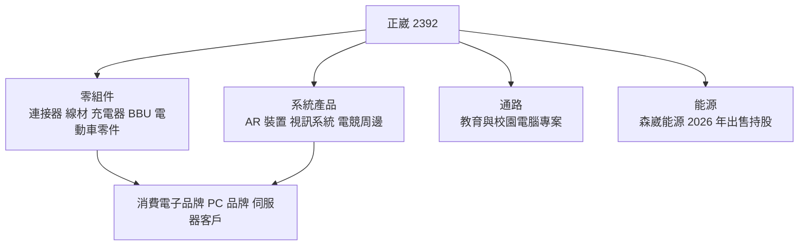
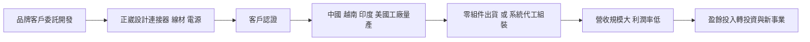
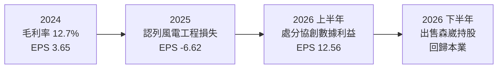
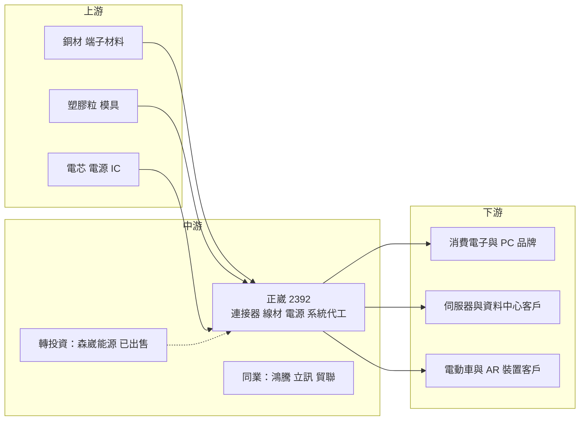

# 2392 正崴

> 上市｜[[產業索引-電子零組件業|電子零組件業]]｜上市（櫃）日期 1999/09/20

# 第一章：企業模式與商業藍圖

> [!info] 撰寫說明
> 本文由 Claude 依公開資料整理，架構比照 [[2330台積電]] 的四章研究，資料截至 2026-10-08。財務數字來源：Goodinfo 經營績效頁（2020 至 2025 年度）、證交所開放資料快照（2026 年上半年損益、資產負債、股利）、富果 2025 年 6 月法說會摘要、中央社、今周刊、經濟日報、科技新報、nStock；產業描述為整理性內容，尚未逐條比對原始文件。#待校對

在評估單一個股的長期投資價值時，首要步驟是拆解企業的底層獲利邏輯。本章針對正崴精密工業（股票代號：2392，以下簡稱正崴）的商業模式進行定性分析。正崴的本業是電子連接器、線材與電源零組件，但近年集團跨入離岸風電工程，2025 年因此出現上市以來最大的虧損，理解這段歷程是評估正崴的關鍵。

## 一、核心定位

正崴成立於 1986 年，1999 年在台灣證交所上市，董事長郭台強創立（市場普遍知道郭台強是鴻海創辦人郭台銘的弟弟，但兩家公司是各自獨立的集團，待校對）。正崴的本業是電子零組件代工：替歐美消費電子與零件品牌生產連接器、精密端子、電子線、充電器與電池模組，也做部分系統產品的代工組裝。

正崴的定位可以用「多角化的電子零組件集團」來形容。它的產品線很廣，從手機、筆電的連接器與充電線，到電動車連接器、伺服器的[[BBU]]（電池備援模組）與高速傳輸線，再到 AR 裝置、電競周邊等系統代工，幾乎涵蓋消費電子的各種周邊零件。產品廣的好處是不依賴單一產品，缺點是每一條產品線的規模與技術門檻都不算突出，整體利潤率偏低。

除了電子本業，正崴集團在 2010 年代後期跨入能源事業，透過轉投資的森崴能源（6806）承攬台電離岸風電二期的海事工程。這項跨界投資在 2025 年演變成鉅額虧損，2026 年正崴決定以每股 0.05 元參與公開收購、出售森崴持股並喪失控制力，等於正式退出這項事業（科技新報）。

## 二、終端應用／產品板塊

依富果整理的 2025 年 6 月法說會，正崴的業務分為四大板塊，各板塊的營收比重未查得，因此本文不畫營收圓餅圖。

* **零組件：** 這是正崴的核心本業，包括消費性電子連接器、電源產品，以及 AI PC 與伺服器用的高速傳輸線（[[AOC]]、[[AEC]]）、伺服器電池備援模組 BBU，和電動車用連接器、軟板與電池模組。BBU 的 3KW 產品已送客戶測試，5.5KW 與 8KW 開發中，代表正崴試圖把電源技術延伸到資料中心。
* **系統產品：** 包括 AI 智慧視訊系統、替美系大廠代工的 AR 裝置、電競周邊、穿戴裝置、電動自行車與 POS 系統。這部分屬於代工組裝，毛利率通常低於零組件。
* **通路：** 經營政府教育專案與校園市場的電腦設備銷售，屬於低毛利、高營收的貿易性質業務。
* **能源：** 森崴能源旗下的富崴能源承攬離岸風電海事工程，富威電力經營綠電與儲能。2026 年出售森崴持股後，能源事業對正崴的影響將大幅降低。

## 三、資本轉化邏輯（營運模式）

正崴本業的獲利模式和多數電子零組件代工廠類似：接受品牌客戶委託設計零件，取得認證後量產，靠規模經濟與自動化壓低成本。不同之處在於正崴的生產據點非常分散，台灣有頂埔、宜蘭、土城、花蓮，中國有東莞、崑山、鹽城、徐州，越南有胡志明市與峴港，印度有 Tirupati、清奈、Noida 三處，美國亞利桑那州也有基地並計畫新增德州廠服務資料中心客戶（富果法說摘要）。這種布局讓正崴能配合客戶「去中國化」的需求，但也代表管理成本較高。

從財務結構看，正崴本業的毛利率長年在 11% 至 13%，營業利益率只有 2% 至 4%（Goodinfo 2020 至 2024 年度）。這代表正崴是「薄利多銷」型的代工廠，營收接近千億元，每年本業獲利只有二、三十億元。低利潤率讓轉投資的成敗對整體獲利影響很大，2025 年森崴的虧損就足以抹去好幾年的本業獲利。

## 四、企業長期藍圖

正崴的長期方向可以分成兩部分看。第一，本業從消費電子轉向 AI 伺服器與資料中心：高速傳輸線、BBU 與美國德州新廠都是這個方向，法說會也提到投資 AI 運算中心、以算力租賃收費，並成立 AI 機器人公司。第二，處理集團轉投資的遺留問題：2025 年認列森崴虧損後，2026 年 4 月孫公司 Power Channel Limited 處分協創數據股票，預計認列稅前處分利益約 103.5 億元以改善財務結構（經濟日報），9 月再出售森崴持股。

整體來看，正崴的經營層有積極多角化的傾向，但跨入離岸風電這個與本業無關、風險極高的工程事業，結果是重大損失。投資人評估正崴時，需要把「本業能否在 AI 伺服器取得規模」與「經營層的資本配置是否轉趨保守」兩件事一起觀察。

# 第二章：護城河深度與競爭優勢

本章分析正崴的護城河構成、全球主要競爭對手，以及這些優勢在連接器與線材的價格競爭中能守住多少。

## 一、正崴護城河的核心組成要素

正崴的護城河偏窄，主要來自以下三個要素：

* **1. 客戶認證與長期合作關係：** 連接器、線材與充電器都要通過品牌客戶的安規與可靠度認證，一旦進入供應鏈，客戶通常不會輕易更換。正崴長期服務歐美消費電子品牌，累積了認證與共同開發的經驗。
* **2. 全球多據點的製造彈性：** 中國、越南、印度與美國都有工廠，可以依客戶要求調整出貨地點。在美中貿易衝突下，這種彈性本身就是爭取訂單的條件。
* **3. 產品線廣、可一站式供貨：** 從連接器、線材到電池模組與系統組裝，正崴可以替客戶整合多種零件，降低客戶的採購管理成本。

不過這些優勢在同業中並不獨特，鴻騰精密、立訊精密等大型同業都具備類似條件，而且規模更大，因此正崴的定價能力有限。

## 二、全球主要競爭對手格局

| 對手 | 定位 | 對正崴的威脅 |
|---|---|---|
| 立訊精密 | 中國最大連接器與組裝廠，深度綁定蘋果 | 規模與成本優勢，搶食消費電子線材與組裝 |
| 鴻騰精密（FIT） | 鴻海集團的連接器與線材子公司 | 在連接器、電動車與伺服器線材直接競爭 |
| 安費諾（Amphenol）、TE Connectivity | 全球連接器龍頭 | 在高速傳輸與車用連接器握有技術優勢 |
| [[3665貿聯-KY]] | 高階線束與伺服器線材 | 在 AI 伺服器高速線材競爭 |
| [[2308台達電]]、[[2301光寶科]] | 電源與 BBU | 在資料中心電源與 BBU 有規模優勢 |

## 三、優勢轉化：哪些市場守得住、哪些守不住

* **守得住：** 已長期合作、需要多地生產的歐美品牌客戶訂單。這些客戶重視交期與供應鏈分散，正崴的印度與越南產能是實質優勢。
* **守不住：** 一般消費電子連接器與充電線的價格。這類產品技術門檻低，中國同業成本更低，所以正崴本業的毛利率長期只有 11% 至 13%。2026 年第二季毛利率更降到約 4%（nStock 單季資料），本業獲利能力明顯轉弱。
* **觀察重點：** 其一，AI 伺服器的高速傳輸線與 BBU 能否取得大客戶量產訂單，讓營收結構轉向高毛利產品。其二，森崴出售後，集團是否還有其他高風險轉投資。其三，處分協創數據取得的資金是用於還債、本業投資還是配發股利，這會反映經營層資本配置的方向。

# 第三章：財務體質與盈利規模

資料日期：2026-10-08。數字取自 Goodinfo 經營績效頁、證交所開放資料快照與經濟日報，表格是撰寫當時的快照；最新月營收、毛利率、累計 EPS 由自動排程寫在本筆記的屬性欄位（月營收、毛利率、累計EPS 等）。#待校對

財務報表是檢驗護城河是否真實存在的最終標準。本章用多年度的三率、ROE、現金流與資本報酬，檢視正崴本業的獲利品質，以及轉投資對財務的衝擊。

## 一、獲利能力的基石：三率

| 年度 | 營收（新台幣） | [[毛利率]] | [[營業利益率]] | EPS（元） | [[ROE]] |
|---|---|---|---|---|---|
| 2020 | 896 億 | 10.9% | 2.67% | 4.06 | 6.46% |
| 2021 | 868 億 | 11.0% | 2.20% | 1.90 | 4.28% |
| 2022 | 941 億 | 12.9% | 3.75% | 3.14 | 6.09% |
| 2023 | 906 億 | 12.9% | 3.33% | 3.09 | 5.75% |
| 2024 | 984 億 | 12.7% | 3.54% | 3.65 | 6.54% |
| 2025 | 950 億 | -7.51% | -17.3% | -6.62 | -58.5% |
| 2026 上半年 | 379.3 億 | 12.3% | 1.78% | 12.56 | 未查得 |

* **本業三率：** 2020 至 2024 年毛利率 10.9% 至 12.9%、營業利益率 2.2% 至 3.8%，是典型的低利潤代工結構。營收在 868 億至 984 億元之間，2020 至 2025 年的年複合成長率約 1.2%（推算），規模大致持平。
* **2025 年的異常：** 合併毛利率降到 -7.51%、營業利益率 -17.3%，主要是合併報表內的富崴能源承攬台電離岸風電二期工程，代墊近 200 億元的追加工程款並暫列損失（中央社 2025 年 8 月）。這是正崴 1999 年上市以來最差的年度，2025 年第二季單季每股虧損 2.1 元也是上市以來最差的單季。
* **2026 年上半年：** 營業利益率回到 1.78%，但稅前純益率高達 22.55%（證交所資料），EPS 12.56 元幾乎全部來自處分協創數據的一次性利益（預計稅前約 103.5 億元）。這筆[[一次性收益]]不能視為本業獲利能力，評估正崴時應以營業利益為準。

## 二、[[ROE]]：資本效率

2021 至 2024 年 ROE 介於 4.28% 至 6.54%，平均約 5.7%（推算），2025 年因鉅額虧損降到 -58.5%。即使不計 2025 年，正崴的 ROE 也長期低於一般認為合理的 8% 至 10% 門檻，原因是本業利潤率太低，加上負債比偏高：2025 年第一季負債比率約 68%（富果法說摘要），2026 年第二季底總負債約 911 億元、權益總計約 324 億元（證交所資料）。高負債放大了轉投資虧損對股東權益的衝擊。

## 三、資本支出與[[自由現金流]]

正崴本業的資本支出主要用於越南、印度與美國新廠，年度金額未查得。2024 年底現金部位約 178 億元，但森崴的工程借款規模大，科技新報報導森崴借款估計約 169 億元並進入債務協商。這代表過去幾年正崴集團的現金流有相當部分被能源事業占用。2026 年處分協創數據與出售森崴後，財務結構可望改善，但具體負債下降幅度要看下半年財報。

股利方面，2024 年度配發現金股利 2.5 元（nStock，配發率約 68%），2025 年度雖然虧損仍配發 1 元（證交所股利資料），nStock 統計近五年平均現金股利約 1.84 元。在虧損年度仍動用保留盈餘配息，顯示經營層重視股利延續，但也代表股利並非完全由當年獲利支撐。

## 四、[[ROIC]] 與 [[WACC]]：價值創造利差

* **ROIC（推算）：** 2025 年營業虧損約 164 億元，ROIC 為負。以較正常的 2024 年計算，營業利益約 34.8 億元（984 億 × 3.54%），稅後營業利益約 27.9 億元。投入資本以 2026 年第二季底權益約 324 億元，加上有息負債估計約 455 億元（有息負債未查得，假設約占總負債 911 億元的一半），合計約 779 億元，ROIC 約 3.6%（推算）。
* **WACC（推算）：** 以 CAPM 推估，無風險利率 1.75%，市場風險溢酬 6%，β 未查得來源，考量高負債與轉投資風險採 1.2，股東權益成本約 8.95%。負債成本假設 2.5%，稅後約 2%；資本結構以權益 42%、負債 58% 計算，WACC 約 4.9%（推算）。
* **結論：** 即使在本業正常的 2024 年，正崴的 ROIC 約 3.6% 也低於約 5% 的資金成本（推算），2025 年更是大幅為負，代表公司近年整體上沒有為股東創造價值。退出能源事業後，若 AI 伺服器相關產品能把本業營業利益率拉高到 5% 以上，ROIC 才有機會接近或超過 WACC。

# 第四章：總體風險與地緣政治

任何企業都無法脫離宏觀環境獨立存在。本章分析正崴未來必須面對的地緣政治、產業週期與營運風險。

## 一、地緣政治風險

* **中國產能與美國關稅：** 正崴在東莞、崑山、鹽城、徐州都有工廠，美國對中國製電子產品的關稅與出口管制，會迫使客戶要求轉移產能。正崴雖已在越南與印度布局，但移轉過程會產生額外成本。
* **印度與越南的營運不確定性：** 印度的法規、勞工與基礎建設條件與中國差異大，新據點的生產效率需要時間建立。2025 年第一季正崴認列緬甸廠資產減損約 1.8 億元（富果法說摘要），說明海外據點也可能帶來減損風險。

## 二、產業週期與市場結構風險

* **消費電子需求波動：** 正崴大部分營收仍來自手機、筆電與周邊產品，這些市場成長緩慢，且受[[長鞭效應]]影響，客戶庫存調整會放大訂單波動。
* **價格競爭：** 連接器與線材的中低階市場由中國廠商主導，價格壓力長期存在，壓抑正崴的毛利率。
* **匯率：** 以美元計價出貨，新台幣升值會壓縮以台幣計算的獲利。

## 三、營運環境的隱性風險

* **轉投資與公司治理：** 森崴事件顯示，正崴集團過去的投資決策曾讓股東承擔與本業無關的重大風險。雖然 2026 年已出售持股，但後續是否仍有連帶的保證、債務或訴訟責任，需要持續追蹤（未查得相關資料）。
* **一次性收益造成的獲利失真：** 2026 年的高 EPS 主要來自處分利益，若以此推估未來獲利，會嚴重高估正崴的本業能力。
* **新事業執行風險：** AI 運算中心、算力租賃、AI 機器人等新業務與既有製造本業差異大，投入資金後能否獲利仍有高度不確定性。

## 四、科技或法規演進風險

AI 伺服器的傳輸技術快速演進，從銅線走向主動式電纜與光纖，甚至走向[[CPO]]（共同封裝光學）。如果正崴的高速傳輸線技術跟不上世代更替，可能在送樣階段就被淘汰。電動車連接器與電池模組則面臨車規認證門檻與中國廠商的成本競爭。另外，各國對電子產品的環保、回收與充電介面規範（例如歐盟統一 USB-C）會影響線材與充電器的產品設計，對正崴有利也有弊。

# 專有名詞解析

## 半導體

- **[[CPO]]**：共同封裝光學，把光學元件與交換器晶片封裝在一起，以縮短電訊號路徑、降低耗電。

## 應用

- **[[BBU]]**：電池備援模組，在資料中心斷電時短暫供電，讓伺服器安全關機或切換到備用電源。
- **[[AOC]]**：主動式光纖纜線，兩端內建光電轉換元件，用光纖傳輸高速訊號，傳輸距離比銅線長。
- **[[AEC]]**：主動式電纜，在銅線兩端加入訊號強化晶片，延長高速訊號的有效傳輸距離，成本低於光纖。

## 金融

- **[[一次性收益]]**：來自處分資產或投資等不會重複發生的收益，會讓當年 EPS 暫時偏高。
- **[[業外收益]]**：非本業營運產生的收益，例如利息、投資收益與匯兌利益，波動較大、不一定能持續。
- **[[長鞭效應]]**：終端需求的小幅變動，沿供應鏈往上游傳遞時被逐級放大，造成上游庫存與訂單劇烈波動。
- **[[ROIC]]**：投入資本報酬率，衡量公司每投入一元營運資本能賺多少稅後營業利益。
- **[[WACC]]**：加權平均資金成本，股東與債權人要求報酬率的加權平均，是企業投資的最低報酬門檻。

## 產業

- **[[連接器]]**：讓電路之間可插拔連接、傳遞電力或訊號的零件，例如 USB 接頭與伺服器內部的高速連接器。
- **[[離岸風電]]**：在海上設置風力發電機，海事工程受天候與船隻調度影響大，工期與成本風險高。

# 核心供應鏈

## 1. 上游：原材料與關鍵零件
- 銅材：[[1605華新]]
- 電池芯與電源元件：國內外電芯與功率元件供應商（未查得具體名單）

## 2. 中游：正崴本身、轉投資與同業
- 轉投資：[[6806森崴能源]]（2026 年 9 月參與公開收購出售持股）、[[3712永崴投控]]
- 同業：[[3665貿聯-KY]]、[[3533嘉澤]]、[[2308台達電]]、[[2301光寶科]]；鴻騰精密、立訊精密、安費諾

## 3. 下游：主要客戶群
- 消費電子與 PC：[[AAPL蘋果]]、[[2357華碩]]、[[2353宏碁]]（主要客戶名單依產業常識整理，待校對）
- 伺服器與資料中心：[[2382廣達]]、[[3231緯創]]（BBU 與高速線材仍在送樣與認證階段，待校對）

## 最新新聞
<!-- news:start -->
<!-- news:end -->

## 相關連結
- [公開資訊觀測站](https://mopsov.twse.com.tw/mops/web/t05st03?step=1&firstin=1&co_id=2392)
- [Goodinfo](https://goodinfo.tw/tw/StockDetail.asp?STOCK_ID=2392)
- [Yahoo 股市](https://tw.stock.yahoo.com/quote/2392)
- [鉅亨網新聞](https://www.cnyes.com/twstock/2392/news)
