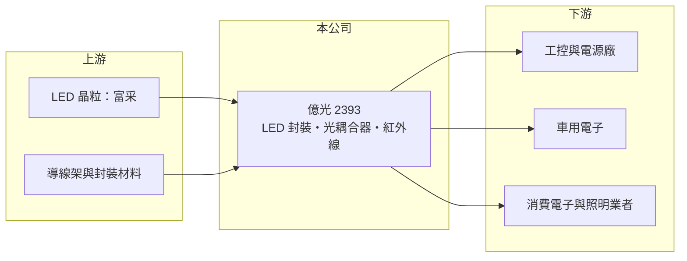

# 2393 億光

> 上市｜[[產業索引-光電業|光電業]]｜上市（櫃）日期 1999/11/04

# 第一章：企業模式與商業藍圖

> [!info] 撰寫說明
> 精簡版，由 Claude 依公開資料整理，架構比照 [[2330台積電]]，資料截至 2026-10-07。來源：財報狗、winvest 營收快訊。#待校對

億光把上游 [[LED晶粒]]封裝成可直接使用的光電元件，並以[[光耦合器]]、紅外線等利基產品拉開與一般照明 LED 的距離。

- **核心業務：** 億光是台灣主要的 [[LED封裝]]廠，產品包括可見光 LED、紅外線元件、光耦合器與光感測元件。
- **營收結構：** 以 LED 封裝與光耦合器、紅外線等光電元件為主，各產品比重這次未查到。
- **營運據點：** 總部在台灣，生產據點推估以中國為主，銷售遍及全球。
- **長期方向：** 推估持續提高光耦合器、紅外線感測與車用、工控等高附加價值產品比重，降低一般照明 LED 的價格競爭壓力。

# 第二章：護城河深度與競爭優勢

億光的護城河來自規模與完整產品線，工控與電源相關產品是較能守住毛利的區塊。

- **競爭優勢：** 規模大、產品線完整，光耦合器等工控與電源相關產品毛利推估高於一般照明 LED。
- **主要對手：** LED 封裝有 [[2301光寶科]]、3698隆達、2499東貝、[[6168宏齊]]；光耦合器則與 [[AVGO博通]]、東芝、瑞薩等國際大廠競爭。
- **觀察重點：** 營收年增能否延續、工控與車用需求復甦程度，以及每季 EPS 是否回到 1.2 元以上。

# 第三章：財務體質與盈利規模

資料日期：2026-10-07，表格是撰寫當時的快照；最新月營收、毛利率、累計 EPS 由自動排程寫在本筆記的屬性欄位（月營收、毛利率、累計EPS 等）。#待校對

億光月營收維持在 17 至 18 億元區間，每季獲利穩定為正。

- **營收規模：** 2026 年 6 月營收 18.31 億元，年增約 11%；4、5 月分別為 17.54 億、17.72 億元，月營收約在 17 至 18 億元區間。
- **獲利：** 2026 年第一季 EPS 0.91 元、第二季 1.24 元；2025 年第三、四季分別為 1.29 元、1.26 元，近四季 EPS 合計 4.69 元。
- **財務特色：** 獲利相對穩定，每季維持正 EPS；[[毛利率]]這次未查到。

# 第四章：總體風險與地緣政治

億光的風險主要來自成熟產業的價格戰，以及生產據點集中中國。

- **產業週期：** LED 封裝產業成熟、價格競爭激烈；光耦合器需求跟隨工控、電源與車用景氣。
- **營運風險：** 中國同業產能擴張帶來價格壓力，一般照明與背光產品毛利容易被壓縮。
- **其他風險：** 生產據點集中中國，需留意關稅與地緣政治；匯率與原物料價格也會影響毛利。

# 專有名詞解析

## 半導體

- **[[LED封裝]]**：把 LED 晶粒固定在支架或基板上，接線並以膠體保護，做成可焊接使用的元件。
- **[[LED晶粒]]**：在磊晶片上切割出的發光二極體晶片，是 LED 封裝廠的主要原料。

## 應用

- **[[光耦合器]]**：以光傳遞訊號、讓兩端電路電氣隔離的元件，常用於電源供應器、工控與電動車。

# 核心供應鏈

- 上游：LED 晶粒廠（如 [[3714富采]]）、導線架、封裝材料
- 下游／客戶：工控與電源廠、車用電子、消費電子與照明業者
- 同業：[[2301光寶科]]、3698隆達、2499東貝、[[6168宏齊]]

## 最新新聞
<!-- news:start -->
<!-- news:end -->

## 相關連結
- [公開資訊觀測站](https://mopsov.twse.com.tw/mops/web/t05st03?step=1&firstin=1&co_id=2393)
- [Goodinfo](https://goodinfo.tw/tw/StockDetail.asp?STOCK_ID=2393)
- [Yahoo 股市](https://tw.stock.yahoo.com/quote/2393)
- [鉅亨網新聞](https://www.cnyes.com/twstock/2393/news)
