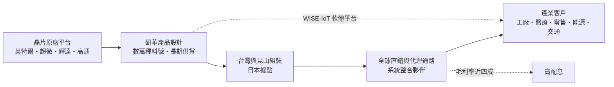
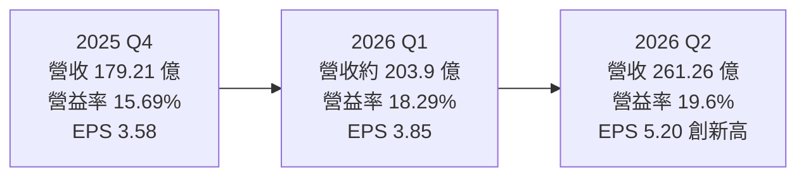
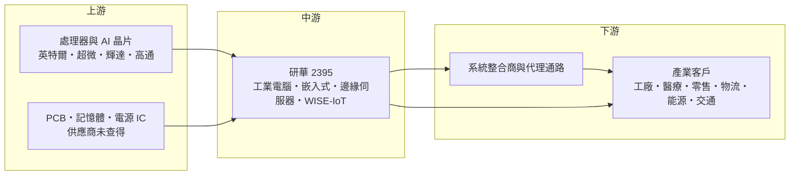

# 2395 研華

> 上市｜[[產業索引-電腦及週邊設備業|電腦及週邊設備業]]｜上市（櫃）日期 1999/12/13

# 第一章：企業模式與商業藍圖

> [!info] 撰寫說明
> 本文由 Claude 依公開資料整理，架構比照 [[2330台積電]] 的四章研究，資料截至 2026-10-07。財務數字來源：研華官網新聞稿（2025 年 EPS 與股利公告、2026 年第二季 EPS 公告）、工商時報、旺得富理財網、優分析、經濟日報、HiStock 嗨投資；產業描述為整理性內容，尚未逐條比對原始文件。#待校對

在評估單一個股的長期投資價值時，首要步驟是拆解企業的底層獲利邏輯。本章針對研華（股票代號：2395）的商業模式進行定性分析，說明一家工業電腦品牌如何把「少量多樣」的零散需求做成規模生意，以及它如何把定位從硬體延伸到邊緣 AI 平台。

## 一、核心定位：全球工業電腦龍頭，轉型為邊緣 AI 平台公司

研華由劉克振等人創立，1999 年上市，是全球規模最大的[[工業電腦]]（Industrial PC）品牌廠之一。研華的產品不是一般消費者使用的電腦，而是裝在工廠產線、醫療設備、零售終端、交通號誌、能源設施裡的嵌入式主機板、工業平板、邊緣伺服器與相關軟體平台。

工業電腦的特點是「少量多樣、長期供貨」：客戶可能只買幾百台，但要求產品穩定運作十年以上，並在長時間內保證同一規格可以持續供貨。研華靠著數萬種料號、遍布全球的業務據點與系統整合夥伴，把這種零散的需求做成規模生意。近年公司把定位從「硬體供應商」拉高到「Edge Computing & AI-Powered WISE Solutions」，也就是以[[邊緣運算]]硬體為基礎，加上 WISE-IoT 軟體平台，協助客戶導入 AI 與工業 [[IoT]] 應用。

## 二、終端應用與產品板塊：四大事業群

研華以產業與產品別劃分事業群。各事業群的精確營收比重本次未查得，因此不畫比重圖，以下依 2025 年法說會與 2026 年第二季報導整理成長率：

* **嵌入式事業群（Embedded）：** 包含嵌入式運算與周邊系統（EIoT）與應用電腦（ACG），提供工業主機板、[[模組電腦]]、邊緣 AI 平台給設備製造商，2025 年成長 10%，2026 年第二季年增 28%。
* **物聯網自動化事業群（IAutomation）：** 工廠自動化、能源與環境監控的控制器與 I/O，2025 年成長 12%，2026 年第二季年增 19%。
* **智能系統事業群（iSystems）：** 高階邊緣伺服器、網通與雲端基礎設施等，2025 年成長 32%，2026 年第二季年增 34%，是近期成長最快的板塊之一。
* **智能服務事業群（iService）：** 零售、醫療、物流等產業的終端與解決方案，2025 年成長 39%，2026 年第二季為個位數成長。工商時報報導零售業務因客戶對價格敏感而持平。

依工商時報報導，2026 年高階邊緣伺服器與雲端基礎設施業務年增超過 100%，Edge AI 運算平台維持 30% 至 50% 成長，機器人與 [[Physical AI]] 相關業務上半年成長 250%。

## 三、資本轉化邏輯：品牌與通路驅動的輕資產模式

* **輕資產：** 研華的核心價值在設計、料號管理與通路，生產以組裝為主，資本密集度低，[[毛利率]]長年接近四成。
* **全球布局：** 業務遍布北美、歐洲、中國、北亞（日、韓）、台灣與新興市場，2026 年第二季各地區分別年增 30%、29%、51%、24%、67%、32%。
* **產能吃緊：** 依工商時報報導，2026 年昆山廠[[產能利用率]]約 106% 至 110%、台灣約 105% 至 110%、日本約 95% 至 100%。

## 四、企業長期藍圖：Edge AI、產業解決方案與機器人

* **把 AI 推理延伸到邊緣：** 推出整合硬體與軟體工具的 Edge AI 平台，讓 AI 從雲端走進工廠、醫院、零售店。
* **深耕垂直市場：** 與系統整合商共同開發（Co-creation）五大垂直市場的產業解決方案。
* **機器人與 Physical AI：** 提供機器人控制器與運算平台。
* **訂單能見度：** 2026 年第二季整體[[接單出貨比]]（B/B ratio）達 1.44，北美更達 1.92，代表訂單能見度延伸到下半年。

# 第二章：護城河深度與競爭優勢

在長期價值投資中，「護城河」指企業抵禦競爭、維持超額利潤的保護機制。本章分析研華的護城河構成、全球主要競爭對手，以及這些優勢在邊緣 AI 時代能守住多少。

## 一、研華護城河的核心組成要素

研華的護城河屬於「寬護城河」，由五個要素組成：

* **1. 品牌與通路規模：** 研華在全球工業電腦市場深耕超過 40 年，擁有龐大的直銷與代理通路。工業客戶重視穩定性與長期供貨，品牌信任度本身就是門檻。
* **2. 產品廣度與長期供貨承諾：** 數萬種料號、可長達十年以上的供貨週期，讓客戶一旦把研華的主機板設計進設備（Design-in），換供應商就得重新驗證，轉換成本高。
* **3. 與晶片原廠的緊密合作：** 研華與 [[INTC英特爾]]、[[AMD超微]]、[[NVDA輝達]]、[[QCOM高通]] 等平台廠合作，新平台推出時能較早取得樣品並推出對應產品。
* **4. 軟體平台與生態系：** WISE-IoT 平台與 Edge AI 開發工具，加上系統整合夥伴網路，讓研華的價值不只是硬體規格。
* **5. 穩定的毛利率：** 近兩年毛利率維持在 38% 至 41% 之間，遠高於一般電腦代工廠，反映少量多樣產品的定價能力。

## 二、全球主要競爭對手格局

| 對手 | 定位 | 對研華的威脅 |
|---|---|---|
| [[6414樺漢]] | 集團旗下有德國 Kontron 等，工業電腦與系統整合 | 產品線部分重疊，透過併購擴大歐洲版圖 |
| [[6166凌華]]、[[8234新漢]]、[[6579研揚]]、[[3088艾訊]] | 國內工業電腦同業 | 在特定應用與價格帶競爭，規模較小 |
| 西門子、Kontron、congatec | 歐系工業自動化與嵌入式大廠 | 在工業控制與模組電腦領域直接競爭 |
| 伺服器品牌與代工廠 | 跨入邊緣伺服器 | 在高階邊緣運算以規模競爭（推估） |
| 中國本土工業電腦品牌 | 低價與國產化政策 | 在中國市場搶標案與價格敏感客戶 |

## 三、優勢轉化：哪些市場守得住、哪些守不住

* **守得住：** 長尾的嵌入式與自動化市場，訂單零散、規格多元，大型代工廠不容易以規模壓價切入；研華的通路與料號廣度是主要防線。
* **守不住：** 零售等對價格敏感的應用，以及中國本土工業電腦品牌的低價競爭；高階邊緣伺服器則需要面對伺服器大廠的規模優勢。
* **觀察重點：** 毛利率能否守住 38% 以上（2026 年第二季為 37.7%，較去年同期下滑）、Edge AI 與機器人業務能否持續高成長，以及關鍵料件缺貨是否影響交期。

# 第三章：財務體質與盈利規模

資料日期：2026-10-07。數字取自研華官網新聞稿與財經媒體、HiStock 嗨投資整理，最新月營收與三率請見[[#相關連結]]的公開資訊觀測站。#待校對

財務報表是檢驗護城河是否真實存在的最終標準。本章用三率、ROE、現金流與資本報酬，檢視研華在新一輪成長期的獲利品質。

## 一、獲利能力的基石：三率

| 項目 | 2025 全年 | 2025 Q4 | 2026 Q1 | 2026 Q2 |
|---|---|---|---|---|
| 營收（新台幣） | 708.82 億 | 179.21 億 | 約 203.9 億 | 261.26 億 |
| [[毛利率]] | 39.8% | 39.8% | 39.15% | 37.7% |
| [[營業利益率]] | 約 16.3%（依季資料推算） | 15.69% | 18.29% | 19.6% |
| EPS（元） | 12.25 | 3.58 | 3.85 | 5.20 |

* **營收與獲利：** 2025 年營收年增約 19%，稅後淨利 105.93 億元，年增 18%。2026 年第二季營收年增 46%、季增 28%，稅後淨利 45.18 億元，年增 127%；上半年營收 465.12 億元、EPS 9.05 元。2026 年 3 月單月營收 76.99 億元，創單月新高。
* **[[毛利率]]：** 從 39.8% 小幅降到 37.7%，可能來自料件成本上升或產品組合改變（高階邊緣伺服器毛利率可能較低，推估）。
* **[[營業利益率]]：** 營收放大帶來營運槓桿，營益率由 15.69% 升到 19.6%，抵銷了毛利率下滑。

## 二、[[ROE]]：資本效率

研華屬於品牌與設計導向的公司，生產以組裝為主，資本密集度低，營業利益率維持在 15% 至 20% 區間。高配息政策使帳上資本不會無限累積，有助於維持股東權益報酬率（精確數字未查得）。

## 三、資本支出與自由現金流

* **[[CapEx]]：** 本次未查得最新資本支出金額。台灣與昆山產能利用率均超過 100%，推估公司需要擴充產能或增加外包。
* **營運資金：** PCB、CPU、電源 IC 等關鍵料件短缺，公司以策略合作確保供料，可能使庫存與營運資金需求增加，短期壓抑[[自由現金流]]（推估）。
* **股利政策：** 2026 年 2 月宣布經常性現金配息率提高到 70% 至 80%，並啟動三年特別股利計畫，2026 至 2028 年每年自資本公積額外配發每股 2 元。2025 年度配發現金股利 9.2 元加特別股利 2 元，合計 11.2 元，配發率約 91.4%。2021 至 2024 年度現金股利分別約 7.98、9.99、9.45、8.39 元。

## 四、[[ROIC]] 與 [[WACC]]：價值創造利差

研華以低資本投入維持近四成毛利率與兩成上下的營益率，ROIC 長期明顯高於 WACC 的機率高（推估，具體數值未查得）。提高配息與發放特別股利，等於把多餘資本還給股東，在投入資本變小的情況下有助於維持 ROIC。需要觀察的是，若為了 Edge AI 與機器人擴大庫存與產能，投入資本增加的速度是否快於營業利益成長。

# 第四章：總體風險與地緣政治

任何企業都無法脫離宏觀環境獨立存在。本章分析研華未來必須面對的地緣政治、產業週期與營運風險。

## 一、地緣政治風險

* **中國市場與產能：** 中國占營收比重相當高，2026 年第二季中國營收年增 51%；同時昆山是主要生產基地。若美中關係惡化，研華同時面臨市場與供應鏈的雙重風險。
* **美國關稅：** 北美是成長最快的市場之一（第二季 B/B 1.92），若美國對台灣或中國製造的電子設備課徵高關稅，價格競爭力與毛利會受影響，研華可能需要調整出貨產地。
* **中國本土替代：** 中國推動工業控制設備國產化，本土工業電腦品牌可能在政府與國企標案中取得優勢。

## 二、產業週期與市場結構風險

* **製造業景氣循環：** 工業電腦需求與全球製造業投資高度相關，2024 年 EPS 曾因庫存調整下滑到 10.45 元。
* **AI 題材的波動：** 高階邊緣伺服器與 Physical AI 成長很快，但基期仍小，若 AI 投資降溫，高成長的部分會先受影響。
* **匯率：** 營收多以美元與其他外幣計價，新台幣升值會壓縮營收與毛利。

## 三、營運環境的隱性風險

* **料件短缺：** 工商時報報導 PCB、CPU、電源 IC 等料件短缺，交期可能延長到第四季，影響出貨節奏。
* **產能吃緊：** 主要工廠稼動率超過 100%，擴產或外包若跟不上，可能錯失訂單。
* **毛利率下滑：** 2026 年第二季毛利率 37.7%，低於過去兩年平均，需觀察原因。

## 四、科技演進風險

邊緣 AI 平台的核心晶片掌握在輝達、英特爾、高通等原廠手中，若原廠直接提供完整的參考設計或軟體平台，研華的附加價值可能被壓縮。研華需要靠軟體、產業解決方案與服務來維持差異化。

# 專有名詞解析

## 應用

- **[[Physical AI]]**：讓 AI 感知並操作實體世界的應用，例如機器人、自主移動車與智慧工廠設備。
- **[[IoT]]**：物聯網，讓設備透過網路連線並交換資料，工業物聯網用於設備監控與自動化。

## 金融

- **[[接單出貨比]]**：B/B ratio，新接訂單除以出貨金額，大於 1 代表訂單多於出貨，未來營收可望成長。
- **[[產能利用率]]**：實際產出占總產能的比例，超過 100% 代表加班或滿載生產。
- **[[毛利率]]**：毛利除以營收，反映產品本身的定價能力與成本控制。
- **[[營業利益率]]**：營業利益除以營收，反映扣除研發、管銷費用後的本業獲利能力。
- **[[ROE]]**：股東權益報酬率，稅後淨利除以股東權益，衡量公司運用股東資金的效率。
- **[[CapEx]]**：資本支出，用於購置廠房、設備等長期資產的支出。
- **[[自由現金流]]**：營業活動現金流減去資本支出，代表企業可自由用於配息、還債或併購的現金。
- **[[ROIC]]**：投入資本報酬率，衡量公司運用股東與債權人資金創造本業報酬的效率。
- **[[WACC]]**：加權平均資金成本，股東與債權人要求報酬率的加權平均，ROIC 高於它才算創造價值。

## 產業

- **[[工業電腦]]**：用於工廠、醫療、交通、能源等場域的電腦，強調長時間穩定運作、耐環境與長期供貨，而非最新效能。
- **[[邊緣運算]]**：在資料產生的現場（工廠、門市、車輛）就近運算，不必全部傳回雲端，可降低延遲與頻寬成本。
- **[[模組電腦]]**：把處理器、記憶體等核心做成標準化模組，設備商只需設計底板，縮短開發時程並方便升級。

# 核心供應鏈

## 1. 上游：晶片與零組件
- 處理器與 AI 晶片：[[INTC英特爾]]、[[AMD超微]]、[[NVDA輝達]]、[[QCOM高通]]
- PCB、記憶體、電源 IC 等料件：本次未查得具體供應商

## 2. 中游：研華本身
- 工業電腦、嵌入式主機板、邊緣伺服器、WISE-IoT 軟體平台

## 3. 下游：產業客戶與通路
- 設備製造商、工廠自動化、醫療、零售、物流、能源與交通等產業客戶
- 全球系統整合商與代理通路

## 4. 同業
- 國內工業電腦：[[6414樺漢]]、[[6166凌華]]、[[8234新漢]]、[[6579研揚]]、[[3088艾訊]]

## 最新新聞
<!-- news:start -->
<!-- news:end -->

## 相關連結
- [公開資訊觀測站](https://mopsov.twse.com.tw/mops/web/t05st03?step=1&firstin=1&co_id=2395)
- [Goodinfo](https://goodinfo.tw/tw/StockDetail.asp?STOCK_ID=2395)
- [Yahoo 股市](https://tw.stock.yahoo.com/quote/2395)
- [鉅亨網新聞](https://www.cnyes.com/twstock/2395/news)
