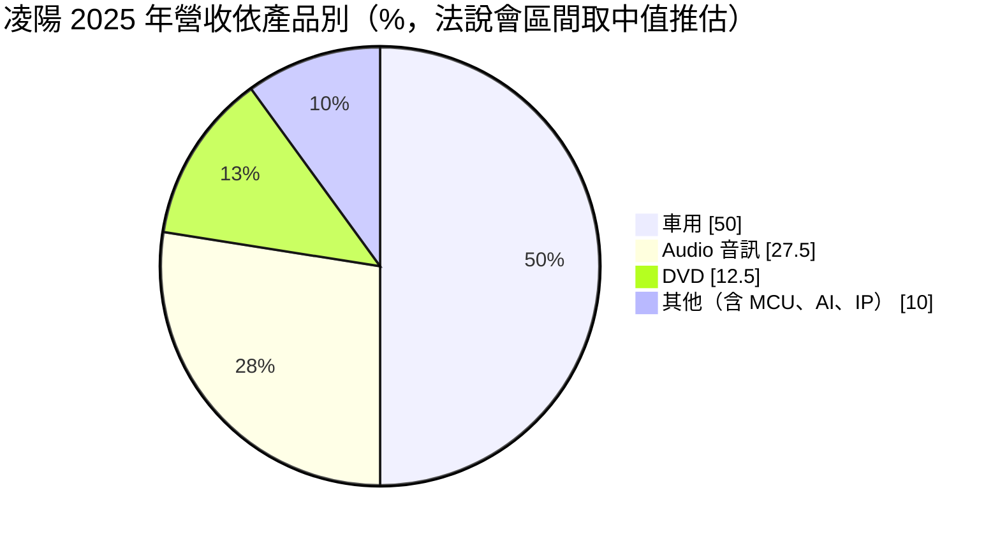
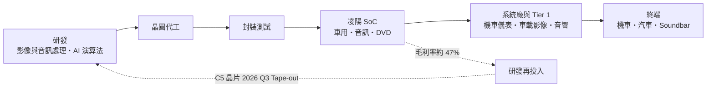
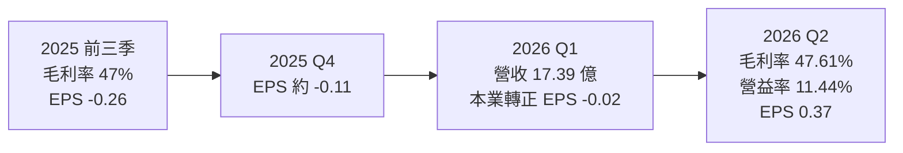
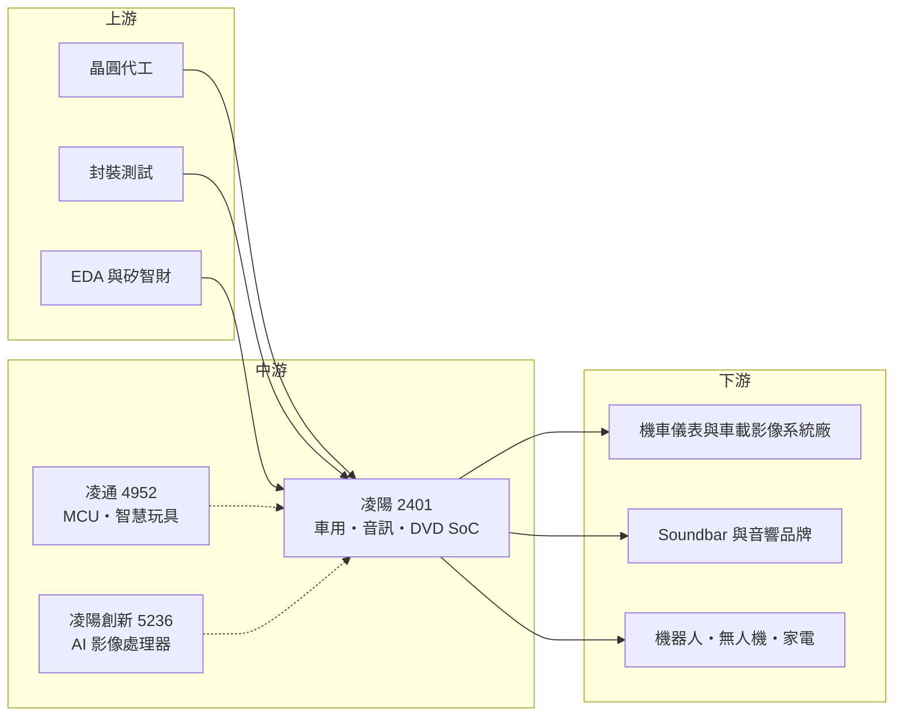

# 2401 凌陽

> 上市｜[[產業索引-半導體業|半導體業]]｜上市（櫃）日期 2000/01/27

# 第一章：企業模式與商業藍圖

> [!info] 撰寫說明
> 本文由 Claude 依公開資料整理，架構比照 [[2330台積電]] 的四章研究，資料截至 2026-10-07。財務數字來源：富果研究（2025 年 12 月 3 日法說會整理）、理財周刊（2026 年 5 月與 6 月）、nstock、winvest 營收快訊、MoneyLink 公司基本資料、工商時報舊報導（2021 年）；產業描述為整理性內容，尚未逐條比對原始文件。#待校對

在評估單一個股的長期投資價值時，首要步驟是拆解企業的底層獲利邏輯。本章針對凌陽科技（股票代號：2401，以下簡稱凌陽）的商業模式進行定性分析，說明這家以消費性多媒體晶片起家的 IC 設計公司，如何把重心轉向車用晶片，並以集團子公司分散產品線。

## 一、核心定位：以車用與音訊 SoC 為主的 IC 設計集團

凌陽成立於 1990 年，是台灣早期的消費性 IC 設計公司，過去以 DVD 播放器、數位相框與電子玩具晶片聞名。DVD 市場萎縮後，凌陽把資源轉向車用與音訊，目前車用晶片已占營收約一半。

凌陽是典型的 [[Fabless]] 公司，自己不擁有晶圓廠，產品以多媒體 [[SoC]] 為核心，強項是影像與聲音的訊號處理。集團架構如下：

* **凌陽本體：** 車用 SoC、音訊晶片、DVD 晶片與 AI 晶片。
* **[[4952凌通]]（持股約 48%）：** [[MCU]]、智慧玩具與 AI 演算法加值。
* **[[5236凌陽創新]]（持股約 57%）：** AI 影像處理器與高階 HPD。
* **景象科技（持股 100%）。**

因此凌陽的合併營收與獲利包含多家子公司，歸屬母公司的淨利會受少數股權比例影響。

## 二、終端應用／產品板塊：車用約五成

依 2025 年 12 月 3 日法說會，營收比重以區間揭露，下圖以區間中值繪製：

* **車用（約 50%）：** 依理財周刊整理，產品涵蓋智慧座艙、[[ADAS]]、[[DMS]] 駕駛監測、環景系統、電子後照鏡、HUD 與車內聲學系統。重點之一是兩輪車（機車）數位儀表晶片，並拓展東南亞（特別是馬來西亞）與外銷車市。
* **Audio 音訊（約 25% 至 30%）：** Soundbar、派對音響、電競音效與無線重低音，導入音訊邊緣 AI 感知與語音辨識。
* **DVD（約 10% 至 15%）：** 傳統產品，持續貢獻現金流但逐年萎縮。
* **AI 晶片與 [[IP]] 授權：** 法說會表示占比極低，但 C5 晶片是未來成長方向。

## 三、資本轉化邏輯（營運模式）：高毛利、高研發的 SoC 模式

* **高毛利：** 2025 年前三季[[毛利率]] 47%，2026 年第二季 47.61%，屬 IC 設計業中上水準，反映車用與音訊晶片的軟硬整合價值。
* **高研發：** 2025 年研發費用年增 5%，主要投入新一代 C5 晶片，使前三季出現虧損。
* **營運槓桿：** 2026 年營收回升後，第一季營業利益 1.36 億元轉正，第二季[[營業利益率]]升至 11.44%，顯示費用固定、營收成長時利潤放大的效果。

## 四、企業長期藍圖：C5 AI 晶片與海外車市

* **C5 晶片：** 法說會表示預計 2026 年第三季 [[Tape-out]]，2027 年貢獻營收。依理財周刊，C5 鎖定邊緣 AI 應用，包括掃地機器人、長照監護、無人機、自走機器人與車內 DMS 語音互動。
* **2026 年成長動能：** 兩輪車業務、外銷車市、東南亞市場與高單價音訊產品。
* **資金：** 2025 年底可動用資金約 56 億元，足以支應研發與潛在投資。

# 第二章：護城河深度與競爭優勢

在長期價值投資中，「護城河」指企業抵禦競爭、維持超額利潤的保護機制。本章分析凌陽的競爭優勢、國內外主要對手，以及這些優勢在車用與音訊市場能守住多少。

## 一、護城河的核心組成要素

凌陽的護城河屬「窄而穩」，由三項要素構成：

* **1. 車規驗證與長生命週期：** 車用晶片要經過[[車規驗證]]，且一款車型或機車儀表往往量產多年，客戶一旦導入很少更換。凌陽在 2021 年已打進一線車廠前裝與後裝供應鏈（工商時報 2021 年報導）。
* **2. 影音處理的軟硬整合：** 凌陽累積數十年影像與音訊演算法，提供晶片加軟體的完整方案，降低客戶開發門檻。
* **3. 兩輪車利基市場：** 機車數位儀表是大廠較少著墨的市場，凌陽在台灣與東南亞的機車產業有地緣與客戶關係優勢（推估）。

## 二、全球主要競爭對手格局

| 對手 | 定位 | 對凌陽的威脅 |
|---|---|---|
| [[2454聯發科]] | 車用座艙與多媒體 SoC 大廠 | 在高階智慧座艙以規模與先進製程競爭 |
| 瑞薩、恩智浦、德州儀器 | 國際車用 MCU 與處理器大廠 | 車用客戶關係深、產品線完整 |
| [[2379瑞昱]] | 音訊與網通晶片 | 在 Soundbar 與音訊晶片直接競爭 |
| 中國車用與音訊晶片業者 | 政策扶植、報價低 | 搶中國與東南亞中低階車用與音響訂單 |

## 三、優勢轉化：守得住／守不住／觀察重點

* **守得住：** 已量產的兩輪車儀表與車載影像方案，以及中高階音訊產品。
* **守不住：** DVD 與低階消費性晶片，市場萎縮且價格競爭激烈。
* **觀察重點：** C5 晶片能否如期 Tape-out 並在 2027 年取得量產訂單、東南亞機車市場的出貨量，以及營業利益率能否維持在雙位數。

# 第三章：財務體質與盈利規模

資料日期：2026-10-07。數字取自富果研究、理財周刊、nstock 與 winvest，表格是撰寫當時的快照；最新月營收、毛利率、累計 EPS 由自動排程寫在本筆記的屬性欄位（月營收、毛利率、累計EPS 等）。#待校對

財務報表是檢驗護城河是否真實存在的最終標準。本章用三率、ROE、現金流與資本報酬，檢視凌陽從 2025 年虧損回到獲利的過程。

## 一、獲利能力的基石：三率

| 項目 | 2025 全年 | 2025 Q4 | 2026 Q1 | 2026 Q2 |
|---|---|---|---|---|
| 營收（新台幣） | 63.03 億 | 約 15 億（推算） | 17.39 億 | 約 21.4 億（推算） |
| [[毛利率]] | 前三季 47% | 未查得 | 未查得 | 47.61% |
| [[營業利益率]] | 未查得 | 未查得 | 約 7.8%（推算） | 11.44% |
| EPS（元） | -0.37 | 約 -0.11（推算） | -0.02 | 0.37 |

註：第一季營業利益率以營業利益 1.36 億元除以營收 17.39 億元推算；第二季營收以 1 至 8 月累計 53.16 億元扣除 7、8 月與第一季推算。

* **[[毛利率]]：** 長期維持在 47% 上下，波動不大，代表產品定價穩定。
* **[[營業利益率]]：** 從 2025 年的虧損回升到 2026 年第二季 11.44%，主要來自營收成長帶動的營運槓桿。
* **[[淨利率]]與少數股權：** 2026 年第二季合併淨利率 16.85%，高於營業利益率，代表有業外收益；但歸屬母公司 EPS 只有 0.37 元，部分獲利屬於子公司的少數股東。
* **營收動能：** 2026 年 1 至 8 月累計營收 53.16 億元，年增 24.27%；8 月營收 6.88 億元，年增 40.95%。

## 二、[[ROE]]：資本效率

依 nstock，2026 年第二季單季 ROE 約 3.39%、ROA 約 2.49%，年化後約在一成上下（推估），已明顯優於 2025 年的負值。凌陽帳上現金充裕，股東權益中現金占比高，會拉低 ROE。

## 三、資本支出與自由現金流

* **[[CapEx]]：** 凌陽為 IC 設計公司，沒有晶圓廠，資本支出主要是研發設備與光罩，具體金額未查得。
* **[[自由現金流]]：** 未查得具體數字。2025 年底可動用資金約 56 億元，財務體質穩健。
* **股利：** 近五年平均現金股利 0.52 元；因 2025 年虧損，2025 年度未配發股利。

## 四、[[ROIC]] 與 [[WACC]]：價值創造利差

2025 年因研發費用增加與業外收益減少而虧損，ROIC 低於 WACC。2026 年營業利益率回到雙位數後，利差可望轉正（推估）。關鍵在於 C5 等新產品能否把研發投入轉成營收，否則高研發費用會持續壓抑資本報酬。

# 第四章：總體風險與地緣政治

任何企業都無法脫離宏觀環境獨立存在。本章分析凌陽未來必須面對的地緣政治、產業週期與營運風險。

## 一、地緣政治

* **中國市場：** 凌陽集團過去在中國有子公司與客戶，車用與消費性晶片在中國面臨本土替代壓力。
* **東南亞機會：** 東南亞機車市場與外銷車市是凌陽主打的成長方向，可分散對單一市場的依賴，但也受當地經濟與匯率影響。
* **供應鏈在地化：** 國際車廠推動供應鏈分散，台灣 IC 設計公司可能受惠於非中國供應來源的需求（推估）。

## 二、產業週期與市場結構

* **車用週期：** 汽車與機車銷量受景氣與利率影響，車用晶片庫存調整週期較長，一旦去化需要數季。
* **消費性音訊：** Soundbar 與音響屬消費性產品，需求受景氣與換機週期影響，[[長鞭效應]]明顯。
* **市場結構：** 車用座艙與 ADAS 晶片市場由國際大廠主導，凌陽集中在中低階與利基應用。

## 三、營運環境的隱性風險

* **研發失敗風險：** C5 晶片若延後或市場接受度不佳，大量研發費用將無法回收。
* **晶圓與封測成本：** 晶圓代工與封測漲價會壓縮毛利，2021 年凌陽曾預估漲價幅度 10% 至 20%（工商時報 2021 年報導），顯示成本轉嫁的需要。
* **子公司管理：** 凌通、凌陽創新等子公司的表現會影響合併報表與歸屬母公司淨利。

## 四、科技或法規演進

* **邊緣 AI：** 終端裝置開始要求內建 AI 推論能力，晶片需整合 NPU，研發門檻提高。
* **車輛安全法規：** 各國逐步要求 DMS 與 ADAS，對凌陽的車用影像產品是需求來源，但也需要通過功能安全認證。

# 專有名詞解析

## 半導體

- **[[Fabless]]**：無晶圓廠的 IC 設計公司，只負責設計，製造委外給晶圓代工廠。
- **[[SoC]]**：系統單晶片，把處理器、記憶體控制、介面等多種功能整合在一顆晶片上。
- **[[MCU]]**：微控制器，把處理器、記憶體與輸入輸出介面整合在一顆晶片上，用於家電、量測儀器與工控設備。
- **[[IP]]**：矽智財，可重複授權給其他晶片設計公司使用的電路設計模組。
- **[[Tape-out]]**：設計定案，晶片設計完成後交付晶圓廠製作光罩，是量產前的重要里程碑。
- **[[NPU]]**：神經網路處理器，專門加速 AI 推論運算的處理單元。

## 應用

- **[[ADAS]]**：先進駕駛輔助系統，包括車道維持、自動緊急煞車等功能。
- **[[DMS]]**：駕駛監控系統，以攝影機偵測駕駛是否分心或疲勞，是車輛安全法規逐步要求的配備。
- **[[車規驗證]]**：車用晶片須通過 AEC-Q100 等可靠度測試與車廠認證，流程常需 2 至 3 年，因此轉換成本高。
- **[[邊緣AI]]**：在終端裝置或現場設備上直接執行 AI 推論，不必把資料傳回雲端，延遲低、隱私較佳。

## 金融

- **[[營運槓桿]]**：固定成本占比高時，營收小幅變動會造成利潤較大幅度變動的現象。
- **[[毛利率]]**：營業毛利占營收的比例，反映產品定價能力與成本結構。
- **[[營業利益率]]**：營業利益占營收的比例，反映扣除營業費用後本業的獲利能力。
- **[[淨利率]]**：稅後淨利占營收的比例，包含業外損益與所得稅的影響。

# 核心供應鏈

## 1. 上游：晶圓代工、封測與設計工具
- 晶圓代工：[[2330台積電]]、[[2303聯電]]（推估，未查得實際比重）
- EDA 工具：[[SNPS新思科技]]、[[CDNS益華電腦]]
- 封裝測試：供應商未查得

## 2. 中游：凌陽本身與子公司
- MCU 與智慧玩具：[[4952凌通]]
- AI 影像處理器：[[5236凌陽創新]]
- 景象科技（100% 持股）

## 3. 下游：主要客戶類型
- 兩輪車數位儀表、車載影像與 DMS 系統廠（台灣、東南亞）
- Soundbar、派對音響與電競音效品牌
- C5 晶片目標：掃地機器人、無人機、自走機器人、長照監護設備

## 4. 同業
- 車用與多媒體 SoC：[[2454聯發科]]
- 音訊晶片：[[2379瑞昱]]
- MCU：[[6202盛群]]、[[4919新唐]]

## 最新新聞
<!-- news:start -->
<!-- news:end -->

## 相關連結
- [公開資訊觀測站](https://mopsov.twse.com.tw/mops/web/t05st03?step=1&firstin=1&co_id=2401)
- [Goodinfo](https://goodinfo.tw/tw/StockDetail.asp?STOCK_ID=2401)
- [Yahoo 股市](https://tw.stock.yahoo.com/quote/2401)
- [鉅亨網新聞](https://www.cnyes.com/twstock/2401/news)
