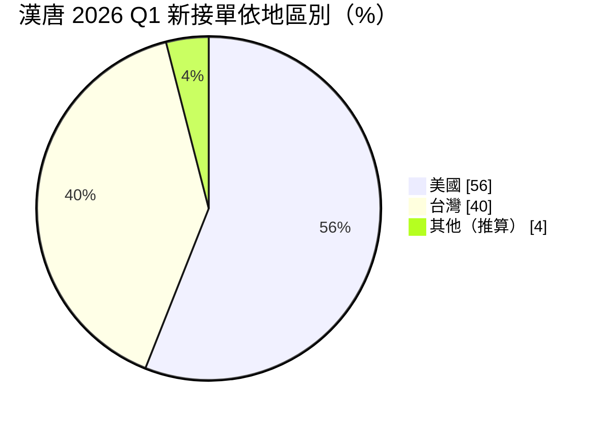
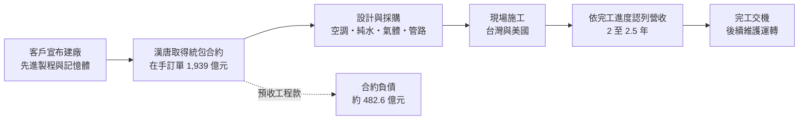
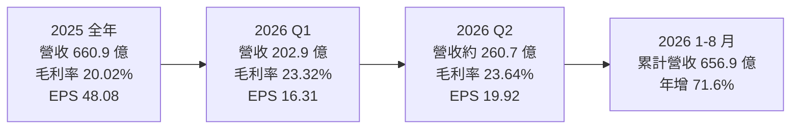
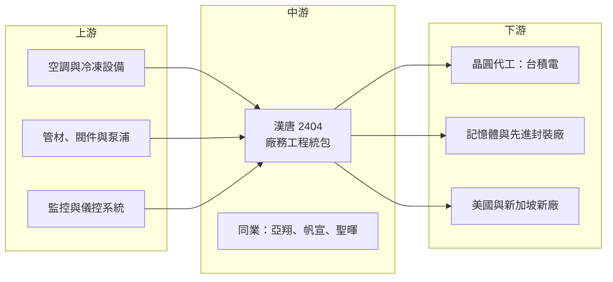

# 2404 漢唐

> 上市｜[[產業索引-其他電子業|其他電子業]]｜上市（櫃）日期 2000/03/14

# 第一章：企業模式與商業藍圖

> [!info] 撰寫說明
> 本文由 Claude 依公開資料整理，架構比照 [[2330台積電]] 的四章研究，資料截至 2026-10-07。財務數字來源：方格子 2026 年 6 月法說會整理、富果研究 2026 年 6 月法說會整理、NOWnews 2026 年 6 月報導、NStock 公司介紹、科技新報 2026 年 8 月營收報導、Yahoo 股市公司基本資料；產業描述為整理性內容，尚未逐條比對原始文件。#待校對

在評估單一個股的長期投資價值時，首要步驟是拆解企業的底層獲利邏輯。本章針對漢唐集成（股票代號：2404，以下簡稱漢唐）的商業模式進行定性分析，說明一家無塵室工程公司為何能隨著台積電全球擴廠，[[在手訂單]]累積到近兩千億元，並把營運重心延伸到美國。

## 一、核心定位：半導體廠務工程的統包商

漢唐成立於 1982 年 9 月 13 日，2000 年上市，董事長為李惠文。公司承攬半導體、光電等高科技廠房的整廠規劃、[[無塵室]]、機電、儀控、[[特殊氣體]]與化學品供應系統，以及完工後的維護運轉，另有小部分醫療器材業務。

晶圓廠的建廠分成兩大部分：建築結構由營造廠負責，廠房內部讓製程能運作的環境系統，包括無塵室、空調、[[超純水]]、氣體、化學品管路與監控，則由[[廠務工程]]公司負責。漢唐屬於後者，且長期是 [[2330台積電]] 廠務工程的主要承包商之一。

* **與客戶擴產同步：** 漢唐的營收來自客戶建廠，台積電與記憶體廠的資本支出就是它的訂單來源。
* **統包模式：** 漢唐以[[統包工程]]方式承攬，從設計、採購到施工整合，工程利潤取決於成本控管與工期管理。

## 二、終端應用板塊：先進製程與美國專案

漢唐的業務以半導體晶圓代工與記憶體廠的無塵室與機電系統工程為主，公司未揭露業務別比重。依 NOWnews 報導，2026 年第一季新接單的地區分布如下（新接單比重，不是營收比重；其他為推算）：

* **台灣：** 先進製程與[[先進封裝]]廠的廠務工程，包括 2 奈米與 [[CoWoS]] 相關廠房。
* **美國：** 隨台積電亞利桑那廠擴建，美國專案大幅成長。公司預期 2026 年美國營收占比約五成，美國二期專案完工進度已超過 50%，年底前預計達 80% 至 90%。
* **其他海外：** 新加坡專案預計 2026 年內完成。

## 三、資本轉化邏輯：在手訂單轉為營收

* **訂單能見度高：** 截至 2026 年 5 月底，未認列在手合約約 1,939 億元，約為 2025 年營收的 2.9 倍，預計在未來 2 至 2.5 年內陸續認列，2026 年內認列超過一半。
* **依完工比例認列：** 工程營收依進度認列，毛利在專案後期結算時可能出現調整。
* **輕資產、預收款：** [[合約負債]]約 482.64 億元，代表客戶預付大量工程款，漢唐不需投入大量自有資金，屬於典型的輕資產工程業。

## 四、企業長期藍圖：跟著 AI 建廠潮全球布局

* **擴張期延續到 2029 年：** 公司在 2026 年 6 月法說會表示，AI 晶片與高速記憶體需求帶動的建廠潮，預期延續到 2029 年。
* **海外人力：** 集團人力約 1,700 人，台灣 900 多人、海外 800 多人，人力是承接更多專案的最大限制。
* **技術升級：** 2 奈米等先進製程的廠房設施密度更高，對廠務系統的設計與施工整合要求提升，有利於有經驗的統包商。

# 第二章：護城河深度與競爭優勢

在長期價值投資中，「護城河」指企業抵禦競爭、維持超額利潤的保護機制。本章分析漢唐的護城河構成、主要競爭對手，以及這些優勢在客戶壓價與人力短缺下能守住多少。

## 一、漢唐護城河的核心組成要素

漢唐屬於「中等護城河」，由三個要素組成：

* **1. 與主要客戶的長期合作：** 先進製程廠房的廠務規格高度客製，漢唐長年參與台積電建廠，熟悉其標準與流程，新廠往往延用相同團隊。
* **2. 統包整合能力：** 無塵室、空調、純水、氣體與監控系統要同時施工、彼此協調，能整合多個系統並準時交機的公司有限。
* **3. 海外執行經驗：** 美國建廠的法規、工會與供應鏈環境與台灣不同，已累積美國專案經驗的公司，在後續擴建中較有優勢。

## 二、主要競爭對手格局

| 對手 | 定位 | 對漢唐的威脅 |
|---|---|---|
| [[6139亞翔]] | 台灣無塵室與機電工程大廠 | 同樣承接半導體廠務工程，在台灣與海外直接競爭 |
| 其他空調與機電工程廠 | 機電與空調次系統 | 分包部分系統，壓縮統包利潤 |
| [[6196帆宣]] | 半導體設備與廠務系統整合 | 在氣體、化學品供應系統重疊 |
| [[5536聖暉]] | 無塵室工程 | 在中小型專案與海外市場競爭 |
| 美國與日本工程公司 | 美日在地工程商 | 在美國與日本的在地專案爭取份額 |

## 三、優勢轉化：哪些市場守得住、哪些守不住

* **守得住：** 台積電先進製程與先進封裝廠的整廠廠務工程，以及已在進行中的美國擴建專案。
* **守不住：** 一般性的機電次系統工程，價格競爭激烈；客戶在建廠潮高峰後，也可能要求降價。法說會也提到客戶會要求分享效能提升的紅利。
* **觀察重點：** 美國專案的毛利率能否維持、新接單金額能否持續補上認列的訂單，以及人力是否足以支撐更多同時進行的專案。

# 第三章：財務體質與盈利規模

資料日期：2026-10-07。數字取自法說會整理（方格子、富果研究）、NOWnews 與 NStock，表格是撰寫當時的快照；最新月營收、毛利率、累計 EPS 由自動排程寫在本筆記的屬性欄位（月營收、毛利率、累計EPS 等）。#待校對

財務報表是檢驗護城河是否真實存在的最終標準。本章用三率、ROE、現金流與資本報酬，檢視漢唐在建廠循環中的獲利品質。

## 一、獲利能力的基石：三率

| 項目 | 2025 全年 | 2026 Q1 | 2026 Q2 |
|---|---|---|---|
| 營收（新台幣） | 660.93 億 | 202.88 億 | 約 260.7 億（依月營收推算） |
| [[毛利率]] | 20.02% | 23.32% | 23.64% |
| [[營業利益率]] | 未查得 | 19.57% | 19.96% |
| 稅後淨利 | 91.65 億 | 30.81 億 | 約 38 億（推算） |
| EPS（元） | 48.08 | 16.31 | 19.92 |

* **[[毛利率]]：** 從 2025 年的 20.02% 升到 2026 年上半年 23% 以上。依法說會整理，美國子公司的利潤率較高，美國專案占比提升是毛利率改善的主因。
* **[[營業利益率]]：** 工程公司的管理費用相對固定，營收放大時營益率接近毛利率，2026 年第二季達 19.96%。
* **[[淨利率]]：** 2026 年第二季約 14.44%。

## 二、[[ROE]]：資本效率

漢唐股本約 19.06 億元，2025 年稅後淨利 91.65 億元，加上高配息使權益不會無限累積，ROE 推估處於高檔（具體數值未查得）。高 ROE 的來源是輕資產模式與客戶預收款，而非財務槓桿。

## 三、資本支出與自由現金流

* **[[CapEx]]：** 工程公司幾乎不需要大型廠房設備，資本支出很低（具體金額未查得）。
* **[[自由現金流]]：** 合約負債約 482.64 億元、合約資產約 93.37 億元，代表預收款遠大於已施工未請款的金額，營業現金流通常充裕。
* **股利：** 2025 年度配發現金股利 40 元，配發率約 83%，近五年配發率在 70% 至 89% 之間。

## 四、[[ROIC]] 與 [[WACC]]：價值創造利差

由於客戶預收款支應大部分營運資金，漢唐的投入資本很低，ROIC 推估遠高於 WACC。這種模式的風險不在資本，而在專案執行：若工期延誤或成本超支，獲利會在單一專案上大幅波動。

# 第四章：總體風險與地緣政治

任何企業都無法脫離宏觀環境獨立存在。本章分析漢唐未來必須面對的地緣政治、產業週期與營運風險。

## 一、地緣政治風險

* **美國建廠政策：** 美國半導體補助、關稅與在地化要求帶動台積電赴美擴廠，是漢唐美國業務的來源；若政策轉向或客戶放慢美國投資，美國營收會受影響。
* **台灣集中：** 客戶的主要產能與漢唐的總部都在台灣，面臨兩岸風險。

## 二、產業週期與市場結構風險

* **客戶集中：** 營收高度依賴台積電等少數半導體大廠的資本支出，客戶擴產步調決定漢唐的接單。
* **建廠週期：** 半導體資本支出具週期性，2029 年以後若建廠潮退燒，訂單可能大幅下滑；工程業的營收落後客戶資本支出 1 至 2 年。
* **[[長鞭效應]]：** AI 需求變化會沿供應鏈放大到晶圓廠擴產計畫，最後反映在廠務工程訂單。

## 三、營運環境的隱性風險

* **人力短缺：** 法說會指出人力是最大痛點，台灣缺工甚至比美國嚴峻，影響可同時承接的專案數。
* **工程延誤與成本超支：** 延誤會增加間接費用並壓縮專案獲利；美國的人工與材料成本較高，報價失準的影響更大。
* **毛利收斂：** 客戶可能要求分享效率提升的紅利，壓縮工程利潤。

## 四、科技或法規演進風險

先進製程對無塵室潔淨度、震動控制、氣體與化學品純度的要求逐代提高，廠務設計必須跟上。各國的環保、職安與建築法規不同，海外專案需要額外的合規成本；淨零排放要求也讓節能、節水與廢氣處理成為新的設計重點。

# 專有名詞解析

## 半導體

- **[[先進封裝]]**：把多顆晶片以中介層、混合鍵合等方式高密度整合的封裝技術，例如 CoWoS、SoIC。
- **[[CoWoS]]**：台積電的 2.5D 先進封裝技術，把 GPU 與 HBM 並排放在矽中介層上，是 AI 晶片的關鍵封裝。

## 金融

- **[[在手訂單]]**：已簽約但尚未認列為營收的工程金額，代表未來數年的營收能見度。
- **[[合約負債]]**：客戶已預付、但公司尚未完成工程的款項，在資產負債表上列為負債。
- **[[CapEx]]**：資本支出，企業購買土地、廠房與設備的支出。
- **[[自由現金流]]**：營業活動現金流減去資本支出，代表企業可自由用於配息、還債或併購的現金。
- **[[長鞭效應]]**：終端需求的小幅變動，沿供應鏈往上游傳遞時被逐級放大，造成上游庫存與訂單劇烈波動。

## 產業

- **[[無塵室]]**：控制空氣中微粒、溫濕度與壓力的密閉空間，半導體製程必須在高等級無塵室中進行。
- **[[廠務工程]]**：晶圓廠內支援製程運作的基礎設施工程，包括空調、純水、氣體、化學品供應與電力。
- **[[統包工程]]**：由單一承包商負責設計、採購與施工整合的工程模式，英文常稱 EPC 或 Turnkey。
- **[[特殊氣體]]**：半導體製程使用的高純度或有毒、易燃氣體，需要專門的供應與監控系統。
- **[[超純水]]**：去除幾乎所有離子與微粒的水，用於晶圓清洗，晶圓廠用量龐大。

# 核心供應鏈

## 1. 上游：設備與材料
- 空調、管材、閥件、泵浦與監控系統：供應商未揭露

## 2. 中游：廠務工程同業
- [[6139亞翔]]、[[6196帆宣]]、[[5536聖暉]]

## 3. 下游：客戶
- 晶圓代工：[[2330台積電]]（台灣與美國亞利桑那廠）
- 記憶體與先進封裝廠：客戶名稱未逐一揭露

延伸閱讀：[[台積電供應鏈]]

## 供應鏈關係
- 供應給 [[2330台積電]]：無塵室機電整合工程（台積電供應鏈 › 上游：台灣建廠、無塵室與廠務系統）

## 最新新聞
<!-- news:start（自動產生，請勿手動編輯此範圍） -->
- 2026-10-09 📰 媒體 06:07｜世紀聯手劇本急轉彎！馬斯克冷回台積電只配分租「漢唐、帆宣、亞翔還能買？」法人翻開這張海外王牌：實質營運根本沒傷｜[旺得富理財網](https://news.google.com/rss/articles/CBMiakFVX3lxTE9UZ0JuZjdxektnQldXbTJjV19hYjNQSzdZMFRBVGVwQ0ZHeXcxM1oxWE0yS01hNFpSYXBCS2pkMlFndDZieDhFMlBzMnJvNzQ2RDJVVEx3SGthd0I2cGhLUU8xZFZzR1BRR2c?oc=5)
- 2026-10-08 📰 媒體 11:44｜漢唐、亞翔、帆宣誰最有戲？「它」手握1578億大單法人目標價一口氣升34％：能見度看到2028 - 上市櫃｜[旺得富理財網](https://news.google.com/rss/articles/CBMiakFVX3lxTE1vZ190OTdwRXJEdFhJZ2hGTUNfWlZzVkNfLXVEREhaWFc2TWEzTmdONUpPNTVDTThkX0JMX0hvSmVWNThWalQ1eUV4dFdwTGlEU1c1c0lGM2NmYnFuT0o4MkUzTWFuek55WHc?oc=5)
- 2026-10-05 📰 媒體 10:23｜建廠需求燒 亞翔、漢唐訂單滿手 ［工商時報］｜[富聯網](https://news.google.com/rss/articles/CBMihgFBVV95cUxPT3B1bFBvM0FLVFlIdmJ5bUZ1Uk9iQ1lXU1Ata2N6WmRJcnBTWWtLend6ZW5lRnZkT1NzaXR2QTM0cmNQM1N6QlQ3eFJzY1FMMHVtRkhVWEpidG01eVNBTTZFbG9BQ2hUYzZpWVhNVHZxc0oxRWFvV3NrcnVMMllnUFVRSVQyUQ?oc=5)
- 2026-10-05 📰 媒體 08:12｜《盤前掃瞄-基本面》大立光強化CPO布局；亞翔、漢唐訂單滿手｜[富聯網](https://news.google.com/rss/articles/CBMiiAFBVV95cUxPaGdsQTlhQ2VzczN2WVRvQTVMRWpXMjhfTzhCeVBrM0lLNTNxclR0OHNWa1FndHA5dzU4c2NpcnBUbTNWcDVjc0pYODV3ZWNRb0lQVi1kNnM4T0RIN0Y1eEp5bjBYcDZIM2NtSWZudW1GaUZCRkpMOFd2bHpBZE9PQWtMcDBURU5D?oc=5)
- 2026-10-05 📰 媒體 03:00｜建廠需求燒亞翔、漢唐訂單滿手- 日報｜[工商時報](https://news.google.com/rss/articles/CBMiX0FVX3lxTE9mQUlWLWdCS2RUZkxqeTQ2S3NnQVhiZEMxVDJPSk5WaWFVVmRKX0had1V3N2huZUs3ZDBubkZJT3htcnEtTDhOdExpdWtXYmxVUUM1RlRTbU5fRmtEa2Z3?oc=5)

完整紀錄：[[2404漢唐 新聞]]
<!-- news:end -->

## 相關連結
- [公開資訊觀測站](https://mopsov.twse.com.tw/mops/web/t05st03?step=1&firstin=1&co_id=2404)
- [Goodinfo](https://goodinfo.tw/tw/StockDetail.asp?STOCK_ID=2404)
- [Yahoo 股市](https://tw.stock.yahoo.com/quote/2404)
- [鉅亨網新聞](https://www.cnyes.com/twstock/2404/news)
