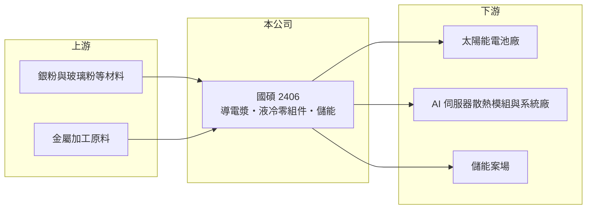

# 2406 國碩

> 上市｜[[產業索引-光電業|光電業]]｜上市（櫃）日期 2000/04/29

# 第一章：企業模式與商業藍圖

> [!info] 撰寫說明
> 精簡版，由 Claude 依公開資料整理，架構比照 [[2330台積電]]，資料截至 2026-10-07。來源：理財周刊、winvest 營收快訊。#待校對

國碩已從光碟廠轉型為控股型態，透過子公司經營綠能材料、AI 散熱零組件與[[儲能]]三條業務。

- **核心業務：** 國碩早年以光碟起家，目前透過子公司經營太陽能[[導電漿]]，並跨入 AI 伺服器[[液冷散熱]]管接件與零組件加工、測試服務。
- **營收結構：** 2026 年第一季營收大增的兩大來源是子公司太陽能導電漿出貨放量，以及 AI 伺服器液冷管接件與零組件需求急增；確切比重未查到。
- **營運據點：** 總部在台灣，導電漿子公司推估為 [[3691碩禾]]，銷售對象以亞洲太陽能電池廠為主。
- **長期方向：** 公司定位為「綠能＋AI 散熱＋儲能」三引擎，與工研院合作冷板散熱技術，並於 2025 年底與 [[6873泓德能源]] 成立儲能平台「星國電力」，首個案場 100MW。

# 第二章：護城河深度與競爭優勢

國碩的優勢在於同時站上 AI 散熱與能源轉型兩條成長主線，但在各領域都不是龍頭。

- **競爭優勢：** 同時握有導電漿材料技術與液冷零組件加工能力，可搭上 AI 散熱與能源轉型兩條成長主線。
- **主要對手：** AI 散熱領域有 [[3017奇鋐]]、[[3324雙鴻]]、[[3653健策]] 等大廠；導電漿則面對國際材料大廠與中國同業競爭。
- **觀察重點：** 營收高成長能否轉化為穩定獲利、液冷零組件客戶擴展情況，以及儲能案場的建置進度。

# 第三章：財務體質與盈利規模

資料日期：2026-10-07，表格是撰寫當時的快照；最新月營收、毛利率、累計 EPS 由自動排程寫在本筆記的屬性欄位（月營收、毛利率、累計EPS 等）。#待校對

國碩營收在 2026 年大幅成長，但獲利尚未跟上營收的腳步。

- **營收規模：** 2025 年全年營收 63.72 億元；2026 年第一季營收 27.24 億元，年增約 169%；7、8 月營收分別為 9.98 億、9.71 億元，8 月年增約 86%。
- **獲利：** 2025 年全年 EPS -0.92 元；2025 年第四季 EPS 約 0 元，[[毛利率]] 回升至 11.28%。2026 年 EPS 這次未查到。
- **財務特色：** 營收規模快速放大，但毛利率偏低，獲利仍在由虧轉盈的過程。

# 第四章：總體風險與地緣政治

國碩的風險集中在導電漿的價格競爭、銀價波動，以及儲能投資帶來的財務負擔。

- **產業週期：** 太陽能材料受全球光電裝機與中國產能價格戰影響；AI 散熱需求則跟隨雲端業者 [[CapEx]] 循環。
- **營運風險：** 導電漿價格競爭激烈、毛利薄；液冷零組件若無法打進主要供應鏈，成長可能放緩。
- **其他風險：** 銀等原物料價格波動直接影響導電漿成本與營收；儲能投資金額大，需留意財務負擔。

# 專有名詞解析

## 應用

- **[[導電漿]]**：以銀粉為主、印在太陽能電池表面形成電極的材料，成本與銀價高度連動。

## 產業

- **[[液冷散熱]]**：以冷卻液流經冷板帶走晶片熱量的散熱方式，是高功耗 AI 伺服器的主流方案。
- **[[儲能]]**：以電池系統儲存電力、在需要時放電，用於電網調頻與再生能源平滑。

# 核心供應鏈

- 上游：銀粉與玻璃粉等材料、金屬加工原料
- 下游／客戶：太陽能電池廠、AI 伺服器散熱模組與系統廠、儲能案場
- 同業：[[3691碩禾]]、[[3017奇鋐]]、[[3324雙鴻]]、[[3653健策]]

## 最新新聞
<!-- news:start（自動產生，請勿手動編輯此範圍） -->
- 2026-10-07 🏛️ 重訊 20:27｜公告子公司禾迅綠電(股)公司115年現金增資調整發行股 數及延長特定人繳款期間之補償方案｜[觀測站](https://mops.twse.com.tw/mops/#/web/t05st01)

完整紀錄：[[2406國碩 新聞]]
<!-- news:end -->

## 相關連結
- [公開資訊觀測站](https://mopsov.twse.com.tw/mops/web/t05st03?step=1&firstin=1&co_id=2406)
- [Goodinfo](https://goodinfo.tw/tw/StockDetail.asp?STOCK_ID=2406)
- [Yahoo 股市](https://tw.stock.yahoo.com/quote/2406)
- [鉅亨網新聞](https://www.cnyes.com/twstock/2406/news)
