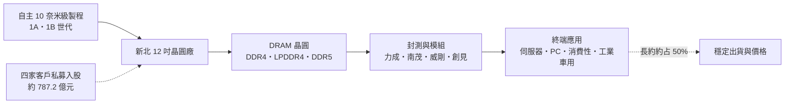
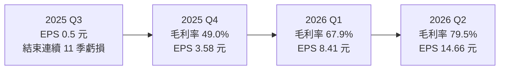
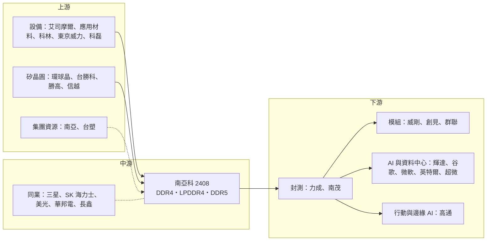

# 2408 南亞科

> 上市｜[[產業索引-半導體業|半導體業]]｜上市（櫃）日期 2000/08/17

# 第一章：企業模式與商業藍圖

> [!info] 撰寫說明
> 本文由 Claude 依公開資料整理，架構比照 [[2330台積電]] 的四章研究，資料截至 2026-10-07。財務數字來源：南亞科 2025 年第四季、2026 年第一季與第二季自結財報與法說會相關報導（科技新報、優分析、中央社、旺得富、永豐金證券豐雲學堂）；產業描述為整理性內容，尚未逐條比對原始文件。#待校對

在評估單一個股的長期投資價值時，首要步驟是拆解企業的底層獲利邏輯。本章針對南亞科技（股票代號：2408，以下簡稱南亞科）的商業模式進行定性分析，說明一家規模遠小於三大廠的 DRAM 製造商，如何在 AI 帶動的記憶體短缺中取得爆發性獲利，以及它正在嘗試的轉型方向。

## 一、核心定位：台灣唯一自有技術的 DRAM 製造商

南亞科是台塑集團旗下的記憶體公司，總部與晶圓廠位於新北市泰山與林口一帶，是台灣主要的 [[DRAM]]（動態隨機存取記憶體）製造商。南亞科屬於 [[IDM]] 型態：自行開發製程技術、自有晶圓廠生產、自有品牌銷售，產品包括 [[DDR4]]、[[DDR5]]、LPDDR4、LPDDR5 等標準與[[利基型記憶體]]。

全球 DRAM 市場由 [[005930三星電子]]、SK 海力士、美光三大廠寡占，南亞科規模約為第四名之後，市占率遠低於三大廠。這個定位帶來兩個特性：

* **技術跟隨轉為自主：** 過去南亞科依賴與美光的技術授權，近年轉為完全自主開發 10 奈米級製程（1A、1B 世代），並規劃 1C、1D、1E 世代與 [[EUV]] 製程，目標是擺脫「技術跟隨者」的角色。
* **價格接受者：** 規模小、產品偏標準化，南亞科難以影響市場價格，獲利高度取決於 DRAM 報價的漲跌。

## 二、終端應用／產品板塊：DDR4 與 LPDDR4 仍是主力

南亞科未公布完整的產品別營收比重，本次查得的資料如下（因比重不完整，不繪製圓餅圖）：

* **標準型與利基型 DRAM：** DDR4、LPDDR4 仍是主力，財經報導引述投顧資料指出，DDR4 與 LPDDR4 合計約占產品組合近七成；依中央社報導，DDR5 約占營收一成，公司表示可以彈性調整。
* **應用分布：** 南亞科的產品用於伺服器、PC、消費性電子（電視、機上盒、網通）、工業與車用。2026 年第二季 AI 基礎建設與伺服器相關產品占營收超過 20%。
* **客製化 AI 記憶體：** 南亞科推出客製化超寬 I/O（[[UWIO]]）記憶體方案，已開始貢獻營收。國泰投顧報告提到南亞科已打入高通的 HBC 記憶體供應鏈，聚焦 LPDDR5 的 [[TSV]] 堆疊製程。LPDDR5 產品預計下半年進行驗證。

三大廠把產能轉向 [[HBM]] 與 DDR5 後，DDR4、LPDDR4 等舊規格供給減少，南亞科以舊規格為主的產品組合，反而在本波短缺中成為優勢。

## 三、資本轉化邏輯：價格槓桿加上客戶入股

* **固定成本高、價格決定一切：** DRAM 廠的折舊與人事成本相對固定，售價上漲時增加的營收幾乎全部轉為利潤。2026 年第二季平均售價再季增超過 60%、出貨量持平，毛利率達 79.5%。
* **客戶入股：** 2026 年 4 月 8 日完成私募，向四家主要客戶募得約 787.2 億元，私募後客戶合計持股約 10.19%。這種「客戶入股」的模式把南亞科與下游客戶的長期供貨關係綁在一起，也讓客戶分擔擴產資金。
* **[[長約]]：** 依中央社報導，長期合約目前約占訂單 50%，有助於降低 DRAM 現貨價格波動的衝擊。

產能方面，南亞科的晶圓廠集中在台灣，現有 12 吋產能位於新北市。新建晶圓廠預計 2027 年第一季開始裝機，第一階段規劃 2028 年月產能達 3 萬片、2029 年 3.6 萬片，滿載約 4.5 萬片。依法說會報導，新廠總資本支出約 4,800 億元，目前已投入不到 1,000 億元。

## 四、企業長期藍圖：從利基型走向 AI 記憶體

* **技術自主：** 持續開發第三到第五代 10 奈米級製程與 EUV，提升位元密度與成本競爭力。產品面已完成 128GB DDR5 RDIMM 模組測試，單顆晶粒速度達 7200 Mb/s。
* **新廠放大規模：** 新廠滿載後月產能約 4.5 萬片，將大幅提高南亞科的位元產出與規模經濟。
* **AI 客製化記憶體：** 透過 UWIO 與 TSV 堆疊等技術，切入[[邊緣 AI]] 與行動 AI 所需的高頻寬記憶體需求，但不直接與三大廠在 HBM 正面競爭。
* **與客戶綁定：** 私募入股與長約並行，目標是讓下一次景氣下行時，出貨量與價格不至於像過去那樣劇烈崩跌。

# 第二章：護城河深度與競爭優勢

在長期價值投資中，「護城河」指企業抵禦競爭、維持超額利潤的保護機制。本章分析南亞科的護城河構成、全球主要競爭對手，以及這些優勢在 DRAM 價格循環中能守住多少。

## 一、南亞科護城河的核心組成要素

DRAM 是高度標準化的商品，南亞科的護城河屬於「窄護城河」，由四個要素組成：

* **1. 自主技術與製造能力：** 能自行開發 10 奈米級 DRAM 製程的公司全球只有少數幾家，進入門檻極高，需要長期的研發累積與巨額資本。
* **2. 利基型市場的供貨穩定性：** 三大廠把產能轉向 HBM 與 DDR5 後，DDR4、LPDDR4 等舊規格供給減少，南亞科成為工業、網通、車用與消費性客戶的重要穩定供應來源。
* **3. 客戶入股與長約：** 私募引進主要客戶持股，加上長約占比約一半，提高客戶黏著度。
* **4. 台塑集團資源：** 母集團的財務支援讓南亞科在景氣低谷時仍能維持投資。

## 二、全球主要競爭對手格局

| 對手 | 定位 | 對南亞科的威脅 |
|---|---|---|
| [[005930三星電子]] | 全球最大 DRAM 廠，主導 HBM 與 DDR5 | 規模、技術與資本遠大於南亞科，產能回流舊規格時威脅最大 |
| SK 海力士 | HBM 領導廠 | 技術世代領先，景氣反轉時成本優勢明顯 |
| 美光 | 美國 DRAM 大廠，南亞科過去的技術授權方 | 標準型 DRAM 與 LPDDR 直接競爭 |
| [[2344華邦電]] | 台灣利基型 DRAM 與 NOR Flash 廠 | 利基型 DRAM 直接競爭，同樣布局客製化 AI 記憶體 |
| 長鑫存儲（CXMT） | 中國政策扶植的 DRAM 廠 | 大量供應 DDR4 與 LPDDR4，是利基型 DRAM 最大的價格威脅 |
| [[6770力積電]] | 晶圓代工兼利基型記憶體 | 部分 DRAM 代工與利基型記憶體業務重疊 |

## 三、優勢轉化：哪些市場守得住、哪些守不住

* **守得住：** 在 AI 帶動記憶體結構性短缺的期間，三大廠產能轉向高階產品，南亞科的 DDR4／LPDDR4 供給反而稀缺，價格大漲帶來暴增的獲利。
* **守不住：** 南亞科在技術世代與規模上仍落後三大廠，單位成本較高；一旦景氣反轉，價格下跌時南亞科的虧損幅度通常大於三大廠，2023 年至 2025 年第二季曾連續 11 季虧損。長鑫在中國市場以低價大量供應 DDR4，若 AI 需求降溫、三大廠產能回流標準型產品，南亞科將面臨雙面夾擊。
* **觀察重點：** 1C 世代與 EUV 製程的開發進度、新廠能否如期在 2028 年投產、DDR5 與客製化 AI 記憶體的營收占比能否提升，以及長約比重能否維持。

# 第三章：財務體質與盈利規模

資料日期：2026-10-07。數字取自公司自結財報與法說會相關報導（科技新報、優分析、中央社、旺得富），表格是撰寫當時的快照；最新月營收、毛利率、累計 EPS 由自動排程寫在本筆記的屬性欄位（月營收、毛利率、累計EPS 等）。#待校對

財務報表是檢驗護城河是否真實存在的最終標準。本章用三率、ROE、資本支出與資本報酬，檢視南亞科在 DRAM 超級循環中的獲利品質。

## 一、獲利能力的基石：三率

| 項目 | 2025 全年 | 2025 Q4 | 2026 Q1 | 2026 Q2 |
|---|---|---|---|---|
| 營收（新台幣） | 665.9 億 | 300.9 億 | 490.9 億 | 825.5 億 |
| [[毛利率]] | 未查得 | 49.0% | 67.9% | 79.5% |
| [[營業利益率]] | 未查得 | 39.1% | 61.3% | 約 73.7% |
| 稅後淨利 | 66.0 億 | 未查得 | 260.6 億 | 501.9 億 |
| EPS（元） | 2.13 | 3.58 | 8.41 | 14.66 |

* **[[毛利率]]：** 2025 年營收較前一年增加逾 95%，全年 EPS 2.13 元。第三季 EPS 0.5 元，終結連續 11 季虧損；第四季 DRAM 平均售價季增超過三成，EPS 跳升至 3.58 元。2026 年第一季平均售價季增超過 70%，出貨量季減中個位數百分比；第二季平均售價再季增超過 60%，出貨量持平，毛利率達 79.5%。
* **[[營業利益率]]與[[淨利率]]：** 第二季營業利益率以營業淨利 608.3 億元除以營收計算約 73.7%，淨利率 60.8%。這種水準在製造業極為罕見，反映的是短缺期間的價格紅利，而非常態。
* **展望：** 公司表示下半年售價可望持續上揚。不過 TrendForce 資料顯示，2026 年第三季一般型 DRAM 價格漲幅預估收斂至 13% 至 18%，低於第二季的 58% 至 63%，漲勢趨緩。

## 二、[[ROE]]：資本效率

DRAM 業者的 ROE 波動極大：景氣低谷時為負，景氣高峰時可大幅躍升。2026 年上半年 EPS 合計 23.38 元，第二季底每股淨值 93.49 元，以此粗估年化 ROE 可能超過四成（推估，且淨值因私募增資而擴大）。評估南亞科的資本效率，應看完整循環（含 2023 至 2025 年的虧損期）的平均，而非單一高峰年度。

## 三、資本支出與自由現金流

* **[[CapEx]]：** 2025 年原編列 196 億元，實際支出 134 億元，62 億元遞延至 2026 年；公司預估 2026 年資本支出約 500 億元。新廠第一階段至滿載的總投資約 4,800 億元，未來數年資本支出將大幅上升。
* **[[自由現金流]]：** 2026 年第二季單季淨利已超過 500 億元，加上私募募得約 787 億元，現金充裕，短期足以支應擴產。但新廠進入大規模裝機後，自由現金流將明顯被資本支出吃掉（推估）。
* **股利：** 南亞科的股利隨獲利大幅波動，虧損年度可能不配息。永豐金證券報導提到南亞科以 2025 年度盈餘每股配發 1.35 元。2026 年獲利暴增，後續配息有望提高，但新廠資本支出龐大，配發率可能較保守（推估）。

## 四、[[ROIC]] 與 [[WACC]]：價值創造利差

南亞科在 2023 至 2025 年上半年的虧損期間，ROIC 為負、遠低於 WACC；2026 年在價格暴漲下，ROIC 大幅高於 WACC（推估，具體數值未查得）。真正的考驗在 4,800 億元的新廠：它的投資報酬取決於 2028 年後投產時的 DRAM 價格，若屆時景氣已反轉，新廠折舊將長期壓低資本報酬。

# 第四章：總體風險與地緣政治

任何企業都無法脫離宏觀環境獨立存在。本章分析南亞科未來必須面對的地緣政治、產業週期、營運與技術風險。

## 一、地緣政治風險

* **中國長鑫的國家級競爭：** 中國以國家資金扶植長鑫存儲，在利基型 DRAM 大量供貨，可能長期壓抑 DDR4、LPDDR4 價格。
* **美國出口管制：** 美國對中國先進記憶體與設備的管制，一方面延緩長鑫的技術升級，另一方面也可能限制南亞科對中國客戶的銷售。
* **生產集中在台灣：** 南亞科的晶圓廠全部在台灣，面臨兩岸風險與地震、水電等天然與基礎設施風險。

## 二、產業週期與市場結構風險

* **記憶體超級循環的反轉：** DRAM 價格歷來大起大落。2026 年的獲利高峰來自 AI 帶動的結構性短缺，但若三大廠與韓廠大舉擴產（南亞科總經理李培瑛也提到韓廠正擴產）、或 AI 投資降溫，價格可能在 2027 至 2028 年回落。
* **漲幅收斂：** TrendForce 預估第三季一般型 DRAM 漲幅大幅收斂，顯示價格動能正在放緩。
* **[[長鞭效應]]：** 漲價期間客戶提前備貨，訂單高於真實需求；價格見頂後，庫存去化會讓訂單快速萎縮。
* **終端需求被排擠：** 記憶體大漲推高手機、PC 與消費性電子成本，可能抑制終端出貨，回頭影響記憶體需求。

## 三、營運環境的隱性風險

* **產品組合偏舊：** DDR4 與 LPDDR4 仍占近七成，若舊規格需求加速萎縮，南亞科需要更快轉向 DDR5 與 LPDDR5。
* **巨額擴產：** 新廠總投資約 4,800 億元，若投產時正逢景氣下行，折舊將大幅侵蝕獲利。
* **私募稀釋：** 私募使既有股東權益稀釋約一成，以換取客戶綁定。
* **匯率：** DRAM 以美元報價，新台幣升值會壓縮台幣計價的獲利。

## 四、科技演進風險

* **製程追趕：** 1C 以下世代與 EUV 導入的難度高，開發若延誤，與三大廠的成本差距將擴大。
* **AI 記憶體路線：** HBM 由三大廠主導，南亞科選擇客製化 UWIO 與 TSV 堆疊路線，能否形成規模仍有不確定性（推估）。
* **規格汰換：** DDR4 正逐步走向生命週期末段，短期的供給缺口終究會因需求萎縮而消失，南亞科必須在此之前完成 DDR5 與 LPDDR5 的放量。

# 專有名詞解析

## 半導體

- **[[DRAM]]**：動態隨機存取記憶體，斷電後資料會消失，作為處理器運算時的主記憶體。
- **[[DDR4]]**：第四代雙倍資料速率 DRAM 規格，目前逐步被 DDR5 取代，仍大量用於工業、網通與消費性電子。
- **[[DDR5]]**：第五代雙倍資料速率 DRAM 規格，頻寬與容量高於 DDR4，是新一代伺服器與 PC 的主流。
- **[[利基型記憶體]]**：容量較小、規格多樣、產品生命週期長的記憶體，例如 DDR3、DDR4 與 NOR Flash，主要供應工業、車用與網通。
- **[[HBM]]**：高頻寬記憶體，把多顆 DRAM 垂直堆疊並與 GPU 封裝在一起，是 AI 加速器的關鍵元件。
- **[[TSV]]**：矽穿孔，在晶片內垂直打孔並填入導體，讓上下堆疊的晶片直接互連，是 HBM 等堆疊記憶體的關鍵技術。
- **[[UWIO]]**：南亞科的客製化超寬 I/O 記憶體方案，以大量並行介面提高頻寬，鎖定邊緣與行動 AI。
- **[[EUV]]**：極紫外光微影技術，用波長更短的光源曝光出更細的線路，是先進邏輯與先進 DRAM 製程的關鍵設備。
- **[[IDM]]**：垂直整合製造商，從晶片設計、晶圓製造到銷售都自己完成的半導體公司。

## 應用

- **[[邊緣 AI]]**：在終端裝置本身執行 AI 運算，而不是把資料傳回雲端處理，可降低延遲與保護隱私。

## 金融

- **[[長約]]**：供應商與客戶簽訂一年以上的供貨合約，鎖定數量與價格區間，有時附帶預付款。
- **[[淨利率]]**：稅後淨利占營收的比例，衡量每一元營收最後替股東賺到多少錢。
- **[[長鞭效應]]**：終端需求的小幅變動，沿供應鏈往上游傳遞時被逐級放大，造成上游庫存與訂單劇烈波動。
- **[[自由現金流]]**：營業活動現金流減去資本支出，代表企業可自由用於配息、還債或併購的現金。

# 核心供應鏈

## 1. 上游：設備、材料與矽晶圓
- 半導體設備：[[ASML艾司摩爾]]、[[AMAT應用材料]]、[[LRCX科林研發]]、[[8035東京威力科創]]、[[KLAC科磊]]
- 矽晶圓：[[6488環球晶]]、[[3532台勝科]]、[[3436勝高]]、[[4063信越化學]]
- 集團資源：[[1303南亞]]、[[1301台塑]]

## 2. 中游：南亞科本身與同業
- DRAM 設計、製造與銷售
- 同業：[[2344華邦電]]、[[005930三星電子]]、SK 海力士、美光、長鑫存儲

## 3. 下游：封測與模組
- 記憶體封測：[[6239力成]]、[[8150南茂]]
- 記憶體模組：[[3260威剛]]、[[2451創見]]、[[8299群聯]]

## 4. 下游：終端客戶
- AI 與資料中心：[[NVDA輝達]]、[[GOOGL谷歌]]、[[MSFT微軟]]、[[INTC英特爾]]、[[AMD超微]]
- 行動與邊緣 AI：[[QCOM高通]]

## 最新新聞
<!-- news:start（自動產生，請勿手動編輯此範圍） -->
- 2026-10-07 📰 媒體 22:11｜鉅亨速報 - Factset 最新調查：南亞科(2408-TW)EPS預估上修至73.43元，預估目標價為660元｜[鉅亨網](https://news.cnyes.com/news/id/6624323)
- 2026-10-07 📰 媒體 16:11｜鉅亨速報 - Factset 最新調查：南亞科(2408-TW)EPS預估上修至72.63元，預估目標價為650元｜[鉅亨網](https://news.cnyes.com/news/id/6623686)
- 2026-10-05 📰 媒體 18:50｜營收速報 - 南亞科(2408)9月營收450.91億元年增率高達576.62％｜[鉅亨網](https://news.cnyes.com/news/id/6621909)

完整紀錄：[[2408南亞科 新聞]]
<!-- news:end -->

## 相關連結
- [公開資訊觀測站](https://mopsov.twse.com.tw/mops/web/t05st03?step=1&firstin=1&co_id=2408)
- [Goodinfo](https://goodinfo.tw/tw/StockDetail.asp?STOCK_ID=2408)
- [Yahoo 股市](https://tw.stock.yahoo.com/quote/2408)
- [鉅亨網新聞](https://www.cnyes.com/twstock/2408/news)
