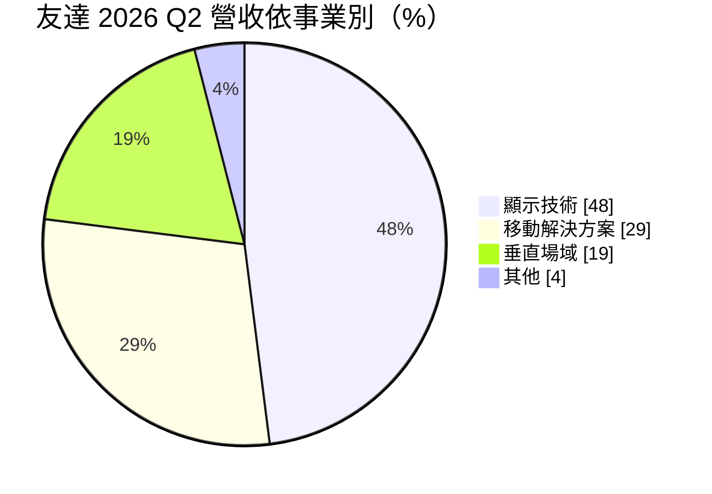
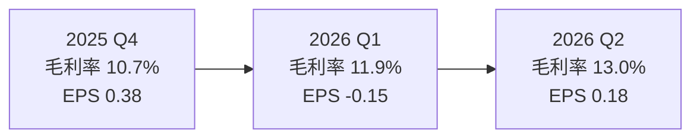
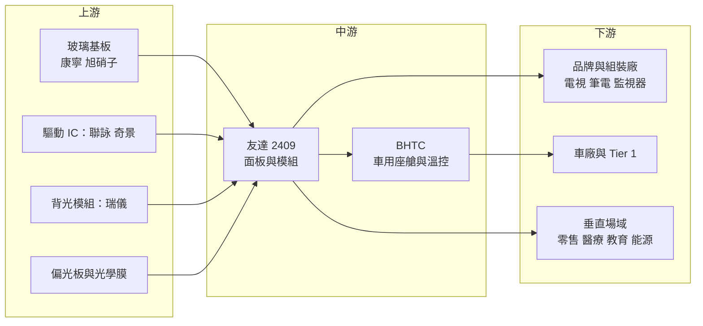

# 2409 友達

> 上市｜[[產業索引-光電業|光電業]]｜上市（櫃）日期 2000/09/08

# 第一章：企業模式與商業藍圖

> [!info] 撰寫說明
> 本文由 Claude 依公開資料整理，架構比照 [[2330台積電]] 的四章研究，資料截至 2026-10-07。財務數字來源：NOWnews（友達 2025 年第四季與全年法說會報導）、優分析（2026 年第二季法說會報導）、永豐金證券豐雲學堂（2026 年第一季法說會整理）、Poorstock（法說會整理）；產業描述為整理性內容，尚未逐條比對原始文件。#待校對

在評估單一個股的長期投資價值時，首要步驟是拆解企業的底層獲利邏輯。本章針對友達光電（股票代號：2409，以下簡稱友達）的商業模式進行定性分析，說明台灣最大面板廠之一如何從單純賣面板，轉型為以車用座艙與垂直場域解決方案為主的「三支柱」企業，以及轉型過程中最大的拖累在哪裡。

## 一、核心定位：從面板廠轉型為顯示與解決方案供應商

友達成立於 1996 年（前身為達碁科技），2001 年與聯友光電合併後改名友達光電，2006 年再合併廣輝電子，成為全球主要 [[TFT-LCD]] 面板廠之一。面板業是典型的資本密集、景氣循環產業，價格隨供需大起大落，中國面板廠大舉擴產後，台灣面板廠在電視等大宗面板上已失去規模優勢。

因此友達的定位正在改變，董事長彭双浪提出「三支柱」轉型：

* **顯示技術（Display）：** 傳統面板事業，產品包括電視、監視器、筆電、手機與車用面板，以及 [[Micro LED]] 等新型顯示技術。
* **移動解決方案（Mobility Solutions）：** 以車用智慧座艙為主，包括車用顯示模組與整合系統，2024 年收購德國車用電子廠 BHTC（Behr-Hella Thermocontrol）強化這塊業務（#待校對）。
* **垂直場域解決方案（Vertical Solutions）：** 智慧零售、醫療、教育、能源等場域的軟硬整合方案。

公司目標是在 2030 年前，讓移動解決方案與垂直場域兩大支柱的營收占比達到 70%。

## 二、終端應用與產品板塊：顯示仍占近半

2026 年第二季營收依三支柱分布如下：



* **顯示技術：** 營收占 48%，但 2026 年第二季營業利益率為 -3.2%，第一季更是 -6.5%，是整體獲利的主要拖累。
* **移動解決方案：** 營收占 29%，第二季營業利益率 3.8%，季增約 3%。車用座艙整合了顯示、觸控、控制面板與溫控等，單價與黏著度高於單純面板。
* **垂直場域：** 營收占 19%，第二季營業利益率 5.6%，季增約 11%，是三支柱中利潤率最高、成長最快的一塊。

## 三、資本轉化邏輯：從賣面積到賣系統

```mermaid
flowchart LR
    A["上游材料<br/>玻璃基板 偏光板<br/>驅動 IC 背光"] --> B["友達面板廠<br/>台灣 中國 等"]
    B --> C1["顯示技術<br/>電視 IT 面板"]
    B --> C2["移動解決方案<br/>車用座艙模組"]
    B --> C3["垂直場域<br/>零售 醫療 教育 能源"]
    C1 --> D1[品牌客戶與組裝廠]
    C2 --> D2["車廠與 Tier 1"]
    C3 --> D3[企業與場域客戶]
    C2 -. 利益率 3.8% .-> E[獲利主力轉移]
    C3 -. 利益率 5.6% .-> E
    C1 -. 利益率 -3.2% .-> E
```

* **面板事業的固定成本：** 面板廠折舊高，[[稼動率]]與面板報價決定毛利率。2025 年全年毛利率 11.5%，比 2024 年提升 2.9 個百分點，但仍屬偏低水準。
* **解決方案的附加價值：** 車用與垂直場域把面板加上軟體、系統整合與售後服務，客戶不是只看每平方公尺的價格，因此利潤率比賣面板穩定。
* **資產活化：** 友達近年出售部分廠房與閒置資產，用以改善財務結構。2026 年第二季淨負債淨值比降到 28.1%，前一年同期為 39.4%。

## 四、企業長期藍圖：2030 年雙支柱過半

* **車用座艙：** 透過 BHTC 取得歐洲車廠客戶與溫控、控制面板技術，往整合型座艙系統供應商發展。
* **新型顯示：** 投入 Micro LED 等新技術，用於車用、穿戴與高階顯示，試圖在 [[OLED]] 由韓國與中國主導的情況下找到差異化路線。
* **垂直場域：** 以軟硬整合服務切入零售、醫療、教育與智慧能源，建立經常性收入。

# 第二章：護城河深度與競爭優勢

在長期價值投資中，「護城河」指企業抵禦競爭、維持超額利潤的保護機制。本章分析友達的護城河構成、全球主要面板競爭對手，以及轉型後的新業務能否建立護城河。

## 一、友達護城河的核心組成要素

傳統面板業的護城河非常窄，價格主要由產能決定。友達的護城河主要建立在轉型後的業務：

* **1. 車用顯示的認證與客戶關係：** 車用面板與座艙系統需要通過車廠嚴格的可靠度測試，開發週期長達數年，一旦導入就會跟著車型供貨多年，轉換成本高。
* **2. 系統整合能力：** 垂直場域與車用座艙需要結合顯示、觸控、軟體與服務，這種整合能力比單純面板產能更難被複製。
* **3. 技術專利與高階產品：** 在高解析度、低功耗、高刷新率等高階面板，以及 Micro LED 等新技術上的專利累積。

## 二、全球主要競爭對手格局

| 對手 | 定位 | 對友達的威脅 |
|---|---|---|
| 京東方（BOE） | 全球最大面板廠，LCD 與 OLED 皆有 | 規模與政府支持，壓低全球面板價格 |
| 華星光電（TCL CSOT）、惠科 | 中國大型面板廠 | 在電視與 IT 面板以價格競爭 |
| [[3481群創]] | 台灣面板同業，轉型半導體封裝 | 在 IT 與車用面板直接競爭 |
| 天馬（中國） | 中小尺寸與車用面板 | 車用面板市占快速提升 |
| 樂金顯示（LG Display）、三星顯示 | OLED 領導者 | 在高階車用與 IT OLED 搶市 |
| [[6176瑞儀]] | 背光模組 | 非直接對手，屬供應鏈夥伴 |

## 三、優勢轉化：哪些市場守得住、哪些守不住

* **守得住：** 車用座艙與垂直場域解決方案。2026 年第二季這兩塊合計營收約占 48%，且都維持正的營業利益率。
* **守不住：** 電視與一般 IT 面板。中國面板廠掌握過半產能，價格主導權不在友達手上，顯示技術事業持續虧損。
* **觀察重點：** 顯示技術事業何時能損益兩平、兩大支柱營收占比能否如期在 2030 年達到 70%、BHTC 與車用業務的利潤率能否提升，以及 Micro LED 能否形成規模營收。

# 第三章：財務體質與盈利規模

資料日期：2026-10-07。數字取自法說會報導與財經媒體，表格是撰寫當時的快照；最新月營收、毛利率、累計 EPS 由自動排程寫在本筆記的屬性欄位（月營收、毛利率、累計EPS 等）。#待校對

財務報表是檢驗護城河是否真實存在的最終標準。本章用三率、ROE、現金流與資本報酬，檢視友達在轉型期間的獲利品質。

## 一、獲利能力的基石：三率

| 項目 | 2025 全年 | 2025 Q4 | 2026 Q1 | 2026 Q2 | 2026 上半年 |
|---|---|---|---|---|---|
| 營收（新台幣） | 2,813.9 億 | 701.4 億 | 690.3 億 | 708.9 億 | 1,399.2 億 |
| [[毛利率]] | 11.5% | 10.7% | 11.9% | 13.0% | 12.5% |
| [[營業利益率]] | 未查得 | -2.7% | -0.9% | 0.3% | 約 -0.3% |
| 歸屬母公司淨利 | 68.4 億 | 28.8 億 | -11.4 億 | 13.4 億 | 約 2.0 億 |
| EPS（元） | 0.90 | 0.38 | -0.15 | 0.18 | 0.03 |



* **[[毛利率]]：** 2026 年第一季 11.9%、第二季 13.0%，連續回升，但仍遠低於一般製造業水準。
* **[[營業利益率]]：** 2025 年第四季營業損失率 2.7%，2026 年第一季縮小到 0.9%，第二季才轉正。營業費用在第二季季增 14.9%，推估與併購後的車用事業費用有關。
* **[[淨利率]]與業外：** 2025 年第四季營業虧損，但歸母淨利 28.8 億元，顯示業外收益（推估含資產處分等）撐起獲利。評估本業時應以營業利益為準。

## 二、[[ROE]]：資本效率

2025 年 EPS 0.90 元，2026 年上半年僅 0.03 元，ROE 屬低個位數（推估，具體數值未查得）。面板業過去十年多數時間的 ROE 偏低，只有 2021 年面板報價大漲時出現短暫高峰。

## 三、資本支出與自由現金流

* **[[CapEx]]：** 2026 年資本支出金額未查得。轉型方向是減少傳統面板產能投資，把資源轉往車用、Micro LED 與解決方案。
* **[[自由現金流]]：** 2026 年第二季現金部位約 537.9 億元，存貨增加到約 407.9 億元、存貨天數 58 天，高於 2025 年第四季的 52 天。存貨上升會占用營運資金，需觀察下半年去化情況。
* **股利政策：** 面板業獲利波動大，股利隨獲利起伏，2026 年配發金額未查得。

## 四、[[ROIC]] 與 [[WACC]]：價值創造利差

以目前的獲利水準推估，友達整體 ROIC 低於資金成本（推估，具體數值未查得），主因是顯示技術事業的大量資產報酬偏低。轉型若成功，資產會由重資本的面板廠轉向輕資本的系統整合與服務，ROIC 才有機會結構性改善。

# 第四章：總體風險與地緣政治

任何企業都無法脫離宏觀環境獨立存在。本章分析友達未來必須面對的地緣政治、產業週期與營運風險。

## 一、地緣政治風險

* **美國關稅：** 面板與顯示器、筆電、電視多經由組裝廠出口到美國，美國關稅政策會影響終端需求與客戶拉貨節奏。2026 年第一季法說會提到關稅墊高前一年基期，造成年減。
* **中國產能與政策：** 中國政府長期補貼面板產業，京東方等廠商的擴產決策不完全依市場供需，台灣面板廠難以在價格上競爭。
* **歐洲業務：** 收購 BHTC 後，歐洲車市景氣與當地勞動法規、能源成本都成為新的風險來源。

## 二、產業週期與市場結構風險

* **面板價格循環：** 面板報價受產能、庫存與終端需求影響，循環劇烈，具有明顯的[[長鞭效應]]。
* **車市景氣：** 移動解決方案依賴全球汽車產量，車市放緩或電動車需求波動會影響訂單。
* **匯率：** 營收以美元計價為主，新台幣升值會壓縮毛利率，2026 年第一季法說會也提到匯率的不利影響。

## 三、營運環境的隱性風險

* **併購整合：** 跨國併購的整合需要時間，費用上升可能先於綜效出現。
* **存貨上升：** 存貨天數上升到 58 天，若需求不如預期，可能需要提列跌價損失。
* **資產處分收益不可持續：** 過去部分季度的獲利依賴資產處分，這類收益無法重複。

## 四、科技演進風險

* **OLED 滲透：** 筆電、平板與車用面板逐步導入 OLED，韓國與中國廠商在 OLED 產能上領先，可能侵蝕友達的 LCD 市場。
* **Micro LED 商業化：** Micro LED 的[[巨量轉移]]與良率仍是挑戰，若量產成本無法下降，投入可能無法回收。
* **[[Mini LED]] 背光：** Mini LED 背光讓 LCD 在高階市場延續競爭力，是友達與群創共同押注的技術方向。

# 專有名詞解析

## 金融

- **[[毛利率]]**：毛利除以營收，反映產品售價扣除直接生產成本後的獲利空間。
- **[[營業利益率]]**：營業利益除以營收，反映扣除管銷研發費用後的本業獲利能力。
- **[[ROIC]]**：投入資本報酬率，衡量公司投入營運的資本能賺回多少報酬。

## 產業

- **[[TFT-LCD]]**：薄膜電晶體液晶顯示器，以電晶體控制液晶開關來顯示畫面，是目前最主流的面板技術。
- **[[OLED]]**：有機發光二極體顯示器，每個像素自行發光、不需背光，對比高、可彎曲，主要由韓國與中國廠商量產。
- **[[Micro LED]]**：以微米級 LED 作為每個像素的顯示技術，亮度高、壽命長，但量產成本仍高。
- **[[Mini LED]]**：把大量小型 LED 作為 LCD 背光源並分區控光，提升對比與亮度。
- **[[巨量轉移]]**：把數百萬顆微型 LED 精準搬到面板基板上的製程，是 Micro LED 量產的主要瓶頸。
- **[[稼動率]]**：工廠實際生產量占產能的比例，面板廠的毛利率高度取決於此數字。
- **[[長鞭效應]]**：終端需求的小幅變動沿供應鏈往上游傳遞時被逐級放大，造成面板報價與庫存劇烈波動。

# 核心供應鏈



## 1. 上游：材料與零組件
- 驅動 IC：[[3034聯詠]]、[[3592瑞鼎]]、奇景光電
- 背光模組：[[6176瑞儀]]
- 玻璃基板：康寧、旭硝子
- 偏光板：[[8215明基材]]

## 2. 中游：友達本身
- 顯示技術、移動解決方案（含 BHTC）、垂直場域三支柱

## 3. 下游：主要客戶
- 筆電與監視器品牌及組裝廠：[[2357華碩]]、[[2353宏碁]]、[[2324仁寶]]、[[2382廣達]]
- 車廠與車用 Tier 1
- 零售、醫療、教育場域客戶

## 4. 同業
- [[3481群創]]、京東方、華星光電、天馬、樂金顯示

## 最新新聞
<!-- news:start（自動產生，請勿手動編輯此範圍） -->
- 2026-10-06 📰 媒體 18:22｜台股創高外資轉賣 大砍友達8.7萬張、投信提款聯電6萬張｜[鉅亨網](https://news.cnyes.com/news/id/6622836)
- 2026-10-05 📰 媒體 18:00｜勤凱(4760)漲停348.5元！TGV盲孔填膏完成驗證，玻璃基板商機不只友達、群創｜[鉅亨網](https://news.cnyes.com/news/id/6621853)
- 2026-10-05 📰 媒體 10:29｜【跨年度做夢行情】友達、聯亞、台達電、聯發科非首選？這幾檔才是下一檔飆股？｜[鉅亨網](https://news.cnyes.com/news/id/6621551)

完整紀錄：[[2409友達 新聞]]
<!-- news:end -->

## 相關連結
- [公開資訊觀測站](https://mopsov.twse.com.tw/mops/web/t05st03?step=1&firstin=1&co_id=2409)
- [Goodinfo](https://goodinfo.tw/tw/StockDetail.asp?STOCK_ID=2409)
- [Yahoo 股市](https://tw.stock.yahoo.com/quote/2409)
- [鉅亨網新聞](https://www.cnyes.com/twstock/2409/news)
